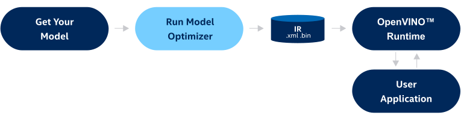

.. index:: pair: page; Converting Models with Model Optimizer
.. _doxid-openvino_docs__m_o__d_g__deep__learning__model__optimizer__dev_guide:

Converting Models with Model Optimizer
======================================

:target:`doxid-openvino_docs__m_o__d_g__deep__learning__model__optimizer__dev_guide_1md_openvino_docs_mo_dg_deep_learning_model_optimizer_devguide`

.. _deep learning model optimizer:

.. toctree::
   :maxdepth: 1
   :hidden:

   ./converting-models-with-model-optimizer/input-shapes
   ./converting-models-with-model-optimizer/model-optimization-techniques
   ./converting-models-with-model-optimizer/cutting-model-with-model-optimizer
   ./converting-models-with-model-optimizer/additional-optimization-use-cases
   ./converting-models-with-model-optimizer/fp16-compression-with-model-optimizer
   ./converting-models-with-model-optimizer/converting-tensorflow-model-with-model-optimizer
   ../openvino_docs_MO_DG_prepare_model_convert_model_Convert_Model_From_ONNX
   ../openvino_docs_MO_DG_prepare_model_convert_model_Convert_Model_From_PyTorch
   ../openvino_docs_MO_DG_prepare_model_convert_model_Convert_Model_From_Paddle
   ../openvino_docs_MO_DG_prepare_model_convert_model_Convert_Model_From_MxNet
   ../openvino_docs_MO_DG_prepare_model_convert_model_Convert_Model_From_Caffe
   ../openvino_docs_MO_DG_prepare_model_convert_model_Convert_Model_From_Kaldi
   ../openvino_docs_MO_DG_prepare_model_convert_model_tutorials
   ../openvino_docs_MO_DG_prepare_model_Model_Optimizer_FAQ

Model Optimizer is a cross-platform command-line tool that facilitates the transition between training and deployment environments, performs static model analysis, and adjusts deep learning models for optimal execution on end-point target devices.

To use it, you need a pre-trained deep learning model in one of the supported formats: TensorFlow, PyTorch, PaddlePaddle, MXNet, Caffe, Kaldi, or ONNX. Model Optimizer converts the model to the OpenVINO Intermediate Representation format (IR), which you can infer later with :ref:`OpenVINO™ Runtime <doxid-openvino_docs__o_v__u_g__o_v__runtime__user__guide>`.

Note that Model Optimizer does not infer models.

The figure below illustrates the typical workflow for deploying a trained deep learning model:

where IR is a pair of files describing the model:

* ``.xml`` - Describes the network topology.

* ``.bin`` - Contains the weights and biases binary data.

The generated IR can be additionally optimized for inference by :ref:`Post-training optimization <doxid-pot_introduction>`	that applies post-training quantization methods.

.. tip:: You can also work with Model Optimizer in OpenVINO™ `Deep Learning Workbench (DL Workbench) <https://docs.openvino.ai/latest/workbench_docs_Workbench_DG_Introduction.html>`__, which is a web-based tool with GUI for optimizing, fine-tuning, analyzing, visualizing, and comparing performance of deep learning models.

How to Run Model Optimizer
~~~~~~~~~~~~~~~~~~~~~~~~~~

To convert a model to IR, you can run Model Optimizer by using the following command:

.. ref-code-block:: cpp

	mo --input_model INPUT_MODEL

If the out-of-the-box conversion (only the ``--input_model`` parameter is specified) is not successful, use the parameters mentioned below to override input shapes and cut the model:

* Model Optimizer provides two parameters to override original input shapes for model conversion: ``--input`` and ``--input_shape``. For more information about these parameters, refer to the :ref:`Setting Input Shapes <doxid-openvino_docs__m_o__d_g_prepare_model_convert_model__converting__model>` guide.

* To cut off unwanted parts of a model (such as unsupported operations and training sub-graphs), use the ``--input`` and ``--output`` parameters to define new inputs and outputs of the converted model. For a more detailed description, refer to the :ref:`Cutting Off Parts of a Model <doxid-openvino_docs__m_o__d_g_prepare_model_convert_model__cutting__model>` guide.

You can also insert additional input pre-processing sub-graphs into the converted model by using the ``--mean_values``, ``scales_values``, ``--layout``, and other parameters described in the :ref:`Embedding Preprocessing Computation <doxid-openvino_docs__m_o__d_g__additional__optimization__use__cases>` article.

The ``--data_type`` compression parameter in Model Optimizer allows generating IR of the ``FP16`` data type. For more details, refer to the :ref:`Compression of a Model to FP16 <doxid-openvino_docs__m_o__d_g__f_p16__compression>` guide.

To get the full list of conversion parameters available in Model Optimizer, run the following command:

.. ref-code-block:: cpp

	mo --help

Examples of CLI Commands
~~~~~~~~~~~~~~~~~~~~~~~~

Below is a list of separate examples for different frameworks and Model Optimizer parameters:

#. Launch Model Optimizer for a TensorFlow MobileNet model in the binary protobuf format:
   
   .. ref-code-block:: cpp
   
   	mo --input_model MobileNet.pb
   
   Launch Model Optimizer for a TensorFlow BERT model in the SavedModel format with three inputs. Specify input shapes explicitly where the batch size and the sequence length equal 2 and 30 respectively:
   
   .. ref-code-block:: cpp
   
   	mo --saved_model_dir BERT --input mask,word_ids,type_ids --input_shape [2,30],[2,30],[2,30]
   
   For more information, refer to the :ref:`Converting a TensorFlow Model <doxid-openvino_docs__m_o__d_g_prepare_model_convert_model__convert__model__from__tensor_flow>` guide.

#. Launch Model Optimizer for an ONNX OCR model and specify new output explicitly:
   
   .. ref-code-block:: cpp
   
   	mo --input_model ocr.onnx --output probabilities
   
   For more information, refer to the [Converting an ONNX Model (``prepare_model/convert_model/Convert_Model_From_ONNX.md``) guide.

.. note:: PyTorch models must be exported to the ONNX format before conversion into IR. More information can be found in :ref:`Converting a PyTorch Model <doxid-openvino_docs__m_o__d_g_prepare_model_convert_model__convert__model__from__py_torch>`.

#. Launch Model Optimizer for a PaddlePaddle UNet model and apply mean-scale normalization to the input:
   
   .. ref-code-block:: cpp
   
   	mo --input_model unet.pdmodel --mean_values [123,117,104] --scale 255
   
   For more information, refer to the :ref:`Converting a PaddlePaddle Model <doxid-openvino_docs__m_o__d_g_prepare_model_convert_model__convert__model__from__paddle>` guide.

#. Launch Model Optimizer for an Apache MXNet SSD Inception V3 model and specify first-channel layout for the input:
   
   .. ref-code-block:: cpp
   
   	mo --input_model ssd_inception_v3-0000.params --layout NCHW
   
   For more information, refer to the :ref:`Converting an Apache MXNet Model <doxid-openvino_docs__m_o__d_g_prepare_model_convert_model__convert__model__from__mx_net>` guide.

#. Launch Model Optimizer for a Caffe AlexNet model with input channels in the RGB format which needs to be reversed:
   
   .. ref-code-block:: cpp
   
   	mo --input_model alexnet.caffemodel --reverse_input_channels
   
   For more information, refer to the :ref:`Converting a Caffe Model <doxid-openvino_docs__m_o__d_g_prepare_model_convert_model__convert__model__from__caffe>` guide.

#. Launch Model Optimizer for a Kaldi LibriSpeech nnet2 model:
   
   .. ref-code-block:: cpp
   
   	mo --input_model librispeech_nnet2.mdl --input_shape [1,140]
   
   For more information, refer to the :ref:`Converting a Kaldi Model <doxid-openvino_docs__m_o__d_g_prepare_model_convert_model__convert__model__from__kaldi>` guide.

* To get conversion recipes for specific TensorFlow, ONNX, PyTorch, Apache MXNet, and Kaldi models, refer to the :ref:`Model Conversion Tutorials <doxid-openvino_docs__m_o__d_g_prepare_model_convert_model_tutorials>`.

* For more information about IR, see :ref:`Deep Learning Network Intermediate Representation and Operation Sets in OpenVINO™ <doxid-openvino_docs__m_o__d_g__i_r_and_opsets>`.

