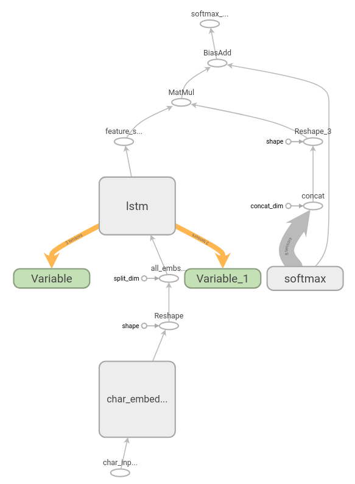

.. index:: pair: page; Converting a TensorFlow Language Model on One Billion Word Benchmark
.. _doxid-openvino_docs__m_o__d_g_prepare_model_convert_model_tf_specific__convert_lm_1b__from__tensorflow:

Converting a TensorFlow Language Model on One Billion Word Benchmark
====================================================================

:target:`doxid-openvino_docs__m_o__d_g_prepare_model_convert_model_tf_specific__convert_lm_1b__from__tensorflow_1md_openvino_docs_mo_dg_prepare_model_convert_model_tf_specific_convert_lm_1b_from_tensorflow`

Downloading a Pre-trained Language Model on One Billion Word Benchmark
~~~~~~~~~~~~~~~~~~~~~~~~~~~~~~~~~~~~~~~~~~~~~~~~~~~~~~~~~~~~~~~~~~~~~~

TensorFlow provides a pretrained `Language Model on One Billion Word Benchmark <https://github.com/tensorflow/models/tree/r2.3.0/research/lm_1b>`__.

To download the model for IR conversion, follow the instructions:

#. Create new directory to store the model:
   
   .. ref-code-block:: cpp
   
   	mkdir lm_1b

#. Go to the ``lm_1b`` directory:
   
   .. ref-code-block:: cpp
   
   	cd lm_1b

#. Download the model GraphDef file:
   
   .. ref-code-block:: cpp
   
   	wget http://download.tensorflow.org/models/LM_LSTM_CNN/graph-2016-09-10.pbtxt

#. Create new directory to store 12 checkpoint shared files:
   
   .. ref-code-block:: cpp
   
   	mkdir ckpt

#. Go to the ``ckpt`` directory:
   
   .. ref-code-block:: cpp
   
   	cd ckpt

#. Download 12 checkpoint shared files:
   
   .. ref-code-block:: cpp
   
   	wget http://download.tensorflow.org/models/LM_LSTM_CNN/all_shards-2016-09-10/ckpt-base
   	wget http://download.tensorflow.org/models/LM_LSTM_CNN/all_shards-2016-09-10/ckpt-char-embedding
   	wget http://download.tensorflow.org/models/LM_LSTM_CNN/all_shards-2016-09-10/ckpt-lstm
   	wget http://download.tensorflow.org/models/LM_LSTM_CNN/all_shards-2016-09-10/ckpt-softmax0
   	wget http://download.tensorflow.org/models/LM_LSTM_CNN/all_shards-2016-09-10/ckpt-softmax1
   	wget http://download.tensorflow.org/models/LM_LSTM_CNN/all_shards-2016-09-10/ckpt-softmax2
   	wget http://download.tensorflow.org/models/LM_LSTM_CNN/all_shards-2016-09-10/ckpt-softmax3
   	wget http://download.tensorflow.org/models/LM_LSTM_CNN/all_shards-2016-09-10/ckpt-softmax4
   	wget http://download.tensorflow.org/models/LM_LSTM_CNN/all_shards-2016-09-10/ckpt-softmax5
   	wget http://download.tensorflow.org/models/LM_LSTM_CNN/all_shards-2016-09-10/ckpt-softmax6
   	wget http://download.tensorflow.org/models/LM_LSTM_CNN/all_shards-2016-09-10/ckpt-softmax7
   	wget http://download.tensorflow.org/models/LM_LSTM_CNN/all_shards-2016-09-10/ckpt-softmax8

Once you have downloaded the pretrained model files, you will have the ``lm_1b`` directory with the following hierarchy:

.. ref-code-block:: cpp

	lm_1b/
	    graph-2016-09-10.pbtxt
	    ckpt/
	        ckpt-base
	        ckpt-char-embedding
	        ckpt-lstm
	        ckpt-softmax0
	        ckpt-softmax1
	        ckpt-softmax2
	        ckpt-softmax3
	        ckpt-softmax4
	        ckpt-softmax5
	        ckpt-softmax6
	        ckpt-softmax7
	        ckpt-softmax8

The frozen model still has two variables: ``Variable`` and ``Variable_1``. It means that the model keeps training those variables at each inference.

At the first inference of this graph, the variables are initialized by initial values. After executing the ``lstm`` nodes, results of execution are assigned to these two variables.

With each inference of the ``lm_1b`` graph, ``lstm`` initial states data is taken from previous inference from variables, and states of current inference of ``lstm`` is reassigned to the same variables.

It helps the model to remember the context of the words that it takes as input.

Converting a TensorFlow Language Model on One Billion Word Benchmark to IR
~~~~~~~~~~~~~~~~~~~~~~~~~~~~~~~~~~~~~~~~~~~~~~~~~~~~~~~~~~~~~~~~~~~~~~~~~~

Model Optimizer assumes that output model is for inference only. Therefore, you should cut those variables off and resolve keeping cell and hidden states on application level.

There is a certain limitation for the model conversion: the original model cannot be reshaped, so you should keep original shapes.

To generate the ``lm_1b`` Intermediate Representation (IR), provide TensorFlow ``lm_1b`` model to the Model Optimizer with parameters:

.. ref-code-block:: cpp

	 mo
	--input_model lm_1b/graph-2016-09-10.pbtxt  \
	--input_checkpoint lm_1b/ckpt               \
	--input_model_is_text                       \
	--input_shape [50],[50],[1,9216],[1,9216]    \
	--output softmax_out,lstm/lstm_0/concat_2,lstm/lstm_1/concat_2 \
	--input char_embedding/EmbeddingLookupUnique/Unique:0,char_embedding/EmbeddingLookupUnique/Unique:1,Variable/read,Variable_1/read

Where:

* ``--input char_embedding/EmbeddingLookupUnique/Unique:0,char_embedding/EmbeddingLookupUnique/Unique:1,Variable/read,Variable_1/read`` and ``--input_shape [50],[50],[1,9216],[1,9216]`` replace the variables with a placeholder.

* ``--output softmax_out,lstm/lstm_0/concat_2,lstm/lstm_1/concat_2`` specifies output node name and names of LSTM cell states.

