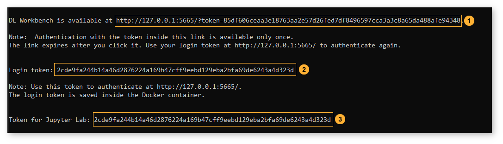
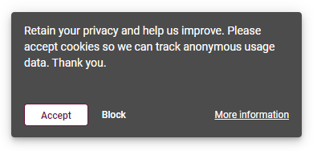
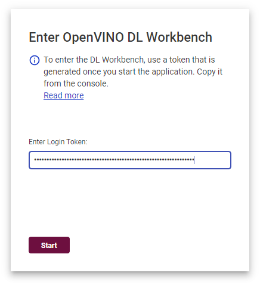
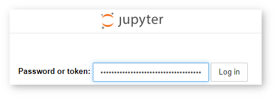

.. index:: pair: page; Enable Authentication in DL Workbench
.. _doxid-workbench_docs__workbench__d_g__authentication:


Enable Authentication in DL Workbench
=====================================

:target:`doxid-workbench_docs__workbench__d_g__authentication_1md_openvino_workbench_docs_workbench_dg_authentication` By default, the DL Workbench is started without authentication settings. This can cause problems with sensitive data, like your model or performance information. It is recommended to enable authentication when starting the DL Workbench.

Enable Authentication
~~~~~~~~~~~~~~~~~~~~~

To enable authentication, use ``-e ENABLE_AUTH=1`` when you start the DL Workbench with the ``docker run`` command or ``--enable-auth`` with the ``openvino-workbench`` script:

* Example ``docker run`` command:
  
  .. ref-code-block:: cpp
  
  	docker run -p 127.0.0.1:5665:5665 --name workbench -e ENABLE_AUTH=1 -it openvino/workbench:2022.1

* Example ``openvino-workbench`` command:
  
  
  
  .. ref-code-block:: cpp
  
  	openvino-workbench --image openvino/workbench:2022.1 --enable-authentication

When you enable authentication, the terminal displays the following when the Docker container with the DL Workbench is up and running:

#. `One-time link with token <#url-token>`__

#. `Login token <#login-token>`__

#. `JupyterLab\* token <#jupyter-token>`__



Configure Authentication
~~~~~~~~~~~~~~~~~~~~~~~~

To set up your own login token, use ``-e CUSTOM_TOKEN=<token>`` when you start the DL Workbench with the ``docker run`` command or ``--custom-token <token>`` with the ``openvino-workbench`` script:

* Example ``docker run`` command:
  
  .. ref-code-block:: cpp
  
  	docker run -p 127.0.0.1:5665:5665 --name workbench -e ENABLE_AUTH=1 -e CUSTOM_TOKEN=MY_CUSTOM_TOKEN -it openvino/workbench:2022.1

* Example ``openvino-workbench`` command:
  
  
  
  .. ref-code-block:: cpp
  
  	openvino-workbench --image openvino/workbench:2022.1 --enable-authentication --custom-token MY_CUSTOM_TOKEN

How to Use Tokens
~~~~~~~~~~~~~~~~~

.. _url-token:

One-Time Link with Token
------------------------

The link is provided to make it easy for you to go to the DL Workbench for the first time. For each new container, a unique one-time link is generated and expires once you click it. Use this link to access the DL Workbench for the first time. When you click the link, the DL Workbench **Active Projects** page appears, and you can move on to :ref:`work with models and sample datasets <doxid-workbench_docs__workbench__d_g__work_with__models_and__sample__datasets>` by clicking **Create Project** :

.. image:: start_page_crop.png

Accept or block cookies in the pop-up window. You can change your decision later on the **Settings** panel.



.. _login-token:

Login Token
-----------

The login token is valid as long as you do not remove the current Docker container, so treat the token as a password for the current DL Workbench session. Use it whenever you see the **Enter OpenVINO DL Workbench** window.

Open the `http://127.0.0.1:5665 <http://127.0.0.1:5665>`__ link without the URL token, and the **Enter OpenVINO DL Workbench** page appears. Copy the login token from the console and paste it into the field:




.. note:: The token is also saved to a folder inside a Docker container, and you can obtain it with the command below:


```bash docker cp workbench:/home/workbench/.workbench/token.txt token.txt `` ``<blockquote>If you do not want to save the token inside a Docker container, use`` SAVE_TOKEN_TO_FILE=0 ``when you start the DL Workbench with the`` docker run ``command or`` disable-token-saving ``with the`` openvino-workbench` script.

Press **Start**. The **Start Page** appears, and you can move on to :ref:`work with models and sample datasets <doxid-workbench_docs__workbench__d_g__work_with__models_and__sample__datasets>` by clicking **Create Project**.

.. image:: start_page_crop.png

Accept or block cookies in the pop-up window. You can change your decision later on the **Settings** panel.


.. _jupyter-token:

JupyterLab Token
----------------

Use this token when you access the :ref:`JupyterLab Environment <doxid-workbench_docs__workbench__d_g__jupyter__notebooks>` delivered by the DL Workbench. This token is valid as long as you do not remove the current Docker container.



See Also
~~~~~~~~

* :ref:`Deep Learning Workbench Security <doxid-workbench_docs_security__workbench>`

* :ref:`Configure Transport Layer Security (TLS) <doxid-workbench_docs__workbench__d_g__configure__t_l_s>`

* :ref:`Troubleshooting <doxid-workbench_docs__workbench__d_g__troubleshooting>`

