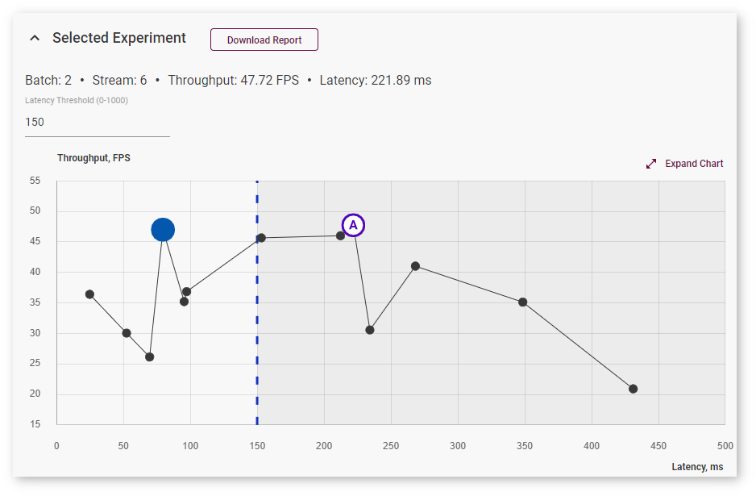
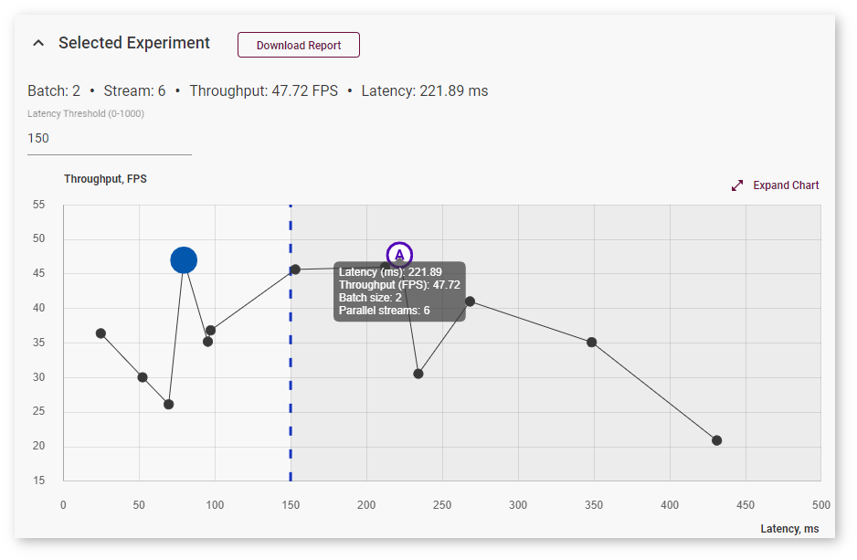
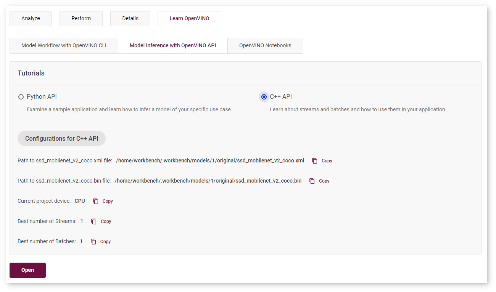
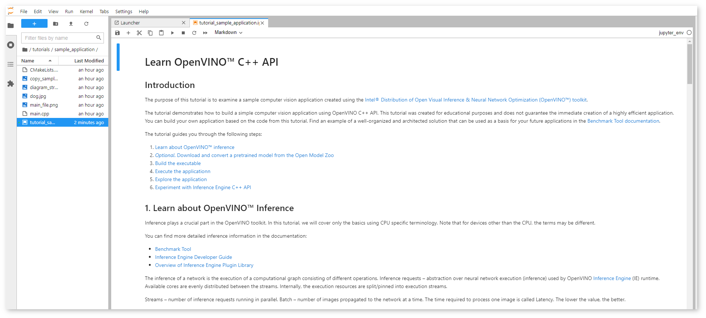
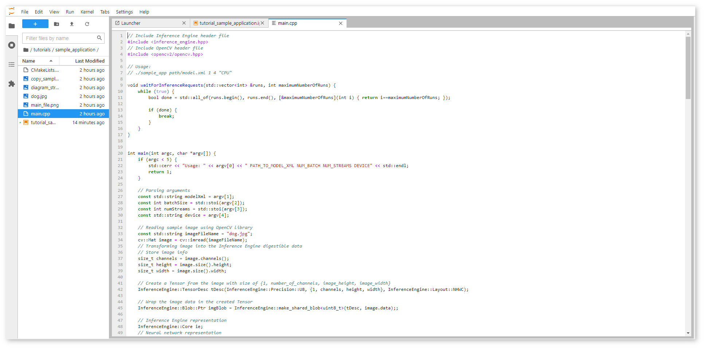
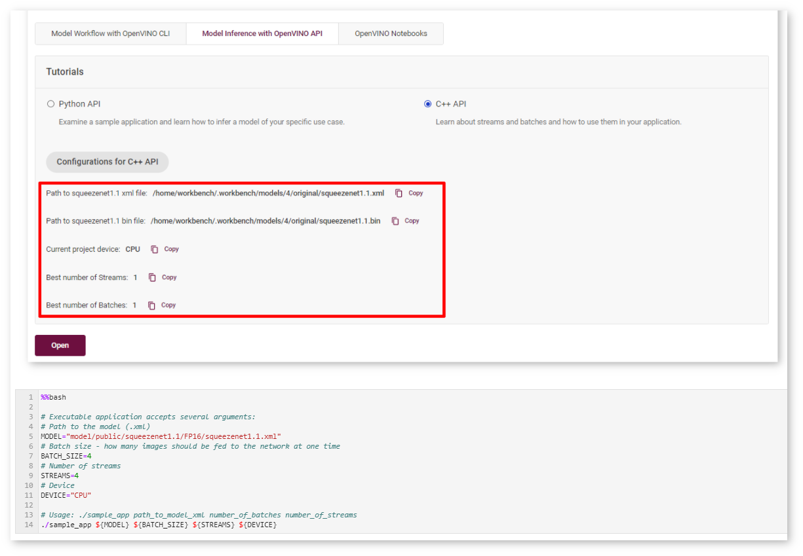
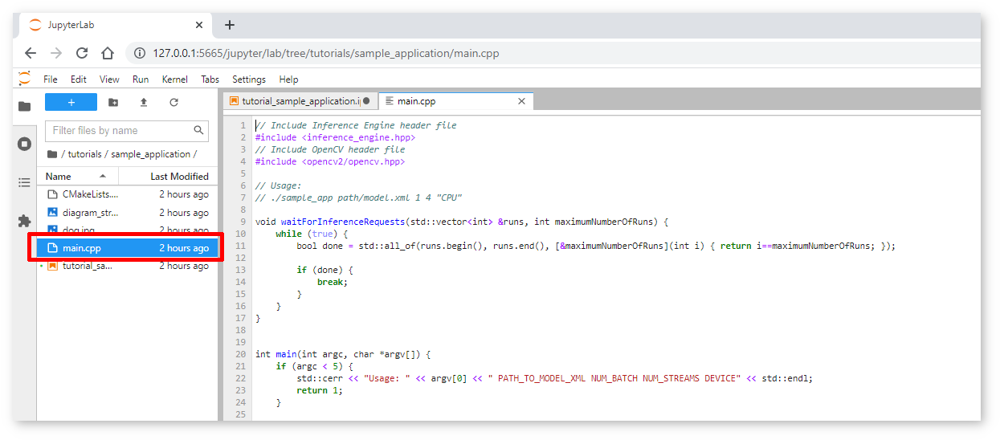

.. index:: pair: page; Deploy and Integrate Performance Criteria into Application
.. _doxid-workbench_docs__workbench__d_g__deploy_and__integrate__performance__criteria_into__application:

Deploy and Integrate Performance Criteria into Application
==========================================================

:target:`doxid-workbench_docs__workbench__d_g__deploy_and__integrate__performance__criteria_into__application_1md_openvino_workbench_docs_workbench_dg_deploy_and_integrate_performance_criteria_into_application` Once you identify the optimal configuration of inferences, batch and target for a model, you can incorporate those settings into the inference engine deployed with your application.

.. raw:: html

    <iframe  allowfullscreen mozallowfullscreen msallowfullscreen oallowfullscreen webkitallowfullscreen width="560" height="315" src="https://www.youtube.com/embed/-i8gdbukpU4" frameborder="0" allow="accelerometer; autoplay; encrypted-media; gyroscope; picture-in-picture" allowfullscreen></iframe>

.. _discover:

Discover Optimal Combination of Streams and Batches with DL Workbench
~~~~~~~~~~~~~~~~~~~~~~~~~~~~~~~~~~~~~~~~~~~~~~~~~~~~~~~~~~~~~~~~~~~~~

To find an optimal combination of inference requests and batches, follow the steps described in :ref:`Run Range of Inferences <doxid-workbench_docs__workbench__d_g__run__single__inference>`.

The optimal combination is the highest point on the **Inference Results** graph. However, you can choose to limit latency values by specifying the **Latency Threshold** value and select an optimal inference among the limited number of inferences:

To view information about latency, throughput, batch, and parallel requests of a specific job, hover your cursor over the corresponding point on the graph:

For details, read :ref:`Integrate the OpenVINO™ Runtime New Request API with Your Application <deploy_infer__integrate_application>`.

Integrate Optimal Combination into Sample Application
~~~~~~~~~~~~~~~~~~~~~~~~~~~~~~~~~~~~~~~~~~~~~~~~~~~~~

Use Streams and Batches in Your Application
-------------------------------------------

Learn how to use batches and streams in your application with DL Workbench C++ Sample Application. To access the sample, open the **Learn OpenVINO** tab, select **Model Inference with OpenVINO API**, then select **C++ API** and click **Open**.

The notebook with the C++ Sample Application opens:

This notebook is created for educational purposes and does not guarantee the immediate creation of a highly efficient application. You can build your own application based on the code from this tutorial. The tutorial guides you through the following steps:

#. Learn about OpenVINO™ inference
   
   Read quick theory to learn about batches and streams, inference requests, and Asynchronous API.

#. Optional. Download and convert a pretrained model from the Open Model Zoo
   
   Learn how to import a model in the DL Workbench or skip this step and proceed to build an application.

#. Build the executable
   
   Compile ``main.cpp`` into an executable file:

#. Execute the application
   
   Copy the path to the model, project device, and batch and stream numbers from the DL Workbench and paste them in the corresponding cell:

#. Explore the application
   
   Inspect and change the main.cpp file with an application that uses the IE asynchronous C++ API. The file is located in the same directory as the notebook.

#. Experiment with OpenVINO™ Runtime C++ API
   
   Return to Step 3: Build the executable or proceed to explore the DL Workbench functionality. After learning about OpenVINO™ inference, you can go to The `Benchmark Tool documentation <https://docs.openvino.ai/latest/openvino_inference_engine_samples_benchmark_app_README.html>`__ to find an example of a well-structured solution that may be used as a basis for your future applications.

See Also
~~~~~~~~

* :ref:`Build Your Application with Deployment Package <doxid-workbench_docs__workbench__d_g__deployment__package>`

* :ref:`Deployment Manager Guide <doxid-openvino_docs_install_guides_deployment_manager_tool>`

* :ref:`Troubleshooting <doxid-workbench_docs__workbench__d_g__troubleshooting>`

