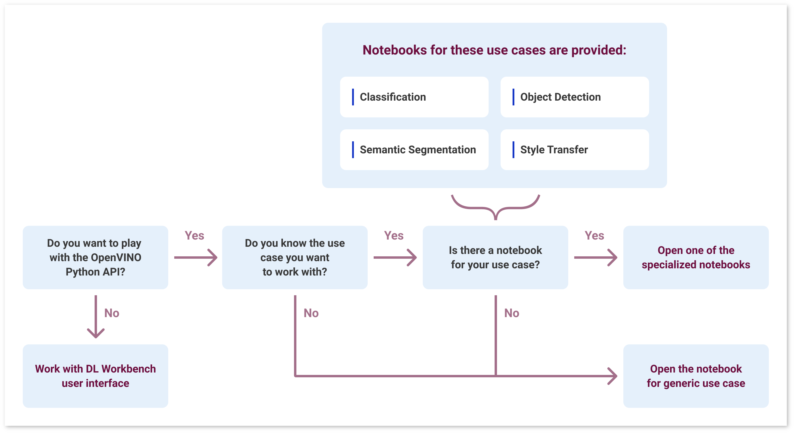
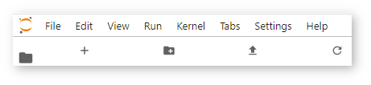

.. index:: pair: page; Learn Model Inference with OpenVINO™ API in JupyterLab\* Environment
.. _doxid-workbench_docs__workbench__d_g__jupyter__notebooks:

Learn Model Inference with OpenVINO™ API in JupyterLab\* Environment
======================================================================

:target:`doxid-workbench_docs__workbench__d_g__jupyter__notebooks_1md_openvino_workbench_docs_workbench_dg_jupyter_notebooks` JupyterLab\* Environment delivered by the DL Workbench helps you learn how to use OpenVINO™, its Python\* API, and its components essential to analyze and optimize models. The environment enables you to quick start with OpenVINO™ by providing a preconfigured OpenVINO™ environment.

Access the JupyterLab
~~~~~~~~~~~~~~~~~~~~~

The `JupyterLab\* <https://jupyter-notebook.readthedocs.io/en/stable/>`__ notebooks are running in the same environment as the DL Workbench. Refer to :ref:`Run DL Workbench instructions <doxid-workbench_docs__workbench__d_g__run__locally>`, to start DL Workbench.

Go to the JupyterLab\* Environment
----------------------------------

Choose one of the ways to access the notebooks:

* By clicking **LEARN OPENVINO** on the top header of the tool.
  
  .. image:: learn_openvino_tab.png

* From the **Learn OpenVINO** tab on the **Projects** page. This works only if you have created a project.
  
  .. image:: jupyter_tab_api.png

.. note:: The playground opens in a new tab. Make sure your browser does not block pop-ups.

Learn Model Inference with OpenVINO API
~~~~~~~~~~~~~~~~~~~~~~~~~~~~~~~~~~~~~~~

The JupyterLab\* provides you with tutorials that show how to infer a model using OpenVINO™ Python interface. The tutorials are listed below. Decide on what use case you want to work with and open the notebook with the relevant tutorial:

* Classification: ``tutorials/classification/tutorial_classification.ipynb``

* Object detection: ``tutorials/object_detection_ssd/tutorial_object_detection_ssd.ipynb``

* Semantic segmentation: ``tutorials/semantic_segmentation/tutorial_semantic_segmentation.ipynb``

* Style transfer: ``tutorials/style_transfer/tutorial_style_transfer.ipynb``

If you could not find your use case in the list above, open the Generic tutorial: ``tutorials/generic/tutorial_generic.ipynb``.

.. note:: If you opened the playground from the **Learn OpenVINO** tab and the DL Workbench recognized the task of your model, you go directly to the associated tutorial. See `You Have a Model Imported into the DL Workbench <#model-from-dl-workbench>`__ for next steps.

Decide on the model you want to work with:

* You want to work with a model that you imported into the DL Workbench

* You want to work with a model that you have on your machine

* You do not have a model

You Have a Model Imported into the DL Workbench
-----------------------------------------------

To use the same model, sample image, and/or the device that you imported into or used in the DL Workbench, follow the steps below.

#. Create a project in the DL Workbench.

#. On the **Projects** page, go to the **Learn OpenVINO** tab.

#. Copy the paths and device name from the **Learn OpenVINO** tab in the DL Workbench and paste them into correct places:
   
   * Find the paths to IR files in the the cell under the **Requirements** section in the **Configure an Inference** step, replace them with the paths displayed on the **Learn OpenVINO** tab.
     
     .. image:: model_paths.png
   
   * Find the path to an image in the cell under the **Optional Parameters** section in the **Configure an Inference** step. Replace it with the path displayed on the **Learn OpenVINO** tab.
     
     .. image:: image_path.png
   
   * Find the device name in the cell under the **Optional Parameters** section in the **Configure an Inference** step as in the image above. Replace it with the device displayed on the **Learn OpenVINO** tab.

#. Run all code cells.

You Have a Model on Your Machine
--------------------------------

To use a model, sample image, and/or device other than those specified in a tutorial, follow the steps below.

.. note:: OpenVINO™ works with Intermediate Representation (IR) and ONNX\* formats. IR is a preferred format. If you upload an original model, convert it into the IR format. To do that, create a new cell in the notebook, and call the OpenVINO™ :ref:`Model Optimizer <doxid-openvino_docs__m_o__d_g__deep__learning__model__optimizer__dev_guide>`. Your command should start with ``!python3 /opt/intel/openvino/tools/model_optimizer/mo.py ...``.

1. Upload the files to the playground using the upload icon under the top menu:

#. Replace the paths and device name in the notebook:
   
   * Find the paths to IR files in the the cell under the **Requirements** section in the **Configure an Inference** step. Replace them with the paths of IR files that you uploaded.
     
     .. image:: model_paths.png
   
   * Find the path to an image in the cell under the **Optional Parameters** section in the **Configure an Inference** step. Replace it with the path to the image you uploaded.
     
     .. image:: image_path.png
   
   * Find the device name in the cell under the **Optional Parameters** section in the **Configure an Inference** step as in the image above. Replace it with the name of the device that you want to use. See the **Supported Inference Devices** of :ref:`Install DL Workbench <dl_workbench__install>` for reference.

#. Run all code cells.

You Do Not Have a Model
-----------------------

If you do not have a model, you still can use the tutorials. `Intel® Open Model Zoo <https://docs.openvino.ai/latest/omz_models_group_intel.html>`__ provides pretrained models for various use cases. Also, each notebook already has a selected model in it, so simply run all the cells to see how the model works in the OpenVINO™ environment. Feel free to change the model and experiment with another one.

**WARNING** : Be cautious when working with files and folders available in JupyterLab. It is recommended to work with a limited set of folders to ensure that the DL Workbench and JupyterLab continue working:

* ``datasets``. Contains all datasets imported in the DL Workbench. Feel free to open and use images from the folder, however, do not change the content.

* ``models``. Contains all models imported in the DL Workbench. Feel free to use models from the folder, however, do not change the content.

* ``tutorials``. Contains Jupyter notebooks with a full inference workflow for different use cases. Feel free to change the content of the folder.

See Also
~~~~~~~~

* :ref:`Learn Model Workflow with OpenVINO API <doxid-workbench_docs__workbench__d_g__jupyter__notebooks__c_l_i>`

* OpenVINO™ :ref:`samples <get_started__samples_overview>` and `application demos <https://docs.openvino.ai/latest/omz_demos.html>`__

* `OpenVINO™ Python API Reference <https://docs.openvinotoolkit.org/latest/ie_python_api/annotated.html>`__

* `JupyterLab documentation <https://jupyter-notebook.readthedocs.io/en/stable/ui_components.html>`__

* :ref:`Troubleshooting <dl_workbench__troubleshooting>`

