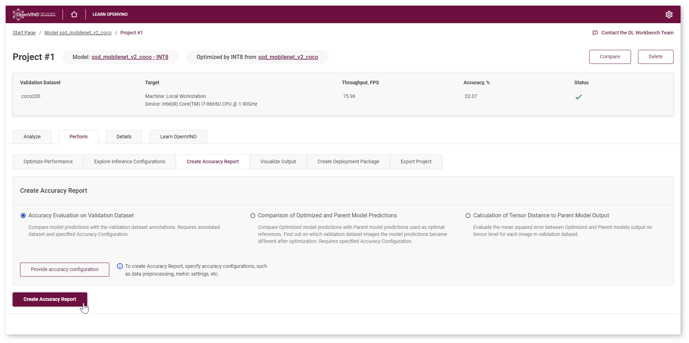
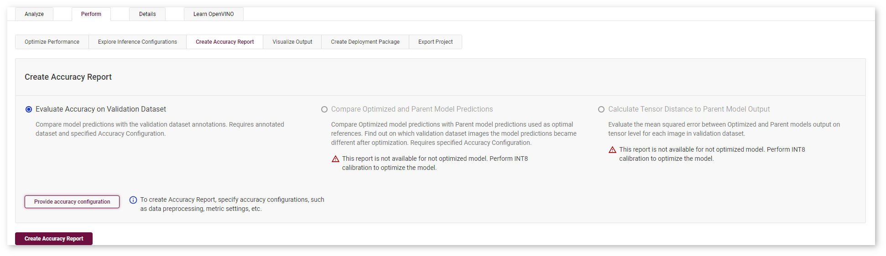
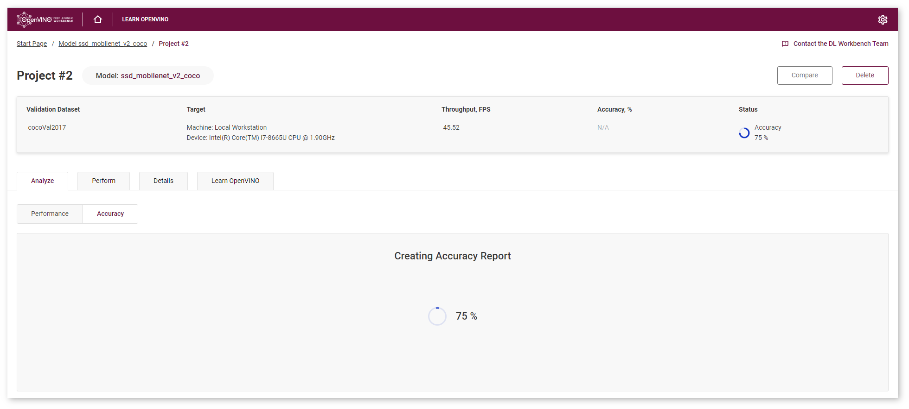

.. index:: pair: page; Object Detection Model Tutorial
.. _doxid-workbench_docs__workbench__d_g__measure__accuracy__object_detection:

Object Detection Model Tutorial
===============================

:target:`doxid-workbench_docs__workbench__d_g__measure__accuracy__object_detection_1md_openvino_workbench_docs_workbench_dg_tutorial_object_detection_dataset` Accuracy measurement is an important stage of profiling your model in the DL Workbench. Along with performance, accuracy is crucial for assessing model quality.

.. list-table::
    :header-rows: 1

    * - Model
      - Task Type
      - Framework
      - Source
      - Dataset
    * - `ssd_mobilenet_v2_coco <https://docs.openvinotoolkit.org/latest/omz_models_model_ssd_mobilenet_v2_coco.html>`__
      - `Object Detection <https://machinelearningmastery.com/object-recognition-with-deep-learning/>`__
      - `TensorFlow\* <https://www.tensorflow.org/>`__
      - `Open Model Zoo <https://github.com/openvinotoolkit/open_model_zoo/tree/master/models/public/mobilenet-ssd>`__
      - `2017 Val images <http://cocodataset.org>`__

Refer to the :ref:`Get Started with DL Workbench <dl_workbench__get_started>` to learn how to import the model and dataset.

.. tip:: If you have optimized the model using :ref:`INT8 Calibration <doxid-workbench_docs__workbench__d_g__int_8__quantization>`, you can use a Not Annotated dataset to compare original and optimized model predictions.

Once you select a model and a dataset and run a baseline inference, the **Projects** page appears. Go to the **Perform** tab and select **Create Accuracy Report** :

Create Accuracy Evaluation on Validation Dataset Report
~~~~~~~~~~~~~~~~~~~~~~~~~~~~~~~~~~~~~~~~~~~~~~~~~~~~~~~

Accuracy Evaluation on Validation Dataset report provides information for evaluating model quality and allows you to compare the model output and validation dataset annotations. Select the report type and click **Provide Accuracy Configuration** button. Refer to the :ref:`Accuracy Configurations page <doxid-workbench_docs__workbench__d_g__accuracy__configuration>` to learn about different accuracy settings.

After you click **Create Accuracy Report**, you will be redirected to the **Analyze** tab, where you can check the status of Accuracy Report creation:

**NOTE:** Accuracy measurements are performed on each dataset image. Creating an Accuracy Report may take some time if the dataset is considerably big.

Interpret Report Results
~~~~~~~~~~~~~~~~~~~~~~~~

Accuracy is measured on the validation dataset images. Each line of the table contains a specific class that the model predicted for the object in the image - **Class Predicted by Model**. The number of detected objects of predicted class is represented in **A. Model Detections of Predicted Class**. The number of objects that have the same class specified in the image annotations is indicated in **B. Objects of Predicted Class in Dataset Annotations**. If the numbers do not match, the model must be incorrect.

To assess the difference between model detections and dataset annotations, check **Matches between A and B**. Matches show the number of times the model detected the location of the object as specified in the validations dataset annotations.

.. tip:: To sort the numbers from lowest to highest, click on the parameter name in the table.

Click **Visualize** button under the **Actions** column to compare the predictions and annotations for a particular image.

In our case, the ``ssd_mobilenet_v2_coco`` model detected 2 objects of class 23 (bear). These detections coincide with the dataset annotations: 2 objects of the same class as predicted by the model. The number of matches also equals 2. In the image, it is shown by almost identical bounding boxes for each object.

Let's consider another example image. The model detected 3 objects of class 1 (person). The annotations indicate that the image contains 4 objects of this class. 2 matches show that only 2 of the 3 detected objects coincide with annotations. In the image, you can see that the model detected 3 people. While one person in the distance is detected precisely, the other bounding boxes are noticeably different from the annotation. Two other people are not detected by the model.

.. tip:: You can enhance your model performance while ensuring that the model accuracy has not decreased dramatically. For that, :ref:`optimize your model <doxid-workbench_docs__workbench__d_g__int_8__quantization>` and create an Accuracy Report that allows you to visualize and :ref:`compare Optimized and Parent model predictions <doxid-workbench_docs__workbench__d_g__tutorial__import__y_o_l_o>`.

*All images were taken from ImageNet, Pascal Visual Object Classes, and Common Objects in Context datasets for demonstration purposes only.*

See Also
~~~~~~~~

* `Accuracy Checker <https://docs.openvinotoolkit.org/latest/omz_tools_accuracy_checker.html>`__

* :ref:`Configure Accuracy Settings <doxid-workbench_docs__workbench__d_g__accuracy__configuration>`

* :ref:`Troubleshooting <dl_workbench__troubleshooting>`

