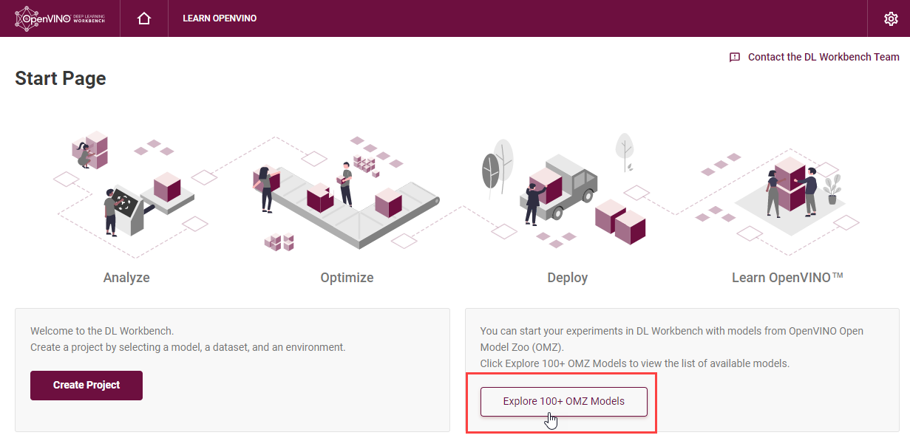
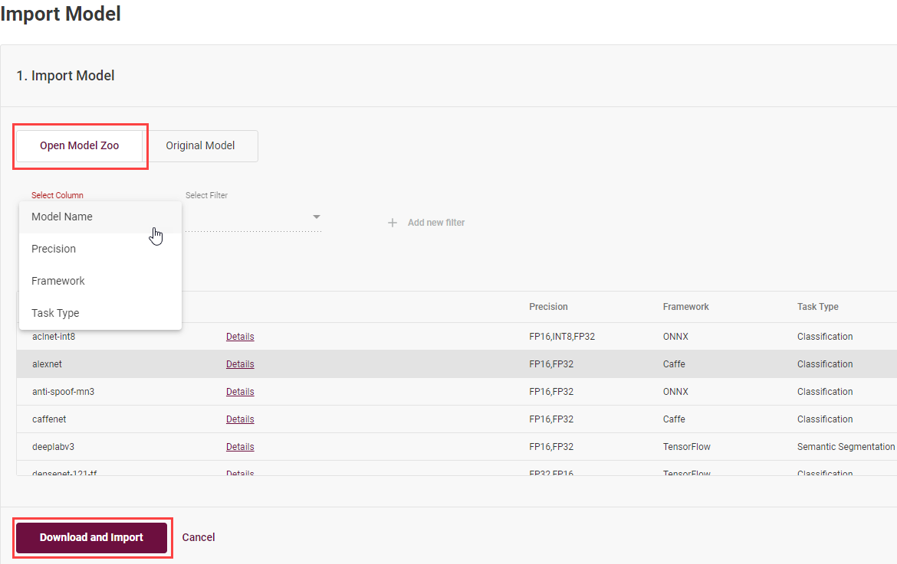
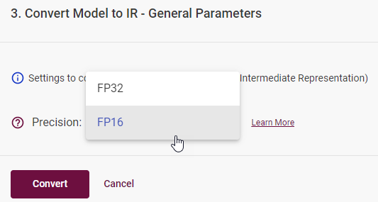

.. index:: pair: page; Import Open Model Zoo Models
.. _doxid-workbench_docs__workbench__d_g__o_m_z__models:

Import Open Model Zoo Models
============================

:target:`doxid-workbench_docs__workbench__d_g__o_m_z__models_1md_openvino_workbench_docs_workbench_dg_omz_models` To upload a model from the Open Model Zoo, click **Explore 100+ OMZ Models** on the Start Page:

On the **Open Model Zoo** tab, select a model and click **Download and Import**. You can search the models by the Model Name, Precision, Framework and Task Type:

To work with OpenVINO tools, you need to obtain a model in the Intermediate Representation (IR) format. IR is the OpenVINO format of pre-trained model representation with two files:

* XML file describing the network topology

* BIN file containing weights and biases

On the **Convert Model to IR** step, you can specify the precision:

.. note:: * If you are behind a corporate proxy, set environment variables during the :ref:`Installation <doxid-workbench_docs__workbench__d_g__run__locally>` step. To learn about the import process, see the Model Downloader documentation.

Once you import a model, you are redirected to the **Create Project** page, where you can select the model and proceed to :ref:`select a dataset <doxid-workbench_docs__workbench__d_g__generate__datasets>`.

See Also
~~~~~~~~

* `Model Downloader <https://docs.openvinotoolkit.org/latest/omz_tools_downloader.html>`__

* `Pretrained Open Model Zoo Public Models <https://docs.openvinotoolkit.org/latest/omz_models_group_public.html>`__

* `Pretrained Open Model Zoo Intel Models <https://docs.openvinotoolkit.org/latest/omz_models_group_intel.html>`__

* :ref:`Troubleshooting <doxid-workbench_docs__workbench__d_g__troubleshooting>`

