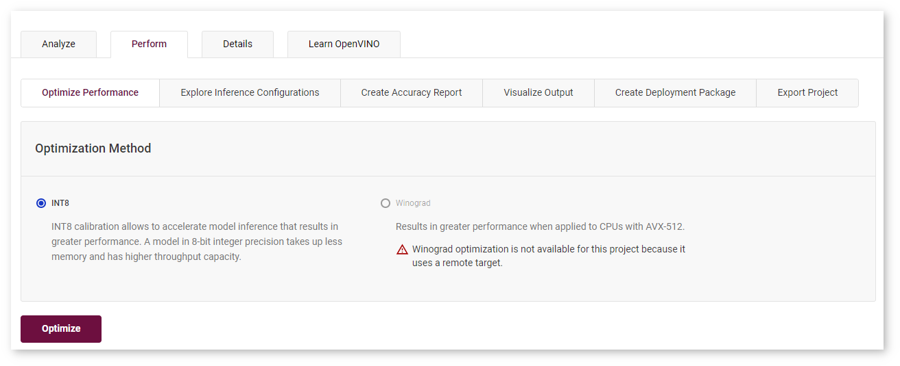
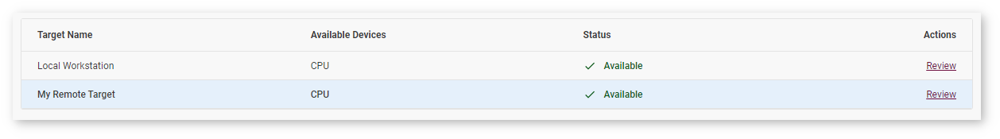

.. index:: pair: page; Profile on Remote Machine
.. _doxid-workbench_docs__workbench__d_g__profile_on__remote__machine:

Profile on Remote Machine
=========================

:target:`doxid-workbench_docs__workbench__d_g__profile_on__remote__machine_1md_openvino_workbench_docs_workbench_dg_profile_on_remote_machine` DL Workbench can collect performance data not only on the machine on which you run it, but also on other machines in your local network.

**NOTES** :

.. _security:

* Learn more about :target:`doxid-workbench_docs__workbench__d_g__profile_on__remote__machine_1security` profiling on a remote machine securely.

* When using a target machine for remote profiling, make sure other users are not working on it at the same time.

* Remote profiling takes more time than profiling on a local machine due to exchanging models, datasets, the script that starts inference, and performance data.

To profile on a remote machine, follow the steps below:

#. :ref:`Set up the remote machine <doxid-workbench_docs__workbench__d_g__setup__remote__target>`.

#. :ref:`Register the remote machine <doxid-workbench_docs__workbench__d_g__add__remote__target>` in the DL Workbench.

#. :ref:`Add a model <doxid-workbench_docs__workbench__d_g__select__models>` to a project.

#. `Add the remote machine <#add-target>`__ to the project.

#. :ref:`Add an environment <doxid-workbench_docs__workbench__d_g__select__environment>` to the project.

#. :ref:`Add a dataset <doxid-workbench_docs__workbench__d_g__generate__datasets>` to the project.

#. :ref:`Create a project <doxid-workbench_docs__workbench__create__project>`.

After these steps, you can run single and group inference and compare performance between models on local and remote machines. Features like accuracy measurements are disabled for remote machines:

.. _add-target:

Add Remote Machine to Project
~~~~~~~~~~~~~~~~~~~~~~~~~~~~~

On the **Create Project** page, :ref:`select a model <doxid-workbench_docs__workbench__d_g__select__models>` and move on to the **Select an Environment** tab.

Machines registered in the DL Workbench are added to the **Select an Environment** table. You can only select a machine that indicates **Available** state:

**Configuring** and **Connecting** states mean that you need to wait for the machine to set up:

.. image:: configuring-env-001.png

.. image:: connecting-001.png

If the machine you want to use indicates **Configuration Failure**, click **Review** and follow the instructions in :ref:`Manipulate Remote Machines <doxid-workbench_docs__workbench__d_g__remote__machines>` :

.. image:: config-failure-001.png

.. _security:

Security Aspects of Remote Profiling
~~~~~~~~~~~~~~~~~~~~~~~~~~~~~~~~~~~~

SSH keys are sensitive data and using them in the DL Workbench is at your own risk.

DL Workbench takes control of a remote machine to perform a limited set of tasks, like installing dependencies and OpenVINO™ tools. Connect a machine at your own risk and according to the security policy of your organization.

:ref:`Run the DL Workbench with Transport Layer Security (TLS) <doxid-workbench_docs__workbench__d_g__configure__t_l_s>` to ensure data protection.

Sensitive data is removed when you remove a machine from the DL Workbench or remove the Docker container with the DL Workbench.

DL Workbench installs dependencies on a target machine and therefore takes additional space on it. DL Workbench data is stored in the ``.workbench`` folder in your user directory. To remove the new data from your target machine, remove the ``.workbench`` folder. DL Workbench transfers models and datasets to the target machine with the SSH protocol and removes them after completing experiments there.

See Also
~~~~~~~~

* :ref:`Work with Remote Targets <doxid-workbench_docs__workbench__d_g__remote__profiling>`

* :ref:`Manipulate Remote Machines <doxid-workbench_docs__workbench__d_g__remote__machines>`

* :ref:`Set Up Remote Target <doxid-workbench_docs__workbench__d_g__setup__remote__target>`

* :ref:`Troubleshooting <doxid-workbench_docs__workbench__d_g__troubleshooting>`

