.. index:: pair: page; Run Inference
.. _doxid-workbench_docs__workbench__d_g__run__single__inference:

Run Inference
=============

:target:`doxid-workbench_docs__workbench__d_g__run__single__inference_1md_openvino_workbench_docs_workbench_dg_run_single_inference`

Run Single Inference
~~~~~~~~~~~~~~~~~~~~

.. raw:: html

   
Run Single Inference

To trigger more inference jobs of an existing configuration, go to the **Perform** tab on the **Projects** page and open the **Explore Inference Configurations** subtab. Select **Single Inference**, specify the number of inferences per a stream and a batch, and click **Execute** :

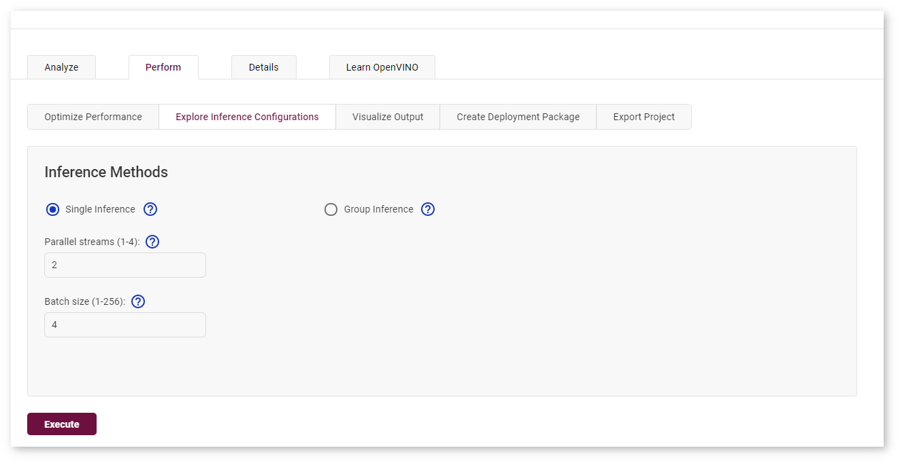

The process starts and you cannot proceed until it is done:

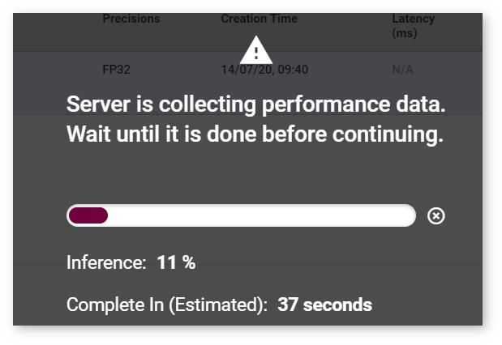

Once the inference is completed, go to the **Analyze** tab. The graph now indicates a point for the new inference experiment:

.. image:: new_inference_experiment.png

The table now also contains a row for the inference experiment:

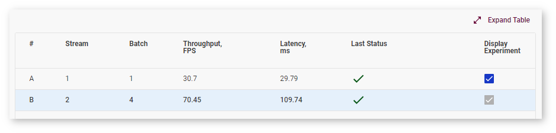

Autobenchmarking
----------------

During the baseline inference with Batch 1 Stream 1 configurations, DL Workbench runs another inference where the parameters are set automatically depending on the model topology to obtain near-optimal performance on the selected accelerator. While automatic selection typically provides near-optimal performance, experimenting with various Batch and Stream combinations might help you accelerate performance even further.

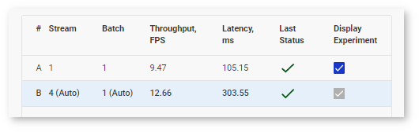

.. note:: For details about inference processes, see the :ref:`OpenVINO™ Runtime documentation <doxid-openvino_docs__o_v__u_g__o_v__runtime__user__guide>`.

Run Group Inference
~~~~~~~~~~~~~~~~~~~

.. raw:: html

   
 Run Group Inference 

DL Workbench provides a graphical interface to find the optimal configuration of batches and parallel requests on a certain machine.

To run a range of inference streams, go to the **Perform** tab on the **Projects** page and open the **Explore Inference Configurations** subtab. Select **Group Inference** and click **Configure Group Inference**.

.. image:: group_inference.png

On the **Configure Group Inference** page, select combinations of stream and batch parameters by clicking corresponding cells in the table. The cells you select are indicated with the check mark. Dark cells represent previously executed inferences. You can select them as well.

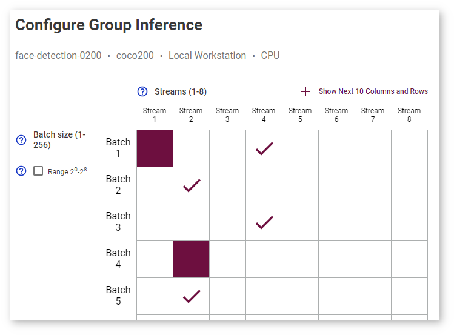

Click **Show Next 10 Columns and Rows** to expand the table:

Select **Range 2 0 -2 8** to see batch values only as degrees of 2:

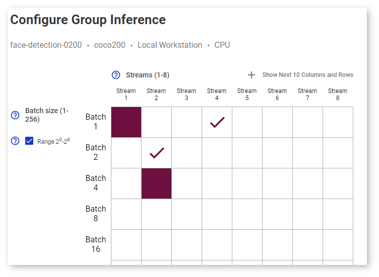

The estimated execution time is displayed under the table:

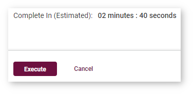

A table with the inferences you selected is on the right:

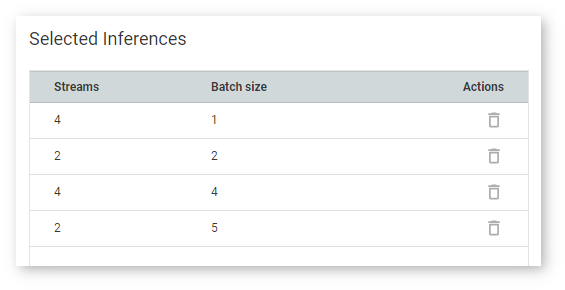

Once you click **Execute**, the inference starts and you cannot proceed until it is done:

Once the inference is completed, go to the **Analyze** tab. The table contains rows for each inference with a certain batch/parallel request configuration, and the graph indicates points corresponding to them:

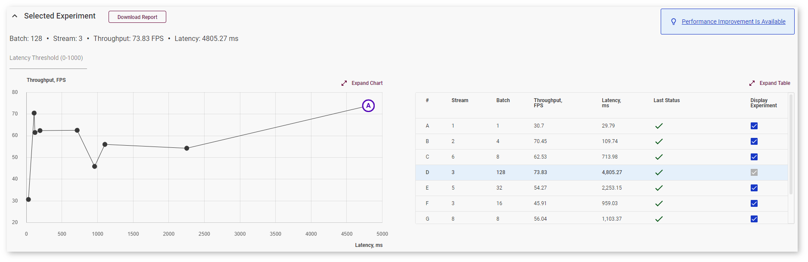

Right above the graph, you can specify maximum latency to find the optimal configuration with the best throughput within the desired latency range. The point corresponding to this configuration turns blue:

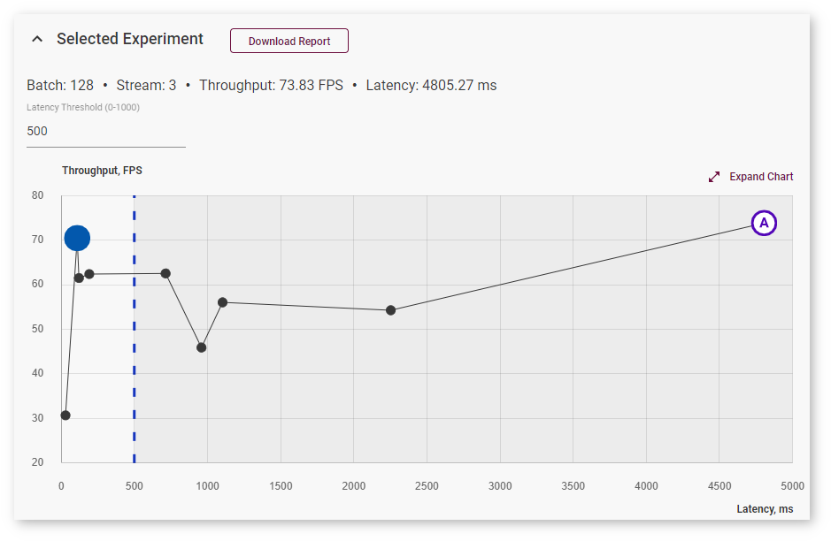

To view information about latency, throughput, batch, and parallel requests of a specific job, hover your cursor over the corresponding point on the graph. Use **Expand** and **Collapse** buttons to change sizes of the chart and the table:

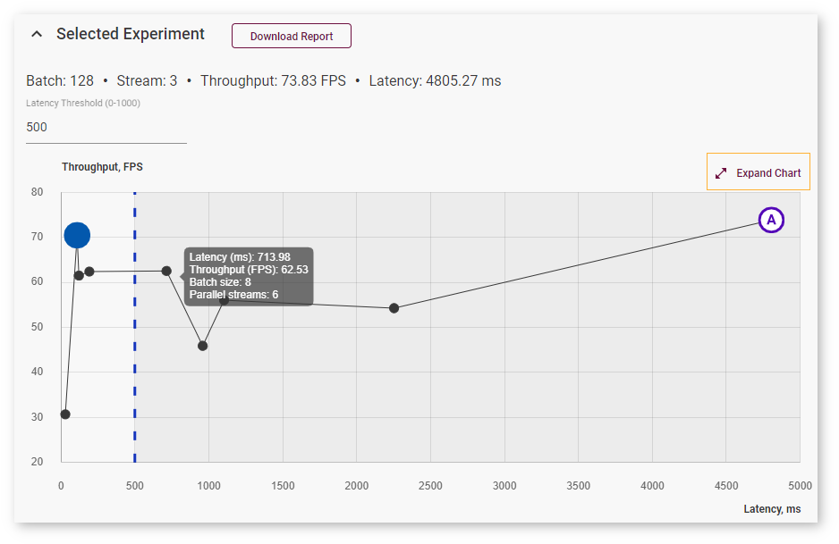

Autobenchmarking
----------------

During the baseline inference with Batch 1 Stream 1 configurations, DL Workbench runs another inference where the parameters are set automatically depending on the model topology to obtain near-optimal performance on the selected accelerator. While automatic selection typically provides near-optimal performance, experimenting with various Batch and Stream combinations might help you accelerate performance even further.

.. note:: For details about inference processes, see the :ref:`OpenVINO™ Runtime documentation <doxid-openvino_docs__o_v__u_g__o_v__runtime__user__guide>`.

See Also
~~~~~~~~

* :ref:`View Inference Results <doxid-workbench_docs__workbench__d_g__view__inference__results>`

* :ref:`Benchmark Tool <doxid-openvino_inference_engine_tools_benchmark_tool__r_e_a_d_m_e>`

* :ref:`Troubleshooting <doxid-workbench_docs__workbench__d_g__troubleshooting>`

