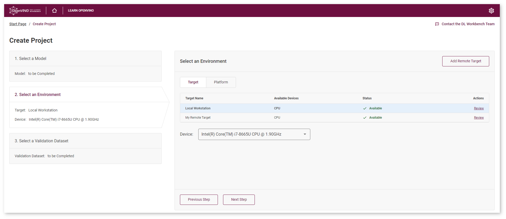
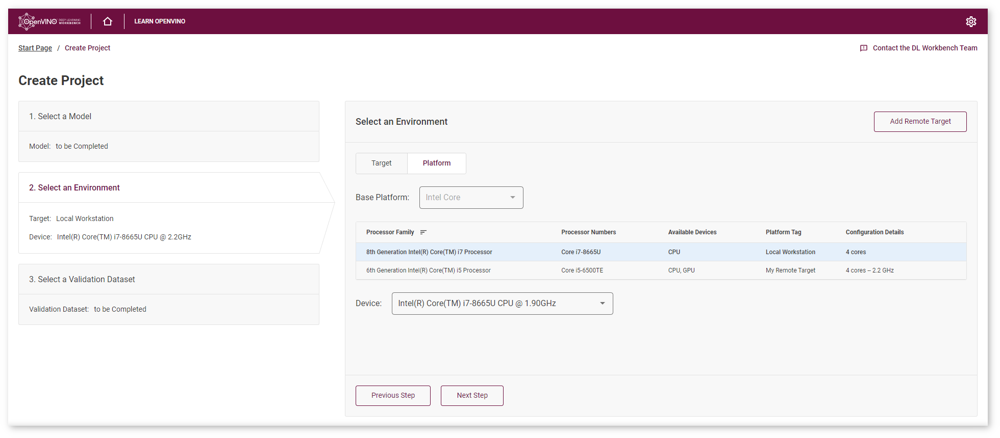

.. index:: pair: page; Select Environment
.. _doxid-workbench_docs__workbench__d_g__select__environment:

Select Environment
==================

:target:`doxid-workbench_docs__workbench__d_g__select__environment_1md_openvino_workbench_docs_workbench_dg_select_environment`

.. toctree::
   :maxdepth: 1
   :hidden:

   workbench_docs_Workbench_DG_Remote_Profiling

Target is a machine that hosts one or several accelerators. Device is a hardware accelerator on which a model is executed. The target can be your local workstation or a remote system. By default, your local target is selected. Learn more about setting up remote targets at the :ref:`Work with Remote Targets <doxid-workbench_docs__workbench__d_g__remote__profiling>` section.

Select a target. This can be your local workstation or a remote target. If you use a remote target, see :ref:`Register Remote Machine <doxid-workbench_docs__workbench__d_g__add__remote__target>`. Select a device from a target or a platform view:

* **Target View**
  
  Use this view when the list with targets is short. Select a target from the list of machines registered in the DL Workbench.

* **Platform View**
  
  Use this view when the list with targets is long. Determine the base platform based on Intel® processors: Core™, Xeon™, or Atom™. Within a platform, choose a combination and an accelerator. To group targets based on a platform, switch to the platform view and select a platform in the **Base Platform** drop-down list:

Targets with higher processor numbers within one platform go first. To sort from lowest to highest, click the arrow next to the **Processor Numbers** heading.

Targets supported in the DL Workbench:

.. list-table::
    :header-rows: 1

    * - Code name in DL Workbench
      - Plugin name in OpenVINO™ Runtime
      - Examples of devices
    * - CPU
      - :ref:`CPU <deploy_infer__cpu_device>`
      - Intel® Xeon® with Intel® AVX2 and AVX512, Intel® Core™ processors with Intel® AVX2, Intel Atom® processors with Intel® SSE
    * - GPU
      - :ref:`GPU <deploy_infer__gpu_device>`
      - Intel® Processor Graphics, including Intel® HD Graphics and Intel® Iris® Graphics
    * - MYRIAD
      - :ref:`MYRIAD <deploy_infer__vpu_myriad_device>`
      - Intel® Movidius™ Neural Compute Stick 2
    * - HDDL
      - :ref:`HDDL <deploy_infer__vpu_hddl_device>`
      - Intel® Vision Accelerator Design with Intel® Movidius™ VPUs

See Also
~~~~~~~~

* :ref:`Work with Remote Targets <doxid-workbench_docs__workbench__d_g__remote__profiling>`

* :ref:`Troubleshooting <doxid-workbench_docs__workbench__d_g__troubleshooting>`

