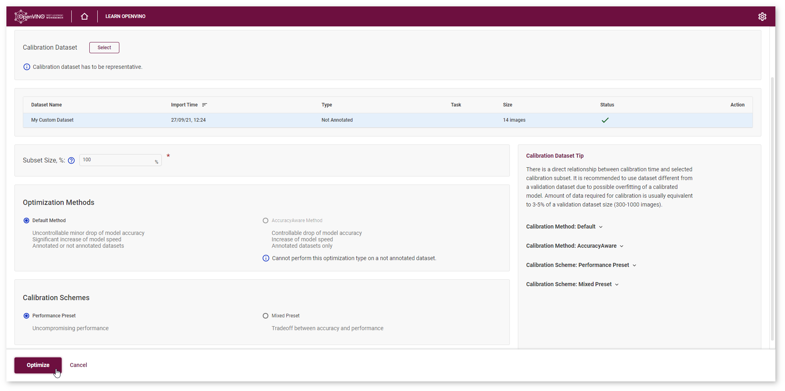
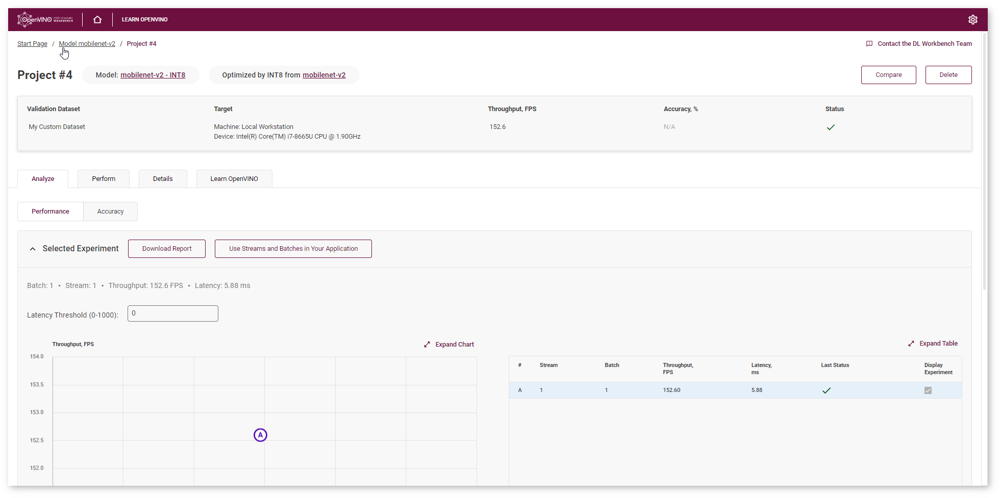
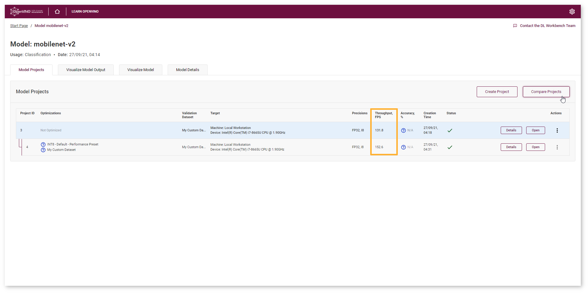
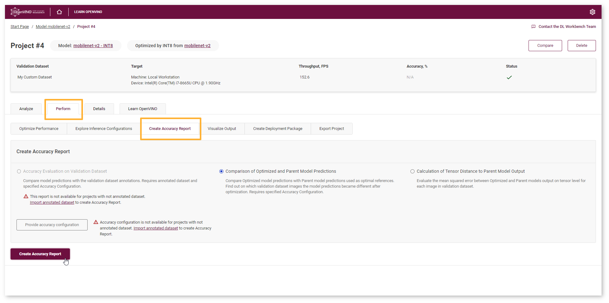
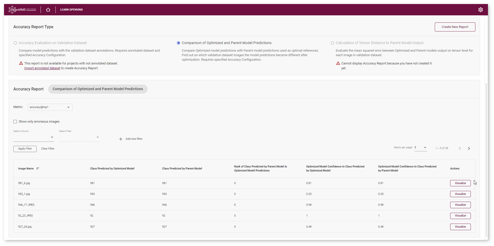
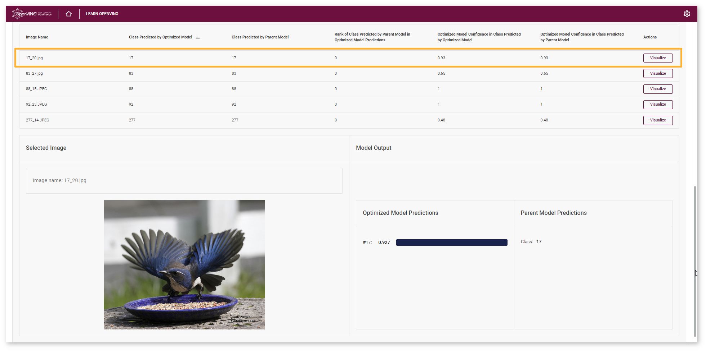
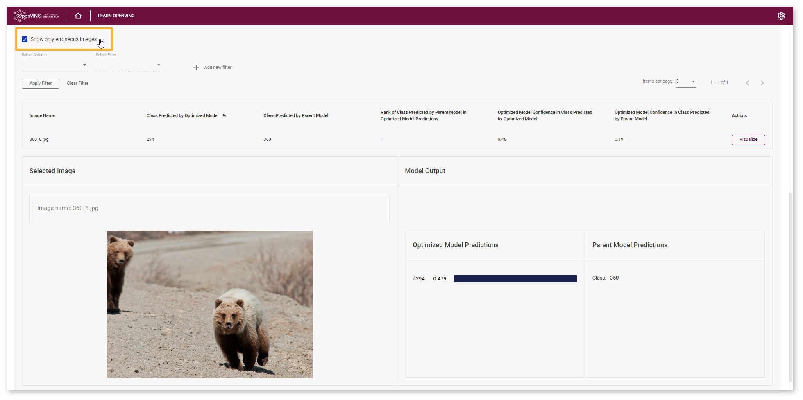

.. index:: pair: page; Optimize Classification Model
.. _doxid-workbench_docs__workbench__d_g__tutorial__classification:

Optimize Classification Model
=============================

:target:`doxid-workbench_docs__workbench__d_g__tutorial__classification_1md_openvino_workbench_docs_workbench_dg_tutorial_classification`

Summary
~~~~~~~

INT8 Calibration is a universal method for accelerating deep learning models. Calibration is a process of converting a Deep Learning model weights to a lower 8-bit precision such that it needs less computation.

In this tutorial, you will learn how to optimize your model using INT8 Calibration, examine how much quicker the model has become, and check the difference between original and optimized model accuracy.

.. list-table::
    :header-rows: 1

    * - Model
      - Task Type
      - Framework
      - Source
      - Dataset
    * - `mobilenet_v2 <https://docs.openvinotoolkit.org/latest/omz_models_model_mobilenet_v2.html>`__
      - `Classification <https://paperswithcode.com/task/image-classification>`__
      - `Caffe\* <https://caffe.berkeleyvision.org/>`__
      - `Open Model Zoo <https://github.com/openvinotoolkit/open_model_zoo/tree/master/models/public/mobilenet-v2>`__
      - :ref:`Not Annotated <doxid-workbench_docs__workbench__d_g__dataset__types>`

You can learn how to :ref:`import the model <doxid-workbench_docs__workbench__d_g__select__model>` and :ref:`create a not annotated dataset <doxid-workbench_docs__workbench__create__project>` in the DL Workbench :ref:`Get Started Guide <dl_workbench__get_started>`.

Optimize Model Using INT8 Calibration
~~~~~~~~~~~~~~~~~~~~~~~~~~~~~~~~~~~~~

To convert the model to INT8, go to **Perform** tab on the Project page and open **Optimize** subtab. Check **INT8** and click **Optimize**.

Once a model has been inferred in the DL Workbench, you can convert it from FP32 to INT8. Go to the **Perform** tab on the Project page and open the **Optimize** subtab. Check **INT8** and click **Optimize**.

.. image:: optimize_face_detection.png

It takes you to the **Optimize INT8** page. Select the imported dataset and perform INT8 Calibration with Default optimization method and Performance Preset calibration scheme first as it provides maximum performance speedup.

After optimization, you will be redirected to a new Project page for optimized ``mobilenet-v2`` model.

To ensure that the optimized model performance is sufficiently accelerated and its predictions can be trusted, evaluate the key characteristics: performance and accuracy.

Compare Optimized and Parent Model Performance
~~~~~~~~~~~~~~~~~~~~~~~~~~~~~~~~~~~~~~~~~~~~~~

Go to the model page and check the performance of the imported and optimized models. Compare the throughput numbers and click **Compare Projects**. Learn more about projects comparison on the :ref:`Compare Performance <doxid-workbench_docs__workbench__d_g__compare__performance_between__two__versions_of__models>` page.

**NOTE:** Throughput is the number of images processed in a given amount of time. It is measured in frames per second (FPS). Higher throughput value means better performance.

You can observe that ``mobilenet_v2`` model has become 1.2x times faster on CPU device after optimization.

Lowering the precision of the model using quantization leads to a loss in prediction capability. Therefore you need to assess the model prediction capability to ensure that you have not lost a significant amount of accuracy.

Compare Parent and Optimized Model Predictions
~~~~~~~~~~~~~~~~~~~~~~~~~~~~~~~~~~~~~~~~~~~~~~

Create Accuracy Report
----------------------

Go to the **Perform** tab and select **Create Accuracy Report** :

Comparison of Optimized and Parent Model Predictions Report allows you to find out on which validation dataset images the predictions of the model have become different after optimization. Let's compare Optimized model predictions with Parent model predictions used as optimal references.

Interpret Report Results
------------------------

Each line of the table contains a specific class that the model predicted for the object in the image - **Class Predicted by Optimized Model**. You can compare this class with the **Class Predicted by Parent Model**.

If the classes do not match, the Optimized model might be incorrect. To assess the difference between the classes, check the **Rank of Class Defined in Parent Model Predictions**. You can also compare optimized **Model Confidence in Class Predicted by Optimized Model** with **Optimized Model Confidence in Class Predicted by Parent Model**.

.. tip:: To sort the numbers from lowest to highest, click on the parameter name in the table.

Click **Visualize** button under the **Actions** column to compare the predictions and annotations for a particular image.

In the example image, the Optimized ``mobilenet-v2`` model predicted the same class as the Parent model (bird) with confidence equaled 0.93.

Check **Show only erroneous images** option to display only images where the classes predicted by the model and specified in dataset annotations do not match.

Another type of Accuracy Report available for not annotated datasets is Calculation of Tensor Distance to Parent Model Output. The report enables you to identify differences between Parent and Optimized model predictions for a wider set of use cases besides classification and object detection. Learn more in the :ref:`Style Transfer model tutorial <doxid-workbench_docs__workbench__d_g__tutorial__style__transfer>`.

Next Step
~~~~~~~~~

After evaluating the accuracy, you can decide whether the difference between imported and optimized models predictions is critical or not:

* If the tradeoff between accuracy and performance is too big, :ref:`import an annotated dataset <doxid-workbench_docs__workbench__d_g__generate__datasets>` and use `AccuracyAware optimization method <Int-8_Quantization.md#accuracyaware>`__, then repeat the steps from this tutorial.

* If the tradeoff is acceptable, :ref:`explore inference configurations <doxid-workbench_docs__workbench__d_g__deploy_and__integrate__performance__criteria_into__application>` to further enhance the performance. Then create a :ref:`deployment package <doxid-workbench_docs__workbench__d_g__deployment__package>` with your ready-to-deploy model.

*All images were taken from ImageNet, Pascal Visual Object Classes, and Common Objects in Context datasets for demonstration purposes only.*

See Also
~~~~~~~~

* :ref:`Create Accuracy Report <doxid-workbench_docs__workbench__d_g__measure__accuracy>`

* :ref:`Troubleshooting <dl_workbench__troubleshooting>`

