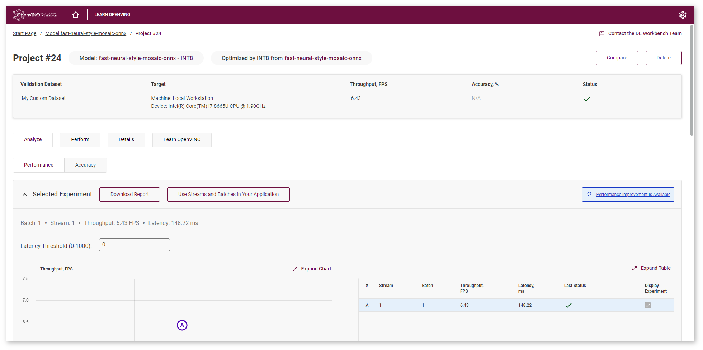
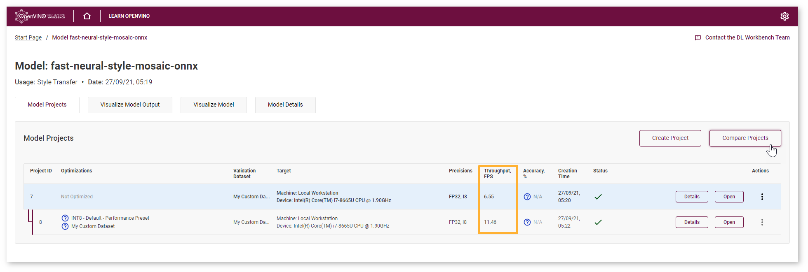
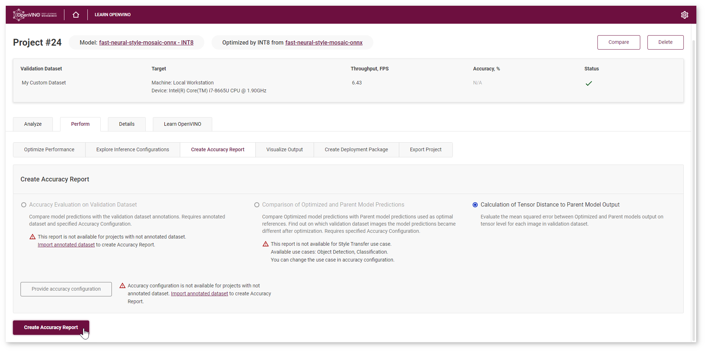
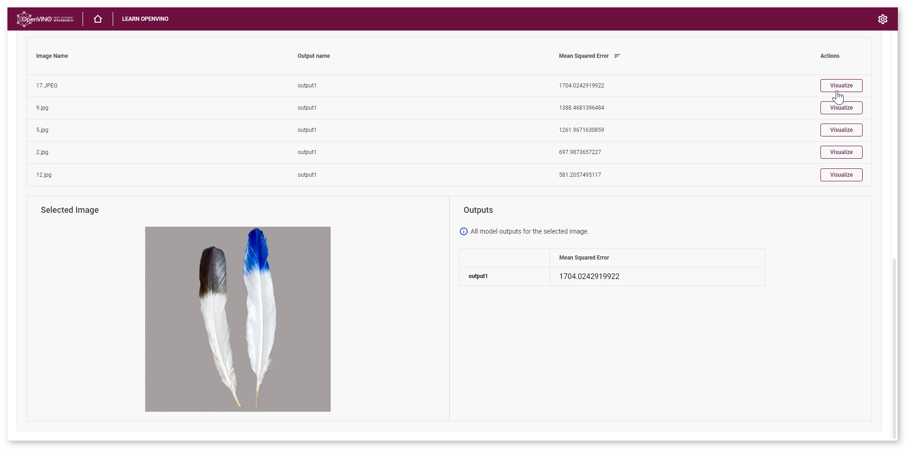
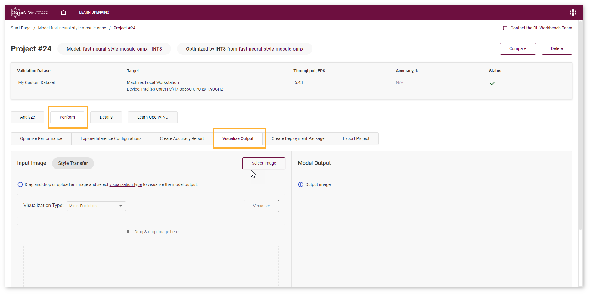
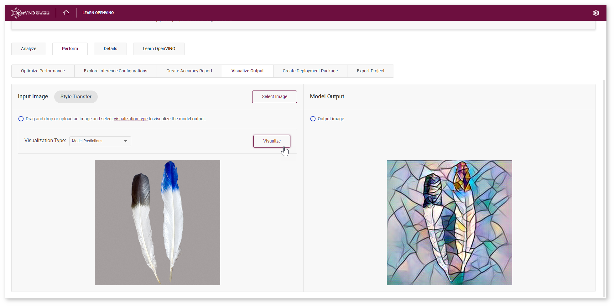
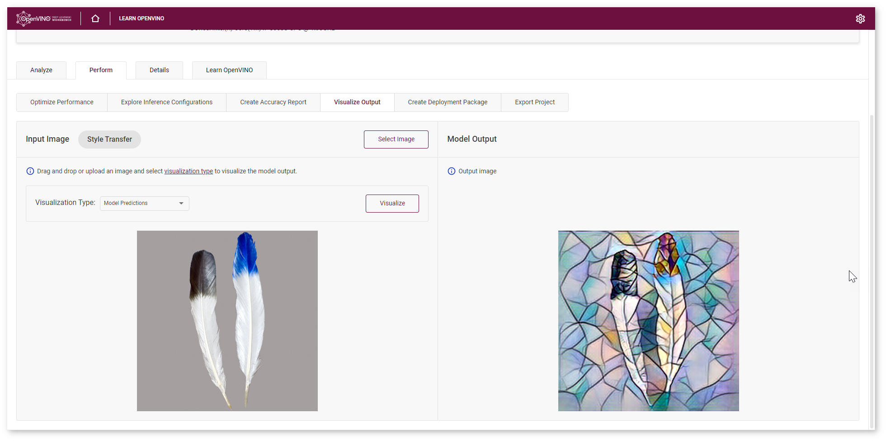

.. index:: pair: page; Optimize Style Transfer Model
.. _doxid-workbench_docs__workbench__d_g__tutorial__style__transfer:

Optimize Style Transfer Model
=============================

:target:`doxid-workbench_docs__workbench__d_g__tutorial__style__transfer_1md_openvino_workbench_docs_workbench_dg_tutorial_style_transfer`

Summary
~~~~~~~

INT8 Calibration is a universal method for accelerating deep learning models. Calibration is a process of converting a Deep Learning model weights to a lower 8-bit precision such that it needs less computation.

In this tutorial, you will learn how to optimize your model using INT8 Calibration, examine how much quicker the model has become, and check the difference between original and optimized model accuracy.

.. list-table::
    :header-rows: 1

    * - Model
      - Task Type
      - Framework
      - Source
      - Dataset
    * - `fast-neural-style-mosaic-onnx <https://docs.openvinotoolkit.org/latest/omz_models_model_fast_neural_style_mosaic_onnx.html>`__
      - `Style Transfer <https://paperswithcode.com/task/style-transfer>`__
      - `ONNX\* <https://onnx.ai/>`__
      - `Open Model Zoo <https://github.com/openvinotoolkit/open_model_zoo/tree/master/models/public/fast-neural-style-mosaic-onnx>`__
      - :ref:`Not Annotated dataset <doxid-workbench_docs__workbench__d_g__dataset__types>`

You can learn how to :ref:`import the model <doxid-workbench_docs__workbench__d_g__select__model>` and :ref:`create a not annotated dataset <doxid-workbench_docs__workbench__create__project>` in the DL Workbench :ref:`Get Started Guide <dl_workbench__get_started>`.

Optimize Model Using INT8 Calibration
~~~~~~~~~~~~~~~~~~~~~~~~~~~~~~~~~~~~~

To convert the model to INT8, go to **Perform** tab on the Project page and open **Optimize** subtab. Check **INT8** and click **Optimize**.

.. image:: optimize_face_detection.png

It takes you to the **Optimize INT8** page. Select the imported dataset and perform INT8 Calibration with Default optimization method and Performance Preset calibration scheme first as it provides maximum performance speedup.

.. image:: int-8-configurations.png

After optimization, you will be redirected to a new Project page for optimized ``mobilenet-v2`` model.

To ensure that the optimized model performance is sufficiently accelerated and its predictions can be trusted, evaluate the key characteristics: performance and accuracy.

Compare Optimized and Parent Model Performance
~~~~~~~~~~~~~~~~~~~~~~~~~~~~~~~~~~~~~~~~~~~~~~

Go to the model page and check the performance of the imported and optimized models. Compare the throughput numbers and click **Compare Projects**. Read about projects comparison on the :ref:`Compare Performance <doxid-workbench_docs__workbench__d_g__compare__performance_between__two__versions_of__models>` page.

.. note:: Throughput is the number of images processed in a given amount of time. It is measured in frames per second (FPS). Higher throughput value means better performance.

You can observe that ``fast-neural-style-mosaic-onnx`` model has become 1.7x times faster on CPU device after optimization.

Lowering the precision of the model using quantization leads to a loss in prediction capability. Therefore you need to assess the model prediction capability to ensure that you have not lost a significant amount of accuracy.

Compare Parent and Optimized Model Predictions
~~~~~~~~~~~~~~~~~~~~~~~~~~~~~~~~~~~~~~~~~~~~~~

Create Accuracy Report
----------------------

To measure accuracy of the model, go to the **Perform** tab and select **Create Accuracy Report** :

Calculation of Tensor Distance to Parent Model Output Report allows to evaluate the mean squared error (MSE) between Optimized and Parent models output on tensor level for each image in the validation dataset. Mean Squared Error (MSE) is an average of the square of the difference between actual and estimated values. MSE evaluation enables you to identify differences between Parent and Optimized model predictions for a wider set of use cases besides classification and object detection.

.. tip:: To sort the numbers from lowest to highest, click on the parameter name in the table.

Visualize Model Predictions
---------------------------

Even though the comparison with Parent model predictions is not available for the models of Style Transfer use case, you still can compare the Optimized and Parent model outputs using DL Workbench visualization feature.

Sort the images to find the largest MSE number and click **Visualize**.

Find this image in the dataset, go to **Perform** tab and upload the image to **Visualize Output**.

Click **Visualize** to see the results:

Save the output image locally. Then open Parent model project, repeat the visualization step, and compare the outputs:

Next Step
~~~~~~~~~

After evaluating the accuracy, you can decide whether the difference between imported and optimized models predictions is critical or not:

* If the tradeoff between accuracy and performance is too big, :ref:`import an annotated dataset <doxid-workbench_docs__workbench__d_g__generate__datasets>` and use `AccuracyAware optimization method <Int-8_Quantization.md#accuracyaware>`__, then repeat the steps from this tutorial.

* If the tradeoff is acceptable, :ref:`explore inference configurations <doxid-workbench_docs__workbench__d_g__deploy_and__integrate__performance__criteria_into__application>` to further enhance the performance. Then create a :ref:`deployment package <doxid-workbench_docs__workbench__d_g__deployment__package>` with your ready-to-deploy model.

*All images were taken from ImageNet, Pascal Visual Object Classes, and Common Objects in Context datasets for demonstration purposes only.*

See Also
~~~~~~~~

* :ref:`Create Accuracy Report <doxid-workbench_docs__workbench__d_g__measure__accuracy>`

* :ref:`Configure Accuracy Settings <doxid-workbench_docs__workbench__d_g__accuracy__configuration>`

* :ref:`Troubleshooting <dl_workbench__troubleshooting>`

