.. index:: pair: page; View Inference Results
.. _doxid-workbench_docs__workbench__d_g__view__inference__results:

View Inference Results
======================

:target:`doxid-workbench_docs__workbench__d_g__view__inference__results_1md_openvino_workbench_docs_workbench_dg_view_inference_results`

Inference Results
~~~~~~~~~~~~~~~~~

Once an initial inference has been run with your project, you can view performance results on the **Analyze** tab of the **Projects** page.

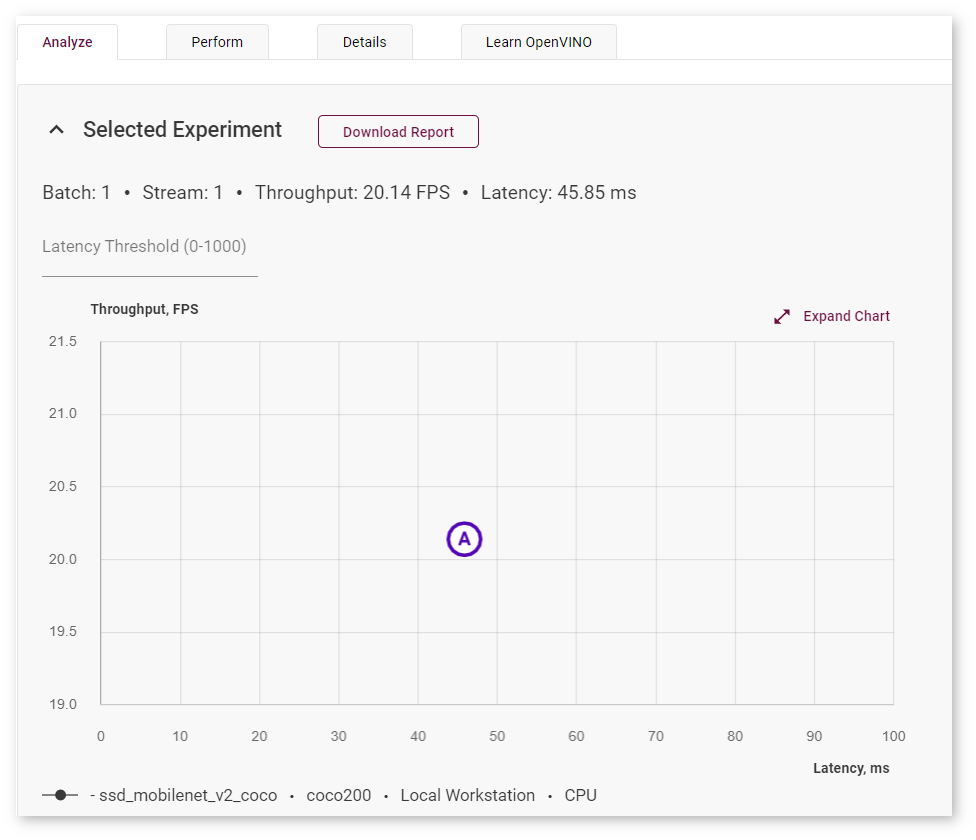

* Throughput/Latency graph

* Table with inferences

If there are ways to improve the performance of your model, the DL Workbench notifies you in the **Analyze** tab:

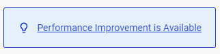

Clicking this button taken you to the bottom of the page with the detailed information on what can be improved and what steps you should take to get the most possible performance of this project.

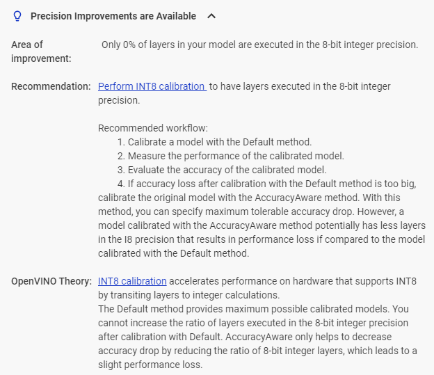

Scroll down to the three tabs below:

* `Performance Summary <#performance-summary>`__

* `Precision-Level Performance <#precision-level-performance>`__

* `Kernel-Level Performance <#kernel-level-performance>`__

.. _performance-summary:

Performance Summary Tab
~~~~~~~~~~~~~~~~~~~~~~~

The tab contains the **Per-layer Accumulated Metrics** table and the **Execution Attributes** field, which includes throughput, latency, batch, and streams values of the selected inference.

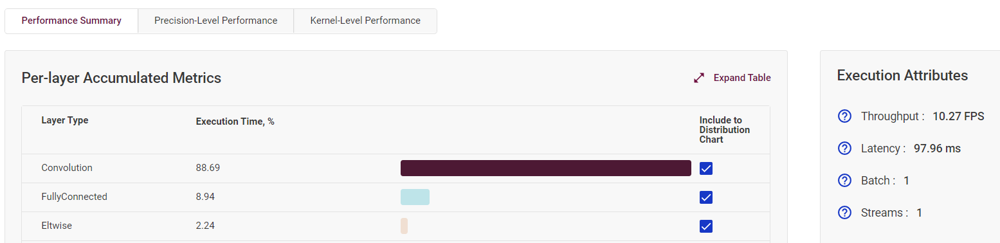

Click **Expand Table** to see the full **Per-layer Accumulated Metrics** table, which provides information on execution time of each layer type as well as the number layers in a certain precision. Layer types are arranged from the most to the least time taken.

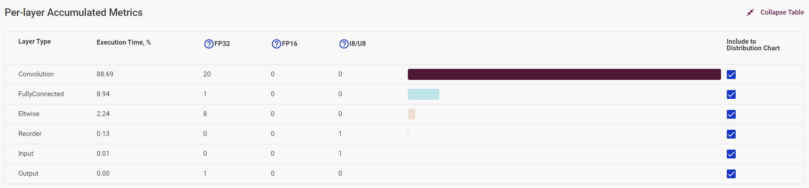

The table visually demonstrates the ratio of time taken by each layer type. Uncheck boxes in the **Include to Distribution Chart** column to filter out certain layers.

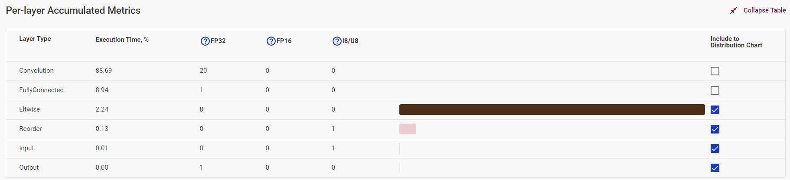

.. _precision-level-performance:

Precision-Level Performance Tab
~~~~~~~~~~~~~~~~~~~~~~~~~~~~~~~

The tab contains the **Precision Distribution** table, **Precision Transitions Matrix**, and **Execution Attributes**.

The **Precision Distribution** table provides information on execution time of layers in different precisions.

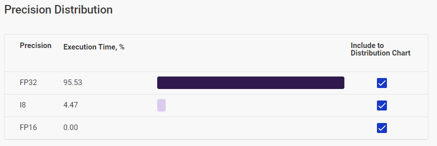

The table visually demonstrates the ratio of time taken by each layer type. Uncheck boxes in the **Include to Distribution Chart** column to filter out certain layers.

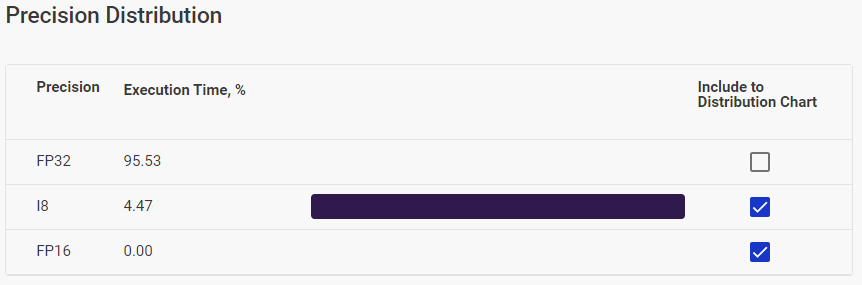

The **Precision Transitions Matrix** shows how inference precision changed during model execution. For example, if the cell at the FP32 row and the FP16 column shows 8, this means that eight times there was a pattern of an FP32 layer being followed by an FP16 layer.

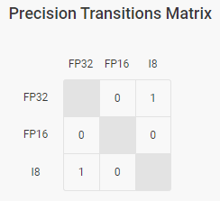

.. _kernel-level-performance:

Kernel-Level Performance Tab
~~~~~~~~~~~~~~~~~~~~~~~~~~~~

The **Kernel-Level Performance** tab includes the **Layers** table and model graphs. See :ref:`Visualize Model <doxid-workbench_docs__workbench__d_g__visualize__model>` for details.

The **Layers** table shows each layer of the executed graph of a model:

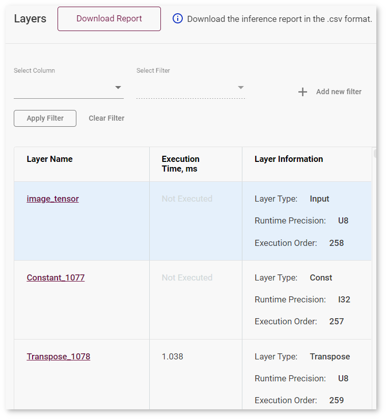

For each layer, the table displays the following parameters:

* Layer name

* Execution time

* Layer type

* Runtime precision

* Execution order

To see details about a layer:

#. Click the name of a layer. The layer gets highlighted on the **Runtime Graph** on the right.

#. Click **Details** next to the layer name on the **Runtime Graph**. The details appear on the right to the table and provide information about execution parameters, layer parameters, and fusing information in case the layer was fused in the runtime.

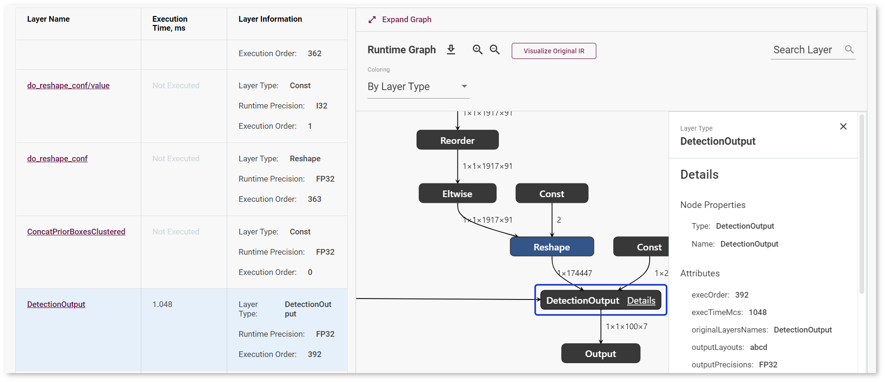

.. tip:: To download a ``.csv`` inference report for your model, click **Download Report**.

Sort and Filter Layers
----------------------

You can sort layers by layer name, execution time, and execution order (layer information) by clicking the name of the corresponding column.

To filter layers, select a column and a filter in the boxes above the table. Some filters by the **Execution Order** and **Execution Time** columns require providing a numerical value in the box that is opened automatically:

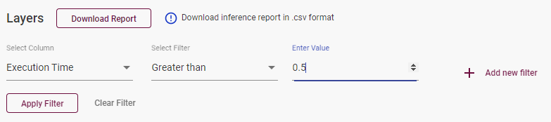

To filter by multiple columns, click **Add new filter** after you specify all the data for the the current column. To remove a filter, click the red *remove* symbol on the left to it:

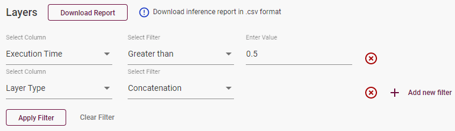

.. note:: The filters you select are applied simultaneously.

Once you configure the filters, press **Apply Filter**. To apply a different filter, press **Clear Filter** and configure new filters.

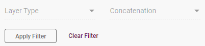

See Also
~~~~~~~~

* :ref:`Visualize Model Performance <doxid-workbench_docs__workbench__d_g__visualize__model>`

* :ref:`INT8 Calibration <doxid-workbench_docs__workbench__d_g__int_8__quantization>`

* :ref:`Troubleshooting <dl_workbench__troubleshooting>`

