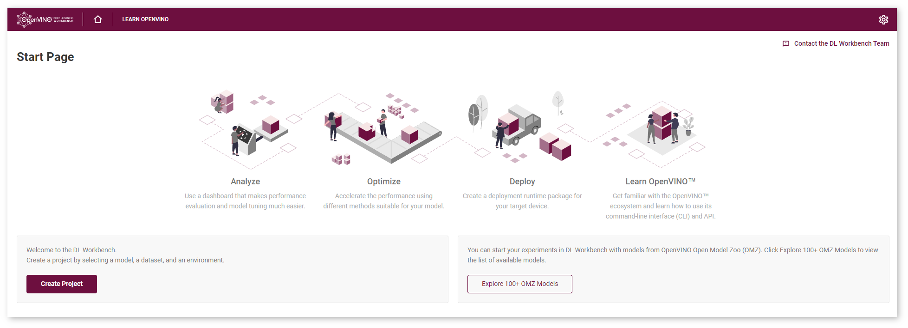

.. index:: pair: page; Run the DL Workbench in the Intel® DevCloud for the Edge
.. _doxid-workbench_docs__workbench__d_g__start__d_l__workbench_in__dev_cloud:

Run the DL Workbench in the Intel® DevCloud for the Edge
=========================================================

:target:`doxid-workbench_docs__workbench__d_g__start__d_l__workbench_in__dev_cloud_1md_openvino_workbench_docs_workbench_dg_start_dl_workbench_in_devcloud` `Intel® DevCloud for the Edge <https://software.intel.com/content/www/us/en/develop/tools/devcloud.html>`__ is a computing resource to develop, test, and run your workloads across a range of Intel® CPUs, GPUs, and Movidius™ Myriad™ Vision Processing Units (VPUs). Running the DL Workbench in the DevCloud helps you optimize your model and analyze its performance on various Intel® hardware configurations. DevCloud is available for enterprise developers, independent developers, students, and faculty members.

When running the DL Workbench in the DevCloud, you can use the following DL Workbench features:

.. list-table::
    :header-rows: 1

    * - Feature
      - Supported
    * - Single and group inference
      - Yes (HDDL plugin is not supported)
    * - INT8 calibration
      - Yes
    * - Accuracy measurements
      - Yes
    * - Model output visualization
      - Yes
    * - Visualization of runtime and Intermediate Representation (IR) graph
      - Yes
    * - Connecting to your remote machine\*\*
      - No
    * - Downloading models from the `Intel Open Model Zoo <https://docs.openvino.ai/latest/omz_models_group_intel.html>`__
      - Yes
    * - Deployment package creation
      - Yes
    * - JupyterLab learning environment
      - No

\*\* *In the DevCloud, you are connecting only to remote machines that are available in it. You cannot work with your local workstation or connect to other machines in your local network.*

.. note:: * Profiling and calibration on DevCloud machines take more time than on a local machine due to the exchange of models, datasets, the job script, and performance data.

* Inference results may insignificantly vary for identical environment configurations. This happens because the same environment in the DevCloud does not mean the same physical machine.

Start the DL Workbench in the Intel® DevCloud for the Edge
~~~~~~~~~~~~~~~~~~~~~~~~~~~~~~~~~~~~~~~~~~~~~~~~~~~~~~~~~~~

.. list-table::

   * - .. raw:: html

           <iframe  allowfullscreen mozallowfullscreen msallowfullscreen oallowfullscreen webkitallowfullscreen height="315" width="560"
           src="https://www.youtube.com/embed/rygSRiKn0oY">
           </iframe>
   * - **Run the DL Workbench in the Intel® DevCloud for the Edge**. Duration: 4:10

#. `Register in the DevCloud <https://inteliotgnew.secure.force.com/devcloudsignup>`__. Shortly after the registration, you receive a mail with a link to the home page.

#. Follow the link from the mail. Click **Accept** if you agree to the Terms and Conditions.

#. Select **Optimize** tab and click **Go There** button to access DL Workbench.
   
   .. image:: ./_assets/devcloud_main_page.png

#. The Jupyter notebook called ``DLWorkbenchLauncher.ipynb`` opens:
   
   .. image:: ./_assets/jupyterlab_open.png

#. Run **Launch DL Workbench** cell:
   
   .. image:: ./_assets/devcloud_launch.png

#. The **Start Application** button appears.
   
   .. image:: ./_assets/devcloud_cell_2-1.png

#. Once you click the button, the DevCloud starts initializing and loading the DL Workbench.
   
   .. image:: ./_assets/devcloud_cell_3-1.png

#. In about a minute, the link appears under the cell:
   
   .. image:: ./_assets/devcloud_cell_4-1.png

Click this link to open the DL Workbench. Make sure your browser does not block pop-up windows as it prevents the tab from opening:

You have started the DL Workbench in the DevCloud. A DL Workbench session in the DevCloud is limited to four hours. Remaining session time is indicated in the upper-right corner of the interface:

.. image:: ./_assets/devcloud_time.png

After four hours, the Docker container with the DL Workbench stops, but your data is autosaved in the DevCloud. To continue working with the DL Workbench, restart the session.

See Also
~~~~~~~~

* :ref:`Next Step: Get Started with the DL Workbench <dl_workbench__get_started>`

* :ref:`Troubleshooting for DL Workbench in the Intel® DevCloud for the Edge <doxid-workbench_docs__workbench__d_g__d_c__troubleshooting>`

