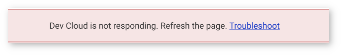
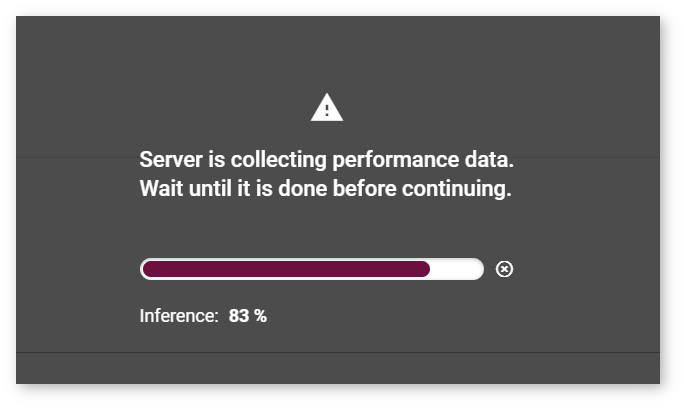
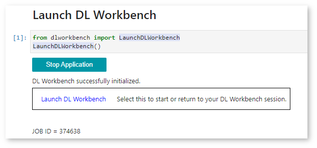
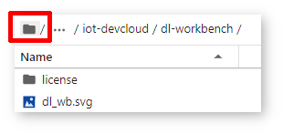
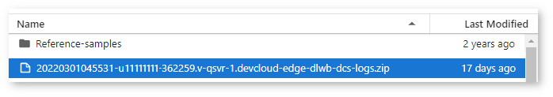

.. index:: pair: page; Troubleshooting for DL Workbench in the Intel® DevCloud for the Edge
.. _doxid-workbench_docs__workbench__d_g__d_c__troubleshooting:

Troubleshooting for DL Workbench in the Intel® DevCloud for the Edge
=====================================================================

:target:`doxid-workbench_docs__workbench__d_g__d_c__troubleshooting_1md_openvino_workbench_docs_workbench_dg_dc_troubleshooting` If you encounter an issue when running the DL Workbench, follow the steps below:

#. Refresh the page.

#. If it does not help, search for the solution among the issues listed on this page.

#. If you could not find the issue on this page or the proposed solution did not work for you, `report the issue to the DevCloud forum <#report-devcloud>`__.

Most Frequent Issues
~~~~~~~~~~~~~~~~~~~~

* `Intel® DevCloud for the Edge is not responding <#not-responding>`__

* `Server is collecting performance data for too long <#hanging>`__

* `DL Workbench session in the DevCloud is over <#session>`__

* `Cannot open the DL Workbench tab from the DevCloud menu <#blocked-tab>`__

* `Cannot log in to the DL Workbench in the DevCloud after a logout <#login>`__

* `Accidentally closed the DL Workbench tab in the DevCloud <#closed-tab>`__

.. _not-responding:

Intel® DevCloud for the Edge Is Not Responding
-----------------------------------------------

When you see the message as in the image below:

#. Refresh the page.

#. If it does not help, start a new DL Workbench session as described in the **Start a New DL Workbench Session in the Intel® DevCloud for the Edge** section of :ref:`Run DL Workbench in the DevCloud <workbench_install__dev_cloud>`.

#. If the issue persists, `report the issue on the DevCloud forum <#report-devcloud>`__.

.. _hanging:

Server is Collecting Performance Data for Too Long
--------------------------------------------------

When the **Server is Collecting Performance Data** banner is hanging on the page for too long:

#. Refresh the page.

#. If it does not help, start a new DL Workbench session as described in the **Start a New DL Workbench Session in the Intel® DevCloud for the Edge** section of :ref:`Run DL Workbench in the DevCloud <workbench_install__dev_cloud>`.

#. If the issue persists, `report the issue on the Intel® DevCloud for the Edge forum <#report-devcloud>`__.

.. _session:

DL Workbench Session in the DevCloud is Over
--------------------------------------------

A DL Workbench session in the DevCloud is limited to four hours. Remaining session time is indicated in the upper-right corner of the interface:

All data is autosaved in the DevCloud. To use the DL Workbench again, start a new session as described in the **Start a New DL Workbench Session in the Intel® DevCloud for the Edge** section of :ref:`Run DL Workbench in the DevCloud <workbench_install__dev_cloud>`.

.. _blocked-tab:

Cannot Open the DL Workbench Tab from the DevCloud Menu
-------------------------------------------------------

If you tried to run the DL Workbench as described in :ref:`Run DL Workbench in the DevCloud <workbench_install__dev_cloud>`, but nothing happens when you press **Deep Learning Workbench** from the **Advanced** tab, make sure your browser does not block pop-up windows as it prevents the tab from opening.

.. _login:

Cannot Log In to the DL Workbench in the DevCloud after a Logout
----------------------------------------------------------------

Once you log out of the DL Workbench in the DevCloud from the **Settings** panel, you can no longer log in to the same DL Workbench session and should start a new one as described in the **Start a New DL Workbench Session in the Intel® DevCloud for the Edge** section of :ref:`Run DL Workbench in the DevCloud <workbench_install__dev_cloud>`.

.. _closed-tab:

Accidentally Closed the DL Workbench Tab in the DevCloud
--------------------------------------------------------

If you accidentally closed the tab with the DL Workbench, go to the Jupyter notebook tab and click the **Return to DL Workbench session** link under the **Stop Application** button.

.. _report-devcloud:

Obtain Logs
~~~~~~~~~~~

To obtain server logs, open the root folder:

Download log.zip files:

.. _report-devcloud:

Report an Issue
~~~~~~~~~~~~~~~

To report an issue that occurred when you run the DL Workbench in the DevCloud:

#. Before you stop the session, take screenshots of the issue.

#. Find the user ID that you got when you registered in the DevCloud. It is also available in the Jupyter\* notebook link:
   
   
   
   .. image:: ./_assets/devcloud_link.png

#. Go to the Jupyter notebook tab and find the job ID under the **Start Application** button:
   
   .. image:: ./_assets/devcloud_two_links.png

#. Go to the `Intel® DevCloud for the Edge forum <https://community.intel.com/t5/Intel-DevCloud-for-Edge/bd-p/devcloud-edge>`__. Describe your issue providing the details necessary to reproduce it and attach your user ID, job ID, and the screenshots.

See Also
~~~~~~~~

* :ref:`Troubleshooting <dl_workbench__troubleshooting>`

* :ref:`Run DL Workbench in the Intel® DevCloud for the Edge <workbench_install__dev_cloud>`

