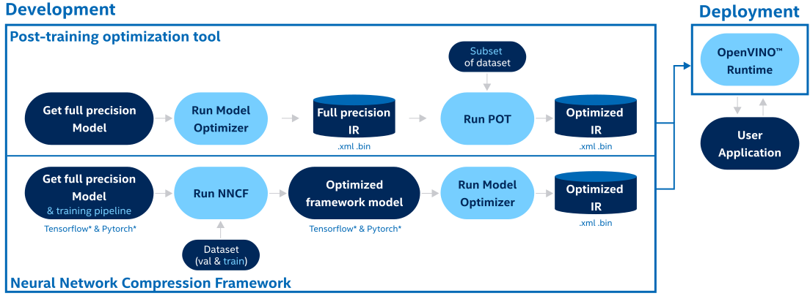
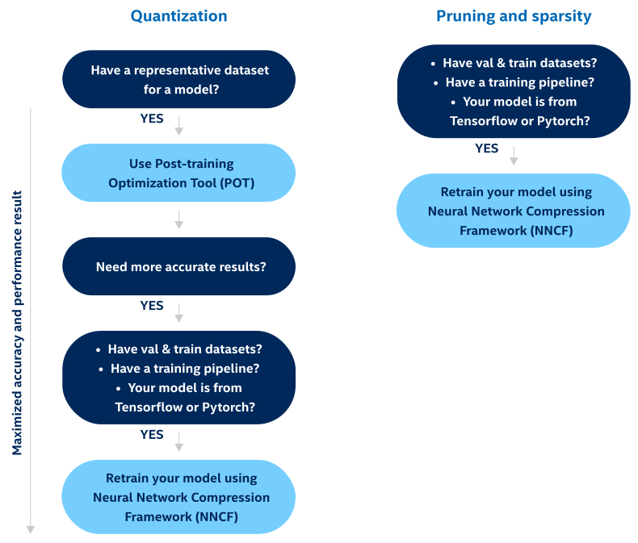

.. index:: pair: page; Model Optimization Guide
.. _model_optimization_guide:

.. meta::
   :description: Model optimization improves final model performance by applying 
                 special optimization methods, such as quantization, pruning, 
                 and preprocessing optimization.
   :keywords: model optimization, inference, post-training model optimization, 
              neural network compression framework, NNCF, Model Optimizer, 
              post-training optimization tool, POT, 8-bit quantization, pruning, 
              preprocessing optimization, OpenVINO, quantization-aware training,
              filter pruning, full precision model, post-training 8-bit quantization

Model Optimization Guide
========================

:target:`model_optimization_guide_1md_openvino_docs_optimization_guide_model_optimization_guide`

.. toctree::
   :maxdepth: 1
   :hidden:

   ./model-optimization-guide/post-training-model-optimization
   ./model-optimization-guide/neural-network-compression-framework
   ./model-optimization-guide/experimental-protecting-model

Model optimization is an optional offline step of improving final model 
performance by applying special optimization methods, such as quantization, 
pruning, preprocessing optimization, etc. OpenVINO provides several tools to 
optimize models at different steps of model development:

* **Model Optimizer** implements most of the optimization parameters to a model 
  by default. Yet, you are free to configure mean/scale values, batch size, RGB 
  vs BGR input channels, and other parameters to speed up preprocess of a model 
  (:ref:`Embedding Preprocessing Computation <doxid-openvino_docs__m_o__d_g__additional__optimization__use__cases>`).

* **Post-training Optimization tool** :ref:`(POT) <pot_tool_introduction>` is 
  designed to optimize inference of deep learning models by applying post-training 
  methods that do not require model retraining or fine-tuning, for example, 
  post-training 8-bit quantization.

* **Neural Network Compression Framework** :ref:`(NNCF) <doxid-docs_nncf_introduction>` 
  provides a suite of advanced methods for training-time model optimization within 
  the DL framework, such as PyTorch and TensorFlow. It supports methods, like 
  Quantization-aware Training and Filter Pruning. NNCF-optimized models can be 
  inferred with OpenVINO using all the available workflows.

Detailed workflow:
~~~~~~~~~~~~~~~~~~

The diagram below will help you understand which development optimization tool 
you need to use:

Post-training methods are limited in terms of achievable accuracy, which may 
degrade for certain scenarios. In such cases, training-time optimization with 
NNCF may give better results.

Once the model has been optimized using the aforementioned tools, it can be used 
for inference using the regular OpenVINO inference workflow. No changes to the 
code are required.

If you are not familiar with model optimization methods, refer to 
:ref:`post-training methods <pot_tool_introduction>`.

Additional Resources
~~~~~~~~~~~~~~~~~~~~

* :ref:`Deployment optimization <doxid-openvino_docs_deployment_optimization_guide_dldt_optimization_guide>`
