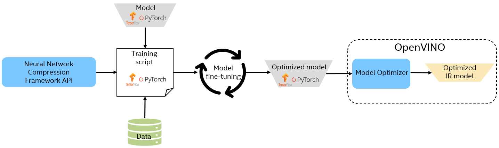

.. index:: pair: page; Neural Network Compression Framework
.. _doxid-docs_nncf_introduction:

Neural Network Compression Framework
====================================

:target:`doxid-docs_nncf_introduction_1md_openvino_docs_optimization_guide_nncf_introduction` The Neural Network Compression Framework (NNCF) aims at optimizing Deep Neural Networks (DNN) by means of methods such as quantization and pruning. It provides in-training optimization capabilities, which means that the optimization methods require model fine-tuning or even re-training.

NNCF is distributed as a separate tool but is closely aligned with OpenVINO in terms of supported optimization features and models. It is open source and available on `GitHub <https://github.com/openvinotoolkit/nncf>`__. The diagram below shows the model optimization workflow, using NNCF.

Features
--------

* Support for optimization of PyTorch and TensorFlow 2.x models.

* Support for various optimization algorithms, applied during a model fine-tuning process to achieve a better trade-off between performance and accuracy:

.. list-table::
    :header-rows: 1

    * - Compression algorithm
      - PyTorch
      - TensorFlow 2.x
    * - `8- bit quantization <https://github.com/openvinotoolkit/nncf/blob/develop/docs/compression_algorithms/Quantization.md>`__
      - Supported
      - Supported
    * - `Filter pruning <https://github.com/openvinotoolkit/nncf/blob/develop/docs/compression_algorithms/Pruning.md>`__
      - Supported
      - Supported
    * - `Sparsity <https://github.com/openvinotoolkit/nncf/blob/develop/docs/compression_algorithms/Sparsity.md>`__
      - Supported
      - Supported
    * - `Mixed-precision quantization <https://github.com/openvinotoolkit/nncf/blob/develop/docs/compression_algorithms/Quantization.md#mixed_precision_quantization>`__
      - Supported
      - Not supported
    * - `Binarization <https://github.com/openvinotoolkit/nncf/blob/develop/docs/compression_algorithms/Binarization.md>`__
      - Supported
      - Not supported

* Stacking of optimization methods, for example: 8-bit quaNtization + Filter Pruning.

* Support for `Accuracy-Aware model training <https://github.com/openvinotoolkit/nncf/blob/develop/docs/Usage.md#accuracy-aware-model-training>`__ pipelines via the `Adaptive Compression Level Training <https://github.com/openvinotoolkit/nncf/tree/develop/docs/accuracy_aware_model_training/AdaptiveCompressionLevelTraining.md>`__ and `Early Exit Training <https://github.com/openvinotoolkit/nncf/tree/develop/docs/accuracy_aware_model_training/EarlyExitTrainig.md>`__.

* Automatic, configurable model graph transformation to obtain the compressed model.
  
  .. note:: Only models created using Sequential or Keras Functional API are supported. Support for TensorFlow models is limited.
  
  
  
  - GPU-accelerated layers for faster compressed model fine-tuning.

* Distributed training support.

* Examples of configuration files for each supported compression algorithm.

* Exporting PyTorch compressed models to ONNX checkpoints and TensorFlow compressed models to SavedModel or Frozen Graph format, ready to use with `OpenVINO toolkit <https://github.com/openvinotoolkit/>`__.

* Git patches for prominent third-party repositories (`huggingface-transformers <https://github.com/huggingface/transformers>`__) demonstrating the process of integrating NNCF into custom training pipelines.

Installation
~~~~~~~~~~~~

NNCF provides the packages available for installation through the PyPI repository. To install the latest version via pip manager, run the following command:

.. ref-code-block:: cpp

	pip install nncf

Usage examples
~~~~~~~~~~~~~~

NNCF provides various examples and tutorials that demonstrate usage of optimization methods:

Tutorials
---------

* `Quantization-aware training of PyTorch model <https://github.com/openvinotoolkit/openvino_notebooks/tree/main/notebooks/302-pytorch-quantization-aware-training>`__

* `Quantization-aware training of TensorFlow model <https://github.com/openvinotoolkit/openvino_notebooks/tree/main/notebooks/305-tensorflow-quantization-aware-training>`__

Samples
-------

* PyTorch:
  
  * `Image Classification sample <https://github.com/openvinotoolkit/nncf/blob/develop/examples/torch/classification/README.md>`__
  
  * `Object Detection sample <https://github.com/openvinotoolkit/nncf/blob/develop/examples/torch/object_detection/README.md>`__
  
  * `Semantic segmentation sample <https://github.com/openvinotoolkit/nncf/blob/develop/examples/torch/semantic_segmentation/README.md>`__

* TensorFlow samples:
  
  * `Image Classification sample <https://github.com/openvinotoolkit/nncf/blob/develop/examples/tensorflow/classification/README.md>`__
  
  * `Object Detection sample <https://github.com/openvinotoolkit/nncf/blob/develop/examples/tensorflow/object_detection/README.md>`__
  
  * `Instance Segmentation sample <https://github.com/openvinotoolkit/nncf/blob/develop/examples/tensorflow/segmentation/README.md>`__

Additional Resources
~~~~~~~~~~~~~~~~~~~~

* `Compressed Model Zoo <https://github.com/openvinotoolkit/nncf#nncf-compressed-model-zoo>`__

* `NNCF in HuggingFace Optimum <https://github.com/openvinotoolkit/openvino_contrib/tree/master/modules/optimum>`__

* :ref:`Post-training optimization <doxid-pot_introduction>`

