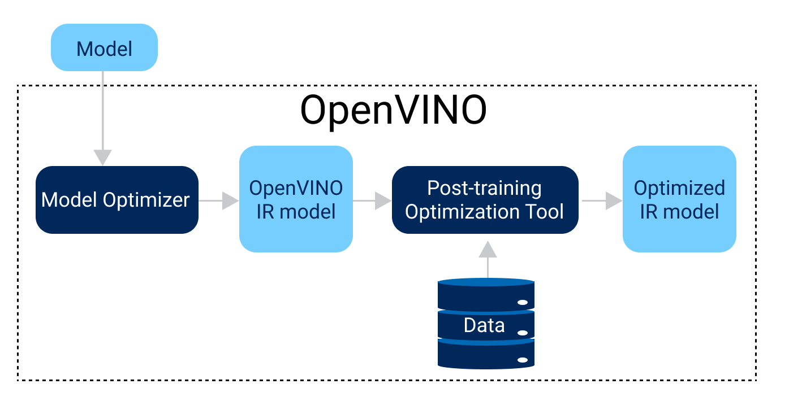

.. index:: pair: page; Optimizing models post-training
.. _pot_tool_introduction: 

.. meta::
   :description: Post-training Optimization Tool (POT) in OpenVINO provides two 
                 main model optimization methods: default quantization and 
                 accuracy-aware quantization.
   :keywords: post-training model optimization, post-training 8-bit quantization,
              OpenVINO, floating-point precision model, FP32, FP16, int8, 
              Post-training Optimization Tool, POT, quantizing models, default
              quantization algorithm, accuracy-aware quantization, OpenVINO IR format,
              intermediate representation, OpenVINO IR model, 8-bit precision, 
              16-bit precision, model optimization

Optimizing models post-training
===============================

:target:`pot_tool_introduction_1md_openvino_tools_pot_docs_introduction`

.. toctree::
   :maxdepth: 1
   :hidden:

   ./post-training-model-optimization/quantizing-model
   ./post-training-model-optimization/accuracy-aware-quantization
   ./post-training-model-optimization/best-practices
   ./post-training-model-optimization/api-reference
   ./post-training-model-optimization/command-line-interface
   ./post-training-model-optimization/examples
   ./post-training-model-optimization/post-training-optimization-tool-faq

Post-training model optimization is the process of applying special methods 
without model retraining or fine-tuning. Therefore, it does not require either 
a training dataset or a training pipeline in the source DL framework. In OpenVINO, 
post-training methods, such as post-training 8-bit quantization, require:

* A floating-point precision model (FP32 or FP16), converted to the OpenVINO 
  IR format (Intermediate Representation) and run on CPU with OpenVINO.

* A representative calibration dataset representing a use case scenario, for 
  example, 300 samples.

* In case of accuracy constraints, a validation dataset and accuracy metrics 
  should be available.

OpenVINO provides a Post-training Optimization Tool (POT) that supports the 
uniform integer quantization method. It can substantially increase inference 
performance and reduce the size of a model.

The figure below shows the optimization workflow with POT:

Quantizing models with POT
~~~~~~~~~~~~~~~~~~~~~~~~~~

Depending on your needs and requirements, POT provides two main quantization 
methods that can be used:

* :ref:`Default Quantization <doxid-pot_default_quantization_usage>` a recommended 
  method that provides fast and accurate results in most cases. It requires only 
  an unannotated dataset for quantization. For more details, see the 
  :ref:`Default Quantization algorithm <doxid-pot_compression_algorithms_quantization_default__r_e_a_d_m_e>` 
  documentation.

* :ref:`Accuracy-aware Quantization <doxid-pot_accuracyaware_usage>` an advanced 
  method that allows keeping accuracy at a predefined range, at the cost of 
  performance improvement, when ``Default Quantization`` cannot guarantee it. 
  This method requires an annotated representative dataset and may require more 
  time for quantization. For more details, see the 
  :ref:`Accuracy-aware Quantization algorithm <doxid-accuracy_aware__r_e_a_d_m_e>` 
  documentation.

Different hardware platforms support different integer precisions and quantization 
parameters. For example, 8-bit is used by CPU, GPU, VPU, and 16-bit by GNA. POT 
abstracts this complexity by introducing a concept of the "target device" used 
to set quantization settings, specific to the device.

.. note:: There is a special ``target_device: "ANY"`` which leads to portable 
   quantized models compatible with CPU, GPU, and VPU devices. GNA-quantized 
   models are compatible only with CPU.

For benchmarking results collected for the models optimized with the POT tool, 
refer to the :ref:`INT8 vs FP32 Comparison on Select Networks and Platforms <doxid-openvino_docs_performance_int8_vs_fp32>`.

Additional Resources
~~~~~~~~~~~~~~~~~~~~

* `Performance Benchmarks <https://docs.openvino.ai/latest/openvino_docs_performance_benchmarks_openvino.html>`__

* `INT8 Quantization by Using Web-Based Interface of the DL Workbench <https://docs.openvino.ai/latest/workbench_docs_Workbench_DG_Int_8_Quantization.html>`__
