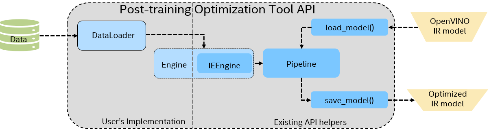

.. index:: pair: page; Quantizing Model
.. _default_model_quantization:

.. meta::
   :description: Post-Training Optimization Tool (POT) in OpenVINO can be used to 
                 quantize models from Open Model Zoo with Default Quantization 
                 method without accuracy control.
   :keywords: Post-Training Optimization Tool, POT, OpenVINO Intermediate Representation,
              default quantization, quantization, quantizing models, DefaultQuantization 
              algorithm, quantizing cascaded models, submodels, model-specific 
              preprocessing, quantization parameters, inference, full precision model, 
              Model Optimizer, OpenVINO IR, DefaultQuantization

Quantizing Model
================

:target:`default_model_quantization_1md_openvino_tools_pot_docs_defaultquantizationusage`

.. toctree::
   :maxdepth: 1
   :hidden:

   ./quantizing-model/default-quantization-algorithm

This guide describes how to apply model quantization with the Default Quantization 
method without accuracy control, using an unannotated dataset. To use this method, 
you need to create a Python script using an API of Post-Training Optimization Tool 
(POT) and implement data preparation logic and quantization pipeline. If you are 
not familiar with Python, try :ref:`command-line interface <doxid-pot_compression_cli__r_e_a_d_m_e>` 
of POT which is designed to quantize models from OpenVINO `Model Zoo <https://github.com/openvinotoolkit/open_model_zoo>`__. 
The figure below shows the common workflow of the quantization script implemented 
with POT API.

The script should include three basic steps:

#. Prepare data and dataset interface.

#. Select quantization parameters.

#. Define and run quantization process.

Prepare data and dataset interface
~~~~~~~~~~~~~~~~~~~~~~~~~~~~~~~~~~

In most cases, it is required to implement only the ``openvino.tools.pot.DataLoader`` 
interface, which allows acquiring data from a dataset and applying model-specific 
pre-processing providing access by index. Any implementation should override the 
following methods:

* The ``__len__()``, returns the size of the dataset.

* The ``__getitem__()``, provides access to the data by index in range of 0 to 
  ``len(self)``. It can also encapsulate the logic of model-specific pre-processing. 
  This method should return data in the ``(data, annotation)`` format, in which:

  * The ``data`` is the input that is passed to the model at inference so that 
    it should be properly preprocessed. It can be either the ``numpy.array`` 
    object or a dictionary, where the key is the name of the model input and 
    value is ``numpy.array`` which corresponds to this input.

  * The ``annotation`` is not used by the Default Quantization method. Therefore, 
    this object can be ``None`` in this case.

Framework data loading classes can be wrapped by the 
``openvino.tools.pot.DataLoader`` interface which is usually straightforward. 
For example, the ``torch.utils.data.Dataset`` has a similar interface as the 
``openvino.tools.pot.DataLoader``, so that its TorchVision implementations can 
be easily wrapped by POT API.

.. note:: Model-specific preprocessing (for example, mean/scale normalization), 
   can be embedded into the model at the conversion step, using Model Optimizer 
   component. This should be considered during the implementation of the DataLoader 
   interface to avoid "double" normalization, which can lead to the loss of accuracy 
   after optimization.

The example code below defines the ``DataLoader`` for three popular use cases: 
images, text, and audio.

.. tab:: Images

   .. ref-code-block:: cpp

      import os

      import numpy as np
      import cv2 as cv

      from openvino.tools.pot import DataLoader

      class ImageLoader(DataLoader):
          """ Loads images from a folder """
          def __init__(self, dataset_path):
              # Use OpenCV to gather image files
              # Collect names of image files
              self._files = []
              all_files_in_dir = os.listdir(dataset_path)
              for name in all_files_in_dir:
                  file = os.path.join(dataset_path, name)
                  if cv.haveImageReader(file):
                      self._files.append(file)

              # Define shape of the model
              self._shape = (224,224)

          def __len__(self):
              """ Returns the length of the dataset """
              return len(self._files)

          def __getitem__(self, index):
              """ Returns image data by index in the NCHW layout
              Note: model-specific preprocessing is omitted, consider adding it here
              """
              if index >= len(self):
                  raise IndexError("Index out of dataset size")

              image = cv.imread(self._files[index]) # read image with OpenCV
              image = cv.resize(image, self._shape) # resize to a target input size
              image = np.expand_dims(image, 0)  # add batch dimension
              image = image.transpose(0, 3, 1, 2)  # convert to NCHW layout
              return image, None   # annotation is set to None

.. tab:: Text

   .. ref-code-block:: cpp

      import os
      from pathlib import Path

      from datasets import load_dataset      #pip install datasets
      from transformers import AutoTokenizer #pip install transformers

      from openvino.tools.pot import DataLoader

      class TextLoader(DataLoader):
          """ Loads content of .txt files from a folder """
          def __init__(self, dataset_path):
              # HuggingFace dataset API is used to process text files
              # Collect names of text files
              extension = ".txt"
              files = sorted(str(p.stem) for p in
                  Path(dataset_path).glob("\*" + extension))
              files = [os.path.join(dataset_path, file + extension) for file in files]
              self._dataset = load_dataset('text', data_files=files)
              # replace with your tokenizer
              self._tokenizer = AutoTokenizer.from_pretrained('bert-base-cased')
              self._dataset = self._dataset.map(self._encode, batched=False)
              # replace with names of model inputs
              self._dataset.set_format(type='numpy',
                          columns=['input_ids', 'token_type_ids', 'attention_mask'])

          def _encode(self, examples):
              """ Tokenization of the input text """
              return self._tokenizer(examples['text'], truncation=True, padding='max_length')

          def __len__(self):
              """ Returns the length of the dataset """
              return len(self._dataset['train'])

          def __getitem__(self, index):
              """ Returns data by index as a (dict[str, np.array], None) """
              if index >= len(self):
                  raise IndexError("Index out of dataset size")

              data = self._dataset['train'][index]
              return {'input_ids': data['input_ids'],
                      'token_type_ids': data['token_type_ids'],
                      'attention_mask': data['attention_mask']}, None # annotation is set to None

.. tab:: Audio

   .. ref-code-block:: cpp

      import os
      from pathlib import Path

      import torchaudio # pip install torch torchaudio

      from openvino.tools.pot import DataLoader

      class AudioLoader(DataLoader):
          """ Loads content of .wav files from a folder """
          def __init__(self, dataset_path):
              # Collect names of wav files
              self._extension = ".wav"
              self._dataset_path = dataset_path
              self._files = sorted(str(p.stem) for p in
                  Path(self._dataset_path).glob("\*" + self._extension))

          def __len__(self):
              """ Returns the length of the dataset """
              return len(self._files)

          def __getitem__(self, index):
              """ Returns wav data by index
              Note: model-specific preprocessing is omitted, consider adding it here
              """
              if index >= len(self):
                  raise IndexError("Index out of dataset size")

              file_name = self._files[index] + self._extension
              file_path = os.path.join(self._dataset_path, file_name)
              waveform, _ = torchaudio.load(file_path) # use a helper from torchaudio to load data
              return waveform.numpy(), None   # annotation is set to None

Select quantization parameters
~~~~~~~~~~~~~~~~~~~~~~~~~~~~~~

Default Quantization algorithm has mandatory and optional parameters which are 
defined as a dictionary:

.. ref-code-block:: cpp

   {
       "name": "DefaultQuantization",
       "params": {
           "target_device": "ANY",
           "stat_subset_size": 300,
           "stat_batch_size": 1
       },
   }

* ``"target_device"`` - currently, only two options are available: ``"ANY"`` (or 
  ``"CPU"``) - to quantize model for CPU, GPU, or VPU, and ``"GNA"`` - for 
  inference on GNA.

* ``"stat_subset_size"`` - size of data subset to calculate activations statistics 
  used for quantization. The whole dataset is used if no parameter is specified. 
  It is recommended to use not less than 300 samples.

* ``"stat_batch_size"`` - size of batch to calculate activations statistics used 
  for quantization. 1 if no parameter specified.

For full specification, see the the :ref:`Default Quantization method <default_quantization_algorithm>`.

Run quantization
~~~~~~~~~~~~~~~~

POT API provides methods to load and save model objects from OpenVINO Intermediate 
Representation: the ``load_model`` and ``save_model``. It also has a concept of 
the ``Pipeline`` that sequentially applies specified optimization methods to the 
model. The ``create_pipeline`` method is used to instantiate a ``Pipeline`` object. 
An example code below shows a basic quantization workflow:

.. ref-code-block:: cpp

   from openvino.tools.pot import IEEngine
   from openvino.tools.pot load_model, save_model
   from openvino.tools.pot import compress_model_weights
   from openvino.tools.pot import create_pipeline

   # Model config specifies the name of the model and paths to .xml and .bin files of the model.
   model_config = 
   {
       "model_name": "model",
       "model": path_to_xml,
       "weights": path_to_bin,
   }

   # Engine config.
   engine_config = {"device": "CPU"}

   algorithms = [
       {
           "name": "DefaultQuantization",
           "params": {
               "target_device": "ANY",
               "stat_subset_size": 300,
               "stat_batch_size": 1
           },
       }
   ]

   # Step 1: Implement and create a user data loader.
   data_loader = ImageLoader("<path_to_images>")

   # Step 2: Load a model.
   model = load_model(model_config=model_config)

   # Step 3: Initialize the engine for metric calculation and statistics collection.
   engine = IEEngine(config=engine_config, data_loader=data_loader)

   # Step 4: Create a pipeline of compression algorithms and run it.
   pipeline = create_pipeline(algorithms, engine)
   compressed_model = pipeline.run(model=model)

   # Step 5 (Optional): Compress model weights to quantized precision
   #                     to reduce the size of the final .bin file.
   compress_model_weights(compressed_model)

   # Step 6: Save the compressed model to the desired path.
   # Set save_path to the directory where the model should be saved.
   compressed_model_paths = save_model(
       model=compressed_model,
       save_path="optimized_model",
       model_name="optimized_model",
   )

The output of the script is the quantized model that can be used for inference 
in the same way as the original full-precision model.

If high degradation of accuracy occurs after applying the Default Quantization 
method, it is recommended to follow the tips from 
:ref:`Quantization Best Practices <doxid-pot_docs__best_practices>` article or 
use :ref:`Accuracy-aware Quantization <doxid-pot_accuracyaware_usage>` method.

Quantizing cascaded models
~~~~~~~~~~~~~~~~~~~~~~~~~~

In some cases, when the optimized model is a cascaded one (consists of several 
submodels, for example, MT-CNN), you will need to implement a complex inference 
pipeline that can properly handle different submodels and data flow between 
them. POT API provides the ``Engine`` interface for this purpose, which allows 
customization of the inference logic. However, it is recommended to inherit from 
``IEEngine`` helper class that already contains all the logic required to do the 
inference based on OpenVINO Python API. For more details, see the following 
:ref:`example <doxid-pot_example_face_detection__r_e_a_d_m_e>`.

Examples
~~~~~~~~

* Tutorials:
  
  * `Quantization of Image Classification model <https://github.com/openvinotoolkit/openvino_notebooks/tree/main/notebooks/301-tensorflow-training-openvino>`__
  
  * `Quantization of Object Detection model from Model Zoo <https://github.com/openvinotoolkit/openvino_notebooks/tree/main/notebooks/111-detection-quantization>`__
  
  * `Quantization of Segmentation model for medical data <https://github.com/openvinotoolkit/openvino_notebooks/tree/main/notebooks/110-ct-segmentation-quantize>`__
  
  * `Quantization of BERT for Text Classification <https://github.com/openvinotoolkit/openvino_notebooks/tree/main/notebooks/105-language-quantize-bert>`__

* Samples:
  
  * `Quantization of 3D segmentation model <https://github.com/openvinotoolkit/openvino/tree/master/tools/pot/openvino/tools/pot/api/samples/3d_segmentation>`__
  
  * `Quantization of Face Detection model <https://github.com/openvinotoolkit/openvino/tree/master/tools/pot/openvino/tools/pot/api/samples/face_detection>`__
  
  * `Quantizatin of speech model for GNA device <https://github.com/openvinotoolkit/openvino/tree/master/tools/pot/openvino/tools/pot/api/samples/speech>`__
