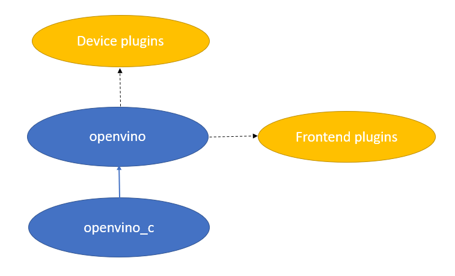

.. index:: pair: page; Deploying Your Applications with OpenVINO™
.. _deploy_infer__deploy_app_intro:

.. meta::
   :description: There are several ways of deploying OpenVINO™ application once 
                 its development has been finished.
   :keywords: OpenVINO™, OpenVINO™ application, deploy application, centralized 
              distribution, OpenVINO Deployment Manager, distribution type, 
              local distribution, RPM packages, Docker images, PIP, PIP package 
              manager, PYPI, Ubuntu 18.04 LTS, Ubuntu 20.04 LTS, 64-bit, 
              build OpenVINO statically, operating system, granularity, 
              OpenVINO package, plugin libraries, openvino_intel_cpu_plugin, 
              openvino_ir_frontend, openvino_c, Red Hat Enterprise Linux 8, 
              Windows Server Core base LTSC 2019, Windows 10 64-bit, 
              version 20H2, OpenVINO IR, PaddlePaddle, ONNX

Deploying Your Applications with OpenVINO™
============================================

:target:`deploy_infer__deploy_app_intro_1md_openvino_docs_ov_runtime_ug_deployment_deployment_intro`

.. toctree::
   :maxdepth: 1
   :hidden:

   ./openvino-deployment-guide/deployment-manager-tool
   ./openvino-deployment-guide/local-distribution

Once the :ref:`OpenVINO™ application development <deploy_infer__integrate_application>` has been finished, application developers usually need to deploy their applications to end users. There are several ways to achieve that:

* Set a dependency on the existing prebuilt packages, also called "centralized distribution":
  
  * using Debian / RPM packages - a recommended way for Linux operating systems;
  
  * using PIP package manager on PyPI - the default approach for Python-based applications;
  
  * using Docker images - if the application should be deployed as a Docker image, use a pre-built OpenVINO™ Runtime Docker image as a base image in the Dockerfile for the application container image. For more information about OpenVINO Docker images, refer to :ref:`Installing OpenVINO on Linux from Docker <doxid-openvino_docs_install_guides_installing_openvino_docker_linux>` and :ref:`Installing OpenVINO on Windows from Docker <doxid-openvino_docs_install_guides_installing_openvino_docker_windows>`. Furthermore, to customize your OpenVINO Docker image, use the `Docker CI Framework <https://github.com/openvinotoolkit/docker_ci>`__ to generate a Dockerfile and built the image.

* Grab a necessary functionality of OpenVINO together with your application, also called "local distribution":
  
  * using :ref:`OpenVINO Deployment Manager <deploy_infer__deploy_manager>` - providing a convenient way for creating a distribution package;
  
  * using the advanced :ref:`local distribution <doxid-openvino_docs_deploy_local_distribution>` approach;
  
  * using `a static version of OpenVINO Runtime linked to the final app <https://github.com/openvinotoolkit/openvino/wiki/StaticLibraries>`__.

The table below shows which distribution type can be used for what target operating system:

.. list-table::
    :header-rows: 1

    * - Distribution type
      - Operating systems
    * - Debian packages
      - Ubuntu 18.04 long-term support (LTS), 64-bit; Ubuntu 20.04 long-term support (LTS), 64-bit
    * - RMP packages
      - Red Hat Enterprise Linux 8, 64-bit
    * - Docker images
      - Ubuntu 18.04 long-term support (LTS), 64-bit; Ubuntu 20.04 long-term support (LTS), 64-bit; Red Hat Enterprise Linux 8, 64-bit; Windows Server Core base LTSC 2019, 64-bit; Windows 10, version 20H2, 64-bit
    * - PyPI (PIP package manager)
      - See `https://pypi.org/project/openvino/ <https://pypi.org/project/openvino/>`__
    * - :ref:`OpenVINO Deployment Manager <deploy_infer__deploy_manager>`
      - All operating systems
    * - :ref:`Local distribution <doxid-openvino_docs_deploy_local_distribution>`
      - All operating systems
    * - `Build OpenVINO statically and link to the final app <https://github.com/openvinotoolkit/openvino/wiki/StaticLibraries>`__
      - All operating systems

Granularity of Major Distribution Types
~~~~~~~~~~~~~~~~~~~~~~~~~~~~~~~~~~~~~~~

The granularity of OpenVINO packages may vary for different distribution types. For example, the PyPI distribution of OpenVINO has a `single 'openvino' package <https://pypi.org/project/openvino/>`__ that contains all the runtime libraries and plugins, while a :ref:`local distribution <doxid-openvino_docs_deploy_local_distribution>` is a more configurable type providing higher granularity. Below are important details of the set of libraries included in the OpenVINO Runtime package:

* The main library ``openvino`` is used by users' C++ applications to link against with. The library provides all OpenVINO Runtime public APIs, including both API 2.0 and the previous Inference Engine and nGraph APIs. For C language applications, ``openvino_c`` is additionally required for distribution.

* The "optional" plugin libraries like ``openvino_intel_cpu_plugin`` (matching the ``openvino_.+_plugin`` pattern) are used to provide inference capabilities on specific devices or additional capabilities like :ref:`Hetero Execution <deploy_infer__hetero_plugin>` and :ref:`Multi-Device Execution <deploy_infer__multi_plugin>`.

* The "optional" plugin libraries like ``openvino_ir_frontend`` (matching ``openvino_.+_frontend``) are used to provide capabilities to read models of different file formats such as OpenVINO IR, ONNX, and PaddlePaddle.

Here the term "optional" means that if the application does not use the capability enabled by the plugin, the plugin library or a package with the plugin is not needed in the final distribution.

Building a local distribution will require more detailed information, and you will find it in the dedicated :ref:`Libraries for Local Distribution <doxid-openvino_docs_deploy_local_distribution>` article.

.. note:: Depending on your target OpenVINO devices, the following configurations 
   might be needed for deployed machines: :ref:`Configurations for GPU <install__config_gpu>`, 
   :ref:`Configurations for GNA <install__config_gna>`, 
   :ref:`Configurations for NCS2 <install__config_ncs2>`, 
   :ref:`Configurations for VPU <install__config_vpu>`.

