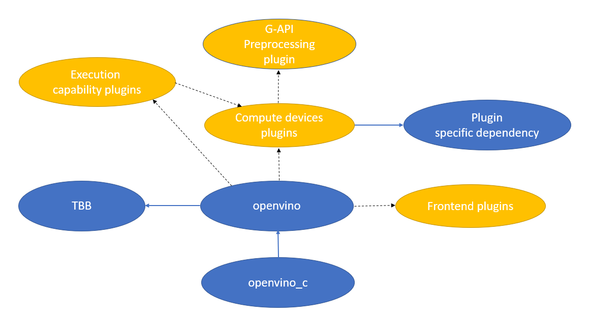

.. index:: pair: page; Libraries for Local Distribution
.. _doxid-openvino_docs_deploy_local_distribution:


Libraries for Local Distribution
================================

:target:`doxid-openvino_docs_deploy_local_distribution_1md_openvino_docs_ov_runtime_ug_deployment_local_distribution` With a local distribution, each C or C++ application/installer will have its own copies of OpenVINO Runtime binaries. However, OpenVINO has a scalable plugin-based architecture, which means that some components can be loaded in runtime only when they are really needed. Therefore, it is important to understand which minimal set of libraries is really needed to deploy the application. This guide helps you to achieve that goal.

Local dsitribution is also appropriate for OpenVINO binaries built from sources using `Build instructions <https://github.com/openvinotoolkit/openvino/wiki#how-to-build>`__, but the guide below supposes OpenVINO Runtime is built dynamically. For case of `Static OpenVINO Runtime <https://github.com/openvinotoolkit/openvino/wiki/StaticLibraries>`__ select the required OpenVINO capabilities on CMake configuration stage using `CMake Options for Custom Compilation <https://github.com/openvinotoolkit/openvino/wiki/CMakeOptionsForCustomCompilation>`__, the build and link the OpenVINO components into the final application.

.. note:: The steps below are operating system independent and refer to a library 
   file name without any prefixes (like ``lib`` on Unix systems) or suffixes (like 
   ``.dll`` on Windows OS). Do not put ``.lib`` files on Windows OS to the distribution, 
   because such files are needed only on a linker stage.


Library Requirements for C++ and C Languages
~~~~~~~~~~~~~~~~~~~~~~~~~~~~~~~~~~~~~~~~~~~~

Independent on the language used to write the application, the ``openvino`` library must always be put to the final distribution, since it's a core library which orchestrates with all the inference and frontend plugins. In Intel® Distribution of OpenVINO™ toolkit, ``openvino`` depends on the TBB libraries which are used by OpenVINO Runtime to optimally saturate the devices with computations, so it must be put to the distribution package.

If your application is written with C language, you need to put the ``openvino_c`` library additionally.

The ``plugins.xml`` file with information about inference devices must also be taken as a support file for ``openvino``.

Libraries for Pluggable Components
~~~~~~~~~~~~~~~~~~~~~~~~~~~~~~~~~~

The picture below presents dependencies between the OpenVINO Runtime core and pluggable libraries:



Libraries for Compute Devices
-----------------------------

For each inference device, OpenVINO Runtime has its own plugin library:

* ``openvino_intel_cpu_plugin`` for :ref:`Intel® CPU devices <deploy_infer__cpu_device>`.

* ``openvino_intel_gpu_plugin`` for :ref:`Intel® GPU devices <deploy_infer__gpu_device>`.

* ``openvino_intel_gna_plugin`` for :ref:`Intel® GNA devices <deploy_infer__gna_device>`.

* ``openvino_intel_myriad_plugin`` for :ref:`Intel® MYRIAD devices <deploy_infer__vpu_myriad_device>`.

* ``openvino_intel_hddl_plugin`` for :ref:`Intel® HDDL device <deploy_infer__vpu_hddl_device>`.

* ``openvino_arm_cpu_plugin`` for :ref:`ARM CPU devices <deploy_infer__arm_cpu_device>`.

Depending on what devices are used in the app, the appropriate libraries need to be put to the distribution package.

As it is shown on the picture above, some plugin libraries may have OS-specific dependencies which are either backend libraries or additional supports files with firmware, etc. Refer to the table below for details:

.. raw:: html

    <div class="collapsible-section" data-title="Windows OS: Click to expand/collapse">

.. list-table::
    :header-rows: 1

    * - Device
      - Dependency
    * - CPU
      - ``-``
    * - GPU
      - ``OpenCL.dll`` , ``cache.json``
    * - MYRIAD
      - ``usb.dll`` , ``usb-ma2x8x.mvcmd`` , ``pcie-ma2x8x.elf``
    * - HDDL
      - ``bsl.dll`` , ``hddlapi.dll`` , ``json-c.dll`` , ``libcrypto-1_1-x64.dll`` , ``libssl-1_1-x64.dll`` , ``mvnc-hddl.dll``
    * - GNA
      - ``gna.dll``
    * - Arm® CPU
      - ``-``

.. raw:: html

    </div>


.. raw:: html

    <div class="collapsible-section" data-title="Linux OS: Click to expand/collapse">

.. list-table::
    :header-rows: 1

    * - Device
      - Dependency
    * - CPU
      - ``-``
    * - GPU
      - ``libOpenCL.so`` , ``cache.json``
    * - MYRIAD
      - ``libusb.so`` , ``usb-ma2x8x.mvcmd`` , ``pcie-ma2x8x.mvcmd``
    * - HDDL
      - ``libbsl.so`` , ``libhddlapi.so`` , ``libmvnc-hddl.so``
    * - GNA
      - ``gna.dll``
    * - Arm® CPU
      - ``-``

.. raw:: html

    </div>


.. raw:: html

    <div class="collapsible-section" data-title="MacOS: Click to expand/collapse">

.. list-table::
    :header-rows: 1

    * - Device
      - Dependency
    * - CPU
      - ``-``
    * - MYRIAD
      - ``libusb.dylib`` , ``usb-ma2x8x.mvcmd`` , ``pcie-ma2x8x.mvcmd``
    * - Arm® CPU
      - ``-``

.. raw:: html

    </div>

Libraries for Execution Modes
-----------------------------

The ``HETERO``, ``MULTI``, ``BATCH`` and ``AUTO`` execution modes can also be used explicitly or implicitly by the application. Use the following recommendation scheme to decide whether to put the appropriate libraries to the distribution package:

* If :ref:`AUTO <deploy_infer__auto_plugin>` is used explicitly in the application or ``:ref:`ov::Core::compile_model <doxid-classov_1_1_core_1a46555f0803e8c29524626be08e7f5c5a>``` is used without specifying a device, put ``openvino_auto_plugin`` to the distribution.

.. note:: Automatic Device Selection relies on 
   :ref:`inference device plugins <deploy_infer__working_with_devices>`. 
   If you are not sure about what inference devices are available on target system, 
   put all the inference plugin libraries to the distribution. If 
   ``:ref:`ov::device::priorities <doxid-group__ov__runtime__cpp__prop__api_1gae88af90a18871677f39739cb0ef0101e>``` 
   is used for ``AUTO`` to specify a limited device list, grab the corresponding device plugins only.


* If :ref:`MULTI <deploy_infer__multi_plugin>` is used explicitly, put ``openvino_auto_plugin`` to the distribution.

* If :ref:`HETERO <doxid-openvino_docs__o_v__u_g__hetero_execution>` is either used explicitly or ``:ref:`ov::hint::performance_mode <doxid-group__ov__runtime__cpp__prop__api_1ga2691fe27acc8aa1d1700ad40b6da3ba2>``` is used with GPU, put ``openvino_hetero_plugin`` to the distribution.

* If :ref:`BATCH <doxid-openvino_docs__o_v__u_g__automatic__batching>` is either used explicitly or ``:ref:`ov::hint::performance_mode <doxid-group__ov__runtime__cpp__prop__api_1ga2691fe27acc8aa1d1700ad40b6da3ba2>``` is used with GPU, put ``openvino_batch_plugin`` to the distribution.

Frontend Libraries for Reading Models
-------------------------------------

OpenVINO Runtime uses frontend libraries dynamically to read models in different formats:

* ``openvino_ir_frontend`` is used to read OpenVINO IR.

* ``openvino_onnx_frontend`` is used to read ONNX file format.

* ``openvino_paddle_frontend`` is used to read Paddle file format.

Depending on the model format types that are used in the application in ``:ref:`ov::Core::read_model <doxid-classov_1_1_core_1ae0576a95f841c3a6f5e46e4802716981>```, pick up the appropriate libraries.

.. note:: To optimize the size of final distribution package, you are recommended 
   to convert models to OpenVINO IR by using 
   :ref:`Model Optimizer <doxid-openvino_docs__m_o__d_g__deep__learning__model__optimizer__dev_guide>`. 
   This way you don't have to keep ONNX, PaddlePaddle, and other frontend libraries in the distribution package.


(Legacy) Preprocessing via G-API
--------------------------------

.. note:: :ref:`G-API <doxid-openvino_docs_gapi_gapi_intro>` preprocessing is a legacy 
   functionality, use :ref:`preprocessing capabilities from OpenVINO 2.0 <deploy_infer__preprocessing_overview>` 
   which do not require any additional libraries.


If the application uses ``:ref:`InferenceEngine::PreProcessInfo::setColorFormat <doxid-class_inference_engine_1_1_pre_process_info_1a3a10ba0d562a2268fe584d4d2db94cac>``` or ``:ref:`InferenceEngine::PreProcessInfo::setResizeAlgorithm <doxid-class_inference_engine_1_1_pre_process_info_1a0c083c43d01c53c327f09095e3e3f004>``` methods, OpenVINO Runtime dynamically loads ``openvino_gapi_preproc`` plugin to perform preprocessing via G-API.

Examples
~~~~~~~~

**CPU + OpenVINO IR in C application**

In this example, the application is written in C language, performs inference on CPU, and reads models stored as the OpenVINO IR format. The following libraries are used:

* The ``openvino_c`` library is a main dependency of the application. It links against this library.

* The ``openvino`` library is used as a private dependency for ``openvino_c`` and is also used in the deployment.

* ``openvino_intel_cpu_plugin`` is used for inference.

* ``openvino_ir_frontend`` is used to read source models.

MULTI execution on GPU and MYRIAD in ``tput`` mode

In this example, the application is written in C++, performs inference :ref:`simultaneously on GPU and MYRIAD devices <deploy_infer__multi_plugin>` with the ``:ref:`ov::hint::PerformanceMode::THROUGHPUT <doxid-group__ov__runtime__cpp__prop__api_1gga032aa530efa40760b79af14913d48d73a50f9b1f40c078d242af7ec323ace44b3>``` property set, and reads models stored in the ONNX format. The following libraries are used:

* The ``openvino`` library is a main dependency of the application. It links against this library.

* ``openvino_intel_gpu_plugin`` and ``openvino_intel_myriad_plugin`` are used for inference.

* ``openvino_auto_plugin`` is used for Multi-Device Execution.

* ``openvino_auto_batch_plugin`` can be also put to the distribution to improve the saturation of :ref:`Intel® GPU <deploy_infer__gpu_device>` device. If there is no such plugin, :ref:`Automatic Batching <doxid-openvino_docs__o_v__u_g__automatic__batching>` is turned off.

* ``openvino_onnx_frontend`` is used to read source models.

**Auto-Device Selection between HDDL and CPU**

In this example, the application is written in C++, performs inference with the :ref:`Automatic Device Selection <deploy_infer__auto_plugin>` mode, limiting device list to HDDL and CPU, and reads models :ref:`created using C++ code <deploy_infer__model_representation>`. The following libraries are used:

* The ``openvino`` library is a main dependency of the application. It links against this library.

* ``openvino_auto_plugin`` is used to enable Automatic Device Selection.

* ``openvino_intel_hddl_plugin`` and ``openvino_intel_cpu_plugin`` are used for inference. AUTO selects between CPU and HDDL devices according to their physical existence on the deployed machine.

* No frontend library is needed because ``:ref:`ov::Model <doxid-classov_1_1_model>``` is created in code.

