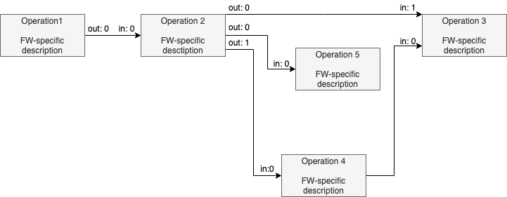
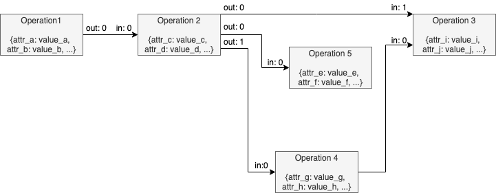
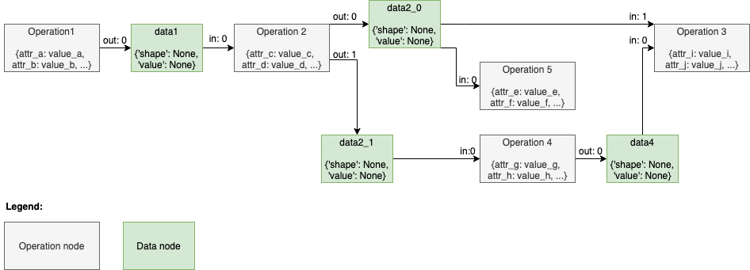
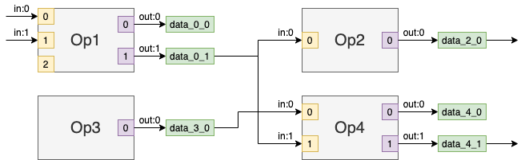
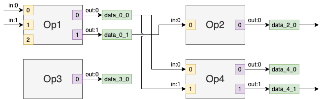
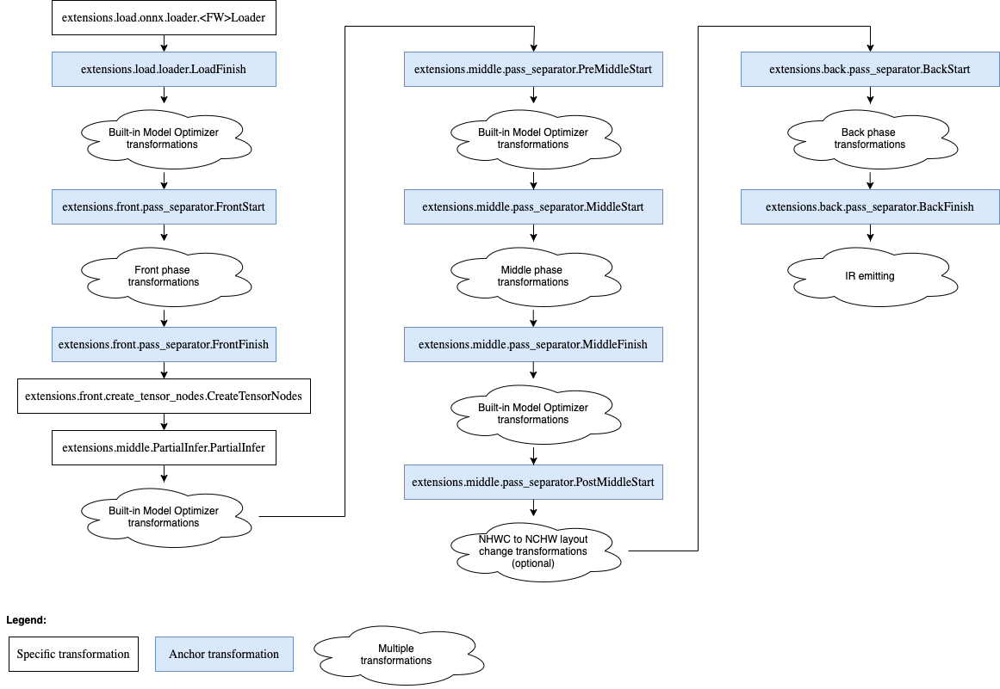

.. index:: pair: page; Model Optimizer Extensibility
.. _model_optimizer_extensibility:

.. meta::
   :description: Model Optimizer extensibility mechanism s a core part of Model Optimizer.
                 It enables support of new operations and custom transformations to generate the optimized 
                 intermediate representation.
   :keywords: model optimizer, extensibility, custom operations, OpenVINO IR, custom framework operations,
              model optimizer extensibility mechanism, model representation, model conversion pipeline,
              graph traversal, model optimizer extensions, node attributes, model loading


Model Optimizer Extensibility
=============================

:target:`model_optimizer_extensibility_1md_openvino_docs_mo_dg_prepare_model_customize_model_optimizer_customize_model_optimizer`


.. toctree::
   :maxdepth: 1
   :hidden:

   ./model_optimizer_extensibility/extending-model-optimizer-with-caffe-python-layers

:target:`model_optimizer_extensibility_1model-optimizer-extensibility` Model Optimizer extensibility mechanism enables support of 
new operations and custom transformations to generate the optimized intermediate representation (IR) as described 
in the :ref:`Deep Learning Network Intermediate Representation and Operation Sets in OpenVINO™ <doxid-openvino_docs__m_o__d_g__i_r_and_opsets>`. 
This mechanism is a core part of Model Optimizer, as a huge set of examples showing how to add custom logic to support your model.

There are several cases when the customization is needed:

* A model contains operation(s) not known for the Model Optimizer, but these operation(s) could be expressed as a combination of supported operations. In this case, a custom transformation should be implemented to replace unsupported operation(s) with supported ones.

* A model contains a sub-graph of operations that can be replaced with a smaller number of operations to get better performance. This example corresponds to so-called *fusing transformations*, for example, replacing a sub-graph performing the calculation :math:`x / (1.0 + e^{-(beta \* x)})` with a single operation of type :ref:`Swish <doxid-openvino_docs_ops_activation__swish_4>`.

* A model contains a custom framework operation (the operation that is not a part of an official operation set of the framework) that was developed using the framework extensibility mechanism. In this case, Model Optimizer should know how to handle the operation and generate a corresponding section in an IR for it.

It is necessary to figure out how Model Optimizer represents a model in a memory and converts it to an IR before going into 
details of the Model Optimizer extensibility mechanism.

.. _model-representation-in-memory:

.. note::
   All paths in this article are provided relatively to the Model Optimizer installation directory if not stated otherwise.


Model Representation in Memory
~~~~~~~~~~~~~~~~~~~~~~~~~~~~~~

The model can be represented as a directed graph, where nodes are operations and edges correspond to data passing from 
a producer operation (node) to a consumer operation (node).

Model Optimizer uses Python class ``mo.graph.graph.Graph`` instance to represent the computation graph in memory during 
the model conversion. This class is inherited from the ``networkx.MultiDiGraph`` class of the standard ``networkx`` 
Python library. It provides many convenient methods to traverse and modify the graph. For the examples, 
refer to the ``mo/graph/graph.py`` file.

Model Optimizer keeps all necessary information about the operation in node attributes. Model Optimizer uses 
the ``mo.graph.graph.Node`` class defined in the ``mo/graph/graph.py`` file, which is a wrapper on top of a ``networkx`` 
node attributes dictionary, and provides many convenient methods to work with the node. For example, the node ``my_node`` 
attribute with a name 'my_attr ``can be retrieved from the node with the following code`` my_node.my_attr<tt>, 
which is equivalent to obtaining attribute with name'my_attr' ``in the`` graph.node['my_node'] 
``dictionary. For the class implementation details, refer to the`` mo/graph/graph.py` file.

An operation may have several inputs and outputs. For example, operation 
:ref:`Split <doxid-openvino_docs_ops_movement__split_1>` has two inputs: data to split and axis to split along, 
and variable number of outputs depending on a value of attribute ``num_splits``. Each input data to the operation 
is passed to a specific operation **input port**. An operation produces the output data from an **output port**. 
Input and output ports are numbered from 0 independently. Model Optimizer uses classes ``mo.graph.port.Port`` 
and ``mo.graph.connection.Connection``, which are useful abstraction to perform graph modifications like nodes 
connecting/re-connecting and graph traversing. These classes are widely used in the Model Optimizer code 
so it is easy to find a lot of usage examples.

There is no dedicated class corresponding to an edge, so low-level graph manipulation is needed to get access to edge attributes 
if needed. Meanwhile, most manipulations with nodes connections should be done with help of the ``mo.graph.connection.Connection`` 
and ``mo.graph.port.Port`` classes. Thus, low-level graph manipulation is error prone and is strongly not recommended.

Further details and examples related to a model representation in memory are provided in the sections below, 
in a context for a better explanation. Also, for more information on how to use ports and connections, 
refer to the `Graph Traversal and Modification Using s and s <#graph-ports-and-conneсtions>`__ section.

.. _model-conversion-pipeline:

Model Conversion Pipeline
~~~~~~~~~~~~~~~~~~~~~~~~~

A model conversion pipeline can be represented with the following diagram:

.. image:: _assets/MO_conversion_pipeline.png
	:alt: Model Conversion pipeline

Each conversion step is reviewed in details below.

.. _model-loading:

Model Loading
-------------

Model Optimizer gets a trained model file as an input. The model loader component of Model Optimizer reads a model file 
using Python bindings provided with the framework and builds an in-memory representation of a computation graph. 
There is a separate loader for each supported framework. These loaders are implemented in the 
``extensions/load/<FRAMEWORK>/loader.py`` files of Model Optimizer.

.. note::
   Model Optimizer uses a special parser for Caffe models built on top of the ``caffe.proto`` file. In the case 
   of a model loading failure, Model Optimizer throws an error and requests preparation of the parser that can read 
   the model. For more information on how to prepare the custom Caffe parser, refer to the 
   :ref:`Model Optimizer Frequently Asked Questions #1 <doxid-openvino_docs__m_o__d_g_prepare_model__model__optimizer__f_a_q>`.


The result of a model loading step is a ``Graph`` object, which can be depicted like in the following example:



Model Optimizer loader saves an operation instance framework description (usually it is a Protobuf message) into a node attribute 
usually with a name ``pb`` for each operation of an input model. It is important that this is a **framework-specific** description 
of an operation. This means that an operation, for example, :ref:`Convolution <doxid-openvino_docs_ops_convolution__convolution_1>` 
may be represented differently in, for example, Caffe and TensorFlow frameworks but performs the same calculations from 
a mathematical point of view.

In the example above, the "Operation 2" has one input and two outputs. The tensor produced from the output "port 0" 
is consumed with the "Operation 5" (the input "port 0") and "Operation 3" (the input "port 1"). The tensor produced from 
the output "port 1" is consumed with the "Operation 4" (the input "port 0").

Each edge has two attributes ``in`` and ``out`` containing the input port number of the consumer node and the output port number 
of the producer node. These attributes describe the fact that nodes are operations consuming some input tensors and producing 
some output tensors. From the perspective of Model Optimizer, nodes themselves are "black boxes" because they do not contain 
required information about the operation they perform.

.. _operations-attributes-extracting:

Operations Attributes Extracting
--------------------------------

The next step is to parse framework-dependent operation representation saved in a node attribute and update the node attributes 
with the operation specific attributes. There are three options to do this.

#. The extractor extension approach. This is a recommended way to extract attributes for an operation and it is explained in details in the `Operation Extractor <#extension-extractor>`__ section.

#. The legacy approach with a built-in extractor. The ``mo/front/<FRAMEWORK>/extractor.py`` file (for example, the one for Caffe) defines a dictionary with extractors for specific operation types. A key in the dictionary is a type of an operation to trigger the extracting function for and the value is the function. The function has one parameter – a node to extract attributes from. This is a legacy and non-extensible approach so it should be avoided. This mechanism will be removed in future versions of Model Optimizer.

The extractors execution order is the following:

* ``CustomLayersMapping.xml`` (for Caffe models only).

* Model Optimizer extension.

* Built-in Model Optimizer extractor.

The result of operations attributes extracting step can be depicted like in the following example:



The only difference in the graph from the previous step is that nodes contain dictionary with extracted attributes 
and operation-specific attributes needed for Model Optimizer. However, starting from this step, Model Optimizer does not 
need the original representation of the operation/model and uses just Model Optimizer representation (there are some peculiar 
cases in which Model Optimizer still uses the ``pb`` attribute, covered in this article partially). A detailed list of common 
node attributes and their values is provided below in the `Model Optimizer Operation <#extension-operation>`__ section.

.. _front-phase:

Front Phase
-----------

For legacy reasons, you must specify shapes for all not fully-defined inputs of the model. In contrast, other machine learning 
frameworks, like TensorFlow, let you create a model with undefined or partially defined input shapes. As an example, 
undefined dimension is marked with an integer value ``-1`` in a TensorFlow model or has some string name in an ONNX model.

During the front phase, Model Optimizer knows shape of the model inputs and constants only and does not know shapes 
(and even ranks) of the intermediate tensors. But information about shapes may not be needed to implement particular 
transformation. For example, the transformation ``extensions/front/TopKNormalize.py`` removes an attribute ``k`` from 
a ``TopK`` node and adds an input constant with the value ``k``. The transformation is needed to convert a ``TopK`` operation. 
It comes from frameworks, where a number of output elements is defined as an attribute of the operation to the OpenVINO 
:ref:`TopK <doxid-openvino_docs_ops_sort__top_k_3>` operation semantic, which requires this value to be a separate input.

It is important to mention that sometimes it seems like transformation cannot be implemented during the front phase because 
the actual values of inputs or shapes are needed. In fact, manipulations of shapes or values can be implemented using operations 
that are added to the graph. Consider the ``extensions/front/onnx/flattenONNX_to_reshape.py`` transformation, which replaces 
an ONNX `Flatten <https://github.com/onnx/onnx/blob/master/docs/Operators.md#Flatten>`__ operation with a sub-graph of operations 
performing the following (when ``axis`` is not equal to 0 and 1):

#. Calculate a shape of the ``Flatten`` input tensor, using the :ref:`ShapeOf <doxid-openvino_docs_ops_shape__shape_of_3>` operation.

#. Get the first ``axis`` elements from the output of ``Shape`` operation and calculate their product, using the :ref:`ReduceProd <doxid-openvino_docs_ops_reduction__reduce_prod_1>` operation.

#. Concatenate output of the ``ReduceProd`` and constant with the value of ``-1`` (for an explanation of this value refer to the :ref:`Reshape <doxid-openvino_docs_ops_shape__reshape_1>` specification page).

#. Use the concatenated value as the second input to the ``Reshape`` operation.

It is highly recommended to write shape-agnostic transformations to avoid model reshape-ability issues. For more information 
related to the reshaping of a model, refer to the :ref:`Using Shape Inference <doxid-openvino_docs__o_v__u_g__shape_inference>` 
guide.

More information on how to develop front phase transformations and dedicated API description is provided in the 
`Front Phase Transformations <#front-phase-transformations>`__ section.

.. _partial-inference:

Partial Inference
-----------------

Model Optimizer performs a partial inference of a model during model conversion. This procedure includes output shapes 
calculation of all operations in a model and constant folding (value calculation for constant sub-graphs). The constant 
folding is needed for the shape inference because in some cases evaluation of constant sub-graph is needed to calculate 
output shapes. For example, the output shape for the :ref:`Reshape <doxid-openvino_docs_ops_shape__reshape_1>` operation 
may be defined as a mathematical expression using the :ref:`ShapeOf <doxid-openvino_docs_ops_shape__shape_of_3>` operation output.

.. note::
   Model Optimizer does not fold sub-graphs starting from the :ref:`ShapeOf <doxid-openvino_docs_ops_shape__shape_of_3>` operation 
   by default because this leads to a model non-reshape-ability (the command-line parameter ``--static_shape`` can override this 
   behavior). For more information related to reshaping of a model, refer to the 
   :ref:`Using Shape Inference <doxid-openvino_docs__o_v__u_g__shape_inference>` guide.


Model Optimizer calculates output shapes for all operations in a model to write them to Intermediate Representation files.

.. note::
   This is a legacy requirement. Starting with IR version 10, OpenVINO Runtime needs to know shapes of the 
   :ref:`Const <doxid-openvino_docs_ops_infrastructure__constant_1>` and the 
   :ref:`Parameter <doxid-openvino_docs_ops_infrastructure__parameter_1>` operations only. The OpenVINO Runtime calculates 
   output shapes for all operations in a model, using shapes of 
   :ref:`Parameter <doxid-openvino_docs_ops_infrastructure__parameter_1>` and 
   :ref:`Const <doxid-openvino_docs_ops_infrastructure__constant_1>` operations defined with respective operation attributes.


Model Optimizer inserts **data** nodes to the computation graph before starting the partial inference phase. The data node 
corresponds to the specific tensor produced with the operation. Each data node contains two attributes: ``shape``, 
containing the shape of the tensor, and ``value``, which may contain the actual value of the tensor. The value for a ``value`` 
attribute is equal to ``None`` if this tensor value cannot be calculated. This happens in two cases: when a tensor value depends 
on a values passed to the :ref:`Parameter <doxid-openvino_docs_ops_infrastructure__parameter_1>` operation of a model or 
Model Optimizer does not have value propagation implementation for the operation.

Before running partial inference, the graph can be depicted like in the following example:



The difference in a graph structure with a graph during the front phase is not only in the data nodes, but also in the edge 
attributes. Note that an ``out`` attribute is specified for edges **from operation** nodes only, while an ``in`` attribute 
is specified for edges **from data** nodes only. This corresponds to the fact that a tensor (data node) is produced from a 
specific output port of an operation and is consumed with a specific input port of an operation. Also, a unique data node 
is created for each output port of an operation. The node may be used as an input node for several operation nodes. Similarly 
to the data node "data2_0", which is consumed with the input "port 1" of the "Operation 3" and input "port 0" of the "Operation 5".

Now, consider how Model Optimizer performs shape and value propagation. Model Optimizer performs graph nodes topological sort. 
An error message is thrown if a graph contains a cycle. Then, shape inference functions are called for each node in the graph, 
according to the topological order. Each node of the graph must have an attribute called ``infer`` with a shape inference function, 
which is a function with one parameter – an instance of the ``Node`` class. The ``infer`` attribute is usually set in the operation 
extractor or when a node is added in some transformation using the Model Optimizer operation class inherited from the ``mo.pos.Op`` 
class. For more information on how to specify a shape inference function, refer to the 
`Model Optimizer Operation <#extension-operation>`__ and `Operation Extractor <#operation-extractor>`__ sections.

A shape inference function should calculate an operation (node) output shape(s) based on input shape(s) and operation (node) 
attribute(s) and update ``shape`` and optionally ``value`` attributes of the corresponding data node(s). A simplified example 
of the shape infer function for the :ref:`Reshape <doxid-openvino_docs_ops_shape__reshape_1>` operation (the full version is 
available in the ``mo/ops/reshape.py`` file):

.. ref-code-block:: cpp

	@staticmethod
	def infer(node: Node):
	    name = node.soft_get('name', node.id)
	
	    input_shape = node.in_port(0).data.get_shape()  # get the input tensor shape
	    new_shape = node.in_port(1).data.get_value()  # get the value defining the output tensor shape. This tensor may
	                                                  # have special values like 0 and -1
	
	    output_shape = ... # calculate output shape without special values like 0 and -1
	
	    if node.in_port(0).data.get_value() is not None:  # if the input value is defined then calculate output value;
	                                                      # shape will be updated automatically with the value shape
	        node.out_port(0).data.set_value(node.in_port(0).data.get_value().:ref:`reshape <doxid-namespacengraph_1_1builder_1_1opset1_1ad5b09acfb63fe54b85b33d6e22ccdc72>`(output_shape))
	    else:  # in the opposite case calculate the output shape only
	        node.out_port(0).data.set_shape(output_shape)

Methods ``in_port()`` and ``output_port()`` of the ``Node`` class are used to get and set data node attributes. For more 
information on how to use them, refer to the 
`Graph Traversal and Modification Using Ports and Connections <#graph-ports-and-conneсtions>`__ section.

.. _middle-phase:

.. note::
   A shape inference function should perform output shape calculation in the original model layout. For example, OpenVINO 
   supports Convolution operations in NCHW layout only but TensorFlow supports NHWC layout as well. Model Optimizer shape 
   inference function calculates output shapes for NHWC Convolutions in NHWC layout and only during the layout change phase 
   the shape is converted to NCHW.


.. note::
   There is a legacy approach to read data node attribute, like ``input_shape = op_node.in_node(0).shape`` and modify data 
   nodes attributes, like ``op_node.out_node(0).shape = some_value``. This approach is still used in the Model Optimizer code 
   but is not recommended. Instead, use the approach described in the `Ports <#intro-ports>`__.


Middle Phase
------------

The middle phase starts after partial inference. At this phase, a graph contains data nodes and output shapes of all operations 
in the graph have been calculated. Any transformation implemented at this stage must update the ``shape`` attribute for all 
newly added operations. It is highly recommended to use API described in the 
`Graph Traversal and Modification Using Ports and Connections <#graph-ports-and-conneсtions>`__ because modification of a graph 
using this API causes automatic re-inference of affected nodes as well as necessary data nodes creation.

More information on how to develop middle transformations and dedicated API description is provided in the 
`Middle Phase Transformations <#middle-phase-transformations>`__.

.. _layout-change:

NHWC to NCHW Layout Change
--------------------------

There are several middle transformations responsible for changing model layout from NHWC to NCHW. These transformations are 
triggered by default for TensorFlow models as TensorFlow supports Convolution operations in the NHWC layout.

This layout change is disabled automatically if the model does not have operations that OpenVINO&trade needs to execute 
in the NCHW layout, for example, Convolutions in NHWC layout.

It is still possible to force Model Optimizer to do a layout change, using ``--disable_nhwc_to_nchw`` command-line parameter, 
although it is not advised.

Layout change is a complex problem and will be addressed here very briefly. For more details on how it works, refer to the 
source code of the transformations mentioned in the below summary of the process:

#. Model Optimizer changes output shapes of most of operations producing 4D and 5D (four dimensional and five dimensional) tensors as if they were in NHWC layout to NCHW layout: ``nchw_shape = np.array(nhwc_shape)[0, 3, 1, 2]`` for 4D and ``nchw_shape = np.array(nhwc_shape)[0, 4, 1, 2, 3]`` for 5D. This permutation does not happen for some operations with specific conditions identified during a model conversion.

#. Model Optimizer inserts :ref:`Gather <doxid-openvino_docs_ops_movement__gather_1>` operations to the sub-graph relates to shapes calculation in order to perform shape calculation in a correct layout.

#. Model Optimizer inserts :ref:`Transpose <doxid-openvino_docs_ops_movement__transpose_1>` operations for some operations with specific conditions, identified during a model conversion, to produce correct inference results.

The list of main transformations responsible for a layout change are: ``extensions/middle/ApplyPermutations.py``, 
``extensions/middle/InsertLayoutPropagationTransposes.py``, ``extensions/middle/MarkSubgraphsWithCorrectLayout.py``, 
``extensions/middle/ApplyNHWCtoNCHWpermutation.py`` and ``extensions/middle/LayoutChangeForConstantShapePaths.py``.

.. _back-phase:

Back Phase
----------

The back phase starts after the layout change to NCHW. This phase contains mostly the following transformations:

#. Transformations that should work with a graph in the NCHW layout and thus cannot be implemented in the middle phase.

#. Transformations that replace nodes corresponding to internal Model Optimizer operations with nodes corresponding to the :ref:`opset <doxid-openvino_docs_ops_opset>` operations.

#. Transformations that normalize operations inputs according to the specification.

#. Final optimization transformations.

A graph structure during the back phase is the same as during the middle phase. There is no difference in writing middle 
and back transformations.

More information on how to develop back transformations and dedicated API description is provided in the 
`Back Phase Transformations <#back-phase-transformations>`__.

.. _ir-emitting:

Intermediate Representation Emitting
------------------------------------

The last phase of a model conversion is the Intermediate Representation emitting. Model Optimizer performs the following steps:

#. Iterates over all operation nodes in the graph and checks that all nodes have the ``type`` attribute set. This attribute defines the operation type and is used in the OpenVINO to instantiate proper operation from the :ref:`opset <doxid-openvino_docs_ops_opset>` specified in the ``version`` attribute of the node. If a node does not have attribute ``type`` or its value is equal to ``None``, Model Optimizer exits with an error.

#. Performs type inference of graph operations similar to the shape inference. Inferred data types are saved to a port attributes in the IR.

#. Performs topological sort of the graph and changes ``id`` attribute of all operation nodes to be sequential integer values starting from 0.

#. Saves all Constants values to the ``.bin`` file. Constants with the same value are shared among different operations.

#. Generates an ``.xml`` file defining a graph structure. The information about operation inputs and outputs are prepared uniformly for all operations regardless of their type. A list of attributes to be saved to the ``.xml`` file is defined with the ``backend_attrs()`` or ``supported_attrs()`` of the ``Op`` class used for a graph node instantiation. For more information on how the operation attributes are saved to XML, refer to the function ``prepare_emit_ir()`` in the ``mo/pipeline/common.py`` file and `Model Optimizer Operation <#extension-operation>`__ section.

.. _graph-ports-and-conneсtions:

Graph Traversal and Modification Using Ports and Connections
~~~~~~~~~~~~~~~~~~~~~~~~~~~~~~~~~~~~~~~~~~~~~~~~~~~~~~~~~~~~

There are three APIs for a graph traversal and transformation used in the Model Optimizer:

#. The API provided with the ``networkx`` Python library for the ``networkx.MultiDiGraph`` class, which is the base class for the ``mo.graph.graph.Graph`` object. For more details, refer to the `Model Representation in Memory <#model-representation-in-memory>`__ section. For example, the following methods belong to this API level: ``graph.add_edges_from([list])``, ``graph.add_node(x, attrs)``, ``graph.out_edges(node_id)`` etc where ``graph`` is a an instance of the ``networkx.MultiDiGraph`` class. **This is the lowest-level API. Avoid using it in the Model Optimizer transformations**.

#. The API built around the ``mo.graph.graph.Node`` class. The ``Node`` class is the primary class to work with graph nodes and their attributes. There are some ``Node`` class methods not recommended for use and some functions defined in the ``mo.graph.graph`` have been deprecated. Examples of such methods and functions are: ``node.in_node(y)``, ``node.out_node(x)``, ``node.get_outputs()``, ``node.insert_node_after(n1, y)``, ``create_edge(n1, n2)`` etc. For more details, refer to the ``mo/graph/graph.py`` file.

#. The high-level API called Model Optimizer Graph API, which uses ``mo.graph.graph.Graph``, ``mo.graph.port.Port`` and ``mo.graph.connection.Connection`` classes. For example, the following methods belong to this API level: ``node.in_port(x)``, ``node.out_port(y)``, ``port.get_connection()``, ``connection.get_source()``, ``connection.set_destination(dest_port)`` etc. **This is the recommended API for the Model Optimizer transformations and operations implementation**.

The main benefit of using the Model Optimizer Graph API is that it hides some internal implementation details (the fact that 
the graph contains data nodes), provides API to perform safe and predictable graph manipulations, and adds operation semantic 
to the graph. This is achieved with introduction of concepts of ports and connections. This article is dedicated to 
the Model Optimizer Graph API only and does not cover other two non-recommended APIs.

.. _intro-ports:

Ports
-----

An operation semantic describes how many inputs and outputs the operation has. For example, 
:ref:`Parameter <doxid-openvino_docs_ops_infrastructure__parameter_1>` and 
:ref:`Const <doxid-openvino_docs_ops_infrastructure__constant_1>` operations have no inputs and have one output, 
:ref:`ReLU <doxid-openvino_docs_ops_activation__re_l_u_1>` operation has one input and one output, 
:ref:`Split <doxid-openvino_docs_ops_movement__split_1>` operation has 2 inputs and a variable number of outputs 
depending on the value of the attribute ``num_splits``.

Each operation node in the graph (an instance of the ``Node`` class) has 0 or more input and output ports 
(instances of the ``mo.graph.port.Port`` class). The ``Port`` object has several attributes:

* ``node`` - the instance of the ``Node`` object the port belongs to.

* ``idx`` - the port number. Input and output ports are numbered independently, starting from ``0``. Thus, :ref:`ReLU <doxid-openvino_docs_ops_activation__re_l_u_1>` operation has one input port (with index ``0``) and one output port (with index ``0``).

* ``type`` - the type of the port. Could be equal to either ``"in"`` or ``"out"``.

* ``data`` - the object that should be used to get attributes of the corresponding data node. This object has methods ``get_shape()`` / ``set_shape()`` and ``:ref:`get_value() <doxid-namespacengraph_1_1runtime_1_1reference_1_1detail_1ad9c8e24a4553eea531ddd4cbfcbc2610>``` / ``set_value()`` to get/set shape/value of the corresponding data node. For example, ``in_port.data.get_shape()`` returns an input shape of a tensor connected to input port ``in_port`` (in_port.type == 'in ``),`` :ref:`out_port.data.get_value() <doxid-namespacengraph_1_1runtime_1_1reference_1_1detail_1ad9c8e24a4553eea531ddd4cbfcbc2610>` ``returns a value of a tensor produced from output port`` out_port ``(`` out_port.type == 'out'`).

.. note::
   Functions ``get_shape()`` and 
   ``:ref:`get_value() <doxid-namespacengraph_1_1runtime_1_1reference_1_1detail_1ad9c8e24a4553eea531ddd4cbfcbc2610>``` return 
   ``None`` until the partial inference phase. For more information about model conversion phases, refer to 
   the `Model Conversion Pipeline <#model-conversion-pipeline>`__ section. For information about partial inference phase, 
   see the `Partial Inference <#partial-inference>`__ section.


There are several methods of the ``Node`` class to get the instance of a corresponding port:

* ``in_port(x)`` and ``out_port(x)`` to get the input/output port with number ``x``.

* ``in_ports()`` and ``out_ports()`` to get a dictionary, where key is a port number and the value is the corresponding input/output port.

Attributes ``in_ports_count`` and ``out_ports_count`` of the ``Op`` class instance define default number of input and output 
ports to be created for the ``Node``. However, additional input/output ports can be added using methods ``add_input_port()`` 
and ``add_output_port()``. Port also can be removed, using the ``delete_input_port()`` and ``delete_output_port()`` methods.

The ``Port`` class is just an abstraction that works with edges incoming/outgoing to/from a specific ``Node`` instance. 
For example, output port with ``idx = 1`` corresponds to the outgoing edge of a node with an attribute ``out = 1``, 
the input port with ``idx = 2`` corresponds to the incoming edge of a node with an attribute ``in = 2``.

Consider the example of a graph part with 4 operation nodes "Op1", "Op2", "Op3", and "Op4" and a number of data nodes 
depicted with light green boxes.



Operation nodes have input ports (yellow squares) and output ports (light purple squares). Input port may not be connected. 
For example, the input "port 2" of node "Op1" does not have incoming edge, while output port always has an associated 
data node (after the partial inference when the data nodes are added to the graph), which may have no consumers.

Ports can be used to traverse a graph. The method ``get_source()`` of an input port returns an output port producing 
the tensor consumed by the input port. It is important that the method works the same during front, middle and back phases 
of a model conversion even though the graph structure changes (there are no data nodes in the graph during the front phase).

Let's assume that there are 4 instances of ``Node`` object ``op1, op2, op3``, and ``op4`` \* corresponding to nodes 
"Op1", "Op2", "Op3", and "Op4", respectively. The result of ``op2.in_port(0).get_source()`` and ``op4.in_port(1).get_source()`` 
is the same object ``op1.out_port(1)`` of type ``Port``.

The method ``get_destination()`` of an output port returns the input port of the node consuming this tensor. 
If there are multiple consumers of this tensor, the error is raised. The method ``get_destinations()`` of an output 
port returns a list of input ports consuming the tensor.

The method ``disconnect()`` removes a node incoming edge corresponding to the specific input port. The method removes 
several edges if it is applied during the front phase for a node output port connected with multiple nodes.

The method ``port.connect(another_port)`` connects output port ``port`` and input port ``another_port``. The method 
handles situations when the graph contains data nodes (middle and back phases) and does not create an edge between 
two nodes but also automatically creates data node or reuses existing data node. If the method is used during 
the front phase and data nodes do not exist, the method creates edge and properly sets ``in`` and ``out`` edge attributes.

For example, applying the following two methods to the graph above will result in the graph depicted below:

.. ref-code-block:: cpp

	op4.in_port(1).disconnect()
	op3.out_port(0).connect(op4.in_port(1))

.. image:: _assets/MO_ports_example_2.png
	:alt: Ports example 2

.. note::
   For a full list of available methods, refer to the ``Node`` class implementation in the ``mo/graph/graph.py`` and 
   ``Port`` class implementation in the ``mo/graph/port.py`` files.

.. _intro-conneсtions:

Connections
-----------

Connection is a concept introduced to easily and reliably perform graph modifications. Connection corresponds to 
a link between a source output port with one or more destination input ports or a link between a destination input 
port and source output port producing data. So each port is connected with one or more ports with help of a connection. 
Model Optimizer uses the ``mo.graph.connection.Connection`` class to represent a connection.

There is only one ``get_connection()`` method of the ``Port`` class to get the instance of the corresponding ``Connection`` 
object. If the port is not connected, the returned value is ``None``.

For example, the ``op3.out_port(0).get_connection()`` method returns a ``Connection`` object encapsulating edges 
from node "Op3" to data node "data_3_0" and two edges from data node "data_3_0" to two ports of the node "Op4".

The ``Connection`` class provides methods to get source and destination(s) ports the connection corresponds to:

* ``connection.get_source()`` - returns an output ``Port`` object producing the tensor.

* ``connection.get_destinations()`` \* - returns a list of input ``Port`` consuming the data.

* ``connection.get_destination()`` \* - returns a single input ``Port`` consuming the data. If there are multiple consumers, the exception is raised.

The ``Connection`` class provides methods to modify a graph by changing a source or destination(s) of a connection. 
For example, the function call ``op3.out_port(0).get_connection().set_source(op1.out_port(0))`` changes source port 
of edges consuming data from port ``op3.out_port(0)`` to ``op1.out_port(0)``. The transformed graph from the sample 
above is depicted below:



Another example is the ``connection.set_destination(dest_port)`` method. It disconnects ``dest_port`` and all input 
ports to which the connection is currently connected and connects the connection source port to ``dest_port``.

Note that connection works seamlessly during front, middle, and back phases and hides the fact that the graph structure 
is different.

.. _extensions:

.. note::
   For a full list of available methods, refer to the ``Connection`` class implementation in the ``mo/graph/connection.py`` file.


Model Optimizer Extensions
~~~~~~~~~~~~~~~~~~~~~~~~~~

Model Optimizer extensions enable you to inject some logic to the model conversion pipeline without changing 
the Model Optimizer core code. There are three types of the Model Optimizer extensions:

#. Model Optimizer operation.

#. A framework operation extractor.

#. A model transformation, which can be executed during front, middle or back phase of the model conversion.

An extension is just a plain text file with a Python code. The file should contain a class (or classes) inherited 
from one of extension base classes. Extension files should be saved to a directory with the following structure:

.. ref-code-block:: cpp

	./<MY_EXT>/
	           ops/                  - custom operations
	           front/                - framework independent front transformations
	                 <FRAMEWORK_1>/  - front transformations for <FRAMEWORK_1> models only and extractors for <FRAMEWORK_1> operations
	                 <FRAMEWORK_2>/  - front transformations for <FRAMEWORK_2> models only and extractors for <FRAMEWORK_2> operations
	                 ...
	           middle/               - middle transformations
	           back/                 - back transformations

Model Optimizer uses the same layout internally to keep built-in extensions. The only exception is that the ``mo/ops/`` 
directory is also used as a source of the Model Optimizer operations due to historical reasons.

.. _extension-operation:

.. note::
   The name of a root directory with extensions should not be equal to "extensions" because it will result 
   in a name conflict with the built-in Model Optimizer extensions.


.. note::
   Model Optimizer itself is built by using these extensions, so there is a huge number of examples of their 
   usage in the Model Optimizer code.


Model Optimizer Operation
-------------------------

Model Optimizer defines a ``mo.ops.Op`` class (``Op`` will be used later in the document to be short), which is a base 
class for an operation used in the Model Optimizer. The instance of the ``Op`` class serves several purposes:

#. Stores the operation attributes.

#. Stores the operation shape/value and type inference functions.

#. Defines operation attributes to be saved to the corresponding IR section.

#. Contains convenient methods to create a graph node from an ``Op`` object instance and connect it with the existing graph.

#. Used in the extractors to store parsed attributes and operation specific attributes in the dedicated graph node.

It is important to mention that there is no connection between the instance of the ``Op`` class and the ``Node`` object 
created from it. The ``Op`` class is just a container for attributes describing the operation. Model Optimizer uses 
the ``Op`` class during a model conversion to create a node of the graph with attributes copied from the ``Op`` class instance. 
Graph manipulations are performed with graph ``Node`` s and their attributes and does not involve ``Op`` s.

There are a number of common attributes used in the operations. Below is the list of these attributes with description.

* ``id`` — unique identifier of a node in a graph. Generated automatically, equal to the number of nodes in the graph plus 1 if not specified. **Mandatory**.

* ``name`` — name of the operation. Generated automatically, equal to the ``id`` if not specified. **Mandatory**.

* ``type`` — type of the operation according to the :ref:`opset specification <doxid-openvino_docs_ops_opset>`. For the internal Model Optimizer operations, this attribute should be set to ``None``. The model conversion fails if an operation with ``type`` equal to ``None`` comes to the IR emitting phase. **Mandatory**.

* ``version`` — the operation set (opset) name the operation belongs to. If not specified, Model Optimizer sets it equal to ``experimental``. For more information about operation sets, refer to :ref:`OpenVINO Model Representation <doxid-openvino_docs__o_v__u_g__model__representation>` section. **Mandatory**.

* ``op`` — Model Optimizer type of the operation. In many cases, the value of ``type`` is equal to the value of ``op``. However, when Model Optimizer cannot instantiate the opset operation during model loading, it creates an instance of an internal operation. Thus, the attribute ``op`` is used as a type of this internal operation. Later in the pipeline, the node created from an internal operation will be replaced during front, middle or back phase with node(s) created from the opset.

* ``infer`` — the attribute defines a function calculating output tensor(s) shape and optional value(s). The attribute may be set to ``None`` for the internal Model Optimizer operations used during the front phase only. For more information about the shape inference function, refer to the `Partial Inference <#partial-inference>`__ section.

* ``type_infer`` — the attribute defines a function calculating output tensor(s) data type. If the attribute is not defined, the default function is used. The function checks if the ``data_type`` node attribute is set and then propagates this type to the output tensor from the "port 0". Otherwise, it propagates the data type of the tensor coming into the input "port 0" to the output tensor from the "port 0".

* ``in_ports_count`` — default number of input ports to be created for the operation. Additional ports can be created or redundant ports can be removed using dedicated ``Node`` class API methods.

* ``out_ports_count`` — default number of output ports to be created for the operation. Additional ports can be created or redundant ports can be removed using dedicated ``Node`` class API methods.

Below is an example of the Model Optimizer class for the :ref:`SoftMax <doxid-openvino_docs_ops_activation__soft_max_1>` 
operation from the ``mo/ops/softmax.py`` file with the comments in code.

.. ref-code-block:: cpp

	class Softmax(Op):
	    # The class attribute defines a name of the operation so the operation class can be obtained using the
	    # "Op.get_op_class_by_name()" static method
	    op = 'SoftMax'
	
	    # The operation works as an extractor by default. This is a legacy behavior, currently not recommended for use,
	    # thus "enabled" class attribute is set to False. The recommended approach is to use dedicated extractor extension.
	    enabled = False
	
	    def __init__(self, graph: Graph, attrs: dict):
	        super().__init__(graph, {  # The constructor of the base class Op is called with additional default attributes.
	            'type': __class__.op,  # The operation is from the opset so the type is set to 'SoftMax'.
	            'op': __class__.op,  # Internal Model Optimizer operation has the same type.
	            'version': 'opset1',  # The operation corresponds to opset1.
	            'infer': Softmax.infer,  # Shape inference function is defined below.
	            'axis': 1,  # Default value for the "axis" attribute of the operation SoftMax.
	            'in_ports_count': 1,  # The operation has one input.
	            'out_ports_count': 1,  # The operation produces one output.
	        }, attrs)
	
	    # The method returns operation specific attributes list. This method is important when implementing
	    # extractor inherited from CaffePythonFrontExtractorOp class to extract attribute for Caffe Python operation.
	    # However, it is currently used interchangeably with the "backend_attrs()" method. If the "backend_attrs()" is not used,
	    # then the "supported_attrs()" is used instead. In this particular case, the operation has just one attribute "axis".
	    def supported_attrs(self):
	        return ['axis']
	
	    @staticmethod
	    def infer(node: Node):
	        "some code calculating output shape and values"

There is a dedicated method called ``backend_attrs()`` defining a list of attributes to be saved to the IR. Consider an example 
from the ``mo/ops/pooling.py`` file:

.. ref-code-block:: cpp

	def backend_attrs(self):
	     return [
	         ('strides', lambda node: ','.:ref:`join <doxid-namespaceov_1_1util_1a860e0918a7b731ba9e886baf48434318>`(map(str, node['stride'][node.spatial_dims]))),
	         ('kernel', lambda node: ','.:ref:`join <doxid-namespaceov_1_1util_1a860e0918a7b731ba9e886baf48434318>`(map(str, node['window'][node.spatial_dims]))),
	
	         ('pads_begin', lambda node: ','.:ref:`join <doxid-namespaceov_1_1util_1a860e0918a7b731ba9e886baf48434318>`(map(str, get_backend_pad(node.pad, node.spatial_dims, 0)))),
	         ('pads_end', lambda node: ','.:ref:`join <doxid-namespaceov_1_1util_1a860e0918a7b731ba9e886baf48434318>`(map(str, get_backend_pad(node.pad, node.spatial_dims, 1)))),
	
	         ('pool-method', 'pool_method'),
	         ('exclude-pad', 'exclude_pad'),
	
	         'rounding_type',
	         'auto_pad',
	     ]

The ``backend_attrs()`` function returns a list of records. A record can be of one of the following formats:

#. A string defining the attribute to be saved to the IR. If the value of the attribute is ``None``, the attribute is not saved. Examples of this case are ``rounding_type`` and ``auto_pad``.

#. A tuple, where the first element is a string defining the name of the attribute as it will appear in the IR and the second element is a function to produce the value for this attribute. The function gets an instance of the ``Node`` as the only parameter and returns a string with the value to be saved to the IR. Examples of this case are ``strides``, ``kernel``, ``pads_begin`` and ``pads_end``.

#. A tuple, where the first element is a string defining the name of the attribute as it will appear in the IR and the second element is the name of the ``Node`` attribute to get the value from. Examples of this case are ``pool-method`` and ``exclude-pad``.

.. _extension-extractor:

Operation Extractor
-------------------

Model Optimizer runs specific extractor for each operation in the model during the model loading. For more information 
about this process, refer to the `operations-attributes-extracting <#operations-attributes-extracting>`__ section.

There are several types of Model Optimizer extractor extensions:

#. The generic one, which is described in this section.

#. The special extractor for Caffe models with Python layers. This kind of extractor is described in the :ref:`Extending Model Optimizer with Caffe Python Layers <extending_model_optimizer_caffe_python_layers>` guide.

This section is focused on the option #1, which provides a generic mechanism for the operation extractor applicable for all 
frameworks. Model Optimizer provides the ``mo.front.extractor.FrontExtractorOp`` class as a base class to implement the extractor. 
It has the ``extract`` class method, which gets the only parameter ``Node``, which corresponds to the graph node to extract data 
from. The operation description in the original framework format is stored in the attribute ``pb`` of the node. The extractor 
goal is to parse this attribute and save necessary attributes to the corresponding node of the graph. Consider the extractor 
for the ``Const`` TensorFlow operation (refer to the ``extensions/front/tf/const_ext.py`` file):

.. ref-code-block:: cpp

	from openvino.tools.mo.front.extractor import FrontExtractorOp
	from openvino.tools.mo.front.tf.extractors.utils import tf_dtype_extractor, tf_tensor_shape, tf_tensor_content
	from openvino.tools.mo.ops.const import Const
	
	
	class ConstExtractor(FrontExtractorOp):
	    # The "op" class attribute defines a type of the operation in the framework (in this case it is a TensorFlow), 
	    # for which the extractor should be triggered.
	    op = 'Const'
	    enabled = True  # The flag that indicates that this extractor is enabled.
	
	    @classmethod
	    def extract(cls, node):  # The entry point of the extractor.
	        # The `node.pb` attribute stores the TensorFlow representation of the operation, which is a Protobuf message of the
	        # specific format. In particular, the message contains the attribute called "value" containing the description of
	        # the constant. The string "pb.attr["value"].tensor" is just a Python binding for Protobuf message parsing.
	        pb_tensor = node.pb.attr["value"].tensor
	        # Get the shape of the tensor from the protobuf message, using the helper function "tf_tensor_shape".
	        shape = tf_tensor_shape(pb_tensor.tensor_shape)
	        # Create a dictionary with necessary attributes.
	        attrs = {
	            'shape': shape,
	            # Get the tensor value, using "tf_tensor_content" helper function.
	            'value': tf_tensor_content(pb_tensor.dtype, shape, pb_tensor),
	            # Get the tensor data type, using "tf_dtype_extractor" helper function.
	            'data_type': tf_dtype_extractor(pb_tensor.dtype),
	        }
	        # Update the node attributes, using default attributes from the "Const" operation and attributes saved to the
	        # "attrs" dictionary.
	        Const.update_node_stat(node, attrs)
	        return cls.enabled

Consider another example with an extractor of the ``Constant`` ONNX operation (refer to the ``extensions/front/onnx/const_ext.py`` file):

.. ref-code-block:: cpp

	from onnx import numpy_helper
	from onnx.numpy_helper import to_array
	
	from openvino.tools.mo.front.extractor import FrontExtractorOp
	from openvino.tools.mo.front.onnx.extractors.utils import onnx_attr
	from openvino.tools.mo.ops.const import Const
	
	
	class ConstantExtractor(FrontExtractorOp):
	    op = 'Constant'
	    enabled = True
	
	    @classmethod
	    def extract(cls, node):
	        # Use "onnx_attr" helper method, which parses the Protobuf representation of the operation saved in the "node".
	        # Gets the value of the attribute with name "value" as "TensorProto" type (specified with a keyword "t").
	        pb_value = onnx_attr(node, 'value', 't')
	        # Use "numpy_helper.to_array()" ONNX helper method to convert "TensorProto" object to a numpy array.
	        value = numpy_helper.to_array(pb_value)
	
	        attrs = {
	            'data_type': value.dtype,
	            'value': value,
	        }
	        # Update the node attributes, using default attributes from the "Const" operation and attributes saved to the
	        # "attrs" dictionary.
	        Const.update_node_stat(node, attrs)
	        return cls.enabled

The extractors for operations from different frameworks work similarly. The only difference is in the helper methods 
used to parse operation attributes encoded with a framework-specific representation.

A common practice is to use ``update_node_stat()`` method of the dedicated ``Op`` class to update the node attributes. This method does the following:

#. Sets values for common attributes like ``op``, ``type``, ``infer``, ``in_ports_count``, ``out_ports_count``, ``version`` to values specific to the dedicated operation (``Const`` operation in this case).

#. Uses ``supported_attrs()`` and ``backend_attrs()`` methods, defined in the ``Op`` class to update specific node attribute ``IE``. The IR emitter uses the value stored in the ``IE`` attribute to pre-process attribute values and save them to IR.

#. Optionally sets additional attributes provided to the ``update_node_stat()`` function as a second parameter. Usually these attributes are parsed from the particular instance of the operation.

.. _graph-transformations:

.. note::
   Model Optimizer uses numpy arrays to store values and numpy arrays of ``np.int64`` type to store shapes in the graph.


Graph Transformation Extensions
-------------------------------

Model Optimizer provides various base classes to implement 
`Front Phase Transformations <#front-phase-transformations>`__, `Middle Phase Transformations <#middle-phase-transformations>`__, 
and `Back Phase Transformations <#back-phase-transformations>`__. All classes have the following common class attributes 
and methods:

#. The ``enabled`` attribute specifies whether the transformation is enabled or not. The value can be changed during runtime to enable or disable execution of the transformation during a model conversion. Default value is ``True``.

#. The ``id`` attribute specifies a unique transformation string identifier. This transformation identifier can be used to enable (disable) the transformation by setting environment variable ``MO_ENABLED_TRANSFORMS`` (``MO_DISABLED_TRANSFORMS``) with a comma separated list of ``id`` s. The environment variables override the value of the ``enabled`` attribute of the transformation. Instead of using ``id`` attribute value you can add fully defined class name to ``MO_ENABLED_TRANSFORMS`` (``MO_DISABLED_TRANSFORMS``) variable, ``extensions.back.NonmalizeToNormalizeL2.NormalizeToNormalizeL2`` for example. It is an optional attribute.

#. The ``run_not_recursively`` attribute specifies whether the transformation should be executed in the sub-graphs, for example, body of the :ref:`TensorIterator <doxid-openvino_docs_ops_infrastructure__tensor_iterator_1>` and the :ref:`Loop <doxid-openvino_docs_ops_infrastructure__loop_5>`. Default value is ``True``.

#. The ``force_clean_up`` attribute specifies whether the graph clean up should be executed after the transformation. The graph cleanup removes nodes of the graph not reachable from the model inputs. Default value is ``False``.

#. The ``force_shape_inference`` attribute specifies whether the nodes marked with ``need_shape_inference`` attribute equal to ``True`` should be re-inferred after the transformation. Model Optimizer sets this attribute automatically for nodes, input(s) of which were changed during the transformation, or you can set this attribute manually in the transformation for the specific nodes. Default value is ``False``.


#. Attribute ``graph_condition`` specifies a list of functions with one parameter ``Graph`` object. The transformation is executed if and only if all functions return ``True``. If the attribute is not set, no check is performed.


#. Method ``run_before()`` returns a list of transformation classes which this transformation should be executed before.

#. Method ``run_after()`` returns a list of transformation classes which this transformation should be executed after.

.. note::
   Some of the transformation types have specific class attributes and methods, which are explained in the corresponding 
   sections of this document.


Model Optimizer builds a graph of dependencies between registered transformations and executes them in the topological order. 
To execute the transformation during a proper model conversion phase, Model Optimizer defines several anchor transformations 
that do nothing. All transformations are ordered with respect to these anchor transformations. The diagram below shows anchor 
transformations, some of built-in transformations and dependencies between them:



User-defined transformations are executed after the corresponding ``Start`` and before the corresponding ``Finish`` anchor 
transformations by default (if ``run_before()`` and ``run_after()`` methods have not been overridden).

.. _front-phase-transformations:

.. note::
   The ``PreMiddleStart`` and ``PostMiddleStart`` anchors were introduced due to historical reasons to refactor 
   the Model Optimizer pipeline, which initially had a hardcoded order of transformations.


Front Phase Transformations
+++++++++++++++++++++++++++

There are several types of a front phase transformation:

#. `Pattern-Defined Front Phase Transformations <#pattern-defined-front-phase-transformations>`__ triggered for each sub-graph of the original graph isomorphic to the specified pattern.

#. `Specific Operation Front Phase Transformations <#specific-operation-front-phase-transformations>`__ triggered for the node with a specific ``op`` attribute value.

#. `Generic Front Phase Transformations <#generic-front-phase-transformations>`__.

#. Manually enabled transformation, defined with a JSON configuration file (for TensorFlow, ONNX, Apache MXNet, and PaddlePaddle models), specified using the ``--transformations_config`` command-line parameter:
   
   #. `Node Name Pattern Front Phase Transformations <#node-name-pattern-front-phase-transformation>`__.
   
   #. `Front Phase Transformations Using Start and End Points <#start-end-points-front-phase-transformations>`__.
   
   #. `Generic Front Phase Transformations Enabled with Transformations Configuration File <#generic-transformations-config-front-phase-transformations>`__.

.. _pattern-defined-front-phase-transformations:

Pattern-Defined Front Phase Transformations
*******************************************

This type of transformation is implemented using ``mo.front.common.replacement.FrontReplacementSubgraph`` 
and ``mo.front.common.replacement.FrontReplacementPattern`` as base classes and works as follows:

#. Define a sub-graph to be matched, using a list of nodes with attributes and edges connecting them (edges may also have attributes).

#. Model Optimizer searches for all sub-graphs of the original graph, isomorphic to the specified sub-graph (pattern).

#. Model Optimizer executes the defined function performing graph transformation for each instance of a matched sub-graph. You can override different functions in the base transformation class so the Model Optimizer works differently:
   
   #. The ``replace_sub_graph(self, graph, match)`` override the method. In this case Model Optimizer only executes the overridden function, pass the ``graph`` object and a dictionary describing the matched sub-graph. You are required to write the transformation and connect the newly created nodes to the rest of the graph.
   
   #. The ``generate_sub_graph(self, graph, match)`` override the method. This case is not recommended for use because it is the most complicated approach. It can be effectively replaced with one of two previous approaches. The explanation of this function is provided in the `Node Name Defined Sub-Graph Transformations <#node-name-defined-sub-graph-transformations>`__ section.

The sub-graph pattern is defined in the ``pattern()`` function. This function should return a dictionary with two keys: 
``nodes`` and ``edges`` :

* The value for the ``nodes`` key is a list of tuples with two elements.
  
  * The first element is an alias name for a node that will be used to define edges between nodes and in the transformation function.
  
  * The second element is a dictionary with attributes. The key is a name of an attribute that should exist in the node. The value for the attribute can be some specific value to match or a function that gets a single parameter - the attribute value from the node. The function should return the result of attribute comparison with a dedicated value.

* The value for the ``edges`` key is a list of tuples with two or three elements.
  
  * The first element is the alias name of the node producing a tensor.
  
  * The second element is the alias name of the node consuming the tensor.
  
  * The third element (optional) is the dictionary with expected edge attributes. This dictionary usually contains attributes like ``in`` and ``out``, defining input and output ports.

Consider the example of a front transformation implemented in the ``extensions/front/Mish_fusion.py`` file performing fusing 
of the sub-graph defining the :ref:`Mish <doxid-openvino_docs_ops_activation__mish_4>` activation function into a single operation:

.. ref-code-block:: cpp

	from openvino.tools.mo.front.Softplus_fusion import SoftplusFusion
	from openvino.tools.mo.ops.activation_ops import Mish
	from openvino.tools.mo.front.common.replacement import FrontReplacementSubgraph
	from openvino.tools.mo.front.subgraph_matcher import SubgraphMatch
	from openvino.tools.mo.graph.graph import Graph, rename_nodes
	
	
	class MishFusion(FrontReplacementSubgraph):
	    """
	    The transformation looks for the pattern with Softplus defining the Mish function: Mish(x) = x \* :ref:`tanh <doxid-namespaceov_1_1op_1_1util_1_1detail_1abac0774a36935817fc40c17937983c13>`(SoftPlus(x)).
	    """
	    enabled = True  # Transformation is enabled.
	
	    def run_after(self):  # Run this transformation after "SoftplusFusion" transformation.
	        return [SoftplusFusion]
	
	    def pattern(self):  # Define pattern according to formulae x \* tanh(SoftPlus(x)).
	        return dict(
	            nodes=[
	                ('mul', dict(op='Mul')),
	                ('tanh', dict(op='Tanh')),
	                ('softplus', dict(op='SoftPlus')),
	            ],
	            edges=[
	                ('softplus', 'tanh'),
	                ('tanh', 'mul'),
	            ])
	
	    def replace_sub_graph(self, graph: Graph, match: [dict, SubgraphMatch]):  # Entry point for the transformation.
	        mul = match['mul']  # Get the Node corresponding to matched "mul" node.
	        mul_name = mul.soft_get('name', mul.id)
	        softplus = match['softplus']  # Get the Node corresponding to the matched "softplus" node.
	
	        # Determine the input port of Mul which gets the 'input' node output.
	        input_port_idx = int(mul.in_port(0).get_connection().get_source().node.soft_get('op') == 'Tanh')
	
	        # Check that the same tensor is provided as input to Mul and SoftPlus.
	        if mul.in_port(input_port_idx).get_source() != softplus.in_port(0).get_source():
	            return
	
	        mish = Mish(graph, {}).create_node()  # Create Mish operation.
	        mish.in_port(0).connect(mul.in_port(input_port_idx).get_source())  # Connect input to the Mish.
	        mul.out_port(0).get_connection().set_source(mish.out_port(0))  # Reconnect outgoing edge from "mul" to Mish.
	
	        # Rename the created Mish operation to have the name of the "mul" node, which produced the value equal to the
	        # Mish output.
	        rename_nodes([(mul, mul_name + '/TBR'), (mish, mul_name)])

.. _specific-operation-front-phase-transformations:

Specific Operation Front Phase Transformations
**********************************************

This type of transformation is implemented using ``mo.front.common.replacement.FrontReplacementOp`` as base class and works as follows:

#. Define an operation type to trigger the transformation.

#. Model Optimizer searches for all nodes in the graph with the attribute ``op`` equal to the specified value.

#. Model Optimizer executes the defined function performing graph transformation for each instance of a matched node. You can override different functions in the base transformation class and Model Optimizer works differently:
   
   #. The ``replace_sub_graph(self, graph, match)`` override method. In this case, Model Optimizer only executes the overridden function. Pass the ``graph`` object and a dictionary with a single key ``op`` with the matched node as value. You are required to write the transformation and connect the newly created nodes to the rest of the graph.
   
   #. The ``replace_op(self, graph, node)`` override method. In this case, Model Optimizer executes the overridden function. Pass the ``graph`` object and the matched node as ``node`` parameter. If the function returns an ``id`` of some node, then the ``Node`` with this ``id`` is connected to the consumers of the matched node. After applying the transformation, the matched node is removed from the graph.

The ``FrontReplacementOp`` class provides a simpler mechanism to match a single operation with specific value of the ``op`` (write the ``op`` attribute in the class instead of defining a ``pattern()`` function) attribute and perform the transformation.

Consider an example transformation from the ``extensions/front/Pack.py`` file, which replaces ``Pack`` operation from the TensorFlow:

.. ref-code-block:: cpp

	from openvino.tools.mo.front.common.partial_infer.utils import int64_array
	from openvino.tools.mo.front.common.replacement import FrontReplacementOp
	from openvino.tools.mo.front.tf.graph_utils import create_op_with_const_inputs
	from openvino.tools.mo.graph.graph import Node, Graph, rename_nodes
	from openvino.tools.mo.ops.concat import Concat
	from openvino.tools.mo.ops.unsqueeze import Unsqueeze
	
	
	class Pack(FrontReplacementOp):
	    op = "Pack"  # Trigger transformation for all nodes in the graph with the op = "Pack" attribute 
	    enabled = True  # Transformation is enabled.
	
	    def replace_op(self, graph: Graph, node: Node):  # Entry point for the transformation.
	        # Create a Concat operation with a number of inputs equal to a number of inputs to Pack.
	        out_node = Concat(graph, {'axis': node.axis, 'in_ports_count': len(node.in_ports())}).create_node()
	        pack_name = node.soft_get('name', node.id)
	
	        for ind in node.in_ports():
	            # Add dimension of size 1 to all inputs of the Pack operation and add them as Concat inputs.
	            unsqueeze_node = create_op_with_const_inputs(graph, Unsqueeze, {1: int64_array([node.axis])},
	                                                         {'name': node.soft_get('name', node.id) + '/Unsqueeze'})
	            node.in_port(ind).get_connection().set_destination(unsqueeze_node.in_port(0))
	            unsqueeze_node.out_port(0).connect(out_node.in_port(ind))
	
	        # Rename the created Concat operation to have the name of the "pack" node, which produced the value equal to the
	        # Concat output.
	        rename_nodes([(node, pack_name + '/TBR'), (out_node, pack_name)])
	        return [out_node.id]  # Reconnect the Pack operation consumers to get input from Concat instead.

.. _generic-front-phase-transformations:

Generic Front Phase Transformations
***********************************

Model Optimizer provides a mechanism to implement generic front phase transformation. This type of transformation 
is implemented using ``mo.front.common.replacement.FrontReplacementSubgraph`` or 
``mo.front.common.replacement.FrontReplacementPattern`` as base classes. Make sure the transformation is enabled before 
trying to execute it. Then, Model Optimizer executes the ``find_and_replace_pattern(self, graph)`` method and provides 
a ``Graph`` object as an input.

Consider the example of a generic front transformation from the ``extensions/front/SqueezeNormalize.py`` file performing 
normalization of the :ref:`Squeeze <doxid-openvino_docs_ops_shape__squeeze_1>` operation. Older version of the operation 
had a list of axes to squeeze as an attribute, but now it is a separate input. For backward compatibility, 
the Model Optimizer operation supports both semantics. Before IR generation, however, the operation should be normalized 
according to the specification.

.. ref-code-block:: cpp

	import logging as log
	
	from openvino.tools.mo.front.common.partial_infer.utils import int64_array
	from openvino.tools.mo.front.common.replacement import FrontReplacementPattern
	from openvino.tools.mo.graph.graph import Graph
	from openvino.tools.mo.ops.const import Const
	from openvino.tools.mo.utils.error import Error
	
	
	class SqueezeNormalize(FrontReplacementPattern):
	    """
	    Normalizes inputs of the Squeeze layers. The layers should have two inputs: the input with data and input with the
	    dimensions to squeeze. If the second input is omitted then all dimensions of size 1 should be removed.
	    """
	    enabled = True  # The transformation is enabled.
	
	    def find_and_replace_pattern(self, graph: Graph):  # The function is called unconditionally.
	        for squeeze_node in graph.get_op_nodes(op='Squeeze'):  # Iterate over all nodes with op='Squeeze'.
	            # If the operation has only 1 input node and no 'squeeze_dims' Node attribute, then convert the attribute to
	            # the operation input.
	            if len(squeeze_node.in_nodes()) == 1 and squeeze_node.has_valid('squeeze_dims'):
	                dims_node = Const(graph, {'name': squeeze_node.id + '/Dims',
	                                          'value': int64_array(squeeze_node.squeeze_dims)}).create_node()
	                squeeze_node.in_port(1).connect(dims_node.out_port(0))
	                del squeeze_node['squeeze_dims']
	            # If two inputs already exist, that means the operation is already normalized.
	            elif len(squeeze_node.in_nodes()) == 2:
	                log.debug('The Squeeze node "{}" is already normalized'.format(squeeze_node.name))
	            # In all other cases, raise an error.
	            else:
	                raise Error('The Squeeze layer "{}" should either have 2 inputs or one input and an "squeeze_dims" '
	                            'attribute'.format(squeeze_node.soft_get('name')))

For the details on implementation and how these front phase transformations work, refer to the ``mo/front/common/replacement.py`` file.

.. _node-name-pattern-front-phase-transformations:

Node Name Pattern Front Phase Transformations
*********************************************

TensorFlow uses a mechanism of scope to group related operation nodes. It is a good practice to put nodes performing particular 
task into the same scope. This approach divides a graph into logical blocks that are easier to review in the TensorBoard. 
The scope, in fact, just defines a common name prefix for the nodes belonging to it.

For example, Inception topologies contain several types of so-called "Inception blocks". Some of them are equal to each other, 
but located in different places of the network. For example, Inception V4 from the 
`TensorFlow-Slim image classification model library <https://github.com/tensorflow/models/tree/master/research/slim>`__ 
has ``Mixed_5b``, ``Mixed_5c`` and ``Mixed_5d`` inception blocks with exactly the same nodes, with the same set of attributes.

Consider a situation when these Inception blocks are implemented extremely efficiently using a single Inference Engine 
operation called ``InceptionBlock`` and these blocks in the model need to be replaced with instances of this operation. 
Model Optimizer provides mechanism to trigger the transformation for a sub-graph of operations defined by the node name 
regular expressions (scope). In this particular case, some of the patterns are: ``.\*InceptionV4/Mixed_5b``, 
``.\*InceptionV4/Mixed_5c`` \* and ``.\*InceptionV4/Mixed_5d``. Each pattern starts with ``.\*``, because the ``InceptionV4`` 
prefix is added to all nodes names during a model freeze.

This type of transformation is implemented using ``mo.front.tf.replacement.FrontReplacementFromConfigFileSubGraph`` 
as a base class and works as follows:

#. Prepare a JSON configuration file template defining node names patterns.

#. Run Model Optimizer with the ``--tensorflow_custom_operations_config_update`` command-line parameter, and Model Optimizer adds information about input and output nodes of the specified sub-graphs.

#. Model Optimizer executes the defined transformation **only** when you specify the path to the configuration file updated in step 2 using the ``--transformations_config`` command-line parameter .

Consider the following possible configuration file template for the Inception Block transformation:

.. ref-code-block:: cpp

	[
	    {
	        "custom_attributes": {
	            "attr1_key": "attr1_value",
	            "attr2_key": 123456
	        },
	        "id": "InceptionBlockTransformation",
	        "instances": [
	            ".\*InceptionV4/Mixed_5b",
	            ".\*InceptionV4/Mixed_5c",
	            ".\*InceptionV4/Mixed_5d"
	        ],
	        "match_kind": "scope"
	    }
	]

The configuration file contains a list of dictionaries. Each dictionary defines one transformation. Each transformation 
is defined with several parameters:

* ``id`` (mandatory) - is a unique identifier of the transformation. It is used in the Python code that implements the transformation to link the class and the transformation description from the configuration file.

* ``match_kind`` (mandatory) - is a string that specifies the matching algorithm. For the node name pattern case, the value should be equal to ``scope``. Another possible values are described in the dedicated sections below.

* ``instances`` (mandatory) - specifies instances of the sub-graph to be matched. It contains a list of node names prefixes patterns for the match kind of the ``scope`` type.

* ``custom_attributes`` (optional) - is a dictionary with attributes that can be used in the transformation code.

After running Model Optimizer with additional ``--tensorflow_custom_operations_config_update`` parameter pointing to 
the template configuration file, the content of the file should be updated with two new sections ``inputs`` and ``outputs``. 
The file content after the update is as follows:

.. ref-code-block:: cpp

	[
	    {
	        "id": "InceptionBlockTransformation",
	        "custom_attributes": {
	            "attr1_key": "attr1_value",
	            "attr2_key": 123456
	        },
	        "instances": [
	            ".\*InceptionV4/Mixed_5b",
	            ".\*InceptionV4/Mixed_5c",
	            ".\*InceptionV4/Mixed_5d"
	        ],
	        "match_kind": "scope",
	        "inputs": [
	            [
	                {
	                    "node": "Branch_2/Conv2d_0a_1x1/Conv2D$",
	                    "port": 0
	                },
	                {
	                    "node": "Branch_3/AvgPool_0a_3x3/AvgPool$",
	                    "port": 0
	                },
	                {
	                    "node": "Branch_1/Conv2d_0a_1x1/Conv2D$",
	                    "port": 0
	                },
	                {
	                    "node": "Branch_0/Conv2d_0a_1x1/Conv2D$",
	                    "port": 0
	                }
	            ]
	        ],
	        "outputs": [
	            {
	                "node": "concat$",
	                "port": 0
	            }
	        ]
	    }
	]

The value for ``inputs`` key is a list of lists describing input tensors of the sub-graph. Each element of the top-level 
list corresponds to one unique input tensor of the sub-graph. Each internal list describes a list of nodes consuming this 
tensor and port numbers, where the tensor is consumed. Model Optimizer generates regular expressions for the input nodes 
names to uniquely identify them in each instance of the sub-graph, defined by the ``instances``. Denote these nodes as input 
nodes of the sub-graph.

In the InceptionV4 topology, the ``InceptionV4/Mixed_5b`` block has four input tensors from outside of the sub-graph, 
but all of them are produced by the ``InceptionV4/Mixed_5a/concat`` node. Therefore, the top-level list of the ``inputs`` 
contains one list corresponding to this tensor. Four input nodes of the sub-graph consume the tensor produced by 
``InceptionV4/Mixed_5a/concat`` node. In this case, all four input nodes consume input tensor into "port 0".

The order of items in the internal list describing nodes does not matter, but the order of elements in the top-level 
list is important. This order defines how Model Optimizer attaches input tensors to a new generated node if the sub-graph 
is replaced with a single node. The ``i`` -th input node of the sub-graph is obtained using ``match.single_input_node(i)`` 
call in the sub-graph transformation code. More information about API is given below. If it is necessary to change the order 
of input tensors, the configuration file can be edited in the text editor.

The value for the ``outputs`` key is a list describing nodes of the sub-graph producing tensor, that goes outside of 
the sub-graph or does not have child nodes. Denote these nodes as output nodes of the sub-graph. The order of elements 
in the list is important. The ``i`` -th element of the list describes the ``i`` -th output tensor of the sub-graph, 
which could be obtained using ``match.output_node(i)`` call. The order of elements can be manually changed in the configuration file. 
Model Optimizer uses this order to connect output edges if the sub-graph is replaced with a single node.

For more examples of this type of transformation, refer to the 
:ref:`Converting TensorFlow Object Detection API Models <doxid-openvino_docs__m_o__d_g_prepare_model_convert_model_tf_specific__convert__object__detection__a_p_i__models>` guide.

.. _start-end-points-front-phase-transformations:

Front Phase Transformations Using Start and End Points
******************************************************

This type of transformation is implemented using ``mo.front.tf.replacement.FrontReplacementFromConfigFileSubGraph`` as a base 
class and works as follows:

#. Prepare a JSON configuration file that defines the sub-graph to match, using two lists of node names: "start" and "end" nodes.

#. Model Optimizer executes the defined transformation **only** when you specify the path to the configuration file using the ``--transformations_config`` command-line parameter . Model Optimizer performs the following steps to match the sub-graph:
   
   #. Starts a graph traversal from every start node following the direction of the graph edges. The search stops in an end node or in the case of a node without consumers. All visited nodes are added to the matched sub-graph.
   
   #. Starts another graph traversal from each non-start node of the sub-graph, i.e. every node except nodes from the "start" list. In this step, the edges are traversed in the opposite edge direction. All newly visited nodes are added to the matched sub-graph. This step is needed to add nodes required for calculation values of internal nodes of the matched sub-graph.
   
   #. Checks that all "end" nodes were reached from "start" nodes. If not, it exits with an error.
   
   #. Checks that there are no :ref:`Parameter <doxid-openvino_docs_ops_infrastructure__parameter_1>` operations among added nodes. If they exist, the sub-graph depends on the inputs of the model. Such configuration is considered incorrect so Model Optimizer exits with an error.

This algorithm finds all nodes "between" start and end nodes and nodes needed for calculation of non-input nodes of the matched 
sub-graph.

The example of a JSON configuration file for a transformation with start and end points is 
``extensions/front/tf/ssd_support_api_v1.15.json`` :

.. ref-code-block:: cpp

	[
	    {
	        "custom_attributes": {
	            "code_type": "caffe.PriorBoxParameter.CENTER_SIZE",
	            "pad_mode": "caffe.ResizeParameter.CONSTANT",
	            "resize_mode": "caffe.ResizeParameter.WARP",
	            "clip_before_nms": false,
	            "clip_after_nms": true
	        },
	        "id": "ObjectDetectionAPISSDPostprocessorReplacement",
	        "include_inputs_to_sub_graph": true,
	        "include_outputs_to_sub_graph": true,
	        "instances": {
	            "end_points": [
	                "detection_boxes",
	                "detection_scores",
	                "num_detections"
	            ],
	            "start_points": [
	                "Postprocessor/Shape",
	                "Postprocessor/scale_logits",
	                "Postprocessor/Tile",
	                "Postprocessor/Reshape_1",
	                "Postprocessor/Cast_1"
	            ]
	        },
	        "match_kind": "points"
	    }
	]

The format of the file is similar to the one provided as an example in 
the `Node Name Pattern Front Phase Transformations <#node-name-pattern-front-phase-transformations>`__ section. The difference 
is in the value of the ``match_kind`` parameter, which should be equal to the ``points`` and the format of the ``instances`` 
parameter, which should be a dictionary with two keys ``start_points`` and ``end_points``, defining start and end node names 
respectively.

.. note::
   The ``include_inputs_to_sub_graph`` and ``include_outputs_to_sub_graph`` parameters are redundant and should be always 
   equal to ``true``.


.. note::
   This sub-graph match algorithm has a limitation that each start node must have only one input. Therefore, it is not 
   possible to specify, for example, the 
   :ref:`Convolution <doxid-openvino_docs_ops_convolution__convolution_1>` node as input because it has two inputs: data tensor 
   and tensor with weights.


For other examples of transformations with points, refer to the 
:ref:`Converting TensorFlow Object Detection API Models <doxid-openvino_docs__m_o__d_g_prepare_model_convert_model_tf_specific__convert__object__detection__a_p_i__models>` guide.

.. _generic-transformations-config-front-phase-transformations:

Generic Front Phase Transformations Enabled with Transformations Configuration File
***********************************************************************************

This type of transformation works similarly to the `Generic Front Phase Transformations <#generic-front-phase-transformations>`__ 
but require a JSON configuration file to enable it similarly to 
`Node Name Pattern Front Phase Transformations <#node-name-pattern-front-phase-transformation>`__ and 
`Front Phase Transformations Using Start and End Points <#start-end-points-front-phase-transformations>`__.

The base class for this type of transformation is ``mo.front.common.replacement.FrontReplacementFromConfigFileGeneral``. 
Model Optimizer executes the ``transform_graph(self, graph, replacement_descriptions)`` method and provides the ``Graph`` 
object and dictionary with values parsed from the ``custom_attributes`` attribute of the provided JSON configuration file.

The example of the configuration file for this type of transformation is ``extensions/front/tf/yolo_v1_tiny.json`` :

.. ref-code-block:: cpp

	[
	  {
	    "id": "TFYOLO",
	    "match_kind": "general",
	    "custom_attributes": {
	      "classes": 20,
	      "coords": 4,
	      "num": 2,
	      "do_softmax": 0
	    }
	  }
	]

and the corresponding transformation file is ``./extensions/front/YOLO.py`` :

.. ref-code-block:: cpp

	from openvino.tools.mo.front.no_op_eraser import NoOpEraser
	from openvino.tools.mo.front.standalone_const_eraser import StandaloneConstEraser
	from openvino.tools.mo.ops.regionyolo import RegionYoloOp
	from openvino.tools.mo.front.tf.replacement import FrontReplacementFromConfigFileGeneral
	from openvino.tools.mo.graph.graph import Node, Graph
	from openvino.tools.mo.ops.result import Result
	from openvino.tools.mo.utils.error import Error
	
	
	class YoloRegionAddon(FrontReplacementFromConfigFileGeneral):
	    """
	    Replaces all Result nodes in graph with YoloRegion->Result nodes chain.
	    YoloRegion node attributes are taken from configuration file
	    """
	    replacement_id = 'TFYOLO'  # The identifier matching the "id" attribute in the JSON file.
	
	    def run_after(self):
	        return [NoOpEraser, StandaloneConstEraser]
	
	    def transform_graph(self, graph: Graph, replacement_descriptions):
	        op_outputs = [n for n, d in graph.nodes(data=True) if 'op' in d and d['op'] == 'Result']
	        for op_output in op_outputs:
	            last_node = Node(graph, op_output).in_node(0)
	            op_params = dict(name=last_node.id + '/YoloRegion', axis=1, end_axis=-1)
	            op_params.update(replacement_descriptions)
	            region_layer = RegionYoloOp(graph, op_params)
	            region_layer_node = region_layer.create_node([last_node])
	            # In here, 'axis' from 'dim_attrs' can be removed to avoid permutation from axis = 1 to axis = 2.
	            region_layer_node.dim_attrs.remove('axis')
	            Result(graph).create_node([region_layer_node])
	            graph.remove_node(op_output)

The configuration file has only 3 parameters: ``id`` identifier of the transformation , ``match_kind`` 
(which should be equal to ``general``) and the ``custom_attributes`` dictionary with custom attributes accessible 
in the transformation.

.. _middle-phase-transformations:

Middle Phase Transformations
++++++++++++++++++++++++++++

There are two types of middle phase transformations:

#. `Pattern-Defined Middle Phase Transformations <#pattern-defined-middle-phase-transformations>`__ triggered for each sub-graph of the original graph, isomorphic to the specified pattern.

#. `Generic Middle Phase Transformations <#generic-middle-phase-transformations>`__.

.. _pattern-defined-middle-phase-transformations:

Pattern-Defined Middle Phase Transformations
********************************************

This type of transformation is implemented using ``mo.middle.replacement.MiddleReplacementPattern`` as a base class 
and works similarly to the `Pattern-Defined Front Phase Transformations <#pattern-defined-middle-phase-transformations>`__. 
The are two differences:

#. The transformation entry function name is ``replace_pattern(self, graph, match)``.

#. The pattern defining the graph should contain data nodes because the structure of the graph is different between front and middle phases. For more information about the graph structure changes, refer to the `Partial Inference <#partial-inference>`__ section.

For the example of a pattern-defined middle transformation, refer to the ``extensions/middle/L2NormToNorm.py`` file.

.. _generic-middle-phase-transformations:

Generic Middle Phase Transformations
************************************

Model Optimizer provides a mechanism to implement generic middle phase transformations. This type of transformation 
is implemented using ``mo.middle.replacement.MiddleReplacementPattern`` as a base class and works similarly to 
the `Generic Front Phase Transformations <#generic-front-phase-transformations>`__. The only difference is that 
the transformation entry function name is ``find_and_replace_pattern(self, graph: Graph)``.

For the example of this transformation, refer to the ``extensions/middle/CheckForCycle.py`` file.

.. _back-phase-transformations:

Back Phase Transformations
++++++++++++++++++++++++++

There are two types of back phase transformations:

#. `Pattern-Defined Back Phase Transformations <#pattern-defined-back-phase-transformations>`__ triggered for each sub-graph of the original graph, isomorphic to the specified pattern.

#. `Generic Back Phase Transformations <#generic-back-phase-transformations>`__.

.. _pattern-defined-back-phase-transformations:

.. note::
   The graph layout during the back phase is always NCHW. However, during the front and middle phases it could be NHWC 
   if the original model was using it. For more details, refer to `Model Conversion Pipeline <#model-conversion-pipeline>`__ 
   section.


Pattern-Defined Back Phase Transformations
******************************************

This type of transformation is implemented using ``mo.back.replacement.MiddleReplacementPattern`` as a base class 
and works the same way as `Pattern-Defined Front Phase Transformations <#pattern-defined-middle-phase-transformations>`__.

For the example of a pattern-defined back transformation, refer to the ``extensions/back/ShufflenetReLUReorder.py`` file.

.. _generic-back-phase-transformations:

Generic Back Phase Transformations
**********************************

Model Optimizer provides mechanism to implement generic back phase transformations. This type of transformation 
is implemented using ``mo.back.replacement.BackReplacementPattern`` as a base class and works the same way 
as `Generic Middle Phase Transformations <#generic-middle-phase-transformations>`__.

For the example of this transformation, refer to the ``extensions/back/GatherNormalizer.py`` file.

.. _see-also:

See Also
~~~~~~~~

* :ref:`Deep Learning Network Intermediate Representation and Operation Sets in OpenVINO™ <doxid-openvino_docs__m_o__d_g__i_r_and_opsets>`

* :ref:`Converting a Model to Intermediate Representation (IR) <doxid-openvino_docs__m_o__d_g_prepare_model_convert_model__converting__model>`

* :ref:`OpenVINO Model Representation <doxid-openvino_docs__o_v__u_g__model__representation>`

* :ref:`OpenVINO™ Extensibility Mechanism <extensibility_api_introduction>`

* :ref:`Extending Model Optimizer with Caffe Python Layers <extending_model_optimizer_caffe_python_layers>`

