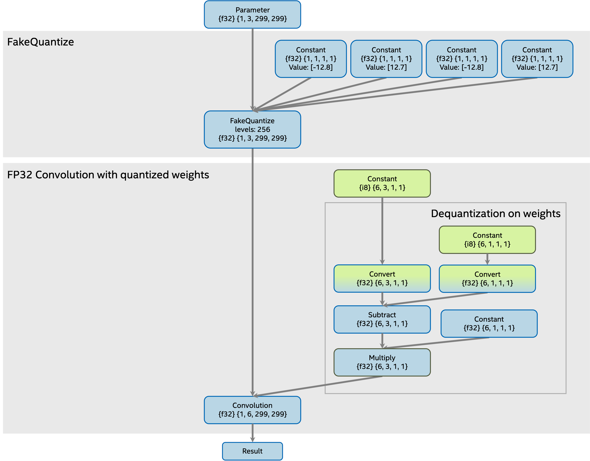
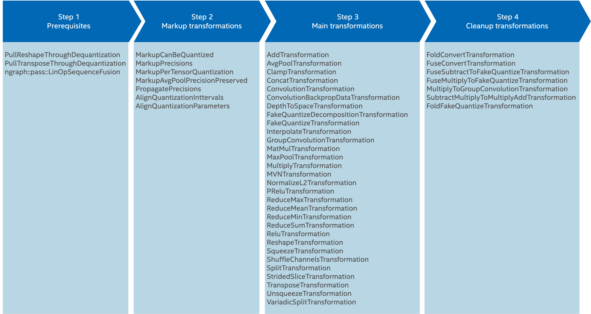
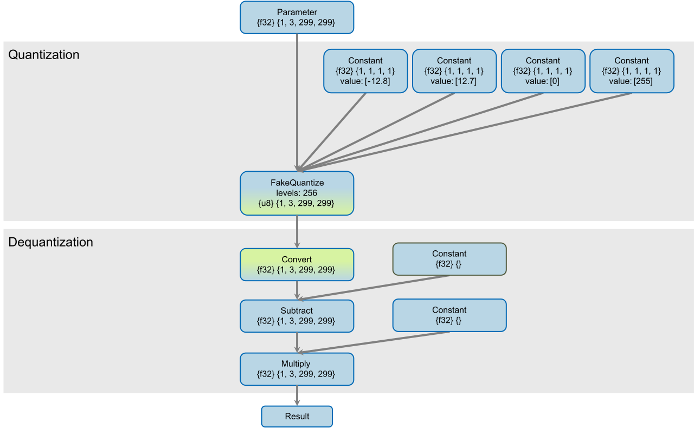

.. index:: pair: page; OpenVINO™ Low Precision Transformations
.. _extensibility_plugin__lpt:

.. meta::
   :description: Guide to Low precision transformations, a set of nGraph 
                 transformations combined in one library.
   :keywords: low precision transformations, lpt, ngraph transformations, OpenVINO, quantized model,
              FP16, FP32, INT8, low precision inference, OpenVINO plugin, FakeQuantize, 
              operation input tensor precisions, plugin transformation pipeline

OpenVINO™ Low Precision Transformations
=========================================

:target:`extensibility_plugin__lpt_1md_openvino_docs_ie_plugin_dg_plugin_transformation_pipeline_low_precision_transformations_lpt`

.. toctree::
   :maxdepth: 1
   :caption: Low Precision Transformations
   :hidden:

   ./low-precision-transformations/low-precision-transformation-attributes
   ./low-precision-transformations/prerequisites-transformations
   ./low-precision-transformations/markup-transformations
   ./low-precision-transformations/main-transformations
   ./low-precision-transformations/cleanup-transformations

Introduction
~~~~~~~~~~~~

Low precision transformations (known as LPT) are a set of nGraph transformations, which are combined in one library. 
The library is mandatory part of OpenVINO to infer quantized model in low precision with the maximum performance 
on Intel CPU, GPU and ARM platforms. The library includes more than 45 transformations and supports more then 30 operations. 
Some transformations are mandatory, some of them are optional and developed for specific device.

The goal of Low Precision Transformations (LPT) is to transform a quantized model from its original precision (FP16 or FP32) 
to a low precision (INT8: ``signed int8`` or ``unsigned int8``), so that it is prepared for low precision inference 
in OpenVINO™ plugin. It is achieved by two main principles:

#. ``FakeQuantize`` operation decomposition to two parts:
   
   
   
   * part #1: quantize operation - new ``FakeQuantize`` operation with output quantization intervals in low precision range (signed int8: [-128, 127] or [-127, 127], unsigned int8: [0, 255] or [0, 256]) and with low precision output (``signed int8`` or ``unsigned int8``),
   
   * part #2: dequantization operations with low precision input and original precision output.

#. Propagation of the dequantization operation through original model's operations. It is done to avoid dequantization operations before original model operations, thus the quantize operations with low precision output remain before the original model operations.

As result, operation input tensor precisions will be changed from original to low precision and operations can be 
inferred by OpenVINO™ plugin in low precision.

For a more detailed description on how to quantize a model, see the `Low precision tools <#low-precision-tools>`__ section 
below. For more information about model quantization, refer to **Brief History of Lower Precision in Deep Learning** section 
in `this whitepaper <https://software.intel.com/en-us/articles/lower-numerical-precision-deep-learning-inference-and-training>`__.

Input model requirements
~~~~~~~~~~~~~~~~~~~~~~~~

LPT transformations propagate dequantization operations through the following operations:

* :ref:`Add-1 <doxid-openvino_docs_ops_arithmetic__add_1>`

* :ref:`AvgPool-1 <doxid-openvino_docs_ops_pooling__avg_pool_1>`

* :ref:`Clamp-1 <doxid-openvino_docs_ops_activation__clamp_1>`

* :ref:`Concat-1 <doxid-openvino_docs_ops_movement__concat_1>`

* :ref:`Convolution-1 <doxid-openvino_docs_ops_convolution__convolution_1>`

* :ref:`ConvolutionBackpropData-1 <doxid-openvino_docs_ops_convolution__convolution_backprop_data_1>`

* :ref:`DepthToSpace-1 <doxid-openvino_docs_ops_movement__depth_to_space_1>`

* :ref:`FakeQuantize-1 <doxid-openvino_docs_ops_quantization__fake_quantize_1>`

* :ref:`GroupConvolution-1 <doxid-openvino_docs_ops_convolution__group_convolution_1>`

* :ref:`Interpolate-1 <doxid-openvino_docs_ops_image__interpolate_1>`

* :ref:`Interpolate-4 <doxid-openvino_docs_ops_image__interpolate_4>`

* :ref:`MatMul-1 <doxid-openvino_docs_ops_matrix__mat_mul_1>`

* :ref:`MaxPool-1 <doxid-openvino_docs_ops_pooling__max_pool_1>`

* :ref:`Multiply-1 <doxid-openvino_docs_ops_arithmetic__multiply_1>`

* :ref:`MVN-1 <doxid-openvino_docs_ops_normalization__m_v_n_1>`

* :ref:`NormalizeL2-1 <doxid-openvino_docs_ops_normalization__normalize_l2_1>`

* :ref:`PRelu-1 <doxid-openvino_docs_ops_activation__p_re_l_u_1>`

* :ref:`ReduceMax-1 <doxid-openvino_docs_ops_reduction__reduce_max_1>`

* :ref:`ReduceMean-1 <doxid-openvino_docs_ops_reduction__reduce_mean_1>`

* :ref:`ReduceMin-1 <doxid-openvino_docs_ops_reduction__reduce_min_1>`

* :ref:`ReduceSum-1 <doxid-openvino_docs_ops_reduction__reduce_sum_1>`

* :ref:`Relu-1 <doxid-openvino_docs_ops_activation__re_l_u_1>`

* :ref:`Reshape-1 <doxid-openvino_docs_ops_shape__reshape_1>`

* :ref:`Split-1 <doxid-openvino_docs_ops_movement__split_1>`

* :ref:`Squeeze-1 <doxid-openvino_docs_ops_shape__reshape_1>`

* :ref:`StridedSlice-1 <doxid-openvino_docs_ops_movement__strided_slice_1>`

* :ref:`Transpose-1 <doxid-openvino_docs_ops_movement__transpose_1>`

* :ref:`Unsqueeze-1 <doxid-openvino_docs_ops_shape__unsqueeze_1>`

* :ref:`VariadicSplit-1 <doxid-openvino_docs_ops_movement__variadic_split_1>`

If operation is not supported by LPT then dequantization operation will not be propagated, input tensor precisions 
will not be changed to low precision and operation will be executed in original precision.

For example, if you would like to infer a model with ``Convolution`` operation in low precision then the model can look 
as on picture below:

There are several supported quantization approaches on activations and on weights. All supported approaches are described 
in `Quantization approaches <#quantization-approaches>`__ section below. In demonstrated model 
`FakeQuantize operation quantization <#fakequantize-operation>`__ approach is used.

Low precision tools
-------------------

For more details on how to get a quantized model, refer to :ref:`Model Optimization <optim_perf__model_optim_guide>` document.

Quantization approaches
~~~~~~~~~~~~~~~~~~~~~~~

LPT transformations support two quantization approaches:

#. ``FakeQuantize`` operation,

#. Quantize and dequantization operations

Let's explore both approaches in details on ``Convolution`` operation.

FakeQuantize operation
----------------------

In this case ``FakeQuantize`` operation is used on activations and quantized constant on weights. Original input model:

Quantize and dequantization operations
--------------------------------------

In this case ``FakeQuantize`` operation and ``Convert`` are used as quantize operation and return quantized low precision 
tensor. After quantize operation on activations there are ``Convert`` and dequantization operations to compensate 
decomposition. Original input model:

.. image:: ./_assets/model_qdq_and_convolution.common.png
	:alt: Original model with Q/DQ

In both cases result is the same. In LPT result model you can see, that:

#. if necessary, ``FakeQuantize`` operations on activations were decomposed to two part:
   
   * new ``FakeQuantize`` operation with updated output intervals in low precision range and low precision output,
   
   * dequantization operations on activations;

#. if necessary, an existing ``FakeQuantize`` decomposition can be reworked to get better precision;

#. dequantization operations were propagated through ``Convolution``.

LPT result model:

.. image:: ./_assets/model_fq_and_convolution.transformed.png
	:alt: Result model

Low precision transformations pipeline
--------------------------------------

LPT transformation pipeline has several steps. For each transformation inside one step pattern matcher is unique per 
transformation, but each operation can be assigned to several transformations.

Inside each step LPT transformations handle input model operation by operation, applying transformation matching pattern 
for each transformation from the step to an operation, and execute transformation if pattern is matched. Decomposition 
transformation decomposes ``FakeQuantize`` to quantize and dequantization operations. Dequantization operations from 
previous transformation result is used for the current one and so on, until the end of the model is achieved.

As result, usually all operations are inferred by plugin in low precision. If plugin doesn't support an operation inference 
in low precision, then corresponding LPT transformation can be disabled, and input tensor precisions for the operation 
will not be changed. In this case the operation is inferred in the original precision.

Low precision transformations pipeline includes four steps:

* :ref:`Step #1: Prerequisites <plugin_lpt__step1_prerequisites>`

* :ref:`Step #2: Markup transformations <plugin_lpt__step2_markup>`

* :ref:`Step #3: Main transformations <plugin_lpt__step3_main_transformations>`

* :ref:`Step #4: Cleanup transformations <plugin_lpt__step4_cleanup>`

Step 1. Prerequisites
---------------------

This step fuses and propagates some operations in the model to prepare for the next step. It is required for OpenVINO plugins. Transformations:

* :ref:`PullReshapeThroughDequantization <lpt_transformations__pull_reshape_through_dequantization>`

* :ref:`PullTransposeThroughDequantization <lpt_transformations__pull_transpose_through_dequantization>`

* :ref:`LinOpSequenceFusion <lpt_transformations__lin_op_sequence_fusion>`

The model on this step is changed. There are more details in developer guide :ref:`Prerequisites transformations <plugin_lpt__step1_prerequisites>`.

Step 2. Markup
--------------

This step creates runtime attributes for operations. These attributes will be used in next step. Transformations:

* :ref:`MarkupCanBeQuantized <lpt_transformations__markup_can_be_quantized>`

* :ref:`MarkupPrecisions <lpt_transformations__markup_precisions>`

* :ref:`MarkupPerTensorQuantization <lpt_transformations__markup_per_tensor_quantization>`

* :ref:`MarkupAvgPoolPrecisionPreserved <lpt_transformations__markup_avg_pool_precision_preserved>`

* :ref:`PropagatePrecisions <lpt_transformations__propagate_precisions>`

* :ref:`AlignQuantizationIntervals <lpt_transformations__align_quantization_intervals>`

* :ref:`AlignQuantizationParameters <lpt_transformations__align_quantization_parameters>`

The model on this step is changed: only new attributes are added to some operations. There are more details in developer 
guide :ref:`Markup transformations <plugin_lpt__step2_markup>`.

Step 3. Main transformations, FakeQuantize decomposition and dequantization operations handling
-----------------------------------------------------------------------------------------------

This step has the most transformations. These transformations can be separated in two groups: decomposition transformation 
and dequantization operations handling. There are more details in developer guide 
:ref:`Main transformations <plugin_lpt__step3_main_transformations>`. Transformations:

* :ref:`AddTransformation <lpt_transformations__add_transformation>`

* :ref:`AvgPoolTransformation <lpt_transformations__avg_pool_transformation>`

* :ref:`ClampTransformation <lpt_transformations__clamp_transformation>`

* :ref:`ConcatTransformation <lpt_transformations__concat_transformation>`

* :ref:`ConvolutionTransformation <lpt_transformations__convolution_transformation>`

* :ref:`ConvolutionBackpropDataTransformation <lpt_transformations__convolution_backprop_data_transformation>`

* :ref:`DepthToSpaceTransformation <lpt_transformations__depth_to_space_transformation>`

* :ref:`FakeQuantizeDecompositionTransformation <lpt_transformations__fake_quantize_decomposition_transformation>`

* :ref:`FakeQuantizeTransformation <lpt_transformations__fake_quantize_transformation>`

* :ref:`InterpolateTransformation <lpt_transformations__interpolate_transformation>`

* :ref:`GroupConvolutionTransformation <lpt_transformations__group_convolution_transformation>`

* :ref:`MatMulTransformation <lpt_transformations__mat_mul_transformation>`

* :ref:`MaxPoolTransformation <lpt_transformations__max_pool_transformation>`

* :ref:`MultiplyTransformation <lpt_transformations__multiply_transformation>`

* :ref:`MVNTransformation <lpt_transformations__mvn_transformation>`

* :ref:`NormalizeL2Transformation <lpt_transformations__normalize_l2_transformation>`

* :ref:`PReluTransformation <lpt_transformations__p_relu_transformation>`

* :ref:`ReduceMaxTransformation <lpt_transformations__reduce_max_transformation>`

* :ref:`ReduceMeanTransformation <lpt_transformations__reduce_mean_transformation>`

* :ref:`ReduceMinTransformation <lpt_transformations__reduce_min_transformation>`

* :ref:`ReduceSumTransformation <lpt_transformations__reduce_sum_transformation>`

* :ref:`ReluTransformation <lpt_transformations__relu_transformation>`

* :ref:`ReshapeTransformation <lpt_transformations__reshape_transformation>`

* :ref:`SqueezeTransformation <lpt_transformations__squeeze_transformation>`

* :ref:`ShuffleChannelsTransformation <lpt_transformations__shuffle_channels_transformation>`

* :ref:`SplitTransformation <lpt_transformations__split_transformation>`

* :ref:`StridedSliceTransformation <lpt_transformations__strided_slice_transformation>`

* :ref:`TransposeTransformation <lpt_transformations__transpose_transformation>`

* :ref:`UnsqueezeTransformation <lpt_transformations__unsqueeze_transformation>`

* :ref:`VariadicSplitTransformation <lpt_transformations__variadic_split_transformation>`

Decomposition transformations
+++++++++++++++++++++++++++++

Decomposition transformations decompose the ``FakeQuantize`` operation to: quantize (``FakeQuantize`` with low precision 
output) and dequantization operations (opposite to quantize, with low precision input and the original precision output). 
For dequantization operations LPT uses three operations: ``Convert``, ``Subtract`` and ``Multiply``. Element-wise operations 
``Subtract`` and ``Multiply`` have constants on the second branches. If dequantization operations are not handled 
at the end of LPT pipeline, then they will be fused back to the ``FakeQuantize``.

Original ``FakeQuantize`` :

.. image:: ./_assets/fq.common.png
	:alt: FakeQuantize operation before LPT

``FakeQuantize`` after decomposition to quantization and dequantization operations:

Dequantization operations handling transformations
++++++++++++++++++++++++++++++++++++++++++++++++++

In this step, LPT transformations fuse dequantization operations or move them through existing 
model operations as much as possible.

Original ``Convolution`` operation in FP32 with dequantization operations before:

``Convolution`` operation in INT8 after decomposition and dequantization operations handling:

.. image:: ./_assets/model_fq_and_convolution.transformed.png
	:alt: Convolution operation after LPT

Step 4: Cleanup of the result model
-----------------------------------

LPT cleanup transformations is final stage in LPT pipeline. In this step LPT transformations clean up the result model 
to avoid not handled dequantization operations: fuse dequantization operations if possible (fuse at least ``Convert`` 
operations if not) to other model operations to cleanup result model. Transformations:

* :ref:`FoldConvertTransformation <lpt_transformations__fold_convert_transformation>`

* :ref:`FoldFakeQuantizeTransformation <lpt_transformations__fold_fake_quantize_transformation>`

* :ref:`FuseConvertTransformation <lpt_transformations__fuse_convert_transformation>`

* :ref:`FuseMultiplyToFakeQuantizeTransformation <lpt_transformations__fuse_multiply_to_fake_quantize_transformation>`

* :ref:`FuseSubtractToFakeQuantizeTransformation <lpt_transformations__fuse_subtract_to_fake_quantize_transformation>`

* :ref:`MultiplyToGroupConvolutionTransformation <lpt_transformations__multiply_to_group_convolution_transformation>`

There are more details in developer guide :ref:`Cleanup transformations <plugin_lpt__step4_cleanup>`.

``FakeQuantize`` operation with not handled dequantization operations:

``FakeQuantize`` operation with fused dequantization operations:

.. image:: ./_assets/fq.common.png
	:alt: TODO: FakeQuantize operation with fused operations after LPT

Low precision transformations in plugin transformation pipeline
~~~~~~~~~~~~~~~~~~~~~~~~~~~~~~~~~~~~~~~~~~~~~~~~~~~~~~~~~~~~~~~

Typical transformation pipeline described below.

Step 1. Common optimizations
----------------------------

This step is optional for LPT but typically is presented in OpenVINO™ plugins. The step doesn't use any LPT transformation. 
Firstly, the step disables dequantization operations constant folding on constant subgraph on weights to prevent 
the lost of dequantization info on the next plugin transformations. After that, it optimizes nGraph function and convert 
operations to operation set 1. Typically, usage of this step is the simplest way to meet LPT requirements for the input 
quantized model. If plugin can guarantee that LPT input requirements are met, then this step can be skipped.

.. ref-code-block:: cpp

	// check if the function is quantized to ignore LPT transformations for not quantized function to speed up model loading
	const bool useLpt = :ref:`ngraph::pass::low_precision::LowPrecision::isFunctionQuantized <doxid-classngraph_1_1pass_1_1low__precision_1_1_low_precision_1a067d6e01e3585f860bff01118399328c>`(nGraphFunc);
	auto defaultPrecisions =
	    useLpt ? :ref:`ngraph::pass::low_precision::precision_set::int8_support <doxid-namespacengraph_1_1pass_1_1low__precision_1_1precision__set_1aadf8375a12f123670991b043f50a94e5>` : std::vector<ov::element::Type>{};
	if (useLpt) {
	    // disable constant folding on constant subgraph to use the subgraph for LPT
	    manager.register_pass<:ref:`ngraph::pass::DisableConvertConstantFoldingOnConstPath <doxid-classngraph_1_1pass_1_1_disable_convert_constant_folding_on_const_path>`>(defaultPrecisions);
	}
	
	// nGraph common transformations happen here
	
	if (useLpt) {
	    // convert subtract constant to INT8 to prevent unnecessary FP16 to FP32 conversion
	    manager.register_pass<:ref:`ngraph::pass::low_precision::ConvertSubtractConstant <doxid-classngraph_1_1pass_1_1low__precision_1_1_convert_subtract_constant>`>(defaultPrecisions);
	}
	
	// nGraph common transformations happen here
	
	if (useLpt) {
	    // convert not supported cases FakeQuantize -> Convert -> Convert -> Subtract -> Multiply to a single FakeQuantize
	    pass_config->:ref:`set_callback <doxid-classov_1_1pass_1_1_pass_base_1a6a56827a1cf76be99289bab703982869>`<:ref:`ngraph::pass::ConvertQuantizeDequantize <doxid-classngraph_1_1pass_1_1_convert_quantize_dequantize>`>([&defaultPrecisions](const std::shared_ptr<const ngraph::Node> &node) -> bool {
	        return :ref:`ngraph::pass::low_precision::NetworkHelper::areQuantizeAndDequantizeSupportedForMultiply <doxid-classngraph_1_1pass_1_1low__precision_1_1_network_helper_1ae0dfcb088b4a5659a946b56e171ae2d7>`(node, defaultPrecisions);
	    });
	
	    // convert not supported cases FakeQuantize -> Convert -> Convert -> Subtract -> Multiply to a single FakeQuantize
	    pass_config->:ref:`set_callback <doxid-classov_1_1pass_1_1_pass_base_1a6a56827a1cf76be99289bab703982869>`<:ref:`ngraph::pass::ConvertSubtract <doxid-classngraph_1_1pass_1_1_convert_subtract>`>([&defaultPrecisions](const std::shared_ptr<const ngraph::Node> &node) -> bool {
	        return :ref:`ngraph::pass::low_precision::NetworkHelper::areQuantizeAndDequantizeSupportedForSubtract <doxid-classngraph_1_1pass_1_1low__precision_1_1_network_helper_1acaa693323231737064c9d7d6e3a25b89>`(node, defaultPrecisions);
	    });
	}
	
	manager.run_passes(nGraphFunc);

Step 2. Low precision transformations execution
-----------------------------------------------

This step is mandatory. It configures and runs LPT transformations.

.. ref-code-block:: cpp

	using namespace :ref:`ngraph::pass::low_precision <doxid-namespacengraph_1_1pass_1_1low__precision>`;
	if (useLpt) {
	    // Low precision transformations plugin specific configuration: restrictions definition
	    auto supportedPrecisions = std::vector<PrecisionsRestriction>({
	        PrecisionsRestriction::create<ngraph::opset1::Convolution>({
	            {0, {ngraph::element::u8}},
	            {1, {ngraph::element::i8}},
	        }),
	        PrecisionsRestriction::create<ngraph::opset1::ConvolutionBackpropData>({
	            {0, {ngraph::element::u8, ngraph::element::i8}},
	            {1, {ngraph::element::i8}}
	        }),
	        PrecisionsRestriction::create<ngraph::opset1::GroupConvolution>({
	            {0, {ngraph::element::u8}},
	            {1, {ngraph::element::i8}}
	        }),
	        PrecisionsRestriction::create<ngraph::opset1::Multiply>({
	            {0, {ngraph::element::u8}},
	            {1, {ngraph::element::i8}},
	        }),
	    });
	
	    // Low precision transformations plugin specific configuration: per-tensor quantization operations definition
	    auto perTensorQuantization = std::vector<QuantizationGranularityRestriction>({
	        QuantizationGranularityRestriction::create<ngraph::opset1::Convolution>({0}),
	        QuantizationGranularityRestriction::create<ngraph::opset1::ConvolutionBackpropData>({0})
	    });
	
	    // Low precision transformations instantiation and registration in pass manager
	    :ref:`ngraph::pass::Manager <doxid-classov_1_1pass_1_1_manager>` lptManager;
	    lptManager.:ref:`register_pass <doxid-classov_1_1pass_1_1_manager_1a3c4834680de7b43557783e8500795da3>`<:ref:`ngraph::pass::low_precision::LowPrecision <doxid-classngraph_1_1pass_1_1low__precision_1_1_low_precision>`>(supportedPrecisions, perTensorQuantization);
	
	    // Low precision transformations plugin specific configuration: transformation callbacks definition
	    lptManager.:ref:`get_pass_config <doxid-classov_1_1pass_1_1_pass_base_1a384e9a459cf0d8f1633241594fad2775>`()->set_callback<:ref:`MarkupPrecisions <doxid-namespacengraph_1_1pass_1_1low__precision_1a3ad0998fffa609dfbb131b7cf9f23309>`>( -> bool {
	        if (const auto :ref:`multiply <doxid-namespacengraph_1_1runtime_1_1reference_1a00292cb933b4e80075ebb7c6fcd77719>` = std::dynamic_pointer_cast<const ngraph::opset1::Multiply>(node)) {
	            return !MultiplyToGroupConvolutionTransformation::canBeTransformedToGroupConvolution(:ref:`multiply <doxid-namespacengraph_1_1runtime_1_1reference_1a00292cb933b4e80075ebb7c6fcd77719>`);
	        }
	        return false;
	    });
	    lptManager.get_pass_config()->set_callback<ConvolutionBackpropDataTransformation>([&defaultPrecisions](const std::shared_ptr<const ngraph::Node>& node) -> bool {
	        return LayerTransformation::isAsymmetricQuantization(node, defaultPrecisions) || WeightableLayerTransformation::isAsymmetricOnWeights(node);
	    });
	    lptManager.get_pass_config()->set_callback<MultiplyToGroupConvolutionTransformation>( -> bool {
	        return MultiplyToGroupConvolutionTransformation::isDynamicOrScalar(node);
	    });
	
	    // Low precision transformations execution
	    lptManager.run_passes(nGraphFunc);
	}

Step 3. Plugin-specific transformations
---------------------------------------

This step is optional. It modifies the nGraph function to a device-specific operation set.

.. ref-code-block:: cpp

	:ref:`ngraph::pass::Manager <doxid-classov_1_1pass_1_1_manager>` deviceSpecificManager;
	deviceSpecificManager.:ref:`register_pass <doxid-classov_1_1pass_1_1_manager_1a3c4834680de7b43557783e8500795da3>`<ngraph::pass::device::ConvertOpSet1ToDeviceSpecific>();
	deviceSpecificManager.:ref:`run_passes <doxid-classov_1_1pass_1_1_manager_1a8b155191130f2c15e294cfd259d4ca0d>`(nGraphFunc);

Result model overview
~~~~~~~~~~~~~~~~~~~~~

Let's explore quantized `TensorFlow implementation of ResNet-50 <https://github.com/openvinotoolkit/open_model_zoo/tree/master/models/public/resnet-50-tf>`__ 
model. Use Model Downloader tool to download the ``fp16`` model from 
`OpenVINO™ Toolkit - Open Model Zoo repository <https://github.com/openvinotoolkit/open_model_zoo>`__ :

.. ref-code-block:: cpp

	omz_downloader --name resnet-50-tf --precisions FP16-INT8

After that you should quantize model by the Model Quantizer tool.

.. ref-code-block:: cpp

	omz_quantizer --model_dir public/resnet-50-tf --dataset_dir <DATASET_DIR> --precisions=FP16-INT8

Inference
---------

The simplest way to infer the model and collect performance counters is 
:ref:`Benchmark Application <doxid-openvino_inference_engine_samples_benchmark_app__r_e_a_d_m_e>`.

.. ref-code-block:: cpp

	./benchmark_app -m resnet-50-tf.xml -d CPU -niter 1 -api sync -report_type average_counters  -report_folder pc_report_dir

If you infer the model with the OpenVINO™ CPU plugin and collect performance counters, all operations (except last not 
quantized SoftMax) are executed in INT8 precision.

Results analysis
----------------

Result model depends on different factors:

* The original model quantization possibility and quantization quality. For some models, some operations are not possible to be quantized by POT and NNCF tools. In this case ``FakeQuantize`` operations are absent before these operations and they will be inferred in original precision.

* LPT customization and plugin supported operations. If plugin doesn't support INT8 inference for some operation then corresponding LPT transformation should be disabled and the operation will be inferred in original precision.

Information about layer precision is stored in the performance counters that are available from the OpenVINO Runtime API. 
For example, the part of performance counters table for quantized 
`TensorFlow implementation of ResNet-50 <https://github.com/openvinotoolkit/open_model_zoo/tree/master/models/public/resnet-50-tf>`__ 
model inference on CPU Plugin looks as follows:

.. list-table::
    :header-rows: 1

    * - layerName
      - execStatus
      - layerType
      - execType
      - realTime (ms)
      - cpuTime (ms)
    * - resnet_model/batch_normalization_15/FusedBatchNorm/Add
      - EXECUTED
      - Convolution
      - jit_avx512_1x1_I8
      - 0.377
      - 0.377
    * - resnet_model/conv2d_16/Conv2D/fq_input_0
      - NOT_RUN
      - FakeQuantize
      - undef
      - 0
      - 0
    * - resnet_model/batch_normalization_16/FusedBatchNorm/Add
      - EXECUTED
      - Convolution
      - jit_avx512_I8
      - 0.499
      - 0.499
    * - resnet_model/conv2d_17/Conv2D/fq_input_0
      - NOT_RUN
      - FakeQuantize
      - undef
      - 0
      - 0
    * - resnet_model/batch_normalization_17/FusedBatchNorm/Add
      - EXECUTED
      - Convolution
      - jit_avx512_1x1_I8
      - 0.399
      - 0.399
    * - resnet_model/add_4/fq_input_0
      - NOT_RUN
      - FakeQuantize
      - undef
      - 0
      - 0
    * - resnet_model/add_4
      - NOT_RUN
      - Eltwise
      - undef
      - 0
      - 0
    * - resnet_model/add_5/fq_input_1
      - NOT_RUN
      - FakeQuantize
      - undef
      - 0
      - 0

The ``execStatus`` column of the table includes possible values:

* ``EXECUTED`` - layer was executed by standalone primitive,

* ``NOT_RUN`` - layer was not executed by standalone primitive or was fused with another operation and executed in another layer primitive.

The ``execType`` column of the table includes inference primitives with specific suffixes. The layers have the following marks:

* Suffix ``I8`` for layers that had 8-bit data type input and were computed in 8-bit precision

* Suffix ``FP32`` for layers computed in 32-bit precision

As result all operations (except not quantized ``SoftMax`` at the end of the model) in OpenVINO™ CPU plugin are inferred 
in low precision. Note, in the result model there are ``FakeQuantize`` operations in FP32 but the plugin 
responsibility is fuse these operations with previous operations. OpenVINO™ CPU plugin achieves maximum optimized 
inference for all operations by fusing INT8 ``Convolution`` with FP32 output with ``FakeQuantize`` operation with FP32 
input and INT8 output. In this case OpenVINO™ CPU plugin uses INT8 and FP32 vectorized instructions but reports about one 
INT8 kernel usage for inference, which is the most optimized for this case.

Mixed precision
~~~~~~~~~~~~~~~

If LPT input model operation output has ``fp16`` precision then dequantization computations still occurs in ``fp32`` 
precision. This approach is used to avoid accuracy loss in ``fp16`` arithmetic computations. The ultimate output 
of the dequantization operation will have the ``fp16`` precision, as expected.

Customization
~~~~~~~~~~~~~

Low Precision Transformations can be customizable. Build-in customization options:

* operation precision restrictions,

* operation per tensor quantization restrictions,

* update precisions,

* dequantization precision.

Operation precision restrictions
--------------------------------

This option defines precisions which allowed for the operation input ports. The option value is passed as input argument 
for ``LowPrecision`` constructor. For example:

.. ref-code-block:: cpp

	auto supportedPrecisions = std::vector<PrecisionsRestriction>({
	    PrecisionsRestriction::create<ngraph::opset1::Convolution>({
	        {0, {ngraph::element::u8}},
	        {1, {ngraph::element::i8}},
	    }),
	});
	
	:ref:`ngraph::pass::Manager <doxid-classov_1_1pass_1_1_manager>` lptManager;
	lptManager.:ref:`register_pass <doxid-classov_1_1pass_1_1_manager_1a3c4834680de7b43557783e8500795da3>`<:ref:`ngraph::pass::low_precision::LowPrecision <doxid-classngraph_1_1pass_1_1low__precision_1_1_low_precision>`>(supportedPrecisions);
	lptManager.run_passes(nGraphFunc);

In provided example in result model ``Convolution`` operation inputs must have specific precisions: ``u8`` (unsigned int8) 
precision on input 0 (on activations) and ``i8`` (signed int8) precision on input 1 (on weights).

Operation per tensor quantization restrictions
----------------------------------------------

This option defines if operation supports per-tensor quantization only. The option value is passed as input argument 
for ``LowPrecision`` constructor. For example:

.. ref-code-block:: cpp

	using namespace :ref:`ngraph::pass::low_precision <doxid-namespacengraph_1_1pass_1_1low__precision>`;
	
	const std::vector<PrecisionsRestriction> emptyRestrictions;
	
	auto perTensorQuantization = std::vector<QuantizationGranularityRestriction>({
	    QuantizationGranularityRestriction::create<ngraph::opset1::Convolution>({0})
	});
	
	:ref:`ngraph::pass::Manager <doxid-classov_1_1pass_1_1_manager>` lptManager;
	lptManager.:ref:`register_pass <doxid-classov_1_1pass_1_1_manager_1a3c4834680de7b43557783e8500795da3>`<:ref:`ngraph::pass::low_precision::LowPrecision <doxid-classngraph_1_1pass_1_1low__precision_1_1_low_precision>`>(emptyRestrictions, perTensorQuantization);
	lptManager.run_passes(nGraphFunc);

In provided example in result model ``Convolution`` operations must have per-tensor quantization on input 0 (on activations).

Update precisions
-----------------

This option defines if each LPT transformation updates precision or not. The option value is boolean and is passed 
as ``updatePrecisions`` member of ``LayerTransformation::Params`` which is input argument for ``LowPrecision`` constructor. 
All transformations are affected. If ``true`` then low precision transformations update precisions to low precision 
and doesn't if ``false``. Typically this option is used for plugin debugging.

Typical customization use cases
-------------------------------

Plugin specific customization can be implemented via nGraph transformation callbacks. For example: asymmetric quantization 
support can be easily customizable via ``LayerTransformation::isAsymmetricQuantization`` and 
``WeightableLayerTransformation::isAsymmetricOnWeights`` methods usage in callbacks. For example:

.. ref-code-block:: cpp

	using namespace :ref:`ngraph::pass::low_precision <doxid-namespacengraph_1_1pass_1_1low__precision>`;
	:ref:`ngraph::pass::Manager <doxid-classov_1_1pass_1_1_manager>` lptManager;
	
	lptManager.:ref:`register_pass <doxid-classov_1_1pass_1_1_manager_1a3c4834680de7b43557783e8500795da3>`<:ref:`ngraph::pass::low_precision::LowPrecision <doxid-classngraph_1_1pass_1_1low__precision_1_1_low_precision>`>();
	lptManager.:ref:`get_pass_config <doxid-classov_1_1pass_1_1_manager_1aec3ebf86305f68866b84412084917cb9>`()->set_callback<ConvolutionBackpropDataTransformation>([&defaultPrecisions](const std::shared_ptr<const ngraph::Node>& node) -> bool {
	    return LayerTransformation::isAsymmetricQuantization(node, defaultPrecisions) || WeightableLayerTransformation::isAsymmetricOnWeights(node);
	});
	lptManager.:ref:`run_passes <doxid-classov_1_1pass_1_1_manager_1a8b155191130f2c15e294cfd259d4ca0d>`(nGraphFunc);

