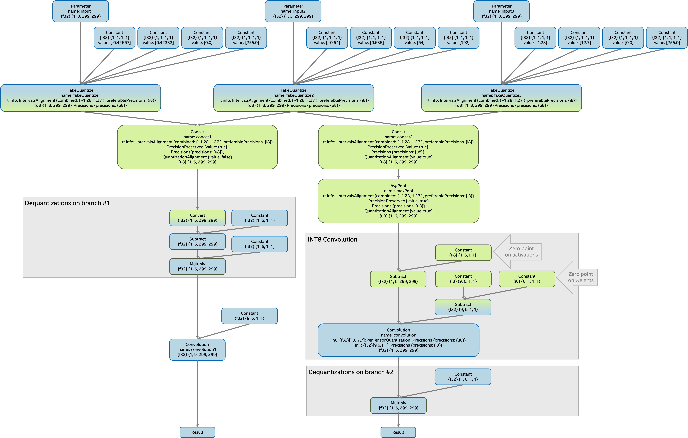

.. index:: pair: page; Step 3. Main Transformations
.. _plugin_lpt__step3_main_transformations:

.. meta::
   :description: Step 3 of low precision transformations. Feature a list of transforamtions used to 
                 decomposition transformation and dequantization operations handling.
   :keywords: low precision transformations, lpt, Main Transformations, decomposition transformation,
              dequantization operation handling, AddTransformation, AvgPoolTransformation, 
              ClampTransformation, ConcatTransformation, ConvolutionTransformation, 
              ConvolutionBackpropDataTransformation, DepthToSpaceTransformation, 
              FakeQuantizeDecompositionTransformation, FakeQuantizeTransformation, InterpolateTransformation,
              GroupConvolutionTransformation, MatMulTransformation, MaxPoolTransformation, 
              MultiplyTransformation, MVNTransformation, NormalizeL2Transformation, PReluTransformation, 
              ReduceMaxTransformation, ReduceMeanTransformation, ReduceMinTransformation, ReduceSumTransformation, 
              ReluTransformation, ReshapeTransformation, SqueezeTransformation, ShuffleChannelsTransformation, 
              SplitTransformation, StridedSliceTransformation, TransposeTransformation, UnsqueezeTransformation, 
              VariadicSplitTransformation, FakeQuantize

Step 3. Main Transformations
============================

:target:`plugin_lpt__step3_main_transformations_1md_openvino_docs_ie_plugin_dg_plugin_transformation_pipeline_low_precision_transformations_pipeline_step3_main` Main transformations are the majority of low precision transformations. Transformations operate with dequantization operations. Main transformations include:

* :ref:`AddTransformation <lpt_transformations__add_transformation>`

* :ref:`AvgPoolTransformation <lpt_transformations__avg_pool_transformation>`

* :ref:`ClampTransformation <lpt_transformations__clamp_transformation>`

* :ref:`ConcatTransformation <lpt_transformations__concat_transformation>`

* :ref:`ConvolutionTransformation <lpt_transformations__convolution_transformation>`

* :ref:`ConvolutionBackpropDataTransformation <lpt_transformations__convolution_backprop_data_transformation>`

* :ref:`DepthToSpaceTransformation <lpt_transformations__depth_to_space_transformation>`

* :ref:`FakeQuantizeDecompositionTransformation <doxid-openvino_docs__o_v__u_g_lpt__fake_quantize_decomposition_transformation>`

* :ref:`FakeQuantizeTransformation <doxid-openvino_docs__o_v__u_g_lpt__fake_quantize_transformation>`

* :ref:`InterpolateTransformation <doxid-openvino_docs__o_v__u_g_lpt__interpolate_transformation>`

* :ref:`GroupConvolutionTransformation <doxid-openvino_docs__o_v__u_g_lpt__group_convolution_transformation>`

* :ref:`MatMulTransformation <doxid-openvino_docs__o_v__u_g_lpt__mat_mul_transformation>`

* :ref:`MaxPoolTransformation <doxid-openvino_docs__o_v__u_g_lpt__max_pool_transformation>`

* :ref:`MultiplyTransformation <doxid-openvino_docs__o_v__u_g_lpt__multiply_transformation>`

* :ref:`MVNTransformation <doxid-openvino_docs__o_v__u_g_lpt__m_v_n_transformation>`

* :ref:`NormalizeL2Transformation <doxid-openvino_docs__o_v__u_g_lpt__normalize_l2_transformation>`

* :ref:`PReluTransformation <doxid-openvino_docs__o_v__u_g_lpt__p_relu_transformation>`

* :ref:`ReduceMaxTransformation <doxid-openvino_docs__o_v__u_g_lpt__reduce_max_transformation>`

* :ref:`ReduceMeanTransformation <doxid-openvino_docs__o_v__u_g_lpt__reduce_mean_transformation>`

* :ref:`ReduceMinTransformation <doxid-openvino_docs__o_v__u_g_lpt__reduce_min_transformation>`

* :ref:`ReduceSumTransformation <doxid-openvino_docs__o_v__u_g_lpt__reduce_sum_transformation>`

* :ref:`ReluTransformation <doxid-openvino_docs__o_v__u_g_lpt__relu_transformation>`

* :ref:`ReshapeTransformation <doxid-openvino_docs__o_v__u_g_lpt__reshape_transformation>`

* :ref:`SqueezeTransformation <doxid-openvino_docs__o_v__u_g_lpt__squeeze_transformation>`

* :ref:`ShuffleChannelsTransformation <doxid-openvino_docs__o_v__u_g_lpt__shuffle_channels_transformation>`

* :ref:`SplitTransformation <doxid-openvino_docs__o_v__u_g_lpt__split_transformation>`

* :ref:`StridedSliceTransformation <doxid-openvino_docs__o_v__u_g_lpt__strided_slice_transformation>`

* :ref:`TransposeTransformation <doxid-openvino_docs__o_v__u_g_lpt__transpose_transformation>`

* :ref:`UnsqueezeTransformation <doxid-openvino_docs__o_v__u_g_lpt__unsqueeze_transformation>`

* :ref:`VariadicSplitTransformation <doxid-openvino_docs__o_v__u_g_lpt__variadic_split_transformation>`

Let's explore some main transformations on the example model. Original model:

.. image:: ./_assets/step3_original.png
	:alt: Original model

Result model after main transformations:

Changes in the example model after main transformation:

* All ``FakeQuantize`` operations (``fakeQuantize1``, ``fakeQuantize2`` and ``fakeQuantize3``) were decomposed:
  
  * original ``FakeQuantize`` operations were replaced with new operations with other output intervals and output port precision,
  
  * dequantization operations.

* Dequantization operations were moved via precision preserved (``concat1`` and ``concat2``) and quantized (``convolution2``) operations.

.. note::
   The left branch (branch #1) does not require per-tensor quantization. As a result, the ``fakeQuantize1`` output 
   interval is [0, 255]. But quantized ``convolution2`` requires per-tensor quantization on the right branch (branch #2). 
   Then all connected ``FakeQuantize`` interval operations (``fakeQuantize1`` and ``fakeQuantize2``) are aligned to have 
   per-tensor quantization after the concatenation (``concat2``) operation.

