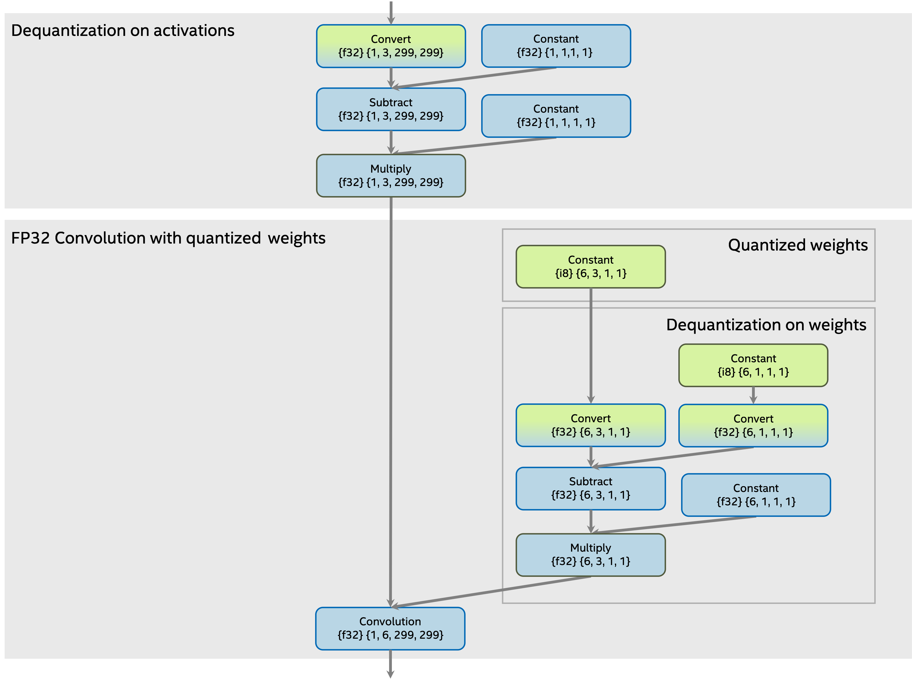
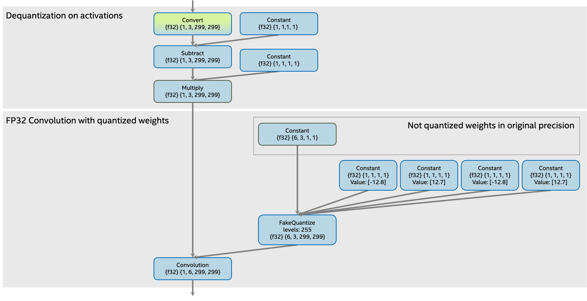
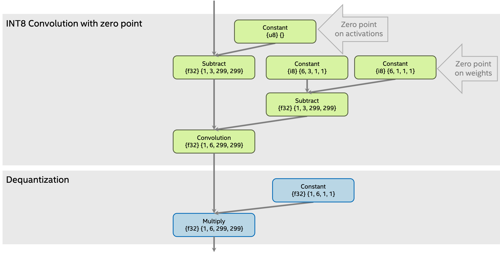

.. index:: pair: page; ConvolutionTransformation transformation
.. _lpt_transformations__convolution_transformation:

.. meta::
   :description: Information about ConvolutionTransformation transformation.
   :keywords: low precision transformation, lpt, ConvolutionTransformation

ConvolutionTransformation transformation
========================================

:target:`lpt_transformations__convolution_transformation_1md_openvino_docs_ie_plugin_dg_plugin_transformation_pipeline_low_precision_transformations_transformations_step3_main_convolution_convolution` :ref:`ngraph::pass::low_precision::ConvolutionTransformation <doxid-classngraph_1_1pass_1_1low__precision_1_1_convolution_transformation>` class represents the ``Convolution`` operation transformation.

The transformation propagates dequantization operations on activations and weights through the ``Convolution`` operation. 
The transformation supports several weights quantization approaches:

* quantized weights in low precision with dequantization operations,

* weights in original precision with ``FakeQuantize`` operation.

Result dequantization ``Multiply`` constant value *result* is calculated as multiplication for dequantization ``Multiply`` 
constant value on activations *a* and dequantization ``Multiply`` constant value on weights *b* :

.. math::

	result_{i} = a_{i} \cdot b_{i}

Limitations
~~~~~~~~~~~

* Dequantization on activations must be per-tensor. It means that dequantization ``Multiply`` constant value on activations must be scalar.

Subgraph before transformation
~~~~~~~~~~~~~~~~~~~~~~~~~~~~~~

Quantized weights in low precision with dequantization operations
-----------------------------------------------------------------

The subgraph with quantized ``Convolution`` before transformation with quantized weights in low precision constant 
and dequantization operations:

Weights in original precision with FakeQuantize operation
---------------------------------------------------------

The subgraph with quantized ``Convolution`` before transformation with weights in original precision 
and ``FakeQuantize`` operation:

Subgraph after transformation
~~~~~~~~~~~~~~~~~~~~~~~~~~~~~

The subgraph with ``Convolution`` operation after the transformation:

