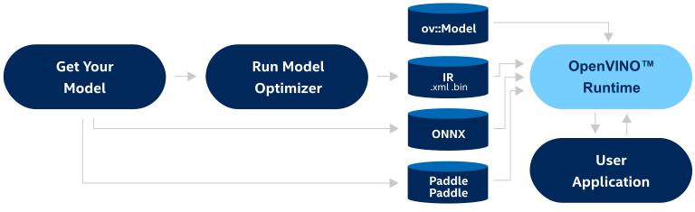

.. index:: pair: page; Performing Inference with OpenVINO Runtime
.. _doxid-openvino_docs__o_v__u_g__o_v__runtime__user__guide:

Performing Inference with OpenVINO Runtime
==========================================

:target:`doxid-openvino_docs__o_v__u_g__o_v__runtime__user__guide_1md_openvino_docs_ov_runtime_ug_openvino_intro`

.. _deep learning openvino runtime:

.. toctree::
   :maxdepth: 1
   :hidden:

   ./openvino-runtime-user-guide/openvino-runtime-integrate-application
   ./openvino-runtime-user-guide/changing-input-shapes
   ./openvino-runtime-user-guide/working-with-devices
   ./openvino-runtime-user-guide/preprocessing
   ./openvino-runtime-user-guide/dynamic-shapes
   ./openvino-runtime-user-guide/automatic-device-selection
   ./openvino-runtime-user-guide/multi-device-execution-mode
   ./openvino-runtime-user-guide/heterogeneous-execution-mode
   ./openvino-runtime-user-guide/performance-hints
   ./openvino-runtime-user-guide/automatic-batching
   ./openvino-runtime-user-guide/stateful-models
   ../ONNX_Format_Support

OpenVINO Runtime is a set of C++ libraries with C and Python bindings providing a common API to deliver inference solutions on the platform of your choice. Use the OpenVINO Runtime API to read an Intermediate Representation (IR), ONNX, or PaddlePaddle model and execute it on preferred devices.

OpenVINO Runtime uses a plugin architecture. Its plugins are software components that contain complete implementation for inference on a particular Intel® hardware device: CPU, GPU, VPU, etc. Each plugin implements the unified API and provides additional hardware-specific APIs for configuring devices or API interoperability between OpenVINO Runtime and underlying plugin backend.

The scheme below illustrates the typical workflow for deploying a trained deep learning model:

Video
~~~~~

.. list-table::

   * - .. raw:: html

           <iframe allowfullscreen mozallowfullscreen msallowfullscreen oallowfullscreen webkitallowfullscreen height="315" width="100%"
           src="https://www.youtube.com/embed/e6R13V8nbak">
           </iframe>
   * - **OpenVINO Runtime Concept**. Duration: 3:43

