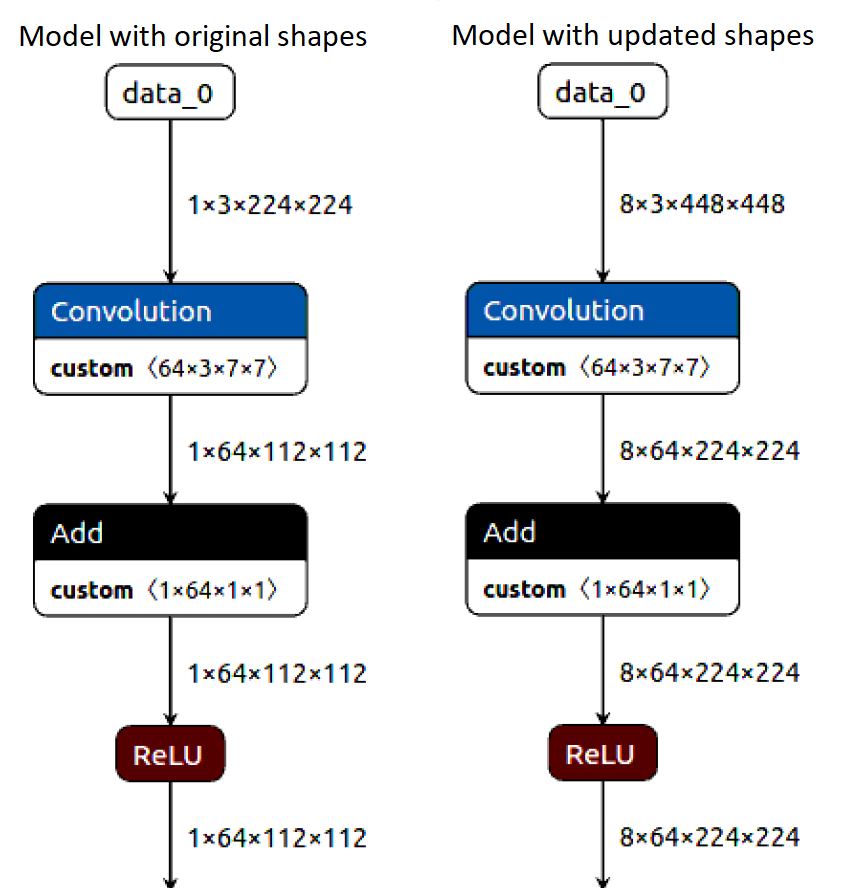
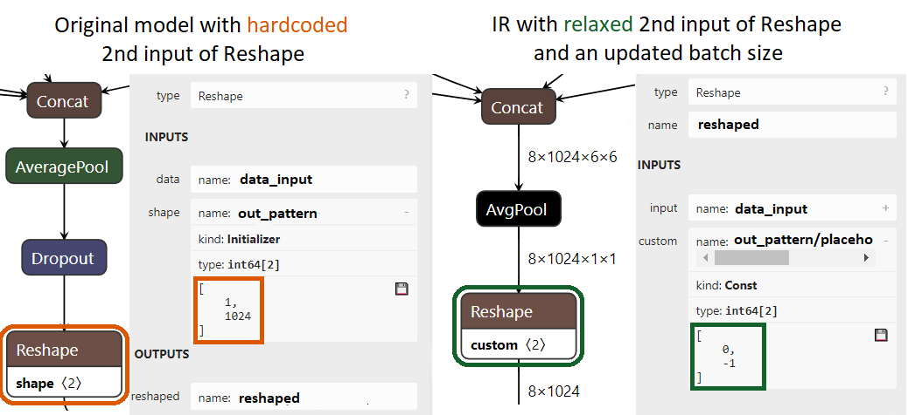

.. index:: pair: page; Changing Input Shapes
.. _deploy_infer__shape_inference:

.. meta::
   :description: OpenVINO™ ensures a capability to change model input shape during 
                 the runtime when provided input has a different size than model 
                 input shape.
   :keywords: OpenVINO™, input shape, shape inference, changing input shape, reshape 
              method, model shape, changing shape of a model, batch size, set_batch, 
              set_batch method, non-reshape-able model, extensibility, inference, 
              model inference, Reshape operation, MatMul operation, static model, 
              dynamic model, static shape, dynamic shape

Changing Input Shapes
=====================

:target:`deploy_infer__shape_inference_1md_openvino_docs_ov_runtime_ug_shapeinference`

.. raw:: html

    <div id="switcher-cpp" class="switcher-anchor">C++</div>

OpenVINO™ provides capabilities to change model input shape during the runtime. It may be useful when you want to feed model an input that has different size than model input shape. If you need to do this only once, prepare a model with updated shapes via Model Optimizer. See :ref:`Specifying --input_shape Command-line Parameter <doxid-openvino_docs__m_o__d_g_prepare_model_convert_model__converting__model_1when_to_specify_input_shapes>` for more information. For all the other cases, follow the instructions below.

Setting a New Input Shape with Reshape Method
---------------------------------------------

The ``:ref:`ov::Model::reshape <doxid-classov_1_1_model_1aa21aff80598d5089d591888a4c7f33ae>``` method updates input shapes and propagates them down to the outputs of the model through all intermediate layers. For example, changing the batch size and spatial dimensions of input of a model with an image input:



Consider the code below to achieve that:

.. ref-code-block:: cpp

	:ref:`model <doxid-group__ov__runtime__cpp__prop__api_1ga461856fdfb6d7533dc53355aec9e9fad>`->reshape({8, 3, 448, 448});

Setting a New Batch Size with set_batch Method
----------------------------------------------

The meaning of the model batch may vary depending on the model design. In order to change the batch dimension of the model, :ref:`set the ov::Layout <deploy_infer__preprocessing_overview_1declare_model_s_layout>` and call the ``:ref:`ov::set_batch <doxid-namespaceov_1a3314e2ff91fcc9ffec05b1a77c37862b>``` method.

.. ref-code-block:: cpp

	// Mark up batch in the layout of the input(s) and reset batch to the new value
	:ref:`model <doxid-group__ov__runtime__cpp__prop__api_1ga461856fdfb6d7533dc53355aec9e9fad>`->get_parameters()[0]->set_layout("N...");
	:ref:`ov::set_batch <doxid-namespaceov_1a3314e2ff91fcc9ffec05b1a77c37862b>`(:ref:`model <doxid-group__ov__runtime__cpp__prop__api_1ga461856fdfb6d7533dc53355aec9e9fad>`, new_batch);

The ``:ref:`ov::set_batch <doxid-namespaceov_1a3314e2ff91fcc9ffec05b1a77c37862b>``` method is a high level API of the ``:ref:`ov::Model::reshape <doxid-classov_1_1_model_1aa21aff80598d5089d591888a4c7f33ae>``` functionality, so all information about the ``:ref:`ov::Model::reshape <doxid-classov_1_1_model_1aa21aff80598d5089d591888a4c7f33ae>``` method implications are applicable for ``:ref:`ov::set_batch <doxid-namespaceov_1a3314e2ff91fcc9ffec05b1a77c37862b>``` too, including the troubleshooting section.

Once the input shape of ``:ref:`ov::Model <doxid-classov_1_1_model>``` is set, call the ``:ref:`ov::Core::compile_model <doxid-classov_1_1_core_1a46555f0803e8c29524626be08e7f5c5a>``` method to get an ``:ref:`ov::CompiledModel <doxid-classov_1_1_compiled_model>``` object for inference with updated shapes.

There are other approaches to change model input shapes during the stage of :ref:`IR generation <doxid-openvino_docs__m_o__d_g_prepare_model_convert_model__converting__model_1when_to_specify_input_shapes>` or :ref:`ov::Model creation <deploy_infer__model_representation>`.

Dynamic Shape Notice
--------------------

Shape-changing functionality could be used to turn dynamic model input into a static one and vice versa. It is recommended to always set static shapes when the shape of data is not going to change from one inference to another. Setting static shapes can avoid possible functional limitations, memory, and runtime overheads for dynamic shapes which may vary depending on hardware plugin and model used. To learn more about dynamic shapes in OpenVINO, see the :ref:`Dynamic Shapes <deploy_infer__dynamic_shapes>` page.

.. _usage_of_reshape_method:

Usage of the Reshape Method
---------------------------

The primary method of the feature is ``:ref:`ov::Model::reshape <doxid-classov_1_1_model_1aa21aff80598d5089d591888a4c7f33ae>```. It is overloaded to better serve two main use cases:

1) To change the input shape of the model with a single input, you may pass a new shape to the method. See the example of adjusting spatial dimensions to the input image below:

.. ref-code-block:: cpp

	// Read an image and adjust models single input for image to fit
	cv::Mat image = cv::imread("path/to/image");
	:ref:`model <doxid-group__ov__runtime__cpp__prop__api_1ga461856fdfb6d7533dc53355aec9e9fad>`->reshape({1, 3, image.rows, image.cols});

To do the opposite - resize input image to the input shapes of the model, use the :ref:`pre-processing API <deploy_infer__preprocessing_overview>`.

2) Otherwise, you can express reshape plan via mapping of input and its new shape:

* ``map<:ref:`ov::Output <doxid-classov_1_1_output>`<:ref:`ov::Node <doxid-classov_1_1_node>`>, :ref:`ov::PartialShape <doxid-classov_1_1_partial_shape>``` specifies input by passing actual input port

* ``map<size_t, :ref:`ov::PartialShape <doxid-classov_1_1_partial_shape>`>`` specifies input by its index

* ``map<string, :ref:`ov::PartialShape <doxid-classov_1_1_partial_shape>`>`` specifies input by its name

.. tab:: Port

    .. doxygensnippet:: ../../snippets/ShapeInference.cpp
       :language: cpp
       :fragment: [obj_to_shape]

.. tab:: Index

    .. doxygensnippet:: ../../snippets/ShapeInference.cpp
       :language: cpp
       :fragment: [idx_to_shape]

.. tab:: Tensor Name

    .. doxygensnippet:: ../../snippets/ShapeInference.cpp
       :language: cpp
       :fragment: [name_to_shape]

The usage scenarios of the ``reshape`` feature can be found in :ref:`OpenVINO Samples <get_started__samples_overview>`, starting with the :ref:`Hello Reshape Sample <doxid-openvino_inference_engine_samples_hello_reshape_ssd__r_e_a_d_m_e>`.

In practice, some models are not ready to be reshaped. In such cases, a new input shape cannot be set with Model Optimizer or the ``:ref:`ov::Model::reshape <doxid-classov_1_1_model_1aa21aff80598d5089d591888a4c7f33ae>``` method.

:target:`deploy_infer__shape_inference_1troubleshooting_reshape_errors`

Troubleshooting Reshape Errors
------------------------------

Operation semantics may impose restrictions on input shapes of the operation. Shape collision during shape propagation may be a sign that a new shape does not satisfy the restrictions. Changing the model input shape may result in intermediate operations shape collision.

Examples of such operations:

* The :ref:`Reshape <doxid-openvino_docs_ops_shape__reshape_1>` operation with a hard-coded output shape value.

* The :ref:`MatMul <doxid-openvino_docs_ops_matrix__mat_mul_1>` operation with the ``Const`` second input and this input cannot be resized by spatial dimensions due to operation semantics.

Model structure and logic should not change significantly after model reshaping.

* The Global Pooling operation is commonly used to reduce output feature map of classification models output. Having the input of the shape [N, C, H, W], Global Pooling returns the output of the shape [N, C, 1, 1]. Model architects usually express Global Pooling with the help of the ``Pooling`` operation with the fixed kernel size [H, W]. During spatial reshape, having the input of the shape [N, C, H1, W1], Pooling with the fixed kernel size [H, W] returns the output of the shape [N, C, H2, W2], where H2 and W2 are commonly not equal to ``1``. It breaks the classification model structure. For example, the publicly available `Inception family models from TensorFlow <https://github.com/tensorflow/models/tree/master/research/slim#pre-trained-models>`__ have this issue.

* Changing the model input shape may significantly affect its accuracy. For example, Object Detection models from TensorFlow have resizing restrictions by design. To keep the model valid after the reshape, choose a new input shape that satisfies conditions listed in the ``pipeline.config`` file. For details, refer to the :ref:`Tensorflow Object Detection API models resizing techniques <doxid-openvino_docs__m_o__d_g_prepare_model_convert_model_tf_specific__convert__object__detection__a_p_i__models_1custom-input-shape>`.

:target:`deploy_infer__shape_inference_1how-to-fix-non-reshape-able-model`

How To Fix Non-Reshape-able Model
---------------------------------

Some operators which prevent normal shape propagation can be fixed. To do so you can:

* see if the issue can be fixed via changing the values of some operators' input. For example, the most common problem of non-reshape-able models is a ``Reshape`` operator with hard-coded output shape. You can cut-off hard-coded 2nd input of ``Reshape`` and fill it in with relaxed values. For the following example on the picture, the Model Optimizer CLI should be:
  
  .. ref-code-block:: cpp
  
  	mo --input_model path/to/model --input data[8,3,224,224],1:reshaped[2]->[0 -1]`
  
  With ``1:reshaped[2]``, it's requested to cut the 2nd input (counting from zero, so ``1:`` means the 2nd input) of the operation named ``reshaped`` and replace it with a ``Parameter`` with shape ``[2]``. With ``->[0 -1]``, this new ``Parameter`` is replaced by a ``Constant`` operator which has the ``[0, -1]`` value. Since the ``Reshape`` operator has ``0`` and ``-1`` as specific values (see the meaning in :ref:`this specification <doxid-openvino_docs_ops_shape__reshape_1>`), it allows propagating shapes freely without losing the intended meaning of ``Reshape``.



* transform the model during Model Optimizer conversion on the back phase. For more information, see the :ref:`Model Optimizer extension <extensibility__model_optimizer>`.

* transform OpenVINO Model during the runtime. For more information, see :ref:`OpenVINO Runtime Transformations <extensibility_transformations__overview>`.

* modify the original model with the help of the original framework.

Extensibility
-------------

OpenVINO provides a special mechanism that allows adding support of shape inference for custom operations. This mechanism is described in the :ref:`Extensibility documentation <extensibility__api_introduction>`

Introduction (Python)
~~~~~~~~~~~~~~~~~~~~~

.. raw:: html

    <div id="switcher-python" class="switcher-anchor">Python</div>

OpenVINO™ provides capabilities to change model input shape during the runtime. It may be useful when you want to feed model an input that has different size than model input shape. If you need to do this only once, prepare a model with updated shapes via Model Optimizer. See :ref:`specifying input shapes <doxid-openvino_docs__m_o__d_g_prepare_model_convert_model__converting__model_1when_to_specify_input_shapes>` for more information. For all the other cases, follow the instructions below.

Setting a New Input Shape with Reshape Method
---------------------------------------------

The `Model.reshape <api/ie_python_api/_autosummary/openvino.runtime.Model.html#openvino.runtime.Model.reshape>`__ method updates input shapes and propagates them down to the outputs of the model through all intermediate layers. Example: Changing the batch size and spatial dimensions of input of a model with an image input:


Consider the code below to achieve that:

.. doxygensnippet:: ../../snippets/ShapeInference.py
   :language: python
   :fragment: [picture_snippet]

Setting a New Batch Size with the set_batch Method
--------------------------------------------------

The meaning of the model batch may vary depending on the model design. In order to change the batch dimension of the model, :ref:`set the layout <deploy_infer__preprocessing_overview_1declare_model_s_layout>` for inputs and call the `set_batch <api/ie_python_api/_autosummary/openvino.runtime.set_batch.html>`__ method.

.. doxygensnippet:: ../../snippets/ShapeInference.py
   :language: python
   :fragment: [set_batch]

`set_batch <api/ie_python_api/_autosummary/openvino.runtime.set_batch.html>`__ method is a high level API of `Model.reshape <api/ie_python_api/_autosummary/openvino.runtime.Model.html#openvino.runtime.Model.reshape>`__ functionality, so all information about `Model.reshape <api/ie_python_api/_autosummary/openvino.runtime.Model.html#openvino.runtime.Model.reshape>`__ method implications are applicable for `set_batch <api/ie_python_api/_autosummary/openvino.runtime.set_batch.html>`__ too, including the troubleshooting section.

Once the input shape of `Model <api/ie_python_api/_autosummary/openvino.runtime.Model.html>`__ is set, call the `compile_model <api/ie_python_api/_autosummary/openvino.runtime.compile_model.html>`__ method to get a `CompiledModel <api/ie_python_api/_autosummary/openvino.runtime.CompiledModel.html>`__ object for inference with updated shapes.

There are other approaches to change model input shapes during the stage of :ref:`IR generation <doxid-openvino_docs__m_o__d_g_prepare_model_convert_model__converting__model_1when_to_specify_input_shapes>` or :ref:`Model creation <deploy_infer__model_representation>`.

Dynamic Shape Notice
--------------------

Shape-changing functionality could be used to turn dynamic model input into a static one and vice versa. It is recommended to always set static shapes when the shape of data is not going to change from one inference to another. Setting static shapes can avoid possible functional limitations, memory, and runtime overheads for dynamic shapes which may vary depending on hardware plugin and used model. To learn more about dynamic shapes in OpenVINO, see the :ref:`Dynamic Shapes <deploy_infer__dynamic_shapes>` article.

.. _usage_of_reshape_method:

Usage of the Reshape Method
---------------------------

The primary method of the feature is `Model.reshape <api/ie_python_api/_autosummary/openvino.runtime.Model.html#openvino.runtime.Model.reshape>`__. It is overloaded to better serve two main use cases:

1) To change the input shape of a model with a single input, you may pass a new shape to the method. See the example of adjusting spatial dimensions to the input image:

.. doxygensnippet:: ../../snippets/ShapeInference.py
   :language: python
   :fragment: [simple_spatials_change]

To do the opposite - resize input image to the input shapes of the model, use the :ref:`pre-processing API <deploy_infer__preprocessing_overview>`.

2) Otherwise, you can express reshape plan via dictionary mapping input and its new shape: Dictionary keys could be:

* The ``str`` key specifies input by its name.

* The ``int`` key specifies input by its index.

* The ``openvino.runtime.Output`` key specifies input by passing the actual input object.

Dictionary values (representing new shapes) could be:

* ``list``

* ``tuple``

* ``PartialShape``

.. tab:: Port

    .. doxygensnippet:: ../../snippets/ShapeInference.py
       :language: python
       :fragment: [obj_to_shape]

.. tab:: Index

    .. doxygensnippet:: ../../snippets/ShapeInference.py
       :language: python
       :fragment: [idx_to_shape]

.. tab:: Tensor Name

    .. doxygensnippet:: ../../snippets/ShapeInference.py
       :language: python
       :fragment: [name_to_shape]

The usage scenarios of the ``reshape`` feature can be found in :ref:`OpenVINO Samples <get_started__samples_overview>`, starting with the :ref:`Hello Reshape Sample <doxid-openvino_inference_engine_ie_bridges_python_sample_hello_reshape_ssd__r_e_a_d_m_e>`.

In practice, some models are not ready to be reshaped. In such cases, a new input shape cannot be set with Model Optimizer or the ``Model.reshape`` method.

Troubleshooting Reshape Errors
------------------------------

Operation semantics may impose restrictions on input shapes of the operation. Shape collision during shape propagation may be a sign that a new shape does not satisfy the restrictions. Changing the model input shape may result in intermediate operations shape collision.

Examples of such operations:

* :ref:`Reshape <doxid-openvino_docs_ops_shape__reshape_1>` operation with a hard-coded output shape value

* :ref:`MatMul <doxid-openvino_docs_ops_matrix__mat_mul_1>` operation with the ``Const`` second input cannot be resized by spatial dimensions due to operation semantics

Model structure and logic should not change significantly after model reshaping.

* The Global Pooling operation is commonly used to reduce output feature map of classification models output. Having the input of the shape [N, C, H, W], Global Pooling returns the output of the shape [N, C, 1, 1]. Model architects usually express Global Pooling with the help of the ``Pooling`` operation with the fixed kernel size [H, W]. During spatial reshape, having the input of the shape [N, C, H1, W1], Pooling with the fixed kernel size [H, W] returns the output of the shape [N, C, H2, W2], where H2 and W2 are commonly not equal to ``1``. It breaks the classification model structure. For example, the publicly available `Inception family models from TensorFlow <https://github.com/tensorflow/models/tree/master/research/slim#pre-trained-models>`__ have this issue.

* Changing the model input shape may significantly affect its accuracy. For example, Object Detection models from TensorFlow have resizing restrictions by design. To keep the model valid after the reshape, choose a new input shape that satisfies conditions listed in the ``pipeline.config`` file. For details, refer to the :ref:`Tensorflow Object Detection API models resizing techniques <doxid-openvino_docs__m_o__d_g_prepare_model_convert_model_tf_specific__convert__object__detection__a_p_i__models_1custom-input-shape>`.

How To Fix Non-Reshape-able Model
---------------------------------

Some operators which prevent normal shape propagation can be fixed. To do so you can:

* see if the issue can be fixed via changing the values of some operators input. For example, the most common problem of non-reshape-able models is a ``Reshape`` operator with hard-coded output shape. You can cut-off hard-coded 2nd input of ``Reshape`` and fill it in with relaxed values. For the following example on the picture Model Optimizer CLI should be:
  
  .. ref-code-block:: cpp
  
  	mo --input_model path/to/model --input data[8,3,224,224],1:reshaped[2]->[0 -1]`
  
  With ``1:reshaped[2]``, it's requested to cut the 2nd input (counting from zero, so ``1:`` means the 2nd input) of the operation named ``reshaped`` and replace it with a ``Parameter`` with shape ``[2]``. With ``->[0 -1]``, this new ``Parameter`` is replaced by a ``Constant`` operator which has value ``[0, -1]``. Since the ``Reshape`` operator has ``0`` and ``-1`` as specific values (see the meaning in :ref:`this specification <doxid-openvino_docs_ops_shape__reshape_1>`), it allows propagating shapes freely without losing the intended meaning of ``Reshape``.


* transform the model during Model Optimizer conversion on the back phase. See :ref:`Model Optimizer extension <extensibility__model_optimizer>`.

* transform OpenVINO Model during the runtime. See :ref:`OpenVINO Runtime Transformations <extensibility_transformations__overview>`.

* modify the original model with the help of the original framework.

Extensibility
-------------

OpenVINO provides a special mechanism that allows adding support of shape inference for custom operations. This mechanism is described in the :ref:`Extensibility documentation <extensibility__api_introduction>`

