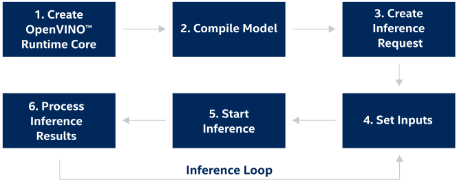

.. index:: pair: page; Integrate OpenVINO™ with Your Application
.. _openvino_integrate_application:

.. meta::
   :description: This article demonstrates the steps of implementing a typical 
                 inference pipeline of OpenVINO™ Runtime in an application.
   :keywords: OpenVINO™ Runtime, inference, inference pipeline, OpenVINO Runtime 
              Core, compiling a model, OpenVINO Intermediate Representation, 
              OpenVINO IR, ONNX, PaddlePaddle, OpenVINO IR model, IR model, ONNX 
              model, PaddlePaddle model, inference request, create inference request, 
              set inputs, start inference, tensor, tensor_name, build application with 
              OpenVINO Runtime, model inference, Async API, OpenVINO Runtime API


Integrate OpenVINO™ with Your Application
===========================================

:target:`openvino_integrate_application_1md_openvino_docs_ov_runtime_ug_integrate_with_your_application`

.. toctree::
   :maxdepth: 1
   :hidden:

   ./openvino-runtime-integrate-application/model-representation
   ./openvino-runtime-integrate-application/inference-request
   ./openvino-runtime-integrate-application/python-api-exclusives

Following these steps, you can implement a typical OpenVINO™ Runtime inference 
pipeline in your application. Before proceeding, make sure you have 
:ref:`installed OpenVINO Runtime <doxid-openvino_docs_install_guides_install_runtime>` 
and set environment variables (run ``<INSTALL_DIR>/setupvars.sh`` for Linux or 
``setupvars.bat`` for Windows, otherwise, the ``OpenVINO_DIR`` variable won't 
be configured properly to pass ``find_package`` calls).



Step 1. Create OpenVINO™ Runtime Core
~~~~~~~~~~~~~~~~~~~~~~~~~~~~~~~~~~~~~~~

Include next files to work with OpenVINO™ Runtime:

.. tab:: C++

   .. ref-code-block:: cpp
   
      #include <openvino/openvino.hpp>

.. tab:: Python

      .. ref-code-block:: cpp
      
         import openvino.runtime as ov

Use the following code to create OpenVINO™ Core to manage available devices and read model objects:

.. tab:: C++

   .. ref-code-block:: cpp
   
      :ref:`ov::Core <doxid-classov_1_1_core>` core;


.. tab:: Python

   .. ref-code-block:: cpp

      core = :ref:`ov.Core <doxid-classov_1_1_core>`()


Step 2. Compile the Model
~~~~~~~~~~~~~~~~~~~~~~~~~

``:ref:`ov::CompiledModel <doxid-classov_1_1_compiled_model>``` class represents 
a device specific compiled model. ``:ref:`ov::CompiledModel <doxid-classov_1_1_compiled_model>``` 
allows you to get information inputs or output ports by a tensor name or index. 
This approach is aligned with the majority of frameworks.

Compile the model for a specific device using 
``:ref:`ov::Core::compile_model() <doxid-classov_1_1_core_1a46555f0803e8c29524626be08e7f5c5a>``` :

.. tab:: C++

   .. tab:: IR

      .. ref-code-block:: cpp

         :ref:`ov::CompiledModel <doxid-classov_1_1_compiled_model>` compiled_model = core.:ref:`compile_model <doxid-classov_1_1_core_1a46555f0803e8c29524626be08e7f5c5a>`("model.xml", "AUTO");

   .. tab:: ONNX

      .. ref-code-block:: cpp

         :ref:`ov::CompiledModel <doxid-classov_1_1_compiled_model>` compiled_model = core.:ref:`compile_model <doxid-classov_1_1_core_1a46555f0803e8c29524626be08e7f5c5a>`("model.onnx", "AUTO");

   .. tab:: PaddlePaddle

      .. ref-code-block:: cpp

         :ref:`ov::CompiledModel <doxid-classov_1_1_compiled_model>` compiled_model = core.:ref:`compile_model <doxid-classov_1_1_core_1a46555f0803e8c29524626be08e7f5c5a>`("model.pdmodel", "AUTO");

   .. tab:: ov::Model

      .. ref-code-block:: cpp

         auto create_model = []() {
             std::shared_ptr<ov::Model> :ref:`model <doxid-group__ov__runtime__cpp__prop__api_1ga461856fdfb6d7533dc53355aec9e9fad>`;
             // To construct a model, please follow 
             // https://docs.openvino.ai/latest/openvino_docs_OV_UG_Model_Representation.html
             return :ref:`model <doxid-group__ov__runtime__cpp__prop__api_1ga461856fdfb6d7533dc53355aec9e9fad>`;
         };
         std::shared_ptr<ov::Model> :ref:`model <doxid-group__ov__runtime__cpp__prop__api_1ga461856fdfb6d7533dc53355aec9e9fad>` = create_model();
         compiled_model = core.:ref:`compile_model <doxid-classov_1_1_core_1a46555f0803e8c29524626be08e7f5c5a>`(:ref:`model <doxid-group__ov__runtime__cpp__prop__api_1ga461856fdfb6d7533dc53355aec9e9fad>`, "AUTO");

.. tab:: Python

   .. tab:: IR

      .. ref-code-block:: cpp

         compiled_model = core.compile_model("model.xml", "AUTO")

   .. tab:: ONNX

      .. ref-code-block:: cpp

         compiled_model = core.compile_model("model.onnx", "AUTO")

   .. tab:: PaddlePaddle

      .. ref-code-block:: cpp

         compiled_model = core.compile_model("model.pdmodel", "AUTO")

   .. tab:: ov::Model

      .. ref-code-block:: cpp

         def create_model():
             # This example shows how to create ov::Function
             #
             # To construct a model, please follow 
             # https://docs.openvino.ai/latest/openvino_docs_OV_UG_Model_Representation.html
             data = ov.opset8.parameter([3, 1, 2], ov.Type.f32)
             res = ov.opset8.result(data)
             return :ref:`ov.Model <doxid-classov_1_1_model>`([res], [data], "model")

         model = create_model()
         compiled_model = core.compile_model(model, "AUTO")


The ``:ref:`ov::Model <doxid-classov_1_1_model>``` object represents any models 
inside the OpenVINO™ Runtime. For more details please read article about 
:ref:`OpenVINO™ Model representation <openvino_model_representation>`.

The code above creates a compiled model associated with a single hardware 
device from the model object. It is possible to create as many compiled 
models as needed and use them simultaneously (up to the limitation of the 
hardware resources). To learn how to change the device configuration, read the 
:ref:`Query device properties <doxid-openvino_docs__o_v__u_g_query_api>` article.

Step 3. Create an Inference Request
~~~~~~~~~~~~~~~~~~~~~~~~~~~~~~~~~~~

``:ref:`ov::InferRequest <doxid-classov_1_1_infer_request>``` class provides methods for model inference in OpenVINO™ Runtime. Create an infer request using the following code (see :ref:`InferRequest detailed documentation <openvino_inference_request>` for more details):

.. tab:: C++

   .. ref-code-block:: cpp

      :ref:`ov::InferRequest <doxid-classov_1_1_infer_request>` infer_request = compiled_model.:ref:`create_infer_request <doxid-classov_1_1_compiled_model_1ae3633c0eb5173ed776446fba32b95953>`();

.. tab:: Python

   .. ref-code-block:: cpp

      infer_request = compiled_model.create_infer_request()

Step 4. Set Inputs
~~~~~~~~~~~~~~~~~~

You can use external memory to create ``:ref:`ov::Tensor <doxid-classov_1_1_tensor>``` 
and use the ``:ref:`ov::InferRequest::set_input_tensor <doxid-classov_1_1_infer_request_1a5ddca7af7faffa2c90fd600a3f84aa6e>``` 
method to put this tensor on the device:

.. tab:: C++

   .. ref-code-block:: cpp

      // Get input port for model with one input
      auto input_port = compiled_model.:ref:`input <doxid-classov_1_1_compiled_model_1a51691646bfe101f135c03e1e2ef30f4f>`();
      // Create tensor from external memory
      :ref:`ov::Tensor <doxid-classov_1_1_tensor>` input_tensor(input_port.get_element_type(), input_port.get_shape(), memory_ptr);
      // Set input tensor for model with one input
      infer_request.:ref:`set_input_tensor <doxid-classov_1_1_infer_request_1a5ddca7af7faffa2c90fd600a3f84aa6e>`(input_tensor);

.. tab:: Python

   .. ref-code-block:: cpp

      # Create tensor from external memory
      input_tensor = :ref:`ov.Tensor <doxid-classov_1_1_tensor>`(array=memory, shared_memory=True)
      # Set input tensor for model with one input
      infer_request.set_input_tensor(input_tensor)

Step 5. Start Inference
~~~~~~~~~~~~~~~~~~~~~~~

OpenVINO™ Runtime supports inference in either synchronous or asynchronous mode. 
Using the Async API can improve application's overall frame-rate: instead of 
waiting for inference to complete, the app can keep working on the host while 
the accelerator is busy. You can use 
``:ref:`ov::InferRequest::start_async <doxid-classov_1_1_infer_request_1a5a05ae4352f804c865e11f5d68b983d5>``` 
to start model inference in the asynchronous mode and call 
``:ref:`ov::InferRequest::wait <doxid-classov_1_1_infer_request_1ab0e0739da45789d816f8b5584a0b5691>``` 
to wait for the inference results:

.. tab:: C++

   .. ref-code-block:: cpp

      infer_request.:ref:`start_async <doxid-classov_1_1_infer_request_1a5a05ae4352f804c865e11f5d68b983d5>`();
      infer_request.:ref:`wait <doxid-classov_1_1_infer_request_1ab0e0739da45789d816f8b5584a0b5691>`();

.. tab:: Python

   .. ref-code-block:: cpp

      infer_request.start_async()
      infer_request.wait()

This section demonstrates a simple pipeline. To get more information about 
other ways to perform inference, read the "Run inference" section in dedicated 
:ref:`OpenVINO™ Inference Request <openvino_inference_request>` article.

Step 6. Process the Inference Results
~~~~~~~~~~~~~~~~~~~~~~~~~~~~~~~~~~~~~

Go over the output tensors and process the inference results.

.. tab:: C++

   .. ref-code-block:: cpp
   
      // Get output tensor by tensor name
      auto output = infer_request.:ref:`get_tensor <doxid-classov_1_1_infer_request_1a75b8da7c6b00686bede600dddceaffc4>`("tensor_name");
      const float \*output_buffer = output.:ref:`data <doxid-classov_1_1_tensor_1aaf6d1cd69a759b31c65fed8b3e7d66fb>`<const float>();
      // output_buffer[] - accessing output tensor data

.. tab:: Python

   .. ref-code-block:: cpp

      # Get output tensor for model with one output
      output = infer_request.get_output_tensor()
      output_buffer = output.data
      # output_buffer[] - accessing output tensor data


Step 7. Link and Build Your Application with OpenVINO™ Runtime (example)
~~~~~~~~~~~~~~~~~~~~~~~~~~~~~~~~~~~~~~~~~~~~~~~~~~~~~~~~~~~~~~~~~~~~~~~~~~

This step may differ for different projects. In this example, a C++ application 
is used, together with CMake for project configuration.

For details on additional CMake build options, refer to the 
`CMake page <https://cmake.org/cmake/help/latest/manual/cmake.1.html#manual:cmake(1)>`__.

Create a structure for the project:
-----------------------------------

.. ref-code-block:: cpp

   project/
       ├── CMakeLists.txt  - CMake file to build
       ├── ...             - Additional folders like includes/
       └── src/            - source folder
           └── main.cpp
   build/                  - build directory
       ...

Include OpenVINO™ Runtime libraries in
----------------------------------------

.. ref-code-block:: cpp

   cmake_minimum_required(VERSION 3.10)
   set(CMAKE_CXX_STANDARD 11)

   find_package(OpenVINO REQUIRED)

   add_executable(${TARGET_NAME} src/main.cpp)

   target_link_libraries(${TARGET_NAME} PRIVATE openvino::runtime)

To build your project using CMake with the default build tools currently 
available on your machine, execute the following commands:

.. ref-code-block:: cpp

   cd build/
   cmake ../project
   cmake --build .

Additional Resources
~~~~~~~~~~~~~~~~~~~~

* See the :ref:`OpenVINO Samples <doxid-openvino_docs__o_v__u_g__samples__overview>` 
  page or the `Open Model Zoo Demos <https://docs.openvino.ai/latest/omz_demos.html>`__ 
  page for specific examples of how OpenVINO pipelines are implemented for 
  applications like image classification, text prediction, and many others.

* :ref:`OpenVINO™ Runtime Preprocessing <doxid-openvino_docs__o_v__u_g__preprocessing__overview>`

* :ref:`Using Encrypted Models with OpenVINO <security_encrypted_models>`

* :ref:`OpenVINO Samples <doxid-openvino_docs__o_v__u_g__samples__overview>`

* `Open Model Zoo Demos <https://docs.openvino.ai/latest/omz_demos.html>`__
