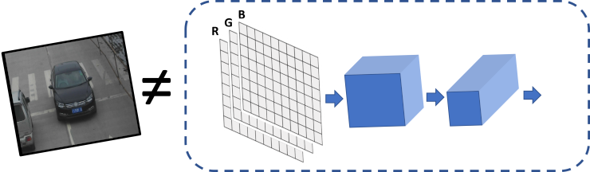

.. index:: pair: page; Optimize Preprocessing
.. _doxid-openvino_docs__o_v__u_g__preprocessing__overview:


Preprocessing
=============

:target:`doxid-openvino_docs__o_v__u_g__preprocessing__overview_1md_openvino_docs_ov_runtime_ug_preprocessing_overview`

.. toctree::
   :maxdepth: 1
   :hidden:

   ./preprocessing/preprocessing-api-details
   ./preprocessing/layout-api-overview
   ./preprocessing/preprocessing-use-case

Introduction
~~~~~~~~~~~~

When input data does not fit the model input tensor perfectly, additional operations/steps are needed to transform the data to the format expected by the model. These operations are known as "preprocessing".

Example
-------

Consider the following standard example: deep learning model expects input with the ``{1, 3, 224, 224}`` shape, ``FP32`` precision, ``RGB`` color channels order, and it requires data normalization (subtract mean and divide by scale factor). However, there is just a ``640x480`` ``BGR`` image (data is ``{480, 640, 3}``). This means that the following operations must be performed:

* Convert ``U8`` buffer to ``FP32``.

* Transform to ``planar`` format: from ``{1, 480, 640, 3}`` to ``{1, 3, 480, 640}``.

* Resize image from 640x480 to 224x224.

* Make ``BGR->RGB`` conversion as model expects ``RGB``.

* For each pixel, subtract mean values and divide by scale factor.



Even though it is relatively easy to implement all these steps in the application code manually, before actual inference, it is also possible with the use of Preprocessing API. Advantages of using the API are:

* Preprocessing API is easy to use.

* Preprocessing steps will be integrated into execution graph and will be performed on selected device (CPU/GPU/VPU/etc.) rather than always being executed on CPU. This will improve selected device utilization which is always good.

Preprocessing API
~~~~~~~~~~~~~~~~~

Intuitively, preprocessing API consists of the following parts:

#. **Tensor** - declares user data format, like shape, :ref:`layout <doxid-openvino_docs__o_v__u_g__layout__overview>`, precision, color format from actual user's data.

#. **Steps** - describes sequence of preprocessing steps which need to be applied to user data.

#. **Model** - specifies model data format. Usually, precision and shape are already known for model, only additional information, like :ref:`layout <doxid-openvino_docs__o_v__u_g__layout__overview>` can be specified.

.. note::

   Graph modifications of a model shall be performed after the model is read 
	from a drive and **before** it is loaded on the actual device.


PrePostProcessor Object
-----------------------

The ``:ref:`ov::preprocess::PrePostProcessor <doxid-classov_1_1preprocess_1_1_pre_post_processor>``` class allows specifying preprocessing and postprocessing steps for a model read from disk.

.. raw:: html

   <div class='sphinxtabset'>


.. raw:: html

   <div class="sphinxtab" data-sphinxtab-value="C++">


.. ref-code-block:: cpp

	:ref:`ov::Core <doxid-classov_1_1_core>` core;
	std::shared_ptr<ov::Model> :ref:`model <doxid-group__ov__runtime__cpp__prop__api_1ga461856fdfb6d7533dc53355aec9e9fad>` = core.:ref:`read_model <doxid-classov_1_1_core_1ae0576a95f841c3a6f5e46e4802716981>`(model_path);
	:ref:`ov::preprocess::PrePostProcessor <doxid-classov_1_1preprocess_1_1_pre_post_processor>` ppp(:ref:`model <doxid-group__ov__runtime__cpp__prop__api_1ga461856fdfb6d7533dc53355aec9e9fad>`);

.. raw:: html

   </div>


.. raw:: html

   <div class="sphinxtab" data-sphinxtab-value="Python">


.. ref-code-block:: cpp

	from openvino.preprocess import PrePostProcessor
	from openvino.runtime import Core
	
	core = Core()
	model = core.read_model(model=xml_path)
	ppp = PrePostProcessor(model)

.. raw:: html

   </div>


.. raw:: html

   </div>


Declare User's Data Format
--------------------------

To address particular input of a model/preprocessor, use the ``ov::preprocess::PrePostProcessor::input(input_name)`` method.

.. raw:: html

   <div class='sphinxtabset'>


.. raw:: html

   <div class="sphinxtab" data-sphinxtab-value="C++">


.. ref-code-block:: cpp

	:ref:`ov::preprocess::InputInfo <doxid-classov_1_1preprocess_1_1_input_info>`& input = ppp.input(input_name);
	input.:ref:`tensor <doxid-classov_1_1preprocess_1_1_input_info_1a7385ef9e3f1c61a87ddee256684638ae>`()
	  .:ref:`set_element_type <doxid-classov_1_1preprocess_1_1_input_tensor_info_1a98fb73ff9178c8c71d809ddf8927faf5>`(:ref:`ov::element::u8 <doxid-group__ov__element__cpp__api_1gaaf60c536d3e295285f6a899eb3d29e2f>`)
	  .:ref:`set_shape <doxid-classov_1_1preprocess_1_1_input_tensor_info_1a106765c426451acafc46379ab2f5ebc0>`({1, 480, 640, 3})
	  .:ref:`set_layout <doxid-group__ov__layout__cpp__api_1ga18464fb8ed029acb5fdc2bb1737358d9>`("NHWC")
	  .set_color_format(:ref:`ov::preprocess::ColorFormat::BGR <doxid-namespaceov_1_1preprocess_1ab027f26e58038e454e1b50a5243f1707a2ad5640ebdec72fc79531d1778c6c2dc>`);

.. raw:: html

   </div>


.. raw:: html

   <div class="sphinxtab" data-sphinxtab-value="Python">


.. ref-code-block:: cpp

	from openvino.preprocess import ColorFormat
	from openvino.runtime import Layout, Type
	ppp.input(input_name).tensor() \
	        .set_element_type(Type.u8) \
	        .set_shape([1, 480, 640, 3]) \
	        .:ref:`set_layout <doxid-group__ov__layout__cpp__api_1ga18464fb8ed029acb5fdc2bb1737358d9>`(:ref:`Layout <doxid-namespace_inference_engine_1a246d143abc5ca07da8d2cadeeb88fdb8>`('NHWC')) \
	        .set_color_format(ColorFormat.BGR)

.. raw:: html

   </div>


.. raw:: html

   </div>


Below is all the specified input information:

* Precision is ``U8`` (unsigned 8-bit integer).

* Data represents tensor with the ``{1,480,640,3}`` shape.

* :ref:`Layout <doxid-openvino_docs__o_v__u_g__layout__overview>` is "NHWC". It means: ``height=480``, ``width=640``, ``channels=3`` '.

* Color format is ``BGR``.

:target:`doxid-openvino_docs__o_v__u_g__preprocessing__overview_1declare_model_s_layout`

Declaring Model Layout
----------------------

Model input already has information about precision and shape. Preprocessing API is not intended to modify this. The only thing that may be specified is input data :ref:`layout <doxid-openvino_docs__o_v__u_g__layout__overview>`

.. raw:: html

   <div class='sphinxtabset'>


.. raw:: html

   <div class="sphinxtab" data-sphinxtab-value="C++">


.. ref-code-block:: cpp

	// `model's input` already `knows` it's shape and data type, no need to specify them here
	input.:ref:`model <doxid-classov_1_1preprocess_1_1_input_info_1a7a1ddc0dea4daa83998995e491adf667>`().:ref:`set_layout <doxid-classov_1_1preprocess_1_1_input_model_info_1af309bac02af20d048e349a2d421c1169>`("NCHW");

.. raw:: html

   </div>


.. raw:: html

   <div class="sphinxtab" data-sphinxtab-value="Python">


.. ref-code-block:: cpp

	# `model's input` already `knows` it's shape and data type, no need to specify them here
	ppp.input(input_name).:ref:`model <doxid-group__ov__runtime__cpp__prop__api_1ga461856fdfb6d7533dc53355aec9e9fad>`().:ref:`set_layout <doxid-group__ov__layout__cpp__api_1ga18464fb8ed029acb5fdc2bb1737358d9>`(:ref:`Layout <doxid-namespace_inference_engine_1a246d143abc5ca07da8d2cadeeb88fdb8>`('NCHW'))

.. raw:: html

   </div>


.. raw:: html

   </div>

Now, if the model input has ``{1,3,224,224}`` shape, preprocessing will be able to identify the ``height=224``, ``width=224``, and ``channels=3`` of that model. The ``height`` / ``width`` information is necessary for ``resize``, and ``channels`` is needed for mean/scale normalization.

Preprocessing Steps
-------------------

Now, the sequence of preprocessing steps can be defined:

.. raw:: html

   <div class='sphinxtabset'>


.. raw:: html

   <div class="sphinxtab" data-sphinxtab-value="C++">


.. ref-code-block:: cpp

	input.:ref:`preprocess <doxid-classov_1_1preprocess_1_1_input_info_1afaeba871501b27522b96f39a3d91f35e>`()
	  .:ref:`convert_element_type <doxid-classov_1_1preprocess_1_1_pre_process_steps_1aac6316155a1690609eb320637c193d50>`(:ref:`ov::element::f32 <doxid-group__ov__element__cpp__api_1gadc8a5dda3244028a5c0b024897215d43>`)
	  .:ref:`convert_color <doxid-classov_1_1preprocess_1_1_pre_process_steps_1a4f062246cc0082822346c97917903983>`(:ref:`ov::preprocess::ColorFormat::RGB <doxid-namespaceov_1_1preprocess_1ab027f26e58038e454e1b50a5243f1707a889574aebacda6bfd3e534e2b49b8028>`)
	  .:ref:`resize <doxid-classov_1_1preprocess_1_1_pre_process_steps_1a40dab78be1222fee505ed6a13400efe6>`(:ref:`ov::preprocess::ResizeAlgorithm::RESIZE_LINEAR <doxid-namespaceov_1_1preprocess_1a8665e295e222dc2120be3550e04db8f3a8803101bcf6d2ec700e6e7358217db68>`)
	  .:ref:`mean <doxid-classov_1_1preprocess_1_1_pre_process_steps_1aef1bb8c1fc5eb0014b07b78749c432dc>`({100.5, 101, 101.5})
	  .scale({50., 51., 52.});
	  // Not needed, such conversion will be added implicitly
	  // .convert_layout("NCHW");

.. raw:: html

   </div>


.. raw:: html

   <div class="sphinxtab" data-sphinxtab-value="Python">


.. ref-code-block:: cpp

	from openvino.preprocess import ResizeAlgorithm
	ppp.input(input_name).preprocess() \
	    .convert_element_type(Type.f32) \
	    .convert_color(ColorFormat.RGB) \
	    .resize(ResizeAlgorithm.RESIZE_LINEAR) \
	    .:ref:`mean <doxid-namespacengraph_1_1builder_1_1opset1_1a06c7367d66f6e48931cbdf49c696d8c9>`([100.5, 101, 101.5]) \
	    .scale([50., 51., 52.])
	# .convert_layout(Layout('NCHW')); # Not needed, such conversion will be added implicitly

.. raw:: html

   </div>


.. raw:: html

   </div>


Perform the following:

#. Convert ``U8`` to ``FP32`` precision.

#. Convert current color format from ``BGR`` to ``RGB``.

#. Resize to ``height`` / ``width`` of a model. Be aware that if a model accepts dynamic size e.g., ``{?, 3, ?, ?}``, ``resize`` will not know how to resize the picture. Therefore, in this case, target ``height`` / ``width`` should be specified. For more details, see also the ``:ref:`ov::preprocess::PreProcessSteps::resize() <doxid-classov_1_1preprocess_1_1_pre_process_steps_1a40dab78be1222fee505ed6a13400efe6>```.

#. Subtract mean from each channel. In this step, color format is already ``RGB``, so ``100.5`` will be subtracted from each ``Red`` component, and ``101.5`` will be subtracted from each ``Blue`` one.

#. Divide each pixel data to appropriate scale value. In this example, each ``Red`` component will be divided by 50, ``Green`` by 51, and ``Blue`` by 52 respectively.

#. Keep in mind that the last ``convert_layout`` step is commented out as it is not necessary to specify the last layout conversion. The ``PrePostProcessor`` will do such conversion automatically.

Integrating Steps into a Model
------------------------------

Once the preprocessing steps have been finished the model can be finally built. It is possible to display ``PrePostProcessor`` configuration for debugging purposes:

.. raw:: html

   <div class='sphinxtabset'>


.. raw:: html

   <div class="sphinxtab" data-sphinxtab-value="C++">


.. ref-code-block:: cpp

	std::cout << "Dump preprocessor: " << ppp << std::endl;
	:ref:`model <doxid-group__ov__runtime__cpp__prop__api_1ga461856fdfb6d7533dc53355aec9e9fad>` = ppp.build();

.. raw:: html

   </div>


.. raw:: html

   <div class="sphinxtab" data-sphinxtab-value="Python">


.. ref-code-block:: cpp

	print(f'Dump preprocessor: {ppp}')
	model = ppp.build()

.. raw:: html

   </div>


.. raw:: html

   </div>

The ``model`` will accept ``U8`` input with the shape of ``{1, 480, 640, 3}`` and the ``BGR`` channel order. All conversion steps will be integrated into the execution graph. Now, model can be loaded on the device and the image can be passed to the model without any data manipulation in the application.

Additional Resources
~~~~~~~~~~~~~~~~~~~~

* :ref:`Preprocessing Details <doxid-openvino_docs__o_v__u_g__preprocessing__details>`

* :ref:`Layout API overview <doxid-openvino_docs__o_v__u_g__layout__overview>`

* ``:ref:`ov::preprocess::PrePostProcessor <doxid-classov_1_1preprocess_1_1_pre_post_processor>``` C++ class documentation

