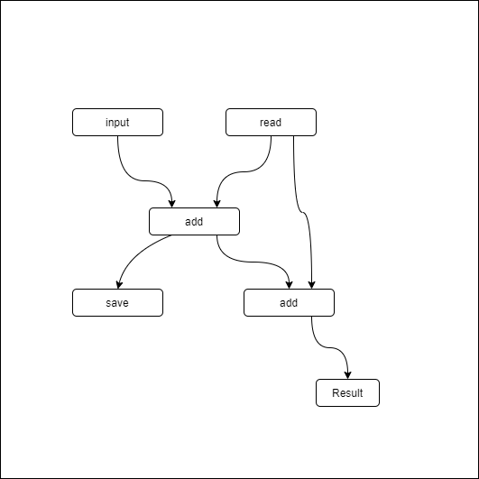
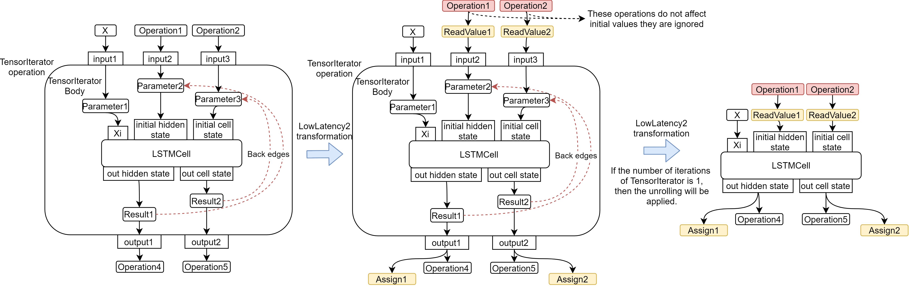
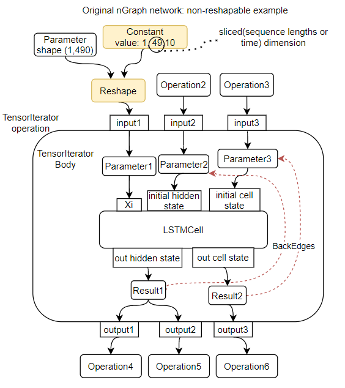
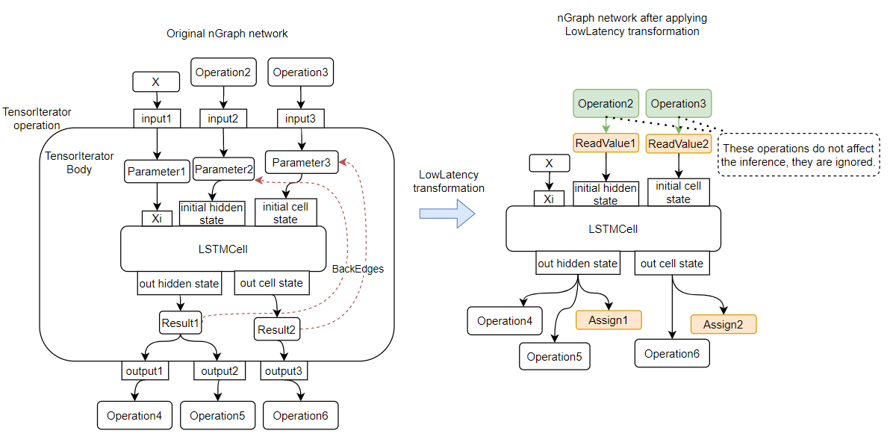

.. index:: pair: page; Stateful models
.. _deploy_infer__stateful_models:

.. meta::
   :description: OpenVINO Runtime includes a special API to work with stateful 
                 networks, where a state can be automatically read, set, saved 
                 or reset between inferences.
   :keywords: OpenVINO Runtime, stateful network, stateful model, data sequence, 
              network state, Keras, stateful, save state, inference, model 
              inference, Assign operation, ReadValue operation, convert model, 
              Model Optimizer, OpenVINO Intermediate Representation, OpenVINO IR, 
              OpenVINO State API, QueryState, inference request, IVariableState, 
              IVariableState interface, SetState, LowLatency2, LowLatency2 
              transformation, TensorIterator operation, Loop operation, State API, 
              Reshape method, reshape model, non-reshapable layer, ModelOptimizer CLI 

Stateful models
===============

:target:`deploy_infer__stateful_models_1md_openvino_docs_ov_runtime_ug_network_state_intro` 

This article describes how to work with stateful networks in OpenVINO™ toolkit. 
More specifically, it illustrates how stateful networks are represented in IR 
and nGraph and how operations with a state can be done. The article 
additionally provides some examples of stateful networks and code to infer them.

What is a Stateful Network?
~~~~~~~~~~~~~~~~~~~~~~~~~~~

Several use cases require processing of data sequences. When length of a 
sequence is known and small enough, it can be processed with RNN like networks 
that contain a cycle inside. However, in some cases, like online speech 
recognition of time series forecasting, length of data sequence is unknown. 
Then, data can be divided in small portions and processed step-by-step. The 
dependency between data portions should be addressed. For that, networks save 
some data between inferences - a state. When one dependent sequence is over, a 
state should be reset to initial value and a new sequence can be started.

Several frameworks have special APIs for states in networks. For example, Keras 
has special option for RNNs, i.e. ``stateful`` that turns on saving a state 
between inferences. Kaldi contains special ``Offset`` specifier to define time 
offset in a network.

OpenVINO also contains a special API to simplify work with networks with 
states. A state is automatically saved between inferences, and there is a way 
to reset a state when needed. A state can also be read or set to some new value 
between inferences.

OpenVINO State Representation
~~~~~~~~~~~~~~~~~~~~~~~~~~~~~

OpenVINO contains the ``Variable``, a special abstraction to represent a state 
in a network. There are two operations to work with a state:

* ``Assign`` - to save a value in a state.

* ``ReadValue`` - to read a value saved on previous iteration.

For more details on these operations, refer to the 
:ref:`ReadValue specification <doxid-openvino_docs_ops_infrastructure__read_value_3>` 
and :ref:`Assign specification <doxid-openvino_docs_ops_infrastructure__assign_3>` 
articles.

Examples of Networks with States
~~~~~~~~~~~~~~~~~~~~~~~~~~~~~~~~

To get a model with states ready for inference, convert a model from another 
framework to IR with Model Optimizer or create an nGraph function. (For more 
information, refer to the :ref:`Build OpenVINO Model section <deploy_infer__model_representation>`). 
Below is the graph in both forms:



Example of IR with State
------------------------

The ``bin`` file for this graph should contain ``float 0`` in binary form. The 
content of the ``xml`` file is as follows.

.. ref-code-block:: cpp

   <?xml version="1.0" ?>
   <net name="summator" version="10">
       <layers>
           <layer id="0" name="init_value" type="Const" version="opset6">
               <data element_type="f32" offset="0" shape="1,1" size="4"/>
               <output>
                   <port id="1" precision="FP32">
                       <dim>1</dim>
                       <dim>1</dim>
                   </port>
               </output>
           </layer>
           <layer id="1" name="read" type="ReadValue" version="opset6">
               <data variable_id="id"/>
               <input>
                   <port id="0">
                       <dim>1</dim>
                       <dim>1</dim>
                   </port>
               </input>
               <output>
                   <port id="1" precision="FP32">
                       <dim>1</dim>
                       <dim>1</dim>
                   </port>
               </output>
           </layer>
           <layer id="2" name="input" type="Parameter" version="opset6">
               <data element_type="f32" shape="1,1"/>
               <output>
                   <port id="0" precision="FP32">
                       <dim>1</dim>
                       <dim>1</dim>
                   </port>
               </output>
           </layer>
           <layer id="3" name="add_sum" type="Add" version="opset6">
               <input>
                   <port id="0">
                       <dim>1</dim>
                       <dim>1</dim>
                   </port>
                   <port id="1">
                       <dim>1</dim>
                       <dim>1</dim>
                   </port>
               </input>
               <output>
                   <port id="2" precision="FP32">
                       <dim>1</dim>
                       <dim>1</dim>
                   </port>
               </output>
           </layer>
           <layer id="4" name="save" type="Assign" version="opset6">
               <data variable_id="id"/>
               <input>
                   <port id="0">
                       <dim>1</dim>
                       <dim>1</dim>
                   </port>
               </input>
           </layer>
           <layer id="10" name="add" type="Add" version="opset6">
               <data axis="1"/>
               <input>
                   <port id="0">
                       <dim>1</dim>
                       <dim>1</dim>
                   </port>
                   <port id="1">
                       <dim>1</dim>
                       <dim>1</dim>
                   </port>
               </input>
               <output>
                   <port id="2" precision="FP32">
                       <dim>1</dim>
                       <dim>1</dim>
                   </port>
               </output>
           </layer>
           <layer id="5" name="output/sink_port_0" type="Result" version="opset6">
               <input>
                   <port id="0">
                       <dim>1</dim>
                       <dim>1</dim>
                   </port>
               </input>
           </layer>
       </layers>
       <edges>
           <edge from-layer="0" from-port="1" to-layer="1" to-port="0"/>
                   <edge from-layer="2" from-port="0" to-layer="3" to-port="1"/>
                   <edge from-layer="1" from-port="1" to-layer="3" to-port="0"/>
                   <edge from-layer="3" from-port="2" to-layer="4" to-port="0"/>
                   <edge from-layer="3" from-port="2" to-layer="10" to-port="0"/> 
                   <edge from-layer="1" from-port="1" to-layer="10" to-port="1"/>
                   <edge from-layer="10" from-port="2" to-layer="5" to-port="0"/>
       </edges>
       <meta_data>
           <MO_version value="unknown version"/>
           <cli_parameters>
           </cli_parameters>
       </meta_data>
   </net>

Example of Creating Model nGraph API
------------------------------------

.. ref-code-block:: cpp

   #include <ngraph/opsets/opset6.hpp>
   #include <ngraph/op/util/variable.hpp>
   // ...

   auto arg = make_shared<ngraph::opset6::Parameter>(:ref:`element::f32 <doxid-group__ov__element__cpp__api_1gadc8a5dda3244028a5c0b024897215d43>`, Shape{1, 1});
   auto init_const = ngraph::opset6::Constant::create(:ref:`element::f32 <doxid-group__ov__element__cpp__api_1gadc8a5dda3244028a5c0b024897215d43>`, Shape{1, 1}, {0});

   // The ReadValue/Assign operations must be used in pairs in the network.
   // For each such a pair, its own variable object must be created.
   const std::string variable_name("variable0");
   auto variable = std::make_shared<ngraph::Variable>(VariableInfo{:ref:`PartialShape::dynamic <doxid-group__ov__element__cpp__api_1ga771959a6fb52f9f6497a5e057b2a16a6>`(), :ref:`element::dynamic <doxid-group__ov__element__cpp__api_1ga771959a6fb52f9f6497a5e057b2a16a6>`, variable_name});

   // Creating ngraph::function
   auto read = make_shared<ngraph::opset6::ReadValue>(init_const, variable);
   std::vector<shared_ptr<ngraph::Node>> args = {arg, read};
   auto :ref:`add <doxid-namespacengraph_1_1runtime_1_1reference_1a12956a756feab4106f4f12a6a372db41>` = make_shared<ngraph::opset6::Add>(arg, read);
   auto assign = make_shared<ngraph::opset6::Assign>(:ref:`add <doxid-namespacengraph_1_1runtime_1_1reference_1a12956a756feab4106f4f12a6a372db41>`, variable);
   auto add2 = make_shared<ngraph::opset6::Add>(:ref:`add <doxid-namespacengraph_1_1runtime_1_1reference_1a12956a756feab4106f4f12a6a372db41>`, read);
   auto res = make_shared<ngraph::opset6::Result>(add2);

   auto :ref:`f <doxid-namespacengraph_1_1runtime_1_1reference_1a4582949bb0b6082a5159f90c43a71ca9>` = make_shared<Function>(:ref:`ResultVector <doxid-namespaceov_1adf9015702d0f2f7e69c705651f19b72a>`({res}), :ref:`ParameterVector <doxid-namespaceov_1a2fd9bce881f1d37b496cf2e098274098>`({arg}), :ref:`SinkVector <doxid-namespaceov_1ac3345f8bb7cf21a546f437de5f1db333>`({assign}));

In this example, the ``SinkVector`` is used to create the ``:ref:`ngraph::Function <doxid-classngraph_1a14d7fe7c605267b52c145579e12d2a5f>```. For a network with states, except inputs and outputs, the ``Assign`` nodes should also point to the ``Function`` to avoid deleting it during graph transformations. Use the constructor to do it, as shown in the example, or with the special ``add_sinks(const SinkVector& sinks)`` method. After deleting the node from the graph with the ``delete_sink()`` method, a sink can be deleted from ``:ref:`ngraph::Function <doxid-classngraph_1a14d7fe7c605267b52c145579e12d2a5f>```.

OpenVINO State API
~~~~~~~~~~~~~~~~~~

Inference Engine has the ``InferRequest::QueryState`` method to get the list of 
states from a network and ``IVariableState`` interface to operate with states. 
Below is a brief description of methods and the example of how to use 
this interface.

* ``std::string GetName() const`` - returns the name (variable_id) of a 
  corresponding Variable.

* ``void Reset()`` - resets a state to a default value.

* ``void SetState(Blob::Ptr newState)`` - sets a new value for a state.

* ``Blob::CPtr GetState() const`` - returns current value of state.

Example of Stateful Network Inference
~~~~~~~~~~~~~~~~~~~~~~~~~~~~~~~~~~~~~

Based on the IR from the previous section, the example below demonstrates 
inference of two independent sequences of data. A state should be reset between 
these sequences.

One infer request and one thread will be used in this example. Using several 
threads is possible if there are several independent sequences. Then, each 
sequence can be processed in its own infer request. Inference of one sequence 
in several infer requests is not recommended. In one infer request, a state 
will be saved automatically between inferences, but if the first step is done 
in one infer request and the second in another, a state should be set in a new 
infer request manually (using the ``IVariableState::SetState`` method).

.. ref-code-block:: cpp

     // input data
     std::vector<float> data = { 1,2,3,4,5,6};
     // infer the first utterance
     for (size_t next_input = 0; next_input < data.size()/2; next_input++) {
         MemoryBlob::Ptr minput = as<MemoryBlob>(ptrInputBlobs[0]);
         auto minputHolder = minput->wmap();

         std::memcpy(minputHolder.as<void \*>(),
             &data[next_input],
             sizeof(float));

         inferRequest.Infer();
         // check states
         auto states = inferRequest.QueryState();
         if (states.empty()) {
             throw std::runtime_error("Queried states are empty");
         }
         auto mstate = as<MemoryBlob>(states[0].GetState());
         if (mstate == nullptr) {
             throw std::runtime_error("Can't cast state to MemoryBlob");
         }
         auto state_buf = mstate->rmap();
         float \* state =state_buf.as<float\*>(); 
         std::cout << state[0] << "\n";
     }

     // resetting state between utterances
     std::cout<<"Reset state\n";
     for (auto &&state : inferRequest.QueryState()) {
         state.Reset();
     }

     // infer the second utterance
     for (size_t next_input = data.size()/2; next_input < data.size(); next_input++) {
         MemoryBlob::Ptr minput = as<MemoryBlob>(ptrInputBlobs[0]);
         auto minputHolder = minput->wmap();

         std::memcpy(minputHolder.as<void \*>(),
             &data[next_input],
             sizeof(float));

         inferRequest.Infer();
         // check states
         auto states = inferRequest.QueryState();
         auto mstate = as<MemoryBlob>(states[0].GetState());
         auto state_buf = mstate->rmap();
         float \* state =state_buf.as<float\*>(); 
         std::cout << state[0] << "\n";
   }

More elaborate examples demonstrating how to work with networks with states can 
be found in a speech sample and a demo. Refer to the 
:ref:`Samples Overview <doxid-openvino_docs__o_v__u_g__samples__overview>`.

LowLatency Transformations
~~~~~~~~~~~~~~~~~~~~~~~~~~

If the original framework does not have a special API for working with states, 
after importing the model, OpenVINO representation will not contain ``Assign`` 
/ ``ReadValue`` layers. For example, if the original ONNX model contains RNN 
operations, IR will contain ``TensorIterator`` operations and the values will 
be obtained only after execution of the whole ``TensorIterator`` primitive. 
Intermediate values from each iteration will not be available. Working with 
these intermediate values of each iteration is enabled by special LowLatency 
and LowLatency2 transformations, which also help receive these values with a 
low latency after each infer request.

How to Get TensorIterator/Loop operations from Different Frameworks via Model Optimizer.
----------------------------------------------------------------------------------------

**ONNX and frameworks supported via ONNX format:** ``LSTM``, ``RNN``, and 
``GRU`` original layers are converted to the ``TensorIterator`` operation. The 
``TensorIterator`` body contains ``LSTM`` / ``RNN`` / ``GRU Cell``. The 
``Peepholes`` and ``InputForget`` modifications are not supported, while the 
``sequence_lengths`` optional input is. ``ONNX Loop`` layer is converted to 
the OpenVINO Loop operation.

**Apache MXNet:** ``LSTM``, ``RNN``, ``GRU`` original layers are converted to 
``TensorIterator`` operation. The ``TensorIterator`` body contains ``LSTM`` / 
``RNN`` / ``GRU Cell`` operations.

**TensorFlow:** The ``BlockLSTM`` is converted to ``TensorIterator`` operation. 
The ``TensorIterator`` body contains ``LSTM Cell`` operation, whereas 
``Peepholes`` and ``InputForget`` modifications are not supported. The 
``While`` layer is converted to ``TensorIterator``. The ``TensorIterator`` 
body can contain any supported operations. However, when count of iterations 
cannot be calculated in shape inference (Model Optimizer conversion) time, the 
dynamic cases are not supported.

**TensorFlow2:** The ``While`` layer is converted to ``Loop`` operation. The 
``Loop`` body can contain any supported operations.

**Kaldi:** Kaldi models already contain ``Assign`` / ``ReadValue`` (Memory) 
operations after model conversion. The ``TensorIterator`` / ``Loop`` 
operations are not generated.

The LowLatency2 Transformation
~~~~~~~~~~~~~~~~~~~~~~~~~~~~~~~

The LowLatency2 transformation changes the structure of the network containing 
:ref:`TensorIterator <doxid-openvino_docs_ops_infrastructure__tensor_iterator_1>` 
and :ref:`Loop <doxid-openvino_docs_ops_infrastructure__loop_5>` by adding the 
ability to work with the state, inserting the ``Assign`` / ``ReadValue`` 
layers as it is shown in the picture below.

The Differences between the LowLatency and the LowLatency2\*\*:
---------------------------------------------------------------

* Unrolling of ``TensorIterator`` / ``Loop`` operations became a part of the 
  LowLatency2, not a separate transformation. After invoking the 
  transformation, the network can be serialized and inferred without 
  re-invoking the transformation.

* Support for ``TensorIterator`` and ``Loop`` operations with multiple 
  iterations inside. The ``TensorIterator`` / ``Loop`` will not be unrolled 
  in this case.

* The "Parameters connected directly to ReadValues" limitation is resolved. To 
  apply the previous version of the transformation in this case, additional 
  manual manipulations were required. Now, the case is processed automatically.

Example of Applying the LowLatency2 Transformation:
+++++++++++++++++++++++++++++++++++++++++++++++++++

:target:`deploy_infer__stateful_models_1example-of-applying-lowlatency2-transformation`



After applying the transformation, the ``ReadValue`` operations can receive 
other operations as an input, as shown in the picture above. These inputs 
should set the initial value for initialization of the ``ReadValue`` 
operations. However, such initialization is not supported in the current State 
API implementation. Input values are ignored and the initial values for the 
``ReadValue`` operations are set to 0 unless otherwise specified by the user 
via `State API <#openvino-state-api>`__.

Steps to Apply the LowLatency2 Transformation
---------------------------------------------

#. Get CNNNetwork. Either way is acceptable:

   * :ref:`from IR or ONNX model <deploy_infer__integrate_application>`

   * :ref:`from ov::Model <deploy_infer__model_representation>`

#. Change the number of iterations inside ``TensorIterator`` / ``Loop`` nodes 
   in the network, using the :ref:`Reshape <deploy_infer__shape_inference>` 
   feature.

For example, when the ``sequence_lengths`` dimension of input of the 
network > 1, the ``TensorIterator`` layer has ``number_iterations``> 1. You can 
reshape the inputs of the network to set ``sequence_dimension`` to 1.

.. ref-code-block:: cpp

   // Network before reshape: Parameter (name: X, shape: [2 (sequence_lengths), 1, 16]) -> TensorIterator (num_iteration = 2, axis = 0) -> ...

   cnnNetwork.reshape({"X" : {1, 1, 16});

   // Network after reshape: Parameter (name: X, shape: [1 (sequence_lengths), 1, 16]) -> TensorIterator (num_iteration = 1, axis = 0) -> ...

**Unrolling** : If the LowLatency2 transformation is applied to a network 
containing ``TensorIterator`` / ``Loop`` nodes with exactly one iteration 
inside, these nodes are unrolled. Otherwise, the nodes remain as they are. For 
more details, see `the picture <#example-of-applying-lowlatency2-transformation>`__ 
above.

#. Apply the LowLatency2 transformation.

   .. ref-code-block:: cpp

      #include "ie_transformations.hpp"

      ...

      InferenceEngine::lowLatency2(cnnNetwork); // 2nd argument 'use_const_initializer = true' by default

   **Use_const_initializer argument**

By default, the LowLatency2 transformation inserts a constant subgraph of the 
same shape as the previous input node, and with 0 values as the initializing 
value for ``ReadValue`` nodes. (See the picture below.) Insertion of this 
subgraph can be disabled by passing the ``false`` value for the 
``use_const_initializer`` argument.

.. ref-code-block:: cpp

   :ref:`InferenceEngine::lowLatency2 <doxid-namespace_inference_engine_1a472a46b52ae2ae5d4fe42de27031c0b5>`(cnnNetwork, false);

.. image::  ./_assets/llt2_use_const_initializer.png
   :alt: use_const_initializer_example

**State naming rule:** A name of a state is a concatenation of names: original 
``TensorIterator`` operation, parameter of the body, and additional suffix 
``variable_`` + ``id`` (0-base indexing, new indexing for each 
``TensorIterator``). Use these rules to predict the name of the inserted state 
after the transformation is applied. For example:

.. ref-code-block:: cpp

   // Precondition in ngraph::function.
   // Created TensorIterator and Parameter in body of TensorIterator with names
   std::string tensor_iterator_name = "TI_name"
   std::string body_parameter_name = "param_name"
   std::string idx = "0"; // it's a first variable in the network

   // The State will be named "TI_name/param_name/variable_0"
   auto state_name = tensor_iterator_name + "//" + body_parameter_name + "//" + "variable_" + idx;

   :ref:`InferenceEngine::CNNNetwork <doxid-class_inference_engine_1_1_c_n_n_network>` cnnNetwork = :ref:`InferenceEngine::CNNNetwork <doxid-class_inference_engine_1_1_c_n_n_network>`{function};
   :ref:`InferenceEngine::lowLatency2 <doxid-namespace_inference_engine_1a472a46b52ae2ae5d4fe42de27031c0b5>`(cnnNetwork);

   :ref:`InferenceEngine::ExecutableNetwork <doxid-class_inference_engine_1_1_executable_network>` executableNetwork = core->LoadNetwork(/\*cnnNetwork, targetDevice, configuration\*/);

   // Try to find the Variable by name
   auto states = executableNetwork.QueryState();
   for (auto& state : states) {
       auto name = state.GetName();
       if (name == state_name) {
           // some actions
       }
   }

#. Use state API. See the `OpenVINO state API <#openvino-state-api>`__ and the 
   `Example of stateful network inference <#example-of-stateful-network-inference>`__ 
   sections.

Known Limitations
-----------------

#. Unable to execute the :ref:`Reshape <deploy_infer__shape_inference>` feature 
   to change the number iterations of ``TensorIterator`` / ``Loop`` layers to 
   apply the transformation correctly.

   The only way to change the number iterations of ``TensorIterator`` / 
   ``Loop`` layer is to use the ``Reshape`` feature. However, networks can be 
   non-reshapable. The most common reason is that the value of shapes is 
   hardcoded in a constant somewhere in the network.



**Current solution:** Trim non-reshapable layers via 
:ref:`ModelOptimizer CLI <doxid-openvino_docs__m_o__d_g_prepare_model_convert_model__converting__model>` : 
the ``--input`` and ``--output`` parameters. For example, the parameter and the 
problematic constant in the picture above can be trimmed using the 
``--input Reshape_layer_name`` command-line option. The problematic constant 
can also be replaced using ngraph, as shown in the example below.

.. ref-code-block:: cpp

   // nGraph example. How to replace a Constant with hardcoded values of shapes in the network with another one with the new values.
   // Assume we know which Constant (const_with_hardcoded_shape) prevents the reshape from being applied.
   // Then we can find this Constant by name on the network and replace it with a new one with the correct shape.
   auto func = cnnNetwork.:ref:`getFunction <doxid-class_inference_engine_1_1_c_n_n_network_1a7053e8341ddf7fc03466fd623558bdf3>`();
   // Creating the new Constant with a correct shape.
   // For the example shown in the picture above, the new values of the Constant should be 1, 1, 10 instead of 1, 49, 10
   auto new_const = std::make_shared<ngraph::opset6::Constant>( /\*type, shape, value_with_correct_shape\*/ );
   for (const auto& node : func->get_ops()) {
       // Trying to find the problematic Constant by name.
       if (node->get_friendly_name() == "name_of_non_reshapable_const") {
           auto const_with_hardcoded_shape = std::dynamic_pointer_cast<ngraph::opset6::Constant>(node);
           // Replacing the problematic Constant with a new one. Do this for all the problematic Constants in the network, then 
           // you can apply the reshape feature.
           :ref:`ngraph::replace_node <doxid-namespaceov_1a75d84ee654edb73fe4fb18936a5dca6d>`(const_with_hardcoded_shape, new_const);
       }
   }

[DEPRECATED] The LowLatency Transformation
~~~~~~~~~~~~~~~~~~~~~~~~~~~~~~~~~~~~~~~~~~

The LowLatency transformation changes the structure of the network containing 
:ref:`TensorIterator <doxid-openvino_docs_ops_infrastructure__tensor_iterator_1>` 
and :ref:`Loop <doxid-openvino_docs_ops_infrastructure__loop_5>` operations by 
adding the ability to work with the state, inserting the ``Assign`` / 
``ReadValue`` layers, as shown in the picture below.



After applying the transformation, ``ReadValue`` operations can receive other 
operations as an input, as shown in the picture above. These inputs should set 
the initial value for initialization of ``ReadValue`` operations. However, such 
initialization is not supported in the current State API implementation. Input 
values are ignored and the initial values for the ``ReadValue`` operations are 
set to 0 unless otherwise specified by the user via 
`State API <#openvino-state-api>`__.

Steps to Apply LowLatency Transformation
----------------------------------------

#. Get CNNNetwork. Either way is acceptable:

   * :ref:`from IR or ONNX model <deploy_infer__integrate_application>`

   * :ref:`from ov::Model <deploy_infer__model_representation>`

#. :ref:`Reshape <deploy_infer__shape_inference>` the CNNNetwork network if 
   necessary. An example of such a **necessary case** is when the 
   ``sequence_lengths`` dimension of input > 1, and it means that 
   ``TensorIterator`` layer will have ``number_iterations``> 1. The inputs of 
   the network should be reshaped to set ``sequence_dimension`` to exactly 1.

Usually, the following exception, which occurs after applying a transform when 
trying to infer the network in a plugin, indicates the need to apply the 
reshape feature: ``C++ exception with description "Function is incorrect. 
The Assign and ReadValue operations must be used in pairs in the network."`` 
This means that there are several pairs of ``Assign`` / ``ReadValue`` 
operations with the same ``variable_id`` in the network and operations were 
inserted into each iteration of the ``TensorIterator``.

.. ref-code-block:: cpp

   // Network before reshape: Parameter (name: X, shape: [2 (sequence_lengths), 1, 16]) -> TensorIterator (num_iteration = 2, axis = 0) -> ...

   cnnNetwork.:ref:`reshape <doxid-class_inference_engine_1_1_c_n_n_network_1abaa4311b783beb2f7bd2ff103589816c>`({"X" : {1, 1, 16});

   // Network after reshape: Parameter (name: X, shape: [1 (sequence_lengths), 1, 16]) -> TensorIterator (num_iteration = 1, axis = 0) -> ...

#. Apply the LowLatency transformation.

   .. ref-code-block:: cpp

      #include "ie_transformations.hpp"

      ...

      InferenceEngine::LowLatency(cnnNetwork);

   **State naming rule:** a name of a state is a concatenation of names: 
   original ``TensorIterator`` operation, parameter of the body, and additional 
   suffix ``variable_`` + ``id`` (0-base indexing, new indexing for each 
   ``TensorIterator``). Use these rules to predict the name of the inserted 
   state after the transformation is applied. For example:

.. ref-code-block:: cpp

   // Precondition in ngraph::function.
   // Created TensorIterator and Parameter in body of TensorIterator with names
   std::string tensor_iterator_name = "TI_name"
   std::string body_parameter_name = "param_name"
   std::string idx = "0"; // it's a first variable in the network

   // The State will be named "TI_name/param_name/variable_0"
   auto state_name = tensor_iterator_name + "//" + body_parameter_name + "//" + "variable_" + idx;

   :ref:`InferenceEngine::CNNNetwork <doxid-class_inference_engine_1_1_c_n_n_network>` cnnNetwork = :ref:`InferenceEngine::CNNNetwork <doxid-class_inference_engine_1_1_c_n_n_network>`{function};
   :ref:`InferenceEngine::LowLatency <doxid-namespace_inference_engine_1a94efd17b1649a1e7dbc6e89d45ed81be>`(cnnNetwork);

   :ref:`InferenceEngine::ExecutableNetwork <doxid-class_inference_engine_1_1_executable_network>` executableNetwork = core->LoadNetwork(/\*cnnNetwork, targetDevice, configuration\*/);

   // Try to find the Variable by name
   auto states = executableNetwork.QueryState();
   for (auto& state : states) {
       auto name = state.GetName();
       if (name == state_name) {
           // some actions
       }
   }

#. Use state API. See the `OpenVINO state API <#openvino-state-api>`__ and the 
   `Example of stateful network inference <#example-of-stateful-network-inference>`__ 
   sections.

Known Limitations for the LowLatency [DEPRECATED]
-------------------------------------------------

#. Parameters connected directly to ``ReadValues`` (states) after the 
   transformation is applied are not allowed.

   Unnecessary parameters may remain on the graph after applying the 
   transformation. The automatic handling of this case inside the 
   transformation is currently not possible. Such parameters should be removed 
   manually from ``:ref:`ngraph::Function <doxid-classngraph_1a14d7fe7c605267b52c145579e12d2a5f>``` 
   or replaced with a constant.

.. image::  ./_assets/low_latency_limitation_1.png
   :alt: low_latency_limitation_1

**Current solutions:**

* Replace a parameter with a constant (freeze) with the ``[0, 0, 0 … 0]`` value 
  via :ref:`ModelOptimizer CLI <doxid-openvino_docs__m_o__d_g_prepare_model_convert_model__converting__model>` : 
  the ``--input`` or ``--freeze_placeholder_with_value`` parameters.

* Use nGraph API to replace a parameter with a constant, as shown in the 
  example below:

  .. ref-code-block:: cpp

     // nGraph example. How to replace Parameter with Constant.
     auto func = cnnNetwork.:ref:`getFunction <doxid-class_inference_engine_1_1_c_n_n_network_1a7053e8341ddf7fc03466fd623558bdf3>`();
     // Creating the new Constant with zero values.
     auto new_const = std::make_shared<ngraph::opset6::Constant>( /\*type, shape, std::vector with zeros\*/ );
     for (const auto& param : func->get_parameters()) {
         // Trying to find the problematic Constant by name.
         if (param->get_friendly_name() == "param_name") {
             // Replacing the problematic Param with a Constant.
             :ref:`ngraph::replace_node <doxid-namespaceov_1a75d84ee654edb73fe4fb18936a5dca6d>`(param, new_const);
             // Removing problematic Parameter from ngraph::function
             func->remove_parameter(param);
         }
     }

Unable to execute reshape precondition to apply the transformation correctly.

Networks can be non-reshapable. The most common reason is that the value of 
shapes is hardcoded in the constant somewhere in the network.


**Current solutions:**

* Trim non-reshapable layers via :ref:`ModelOptimizer CLI <doxid-openvino_docs__m_o__d_g_prepare_model_convert_model__converting__model>` : 
  the ``--input`` and ``--output`` parameters. For example, the parameter and 
  the problematic constant (as shown in the picture above) can be trimmed using 
  the ``--input Reshape_layer_name`` command-line option.

* Use nGraph API to replace the problematic constant, as shown in the example below:

  .. ref-code-block:: cpp

     // nGraph example. How to replace a Constant with hardcoded values of shapes in the network with another one with the new values.
     // Assume we know which Constant (const_with_hardcoded_shape) prevents the reshape from being applied.
     // Then we can find this Constant by name on the network and replace it with a new one with the correct shape.
     auto func = cnnNetwork.:ref:`getFunction <doxid-class_inference_engine_1_1_c_n_n_network_1a7053e8341ddf7fc03466fd623558bdf3>`();
     // Creating the new Constant with a correct shape.
     // For the example shown in the picture above, the new values of the Constant should be 1, 1, 10 instead of 1, 49, 10
     auto new_const = std::make_shared<ngraph::opset6::Constant>( /\*type, shape, value_with_correct_shape\*/ );
     for (const auto& node : func->get_ops()) {
         // Trying to find the problematic Constant by name.
         if (node->get_friendly_name() == "name_of_non_reshapable_const") {
             auto const_with_hardcoded_shape = std::dynamic_pointer_cast<ngraph::opset6::Constant>(node);
             // Replacing the problematic Constant with a new one. Do this for all the problematic Constants in the network, then 
             // you can apply the reshape feature.
             :ref:`ngraph::replace_node <doxid-namespaceov_1a75d84ee654edb73fe4fb18936a5dca6d>`(const_with_hardcoded_shape, new_const);
         }
     }
