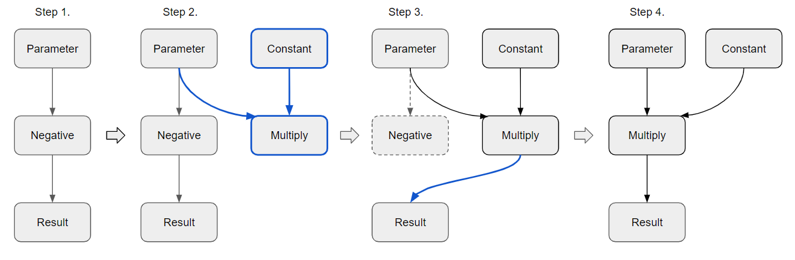
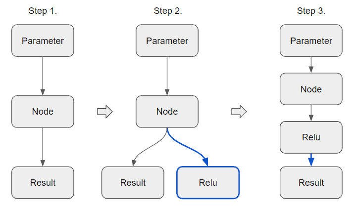

.. index:: pair: page; Overview of Transformations API
.. _doxid-openvino_docs_transformations:


Overview of Transformations API
===============================

:target:`doxid-openvino_docs_transformations_1md_openvino_docs_extensibility_ug_ov_transformations`


.. toctree::
   :maxdepth: 1
   :hidden:

   ./openvino-transformation-api/transformation-api-model-pass
   ./openvino-transformation-api/transformation-api-matcher-pass
   ./openvino-transformation-api/transformation-api-graph-rewrite-pass

OpenVINO Transformation mechanism allows to develop transformation passes to modify ``:ref:`ov::Model <doxid-classov_1_1_model>```. You can use this mechanism to apply additional optimizations to the original Model or transform unsupported subgraphs and operations to new operations which are supported by the plugin. This guide contains all necessary information that you need to start implementing OpenVINO™ transformations.

Working with Model
~~~~~~~~~~~~~~~~~~

Before moving to the transformation part,  several words need to be said about functions that allow to modify ``:ref:`ov::Model <doxid-classov_1_1_model>```. This chapter extends the :ref:`model representation guide <doxid-openvino_docs__o_v__u_g__model__representation>` and shows an API that allows us to manipulate with ``:ref:`ov::Model <doxid-classov_1_1_model>```.

Working with node input and output ports
----------------------------------------

First of all let's talk about ``:ref:`ov::Node <doxid-classov_1_1_node>``` input/output ports. Each OpenVINO™ operation has input and output ports except cases when operation has ``Parameter`` or ``Constant`` type.

Every port belongs to its node, so using a port we can access parent node, get shape and type for particular input/output, get all consumers in case of output port, and get producer node in case of input port. With output port we can set inputs for newly created operations.

Lets look at the code example.

.. ref-code-block:: cpp

	// Let's suppose that node is opset8::Convolution operation
	// as we know opset8::Convolution has two input ports (data, weights) and one output port
	:ref:`ov::Input\<ov::Node> <doxid-classov_1_1_input>` data = node->input(0);
	:ref:`ov::Input\<ov::Node> <doxid-classov_1_1_input>` weights = node->input(1);
	:ref:`ov::Output\<ov::Node> <doxid-classov_1_1_output>` output = node->output(0);
	
	// Getting shape and type
	auto pshape = data.get_partial_shape();
	auto el_type = data.get_element_type();
	
	// Getting parent for input port
	:ref:`ov::Output\<ov::Node> <doxid-classov_1_1_output>` parent_output;
	parent_output = data.get_source_output();
	
	// Another short way to get partent for output port
	parent_output = node->input_value(0);
	
	// Getting all consumers for output port
	auto consumers = output.get_target_inputs();

Node replacement
----------------

OpenVINO™ provides two ways for node replacement: via OpenVINO™ helper function and directly via port methods. We are going to review both of them.

Let's start with OpenVINO™ helper functions. The most popular function is ``ov::replace_node(old_node, new_node)``.

We will review real replacement case where Negative operation is replaced with Multiply.



.. ref-code-block:: cpp

	bool ov_replace_node(std::shared_ptr<ov::Node> node) {
	    // Step 1. Verify that node has opset8::Negative type
	    auto neg = std::dynamic_pointer_cast<ov::opset8::Negative>(node);
	    if (!neg) {
	        return false;
	    }
	
	    // Step 2. Create opset8::Multiply operation where the first input is negative operation input and second as Constant with -1 value
	    auto mul = std::make_shared<ov::opset8::Multiply>(neg->input_value(0),
	                                                      ov::opset8::Constant::create(neg->get_element_type(), :ref:`ov::Shape <doxid-classov_1_1_shape>`{1}, {-1}));
	
	    mul->set_friendly_name(neg->get_friendly_name());
	    :ref:`ov::copy_runtime_info <doxid-namespaceov_1a3bb5969a95703b4b4fd77f6f58837207>`(neg, mul);
	
	    // Step 3. Replace Negative operation with Multiply operation
	    :ref:`ov::replace_node <doxid-namespaceov_1a75d84ee654edb73fe4fb18936a5dca6d>`(neg, mul);
	    return true;
	
	    // Step 4. Negative operation will be removed automatically because all consumers was moved to Multiply operation
	}

``:ref:`ov::replace_node <doxid-namespaceov_1a75d84ee654edb73fe4fb18936a5dca6d>``` has a constraint that number of output ports for both of ops must be the same; otherwise, it raises an exception.

The alternative way to do the same replacement is the following:

.. ref-code-block:: cpp

	// All neg->output(0) consumers will be moved to mul->output(0) port
	neg->output(0).replace(mul->output(0));

Another transformation example is insertion.



.. ref-code-block:: cpp

	// Step 1. Lets suppose that we have a node with single output port and we want to insert additional operation new_node after it
	void insert_example(std::shared_ptr<ov::Node> node) {
	    // Get all consumers for node
	    auto consumers = node->output(0).get_target_inputs();
	
	    // Step 2. Create new node. Let it be opset8::Relu.
	    auto new_node = std::make_shared<ov::opset8::Relu>(node);
	
	    // Step 3. Reconnect all consumers to new_node
	    for (auto input : consumers) {
	        input.replace_source_output(new_node);
	    }
	}

The alternative way to the insert operation is to make a node copy and use ``:ref:`ov::replace_node() <doxid-namespaceov_1a75d84ee654edb73fe4fb18936a5dca6d>``` :

.. ref-code-block:: cpp

	void insert_example_with_copy(std::shared_ptr<ov::Node> node) {
	    // Make a node copy
	    auto node_copy = node->clone_with_new_inputs(node->input_values());
	    // Create new node
	    auto new_node = std::make_shared<ov::opset8::Relu>(node_copy);
	    :ref:`ov::replace_node <doxid-namespaceov_1a75d84ee654edb73fe4fb18936a5dca6d>`(node, new_node);
	}

Node elimination
----------------

Another type of node replacement is its elimination.

To eliminate operation, OpenVINO™ has special method that considers all limitations related to OpenVINO™ Runtime.

.. ref-code-block:: cpp

	// Suppose we have a node that we want to remove
	bool success = :ref:`ov::replace_output_update_name <doxid-namespaceov_1a75ba2120e573883bd96bb19c887c6a1d>`(node->output(0), node->input_value(0));

``:ref:`ov::replace_output_update_name() <doxid-namespaceov_1a75ba2120e573883bd96bb19c887c6a1d>``` in case of successful replacement it automatically preserves friendly name and runtime info.

.. _transformations_types:

Transformations types
~~~~~~~~~~~~~~~~~~~~~

OpenVINO™ Runtime has three main transformation types:

* :ref:`Model pass <doxid-openvino_docs__extensibility__u_g_model_pass>` - straightforward way to work with ``:ref:`ov::Model <doxid-classov_1_1_model>``` directly

* :ref:`Matcher pass <doxid-openvino_docs__extensibility__u_g_matcher_pass>` - pattern-based transformation approach

* :ref:`Graph rewrite pass <doxid-openvino_docs__extensibility__u_g_graph_rewrite_pass>` - container for matcher passes needed for efficient execution

.. image:: transformations_structure.png

Transformation conditional compilation
~~~~~~~~~~~~~~~~~~~~~~~~~~~~~~~~~~~~~~

Transformation library has two internal macros to support conditional compilation feature.

* ``:ref:`MATCHER_SCOPE(region) <doxid-conditional__compilation_2include_2openvino_2cc_2pass_2itt_8hpp_1a3d1377542bcf3e305c33a1b683cc77df>``` - allows to disable the MatcherPass if matcher isn't used. The region name should be unique. This macro creates a local variable ``matcher_name`` which you should use as a matcher name.

* ``:ref:`RUN_ON_MODEL_SCOPE(region) <doxid-conditional__compilation_2include_2openvino_2cc_2pass_2itt_8hpp_1ab308561b849d47b9c820506ec73c4a30>``` - allows to disable run_on_model pass if it isn't used. The region name should be unique.

.. _transformation_writing_essentials:

Transformation writing essentials
~~~~~~~~~~~~~~~~~~~~~~~~~~~~~~~~~

When developing a transformation, you need to follow these transformation rules:

1. Friendly Names
-----------------

Each ``:ref:`ov::Node <doxid-classov_1_1_node>``` has an unique name and a friendly name. In transformations we care only about friendly name because it represents the name from the model. To avoid losing friendly name when replacing node with other node or subgraph, set the original friendly name to the latest node in replacing subgraph. See the example below.

.. ref-code-block:: cpp

	// Replace Div operation with Power and Multiply sub-graph and set original friendly name to Multiply operation
	auto pow = std::make_shared<ov::opset8::Power>(div->input(1).get_source_output(),
	                                               :ref:`ov::op::v0::Constant::create <doxid-classov_1_1op_1_1v0_1_1_constant_1ad812afdc89a39746c8bb84b5b6cee9ac>`(div->get_input_element_type(1), :ref:`ov::Shape <doxid-classov_1_1_shape>`{1}, {-1}));
	auto mul = std::make_shared<ov::opset8::Multiply>(div->input(0).get_source_output(), pow);
	mul->set_friendly_name(div->get_friendly_name());
	:ref:`ngraph::replace_node <doxid-namespaceov_1a75d84ee654edb73fe4fb18936a5dca6d>`(div, mul);

In more advanced cases, when replaced operation has several outputs and we add additional consumers to its outputs, we make a decision how to set friendly name by arrangement.

2. Runtime Info
---------------

Runtime info is a map ``std::map<std::string, :ref:`ov::Any <doxid-classov_1_1_any>`>`` located inside ``:ref:`ov::Node <doxid-classov_1_1_node>``` class. It represents additional attributes in ``:ref:`ov::Node <doxid-classov_1_1_node>```. These attributes can be set by users or by plugins and when executing transformation that changes ``:ref:`ov::Model <doxid-classov_1_1_model>``` we need to preserve these attributes as they will not be automatically propagated. In most cases, transformations have the following types: 1:1 (replace node with another node), 1:N (replace node with a sub-graph), N:1 (fuse sub-graph into a single node), N:M (any other transformation). Currently, there is no mechanism that automatically detects transformation types, so we need to propagate this runtime information manually. See the examples below.

.. ref-code-block:: cpp

	// Replace Transpose with Reshape operation (1:1)
	:ref:`ov::copy_runtime_info <doxid-namespaceov_1a3bb5969a95703b4b4fd77f6f58837207>`(:ref:`transpose <doxid-namespacengraph_1_1builder_1_1opset1_1a5541708ed899fa8e1196222a68727be9>`, :ref:`reshape <doxid-namespacengraph_1_1builder_1_1opset1_1ad5b09acfb63fe54b85b33d6e22ccdc72>`);
	
	// Replace Div operation with Power and Multiply sub-graph (1:N)
	:ref:`ov::copy_runtime_info <doxid-namespaceov_1a3bb5969a95703b4b4fd77f6f58837207>`(div, {pow, mul});
	
	// Fuse Convolution with Add operation (N:1)
	:ref:`ov::copy_runtime_info <doxid-namespaceov_1a3bb5969a95703b4b4fd77f6f58837207>`({conv, bias}, {conv_fused});
	
	// Any other transformation that replaces one sub-graph with another sub-graph (N:M)
	:ref:`ov::copy_runtime_info <doxid-namespaceov_1a3bb5969a95703b4b4fd77f6f58837207>`({a, b, c}, {e, :ref:`f <doxid-namespacengraph_1_1runtime_1_1reference_1a4582949bb0b6082a5159f90c43a71ca9>`});

When transformation has multiple fusions or decompositions, ``:ref:`ov::copy_runtime_info <doxid-namespaceov_1a3bb5969a95703b4b4fd77f6f58837207>``` must be called multiple times for each case.

**Note** : copy_runtime_info removes rt_info from destination nodes. If you want to keep it, you need to specify them in source nodes like this: copy_runtime_info({a, b, c}, {a, b})

3. Constant Folding
-------------------

If your transformation inserts constant sub-graphs that need to be folded, do not forget to use ``:ref:`ov::pass::ConstantFolding() <doxid-classov_1_1pass_1_1_constant_folding>``` after your transformation or call constant folding directly for operation. The example below shows how constant subgraph can be constructed.

.. ref-code-block:: cpp

	// After ConstantFolding pass Power will be replaced with Constant
	auto input = std::make_shared<ov::opset8::Parameter>(:ref:`ov::element::f32 <doxid-group__ov__element__cpp__api_1gadc8a5dda3244028a5c0b024897215d43>`, :ref:`ov::Shape <doxid-classov_1_1_shape>`{1});
	auto pow = std::make_shared<ov::opset8::Power>(ov::opset8::Constant::create(:ref:`ov::element::f32 <doxid-group__ov__element__cpp__api_1gadc8a5dda3244028a5c0b024897215d43>`, :ref:`ov::Shape <doxid-classov_1_1_shape>`{1}, {2}),
	                                               ov::opset8::Constant::create(:ref:`ov::element::f32 <doxid-group__ov__element__cpp__api_1gadc8a5dda3244028a5c0b024897215d43>`, :ref:`ov::Shape <doxid-classov_1_1_shape>`{1}, {3}));
	auto mul = std::make_shared<ov::opset8::Multiply>(input /\* not constant input \*/, pow);

Manual constant folding is more preferable than ``:ref:`ov::pass::ConstantFolding() <doxid-classov_1_1pass_1_1_constant_folding>``` because it is much faster.

Below you can find an example of manual constant folding:

.. ref-code-block:: cpp

	template <class T>
	:ref:`ov::Output\<ov::Node> <doxid-classov_1_1_output>` :ref:`eltwise_fold <doxid-namespacengraph_1_1op_1_1util_1a509012b6f17705b68e32968c38b36d37>`(const :ref:`ov::Output\<ov::Node> <doxid-classov_1_1_output>`& input0, const :ref:`ov::Output\<ov::Node> <doxid-classov_1_1_output>`& input1) {
	    auto eltwise = std::make_shared<T>(input0, input1);
	    :ref:`ov::OutputVector <doxid-namespaceov_1a0a3841455b82c164b1b04b61a9c7c560>` output(eltwise->get_output_size());
	    // If constant folding wasn't successful return eltwise output
	    if (!eltwise->constant_fold(output, {input0, input1})) {
	        return eltwise->output(0);
	    }
	    return output[0];
	}

.. _common_mistakes:

Common mistakes in transformations
~~~~~~~~~~~~~~~~~~~~~~~~~~~~~~~~~~

In transformation development process:

* Do not use deprecated OpenVINO™ API. Deprecated methods has the ``OPENVINO_DEPRECATED`` macros in its definition.

* Do not pass ``shared_ptr<Node>`` as an input for other node if type of node is unknown or it has multiple outputs. Use explicit output port.

* If you replace node with another node that produces different shape, remember that new shape will not be propagated until the first ``validate_nodes_and_infer_types`` call for ``:ref:`ov::Model <doxid-classov_1_1_model>```. If you are using ``:ref:`ov::pass::Manager <doxid-classov_1_1pass_1_1_manager>```, it will automatically call this method after each transformation execution.

* Do not forget to call the ``:ref:`ov::pass::ConstantFolding <doxid-classov_1_1pass_1_1_constant_folding>``` pass if your transformation creates constant subgraphs.

* Use latest OpSet if you are not developing downgrade transformation pass.

* When developing a callback for ``:ref:`ov::pass::MatcherPass <doxid-classov_1_1pass_1_1_matcher_pass>```, do not change nodes that come after the root node in topological order.

.. _using_pass_manager:

Using pass manager
~~~~~~~~~~~~~~~~~~

``:ref:`ov::pass::Manager <doxid-classov_1_1pass_1_1_manager>``` is a container class that can store the list of transformations and execute them. The main idea of this class is to have high-level representation for grouped list of transformations. It can register and apply any `transformation pass <#transformations_types>`__ on model. In addition, ``:ref:`ov::pass::Manager <doxid-classov_1_1pass_1_1_manager>``` has extended debug capabilities (find more information in the `how to debug transformations <#how_to_debug_transformations>`__ section).

The example below shows basic usage of ``:ref:`ov::pass::Manager <doxid-classov_1_1pass_1_1_manager>```

.. ref-code-block:: cpp

	:ref:`ov::pass::Manager <doxid-classov_1_1pass_1_1_manager>` manager;
	manager.:ref:`register_pass <doxid-classov_1_1pass_1_1_manager_1a3c4834680de7b43557783e8500795da3>`<ov::pass::MyModelTransformation>();
	// Two matchers will run independently (two independent graph traversals)
	// pass::Manager automatically creates GraphRewrite container for each MatcherPass
	manager.:ref:`register_pass <doxid-classov_1_1pass_1_1_manager_1a3c4834680de7b43557783e8500795da3>`<ov::pass::DecomposeDivideMatcher>();
	manager.:ref:`register_pass <doxid-classov_1_1pass_1_1_manager_1a3c4834680de7b43557783e8500795da3>`<ov::pass::ReluReluFusionMatcher>();
	manager.:ref:`run_passes <doxid-classov_1_1pass_1_1_manager_1a8b155191130f2c15e294cfd259d4ca0d>`(:ref:`f <doxid-namespacengraph_1_1runtime_1_1reference_1a4582949bb0b6082a5159f90c43a71ca9>`);

Another example shows how multiple matcher passes can be united into single GraphRewrite.

.. ref-code-block:: cpp

	// Register anchor GraphRewrite pass inside manager that will execute two matchers simultaneously
	:ref:`ov::pass::Manager <doxid-classov_1_1pass_1_1_manager>` manager;
	auto anchor = manager.:ref:`register_pass <doxid-classov_1_1pass_1_1_manager_1a3c4834680de7b43557783e8500795da3>`<:ref:`ov::pass::GraphRewrite <doxid-classov_1_1pass_1_1_graph_rewrite>`>();
	anchor->:ref:`add_matcher <doxid-classov_1_1pass_1_1_graph_rewrite_1abb0dd37c85a3d1a0f875f9d2deac4a79>`<ov::pass::DecomposeDivideMatcher>();
	anchor->add_matcher<ov::pass::ReluReluFusionMatcher>();
	manager.:ref:`run_passes <doxid-classov_1_1pass_1_1_manager_1a8b155191130f2c15e294cfd259d4ca0d>`(:ref:`f <doxid-namespacengraph_1_1runtime_1_1reference_1a4582949bb0b6082a5159f90c43a71ca9>`);

.. _how_to_debug_transformations:

How to debug transformations
~~~~~~~~~~~~~~~~~~~~~~~~~~~~

If you are using ``ngraph::pass::Manager`` to run sequence of transformations, you can get additional debug capabilities by using the following environment variables:

.. ref-code-block:: cpp

	OV_PROFILE_PASS_ENABLE=1 - enables performance measurement for each transformation and prints execution status
	OV_ENABLE_VISUALIZE_TRACING=1 -  enables visualization after each transformation. By default, it saves dot and svg files.

**Note** : Make sure that you have dot installed on your machine; otherwise, it will silently save only dot file without svg file.


See Also
~~~~~~~~

* :ref:`OpenVINO™ Model Representation <doxid-openvino_docs__o_v__u_g__model__representation>`

* :ref:`OpenVINO™ Extensions <doxid-openvino_docs__extensibility__u_g__intro>`

