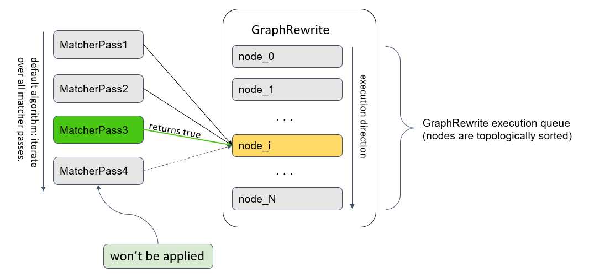
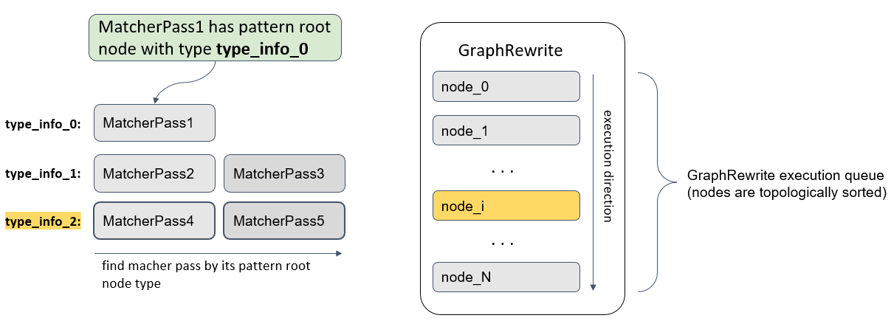

.. index:: pair: page; OpenVINO Graph Rewrite Pass
.. _extensibility_graph_rewrite_pass:

.. meta::
   :description: Graph Rewrite serves for running multiple matcher passes on 
                 ov::Model in a single graph traversal.
   :keywords: Graph Rewrite, matcher pass, graph traversal, OpenVINO
              


OpenVINO Graph Rewrite Pass
===========================

:target:`extensibility_graph_rewrite_pass_1md_openvino_docs_extensibility_ug_graph_rewrite_pass` 
``:ref:`ov::pass::GraphRewrite <doxid-classov_1_1pass_1_1_graph_rewrite>``` serves for running multiple matcher passes 
on ``:ref:`ov::Model <doxid-classov_1_1_model>``` in a single graph traversal. Example:

.. ref-code-block:: cpp

	// Two matcher passes will run simultaneously in a single graph traversal
	:ref:`ov::pass::GraphRewrite <doxid-classov_1_1pass_1_1_graph_rewrite>` pass;
	pass.:ref:`add_matcher <doxid-classov_1_1pass_1_1_graph_rewrite_1abb0dd37c85a3d1a0f875f9d2deac4a79>`<ov::pass::DecomposeDivideMatcher>();
	pass.:ref:`add_matcher <doxid-classov_1_1pass_1_1_graph_rewrite_1abb0dd37c85a3d1a0f875f9d2deac4a79>`<ov::pass::ReluReluFusionMatcher>();
	pass.:ref:`run_on_model <doxid-classov_1_1pass_1_1_graph_rewrite_1ad27ed8542330330ce9a524ff17564c21>`(:ref:`f <doxid-namespacengraph_1_1runtime_1_1reference_1a4582949bb0b6082a5159f90c43a71ca9>`);

In addition, GraphRewrite handles nodes that were registered by MatcherPasses during their execution. This nodes will be 
added to the beginning of the sequence with nodes for pattern matching.

.. note::
   When using ``:ref:`ov::pass::Manager <doxid-classov_1_1pass_1_1_manager>``` temporary GraphRewrite is used to execute 
   single MatcherPass.


GraphRewrite has two algorithms for MatcherPasses execution. First algorithm is straightforward. It applies each MatcherPass 
in registration order to current node.



But it is not really efficient when you have a lot of registered passes. So first of all GraphRewrite checks that all 
MatcherPass patterns has type-based root node (it means that type of this node is not hidden into predicate). And then creates 
map from registered MatcherPasses. That helps to avoid additional cost of applying each MatcherPass for each node.



.. note::
   GraphRewrite execution algorithm cannot be set manually and depends only on root nodes registered inside MatcherPasses.


See Also
~~~~~~~~

* :ref:`OpenVINO™ Transformations <transformations_overview>`

