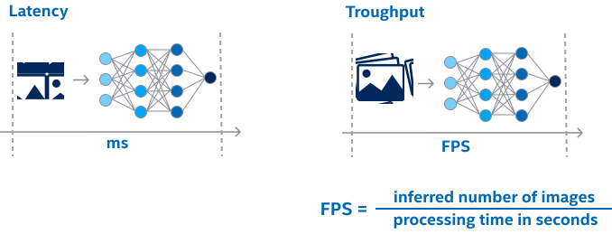

.. index:: pair: page; Introduction to Performance Optimization
.. _optim_perf__introduction:

.. meta::
   :description: Improving inference performance involves model and runtime 
                 optimizations that can be done independently. Inference 
                 speed depends on latency and throughput.
   :keywords: inference, inference performance, performance optimization, 
              inference optimization, latency, throughput, model optimization,
              runtime optimization, deployment optimization, OpenVINO Runtime,
              benchmarks, first-inference latency, memory footprint, quantization, 
              pruning, optimization of preprocessing

Introduction to Performance Optimization
========================================

:target:`optim_perf__introduction_1md_openvino_docs_optimization_guide_dldt_optimization_guide` 

Even though inference performance should be defined as a combination of many 
factors, including accuracy and efficiency, it is most often described as the 
speed of execution. As the rate with which the model processes live data, it 
is based on two fundamentally interconnected metrics: latency and throughput.

**Latency** measures inference time (in ms) required to process a single input. 
When it comes to executing multiple inputs simultaneously (for example, via 
batching), the overall throughput (inferences per second, or frames per second, 
FPS, in the specific case of visual processing) is usually more of a concern. 
**Throughput** is calculated by dividing the number of inputs that were processed 
by the processing time.

End-to-End Application Performance
~~~~~~~~~~~~~~~~~~~~~~~~~~~~~~~~~~

It is important to separate the "pure" inference time of a neural network and the end-to-end application performance. For example, data transfers between the host and a device may unintentionally affect the performance when a host input tensor is processed on the accelerator such as dGPU.

Similarly, the input-preprocessing contributes significantly to the inference time. As described in the :ref:`getting performance numbers <optim_perf__get_perf_numbers>` section, when evaluating *inference* performance, one option is to measure all such items separately. For the **end-to-end scenario**, though, consider image pre-processing with OpenVINO and the asynchronous execution as a way to lessen the communication costs (like data transfers). For more details, see the :ref:`general optimizations guide <optim_perf__deploy_general_optim>`.

Another specific case is **first-inference latency** (for example, when a fast application start-up is required), where the resulting performance may be well dominated by the model loading time. :ref:`Model caching <optim_perf__model_caching>` may be considered as a way to improve model loading/compilation time.

Finally, **memory footprint** restriction is another possible concern when designing an application. While this is a motivation for the use of the *model* optimization techniques, keep in mind that the throughput-oriented execution is usually much more memory consuming. For more details, see the :ref:`Runtime Inference Optimizations guide <optim_perf__runtime_inference_optim>`.

.. note:: To get performance numbers for OpenVINO, along with the tips on how 
   to measure and compare it with a native framework, see the 
   :ref:`Getting performance numbers article <optim_perf__get_perf_numbers>`.

Improving Performance: Model vs Runtime Optimizations
~~~~~~~~~~~~~~~~~~~~~~~~~~~~~~~~~~~~~~~~~~~~~~~~~~~~~

.. note:: First, make sure that your model can be successfully inferred with OpenVINO Runtime.

There are two primary optimization approaches to improving inference performance 
with OpenVINO: model- and runtime-level optimizations. They are **fully compatible** and can be done independently.

* **Model optimizations** include model modifications, such as quantization, 
  pruning, optimization of preprocessing, etc. For more details, refer to this 
  :ref:`document <optim_perf__model_optim_guide>`.
  
  * The model optimizations directly improve the inference time, even without 
    runtime parameters tuning (described below).

* **Runtime (Deployment) optimizations** includes tuning of model *execution* 
  parameters. Fore more details, see the 
  :ref:`Runtime Inference Optimizations guide <optim_perf__runtime_inference_optim>`.

Performance benchmarks
~~~~~~~~~~~~~~~~~~~~~~

A wide range of public models for estimating performance and comparing the 
numbers (measured on various supported devices) are available in the 
:ref:`Performance benchmarks section <optim_perf__performance_benchmarks>`.
