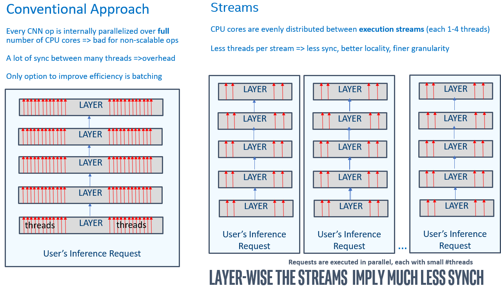
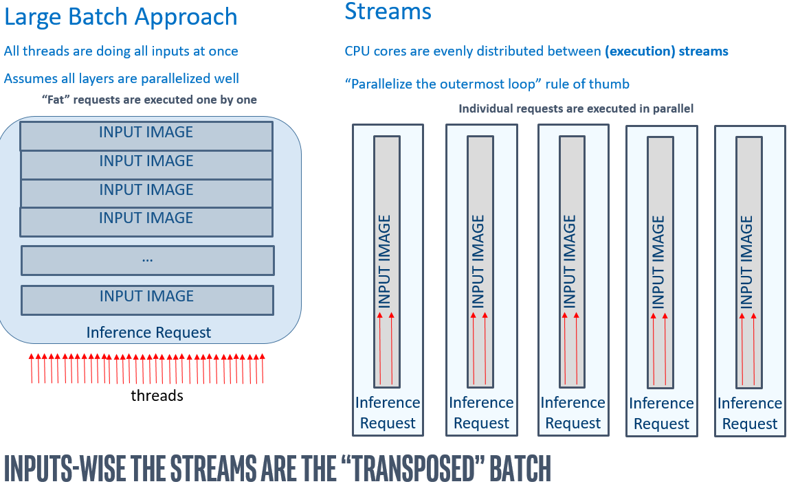
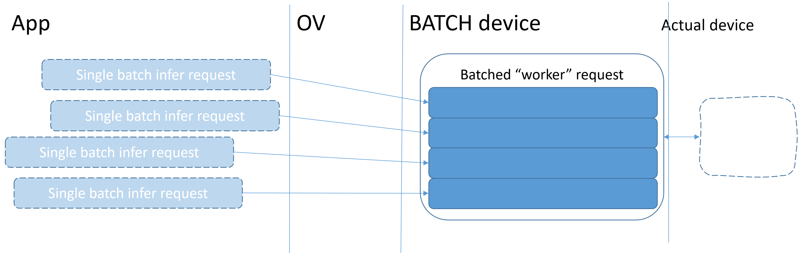

.. index:: pair: page; Further Low-Level Implementation Details
.. _deployment_low_level_implementation:

.. meta::
   :description: Automatic Batching moves asynchronicity from individual 
                 requests to groups of requests, and the CPU streams are 
                 inference threads grouped by CPU cores.
   :keywords: OpenVINO, OpenVINO streams, automatic batching, throughput, 
              improving throughput, asynchronous execution, multiple 
              inference requests, batch size, number of streams, asynchronicity,
              throughput optimization, inference precision, inference queue,
              parallelism, inference threads, high-level performance hints,
              get_tensor

Further Low-Level Implementation
================================

:target:`deployment_low_level_implementation_1md_openvino_docs_optimization_guide_dldt_deployment_optimization_internals`

Throughput on the CPU: Internals
~~~~~~~~~~~~~~~~~~~~~~~~~~~~~~~~

As explained in the :ref:`throughput-related section <deployment_optimizing_for_throughput>`, 
the OpenVINO streams is a mean of running multiple requests in parallel. In 
order to best serve multiple inference requests executed simultaneously, the 
inference threads are grouped/pinned to the particular CPU cores, constituting 
the "CPU" streams. This provides much better performance for the networks than 
batching, especially for the multiple-core systems:

Compared to the batching, the parallelism is somewhat transposed (i.e., 
performed over inputs with much less synchronization within CNN ops):

Keep in mind that :ref:`high-level performance hints <doxid-openvino_docs__o_v__u_g__performance__hints>` 
allow the implementation to select the optimal number of streams depending on 
model's compute demands and CPU capabilities, including :ref:`int8 inference <model_optimization_guide>` 
hardware acceleration, number of cores, etc.

Automatic Batching Internals
~~~~~~~~~~~~~~~~~~~~~~~~~~~~

:ref:`Automatic batching <doxid-openvino_docs__o_v__u_g__automatic__batching>` 
performs on-the-fly grouping of inference requests to improve device 
utilization. It relaxes the requirement for an application to saturate devices 
such as GPU by "explicitly" using a large batch. It performs transparent input 
gathering from individual inference requests followed by the actual batched 
execution, with no programming effort from the user:

Essentially, Automatic Batching shifts asynchronicity from individual requests 
to groups of requests that constitute the batches. Furthermore, for the 
execution to be efficient, it is very important that the requests arrive 
timely, without causing a batching timeout. Normally, the timeout should never 
be hit. It is rather a graceful way to handle the application exit (when the 
inputs are not arriving anymore, so the full batch is not possible to collect).

If a workload experiences timeouts, which lead to a drop in performance due to 
increased latency of every request, consider balancing its value against the 
batch size. For example, a smaller batch size and timeout value may yield 
better results than a large batch size coupled with a timeout value that 
cannot guarantee accommodating all the required requests.

Finally, following the ``get_tensor`` idiom section from the 
:ref:`general optimizations <deployment_general_optimizations>` helps Automatic 
Batching to save on inputs/outputs copies. According to that you should always 
prefer the "get" versions of the tensors' data access APIs in your applications.
