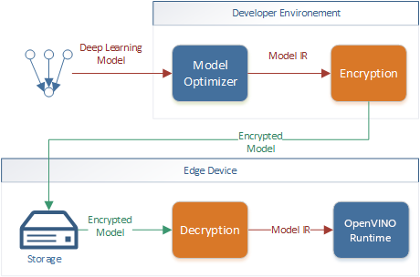

.. index:: pair: page; Using Encrypted Models with OpenVINO
.. _security__encrypted_models:

.. meta::
   :description: Description of securing and loading encrypted models along with
                 their usage in OpenVINO.
   :keywords: OpenVINO Runtime, integrity, security, cryptography, encrypted models, encryption,
              secure model deployment, optimizing models, loading encrypted models, decryption


Using Encrypted Models with OpenVINO
====================================

:target:`security__encrypted_models_1md_openvino_docs_ov_runtime_ug_protecting_model_guide` Deploying deep-learning capabilities 
to edge devices can present security challenges like ensuring inference integrity, or providing copyright protection of your 
deep-learning models.

One possible solution is to use cryptography to protect models as they are deployed and stored on edge devices. Model encryption, 
decryption and authentication are not provided by OpenVINO but can be implemented with third-party tools (i.e., OpenSSL). 
While implementing encryption, ensure that the latest versions of tools are used and follow cryptography best practices.

This guide presents how to use OpenVINO securely with protected models.

Secure Model Deployment
~~~~~~~~~~~~~~~~~~~~~~~

After a model is optimized by the OpenVINO Model Optimizer, it's deployed to target devices in the OpenVINO Intermediate 
Representation (OpenVINO IR) format. An optimized model is stored on edge device and is executed by the OpenVINO Runtime. 
ONNX and PDPD models can be read natively by OpenVINO Runtime as well.

Encrypting and optimizing model before deploying it to the edge device can be used to protect deep-learning models. The edge 
device should keep the stored model protected all the time and have the model decrypted **in runtime only** for use by the 
OpenVINO Runtime.



Loading Encrypted Models
~~~~~~~~~~~~~~~~~~~~~~~~

The OpenVINO Runtime requires model decryption before loading. Allocate a temporary memory block for model decryption 
and use the ``:ref:`ov::Core::read_model <doxid-classov_1_1_core_1ae0576a95f841c3a6f5e46e4802716981>``` method to load 
the model from a memory buffer. For more information, see the ``:ref:`ov::Core <doxid-classov_1_1_core>``` Class Reference 
Documentation.

.. ref-code-block:: cpp

	std::vector<uint8_t> model_data, weights_data;
	
	std::string password; // taken from an user
	std::ifstream model_file("model.xml"), weights_file("model.bin");
	
	// Read model files and decrypt them into temporary memory block
	decrypt_file(model_file, password, model_data);
	decrypt_file(weights_file, password, weights_data);

Hardware-based protection such as Intel Software Guard Extensions (Intel SGX) can be used to protect decryption operation 
secrets and bind them to a device. For more information, see the 
`Intel Software Guard Extensions <https://software.intel.com/en-us/sgx>`__.

Use the ``:ref:`ov::Core::read_model <doxid-classov_1_1_core_1ae0576a95f841c3a6f5e46e4802716981>``` to set model representations 
and weights respectively.

Currently there is no way to read external weights from memory for ONNX models. The 
``ov::Core::read_model(const std::string& model, const Tensor& weights)`` method should be called with ``weights`` passed as 
an empty ``:ref:`ov::Tensor <doxid-classov_1_1_tensor>```.

.. ref-code-block:: cpp

	:ref:`ov::Core <doxid-classov_1_1_core>` core;
	// Load model from temporary memory block
	std::string str_model(model_data.begin(), model_data.end());
	auto :ref:`model <doxid-group__ov__runtime__cpp__prop__api_1ga461856fdfb6d7533dc53355aec9e9fad>` = core.:ref:`read_model <doxid-classov_1_1_core_1ae0576a95f841c3a6f5e46e4802716981>`(str_model,
	    :ref:`ov::Tensor <doxid-classov_1_1_tensor>`(:ref:`ov::element::u8 <doxid-group__ov__element__cpp__api_1gaaf60c536d3e295285f6a899eb3d29e2f>`, {weights_data.:ref:`size <doxid-classov_1_1element_1_1_type_1a5e14ed0ad8e1347848975132be59d040>`()}, weights_data.data()));

Additional Resources
~~~~~~~~~~~~~~~~~~~~

* Intel® Distribution of OpenVINO™ toolkit `home page <https://software.intel.com/en-us/openvino-toolkit>`__.

* Model Optimizer :ref:`Developer Guide <doxid-openvino_docs__m_o__d_g__deep__learning__model__optimizer__dev_guide>`.

* :ref:`OpenVINO™ Runtime User Guide <deploy_infer__openvino_runtime_user_guide>`.

* For more information on Sample Applications, see the :ref:`OpenVINO Samples Overview <get_started__samples_overview>`

* For information on a set of pre-trained models, see the Overview of OpenVINO™ Toolkit Pre-Trained Models.

* For IoT Libraries and Code Samples, see the `Intel® IoT Developer Kit <https://github.com/intel-iot-devkit>`__.

