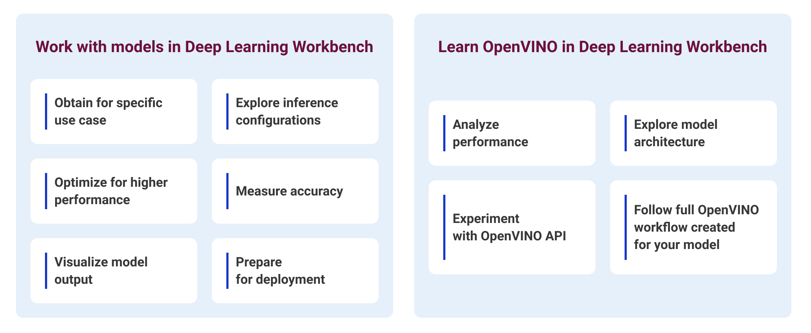
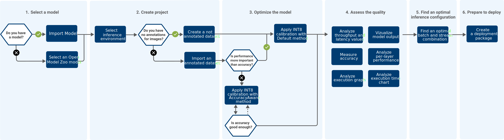
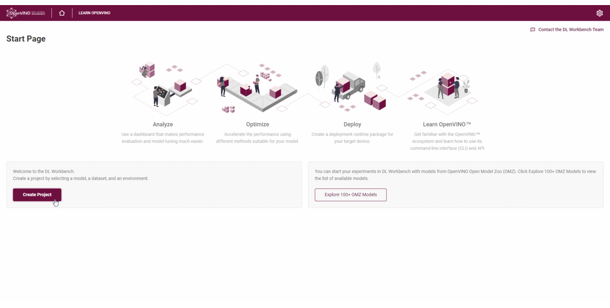

.. index:: pair: page; OpenVINO™ Deep Learning Workbench Overview
.. _doxid-workbench_docs__workbench__d_g__introduction:

OpenVINO™ Deep Learning Workbench Overview
============================================

:target:`doxid-workbench_docs__workbench__d_g__introduction_1md_openvino_docs_documentation_dl_workbench_overview`

.. toctree::
   :maxdepth: 1
   :hidden:

   ./workbench-overview/workbench-install
   ./workbench-overview/workbench-get-started
   Tutorials <./workbench-overview/workbench-tutorials>
   User Guide <./workbench-overview/workbench-user-guide>
   ./workbench-overview/workbench-troubleshooting

Deep Learning Workbench (DL Workbench) is an official OpenVINO™ graphical interface designed to make the production of pretrained deep learning Computer Vision and Natural Language Processing models significantly easier.

Minimize the inference-to-deployment workflow timing for neural models right in your browser: import a model, analyze its performance and accuracy, visualize the outputs, optimize and make the final model deployment-ready in a matter of minutes. DL Workbench takes you through the full OpenVINO™ workflow, providing the opportunity to learn about various toolkit components.

.. link-button:: workbench_docs_Workbench_DG_Start_DL_Workbench_in_DevCloud
    :type: ref
    :text: Run DL Workbench in Intel® DevCloud
    :classes: btn-primary btn-block

DL Workbench enables you to get a detailed performance assessment, explore inference configurations, and obtain an optimized model ready to be deployed on various Intel® configurations, such as client and server CPU, Intel® Processor Graphics (GPU), Intel® Movidius™ Neural Compute Stick 2 (NCS 2), and Intel® Vision Accelerator Design with Intel® Movidius™ VPUs.

DL Workbench also provides the `JupyterLab environment <https://docs.openvino.ai/latest/workbench_docs_Workbench_DG_Jupyter_Notebooks.html#doxid-workbench-docs-workbench-d-g-jupyter-notebooks>`__ that helps you quick start with OpenVINO™ API and command-line interface (CLI). Follow the full OpenVINO workflow created for your model and learn about different toolkit components.

Video
~~~~~

.. list-table::

   * - .. raw:: html

           <iframe  allowfullscreen mozallowfullscreen msallowfullscreen oallowfullscreen webkitallowfullscreen  height="315" width="560"
           src="https://www.youtube.com/embed/on8xSSTKCt8">
           </iframe>
   * - **DL Workbench Introduction**. Duration: 1:31

User Goals
~~~~~~~~~~

DL Workbench helps achieve your goals depending on the stage of your deep learning journey.

If you are a beginner in the deep learning field, the DL Workbench provides you with learning opportunities:

* Learn what neural networks are, how they work, and how to examine their architectures.

* Learn the basics of neural network analysis and optimization before production.

* Get familiar with the OpenVINO™ ecosystem and its main components without installing it on your system.

If you have enough experience with neural networks, DL Workbench provides you with a convenient web interface to optimize your model and prepare it for production:

* Measure and interpret model performance.

* Tune the model for enhanced performance.

* Analyze the quality of your model and visualize output.

General Workflow
~~~~~~~~~~~~~~~~

The diagram below illustrates the typical DL Workbench workflow. Click to see the full-size image:

Get a quick overview of the workflow in the DL Workbench User Interface:

OpenVINO™ Toolkit Components
~~~~~~~~~~~~~~~~~~~~~~~~~~~~~~

The intuitive web-based interface of the DL Workbench enables you to easily use various OpenVINO™ toolkit components:

.. list-table::
    :header-rows: 1

    * - Component
      - Description
    * - `Open Model Zoo <https://docs.openvinotoolkit.org/latest/omz_tools_downloader.html>`__
      - Get access to the collection of high-quality pre-trained deep learning `public <https://docs.openvinotoolkit.org/latest/omz_models_group_public.html>`__ and `Intel-trained <https://docs.openvinotoolkit.org/latest/omz_models_group_intel.html>`__ models trained to resolve a variety of different tasks.
    * - `Model Optimizer <https://docs.openvinotoolkit.org/latest/openvino_docs_MO_DG_Deep_Learning_Model_Optimizer_DevGuide.html>`__
      - Optimize and transform models trained in supported frameworks to the IR format. Supported frameworks include TensorFlow\*, Caffe\*, Kaldi\*, MXNet\*, and ONNX\* format.
    * - `Benchmark Tool <https://docs.openvinotoolkit.org/latest/openvino_inference_engine_tools_benchmark_tool_README.html>`__
      - Estimate deep learning model inference performance on supported devices.
    * - `Accuracy Checker <https://docs.openvinotoolkit.org/latest/omz_tools_accuracy_checker.html>`__
      - Evaluate the accuracy of a model by collecting one or several metric values.
    * - `Post-Training Optimization Tool <https://docs.openvinotoolkit.org/latest/pot_README.html>`__
      - Optimize pretrained models with lowering the precision of a model from floating-point precision(FP32 or FP16) to integer precision (INT8), without the need to retrain or fine-tune models.

.. link-button:: workbench_docs_Workbench_DG_Start_DL_Workbench_in_DevCloud
    :type: ref
    :text: Run DL Workbench in Intel® DevCloud
    :classes: btn-outline-primary

Contact Us
~~~~~~~~~~

* `DL Workbench GitHub Repository <https://github.com/openvinotoolkit/workbench>`__

* `DL Workbench on Intel Community Forum <https://community.intel.com/t5/Intel-Distribution-of-OpenVINO/bd-p/distribution-openvino-toolkit>`__

* `DL Workbench Gitter Chat <https://gitter.im/dl-workbench/general?utm_source=badge&utm_medium=badge&utm_campaign=pr-badge&content=body>`__
  
  :target:`doxid-workbench_docs__workbench__d_g__introduction_1md_openvino_workbench_docs_workbench_dg_overview` Deep Learning Workbench (DL Workbench) is an official OpenVINO™ graphical interface designed to make the production of pretrained deep learning Computer Vision and Natural Language Processing models significantly easier.

Minimize the inference-to-deployment workflow timing for neural models right in your browser: import a model, analyze its performance and accuracy, visualize the outputs, optimize and make the final model deployment-ready in a matter of minutes. DL Workbench takes you through the full OpenVINO™ workflow, providing the opportunity to learn about various toolkit components.

.. link-button:: workbench_docs_Workbench_DG_Install
    :type: ref
    :text: Install DL Workbench 
    :classes: btn-primary btn-block

DL Workbench enables you to get a detailed performance assessment, explore inference configurations, and obtain an optimized model ready to be deployed on various Intel® configurations, such as client and server CPU, Intel® Processor Graphics (GPU), Intel® Movidius™ Neural Compute Stick 2 (NCS 2), and Intel® Vision Accelerator Design with Intel® Movidius™ VPUs.

DL Workbench also provides the :ref:`JupyterLab environment <doxid-workbench_docs__workbench__d_g__jupyter__notebooks>` that helps you quick start with OpenVINO™ API and command-line interface (CLI). Follow the full OpenVINO workflow created for your model and learn about different toolkit components.

Video
~~~~~

.. list-table::

   * - .. raw:: html

           <iframe  allowfullscreen mozallowfullscreen msallowfullscreen oallowfullscreen webkitallowfullscreen  height="315" width="560"
           src="https://www.youtube.com/embed/on8xSSTKCt8">
           </iframe>
   * - **DL Workbench Introduction**. Duration: 1:31

User Goals
~~~~~~~~~~

DL Workbench helps achieve your goals depending on the stage of your deep learning journey.

If you are a beginner in the deep learning field, the DL Workbench provides you with learning opportunities:

* Learn what neural networks are, how they work, and how to examine their architectures.

* Learn the basics of neural network analysis and optimization before production.

* Get familiar with the OpenVINO™ ecosystem and its main components without installing it on your system.

If you have enough experience with neural networks, DL Workbench provides you with a convenient web interface to optimize your model and prepare it for production:

* Measure and interpret model performance.

* Tune the model for enhanced performance.

* Analyze the quality of your model and visualize output.

General Workflow
~~~~~~~~~~~~~~~~

The diagram below illustrates the typical DL Workbench workflow. Click to see the full-size image:

Get a quick overview of the workflow in the DL Workbench User Interface:

.. image:: ./_assets/workflow_DL_Workbench.gif

OpenVINO™ Toolkit Components
~~~~~~~~~~~~~~~~~~~~~~~~~~~~~~

The intuitive web-based interface of the DL Workbench enables you to easily use various OpenVINO™ toolkit components:

.. list-table::
    :header-rows: 1

    * - Component
      - Description
    * - `Open Model Zoo <https://docs.openvinotoolkit.org/latest/omz_tools_downloader.html>`__
      - Get access to the collection of high-quality pre-trained deep learning `public <https://docs.openvinotoolkit.org/latest/omz_models_group_public.html>`__ and `Intel-trained <https://docs.openvinotoolkit.org/latest/omz_models_group_intel.html>`__ models trained to resolve a variety of different tasks.
    * - `Model Optimizer <https://docs.openvinotoolkit.org/latest/openvino_docs_MO_DG_Deep_Learning_Model_Optimizer_DevGuide.html>`__
      - Optimize and transform models trained in supported frameworks to the IR format. Supported frameworks include TensorFlow\*, Caffe\*, Kaldi\*, MXNet\*, and ONNX\* format.
    * - `Benchmark Tool <https://docs.openvinotoolkit.org/latest/openvino_inference_engine_tools_benchmark_tool_README.html>`__
      - Estimate deep learning model inference performance on supported devices.
    * - `Accuracy Checker <https://docs.openvinotoolkit.org/latest/omz_tools_accuracy_checker.html>`__
      - Evaluate the accuracy of a model by collecting one or several metric values.
    * - `Post-Training Optimization Tool <https://docs.openvinotoolkit.org/latest/pot_README.html>`__
      - Optimize pretrained models with lowering the precision of a model from floating-point precision(FP32 or FP16) to integer precision (INT8), without the need to retrain or fine-tune models.

.. link-button:: workbench_docs_Workbench_DG_Install
    :type: ref
    :text: Install DL Workbench 
    :classes: btn-outline-primary

Contact Us
~~~~~~~~~~

* `DL Workbench GitHub Repository <https://github.com/openvinotoolkit/workbench>`__

* `DL Workbench on Intel Community Forum <https://community.intel.com/t5/Intel-Distribution-of-OpenVINO/bd-p/distribution-openvino-toolkit>`__

* `DL Workbench Gitter Chat <https://gitter.im/dl-workbench/general?utm_source=badge&utm_medium=badge&utm_campaign=pr-badge&content=body>`__

