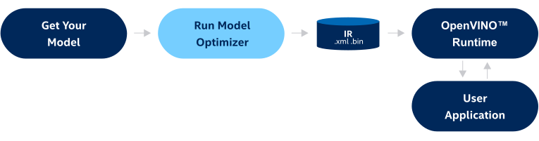

.. index:: pair: page; Convert model with Model Optimizer
.. _doxid-openvino_docs__m_o__d_g__deep__learning__model__optimizer__dev_guide:

Convert model with Model Optimizer
==================================

:target:`doxid-openvino_docs__m_o__d_g__deep__learning__model__optimizer__dev_guide_1md_openvino_docs_mo_dg_deep_learning_model_optimizer_devguide`

.. _deep learning model optimizer:

.. toctree::
   :maxdepth: 1
   :hidden:

   openvino_docs_MO_DG_prepare_model_convert_model_Converting_Model
   openvino_docs_MO_DG_prepare_model_convert_model_Cutting_Model
   openvino_docs_MO_DG_Additional_Optimization_Use_Cases
   openvino_docs_MO_DG_FP16_Compression
   openvino_docs_MO_DG_prepare_model_convert_model_Convert_Model_From_TensorFlow
   openvino_docs_MO_DG_prepare_model_convert_model_Convert_Model_From_ONNX
   openvino_docs_MO_DG_prepare_model_convert_model_Convert_Model_From_PyTorch
   openvino_docs_MO_DG_prepare_model_convert_model_Convert_Model_From_Paddle
   openvino_docs_MO_DG_prepare_model_convert_model_Convert_Model_From_MxNet
   openvino_docs_MO_DG_prepare_model_convert_model_Convert_Model_From_Caffe
   openvino_docs_MO_DG_prepare_model_convert_model_Convert_Model_From_Kaldi
   openvino_docs_MO_DG_prepare_model_convert_model_tutorials
   openvino_docs_MO_DG_prepare_model_Model_Optimizer_FAQ

Introduction
~~~~~~~~~~~~

Model Optimizer is a cross-platform command-line tool that facilitates the transition between training and deployment environments, performs static model analysis, and adjusts deep learning models for optimal execution on end-point target devices.

Using Model Optimizer tool assumes you already have a deep learning model trained using one of the supported frameworks: TensorFlow, PyTorch, PaddlePaddle, MXNet, Caffe, Kaldi, or represented in ONNX\* format. Model Optimizer produces an Intermediate Representation (IR) of the model, which can be inferred with :ref:`OpenVINO™ Runtime <doxid-openvino_docs__o_v__u_g__o_v__runtime__user__guide>`.

.. note:: Model Optimizer does not infer models. Model Optimizer is an offline tool that converts a model into IR and optimizes before the inference takes place.

The scheme below illustrates the typical workflow for deploying a trained deep learning model:

The IR is a pair of files describing the model:

* ``.xml`` - Describes the network topology

* ``.bin`` - Contains the weights and biases binary data.

.. note:: The generated IR can be additionally optimized for inference by :ref:`Post-training optimization <doxid-pot_introduction>` that applies post-training quantization methods.

.. tip:: You also can work with the Model Optimizer inside the OpenVINO™ `Deep Learning Workbench <https://docs.openvino.ai/latest/workbench_docs_Workbench_DG_Introduction.html>`__ (DL Workbench). `DL Workbench <https://docs.openvino.ai/latest/workbench_docs_Workbench_DG_Introduction.html>`__ is a web-based graphical environment that enables you to optimize, fine-tune, analyze, visualize, and compare performance of deep learning models.

Run Model Optimizer
~~~~~~~~~~~~~~~~~~~

To convert the model to IR, run Model Optimizer:

.. ref-code-block:: cpp

	mo --input_model INPUT_MODEL

If out-of-the-box conversion (only the ``--input_model`` parameter is specified) is not succeed, try to use parameters for overriding input shapes and cutting the model, mentioned below.

To override original input shapes for model conversion, Model Optimizer provides two parameters: ``--input`` and ``--input_shape``. For more information about these parameters, refer to :ref:`Setting Input Shapes <doxid-openvino_docs__m_o__d_g_prepare_model_convert_model__converting__model>`.

To cut off unwanted parts of a model, such as unsupported operations and training sub-graphs, the ``--input`` and ``--output`` parameters can be used, defining new inputs and outputs of the converted model. For a more detailed description, refer to :ref:`Cutting Off Parts of a Model <doxid-openvino_docs__m_o__d_g_prepare_model_convert_model__cutting__model>`.

Also, you can insert additional input pre-processing sub-graphs into the converted model using the ``--mean_values``, ``scales_values``, ``--layout``, and other parameters described in :ref:`Embedding Preprocessing Computation <doxid-openvino_docs__m_o__d_g__additional__optimization__use__cases>`.

Model Optimizer's compression parameter ``--data_type`` allows to generate IR of the ``FP16`` data type. For more details, please refer to :ref:`Compression of a Model to FP16 <doxid-openvino_docs__m_o__d_g__f_p16__compression>`.

To get the full list of conversion parameters available in Model Optimizer, run the following command:

.. ref-code-block:: cpp

	mo --help

Examples of CLI Commands
~~~~~~~~~~~~~~~~~~~~~~~~

Below is a list of separate examples for different frameworks and Model Optimizer parameters.

#. Launch Model Optimizer for a TensorFlow MobileNet model in the binary protobuf format.
   
   .. ref-code-block:: cpp
   
   	mo --input_model MobileNet.pb

Launch Model Optimizer for a TensorFlow BERT model in the SavedModel format, with three inputs. Explicitly specify input shapes where the batch size and the sequence length equal 2 and 30 respectively.

.. ref-code-block:: cpp

	mo --saved_model_dir BERT --input mask,word_ids,type_ids --input_shape [2,30],[2,30],[2,30]

For more information on TensorFlow model conversion, refer to :ref:`Converting a TensorFlow Model <doxid-openvino_docs__m_o__d_g_prepare_model_convert_model__convert__model__from__tensor_flow>`.

#. Launch Model Optimizer for an ONNX OCR model and explicitly specify new output.
   
   .. ref-code-block:: cpp
   
   	mo --input_model ocr.onnx --output probabilities

For more information on ONNX model conversion, please refer to :ref:`Converting an ONNX Model <doxid-openvino_docs__m_o__d_g_prepare_model_convert_model__convert__model__from__o_n_n_x>`. Note that PyTorch models must be exported to the ONNX format before its conversion into IR. More details can be found in :ref:`Converting a PyTorch Model <doxid-openvino_docs__m_o__d_g_prepare_model_convert_model__convert__model__from__py_torch>`.

#. Launch Model Optimizer for a PaddlePaddle UNet model and apply mean-scale normalization to the input.
   
   .. ref-code-block:: cpp
   
   	mo --input_model unet.pdmodel --mean_values [123,117,104] --scale 255

For more information on PaddlePaddle model conversion, please refer to :ref:`Converting a PaddlePaddle Model <doxid-openvino_docs__m_o__d_g_prepare_model_convert_model__convert__model__from__paddle>`.

#. Launch Model Optimizer for an MXNet SSD Inception V3 model and specify first-channel layout for the input.
   
   .. ref-code-block:: cpp
   
   	mo --input_model ssd_inception_v3-0000.params --layout NCHW

For more information on MXNet models conversion, please refer to :ref:`Converting an MXNet Model <doxid-openvino_docs__m_o__d_g_prepare_model_convert_model__convert__model__from__mx_net>`.

#. Launch Model Optimizer for a Caffe AlexNet model with input channels in the RGB format, which needs to be reversed.
   
   .. ref-code-block:: cpp
   
   	mo --input_model alexnet.caffemodel --reverse_input_channels

For more information on Caffe model conversion, please refer to :ref:`Converting a Caffe Model <doxid-openvino_docs__m_o__d_g_prepare_model_convert_model__convert__model__from__caffe>`.

#. Launch Model Optimizer for a Kaldi LibriSpeech nnet2 model.
   
   .. ref-code-block:: cpp
   
   	mo --input_model librispeech_nnet2.mdl --input_shape [1,140]

For more information on Kaldi model conversion, refer to :ref:`Converting a Kaldi Model <doxid-openvino_docs__m_o__d_g_prepare_model_convert_model__convert__model__from__kaldi>`.

To get conversion recipes for specific TensorFlow, ONNX, PyTorch, MXNet, and Kaldi models, refer to :ref:`Model Conversion Tutorials <doxid-openvino_docs__m_o__d_g_prepare_model_convert_model_tutorials>`.

