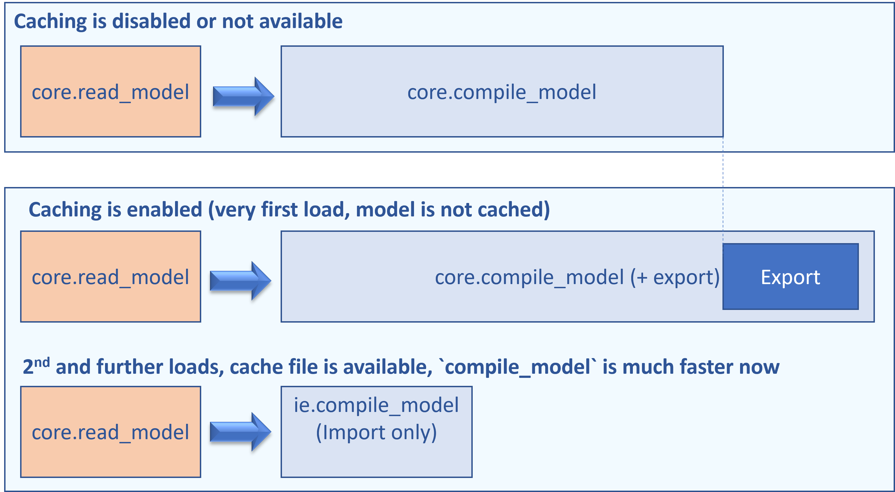
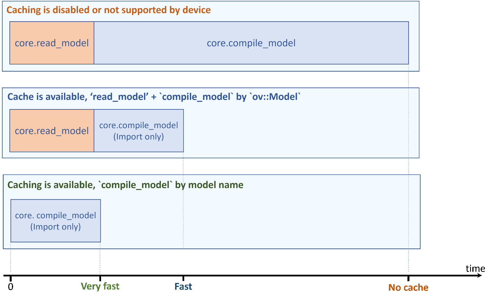

.. index:: pair: page; Model Caching Overview
.. _doxid-openvino_docs__o_v__u_g__model_caching_overview:


Model Caching Overview
======================

:target:`doxid-openvino_docs__o_v__u_g__model_caching_overview_1md_openvino_docs_ov_runtime_ug_model_caching_overview`

Introduction
~~~~~~~~~~~~

As described in the :ref:`Integrate OpenVINO™ with Your Application <doxid-openvino_docs__o_v__u_g__integrate__o_v_with_your_application>`, a common application flow consists of the following steps:

#. **Create a Core object** : First step to manage available devices and read model objects

#. **Read the Intermediate Representation** : Read an Intermediate Representation file into an object of the ``:ref:`ov::Model <doxid-classov_1_1_model>```

#. **Prepare inputs and outputs** : If needed, manipulate precision, memory layout, size or color format

#. **Set configuration** : Pass device-specific loading configurations to the device

#. **Compile and Load Network to device** : Use the ``:ref:`ov::Core::compile_model() <doxid-classov_1_1_core_1a46555f0803e8c29524626be08e7f5c5a>``` method with a specific device

#. **Set input data** : Specify input tensor

#. **Execute** : Carry out inference and process results

Step 5 can potentially perform several time-consuming device-specific optimizations and network compilations, and such delays can lead to a bad user experience on application startup. To avoid this, some devices offer import/export network capability, and it is possible to either use the :ref:`Compile tool <doxid-openvino_inference_engine_tools_compile_tool__r_e_a_d_m_e>` or enable model caching to export compiled model automatically. Reusing cached model can significantly reduce compile model time.

Set "cache_dir" config option to enable model caching
-----------------------------------------------------

To enable model caching, the application must specify a folder to store cached blobs, which is done like this:

.. tab:: C++

      .. doxygensnippet:: docs/snippets/ov_caching.cpp
         :language: cpp
         :fragment: [ov:caching:part0]

.. tab:: Python

      .. doxygensnippet:: docs/snippets/ov_caching.py
         :language: python
         :fragment: [ov:caching:part0]

With this code, if the device specified by ``device_name`` supports import/export model capability, a cached blob is automatically created inside the ``/path/to/cache/dir`` folder. If the device does not support import/export capability, cache is not created and no error is thrown.

Depending on your device, total time for compiling model on application startup can be significantly reduced. Also note that the very first ``compile_model`` (when cache is not yet created) takes slightly longer time to "export" the compiled blob into a cache file:



Even faster: use compile_model(modelPath)
-----------------------------------------

In some cases, applications do not need to customize inputs and outputs every time. Such application always call ``model = core.read_model(...)``, then ``core.compile_model(model, ..)`` and it can be further optimized. For these cases, there is a more convenient API to compile the model in a single call, skipping the read step:

.. tab:: C++

      .. doxygensnippet:: docs/snippets/ov_caching.cpp
         :language: cpp
         :fragment: [ov:caching:part1]

.. tab:: Python

      .. doxygensnippet:: docs/snippets/ov_caching.py
         :language: python
         :fragment: [ov:caching:part1]

With model caching enabled, total load time is even smaller, if ``read_model`` is optimized as well.

.. tab:: C++

      .. doxygensnippet:: docs/snippets/ov_caching.cpp
         :language: cpp
         :fragment: [ov:caching:part2]

.. tab:: Python

      .. doxygensnippet:: docs/snippets/ov_caching.py
         :language: python
         :fragment: [ov:caching:part2]



Advanced Examples
-----------------

Not every device supports network import/export capability. For those that don't, enabling caching has no effect. To check in advance if a particular device supports model caching, your application can use the following code:

.. tab:: C++

      .. doxygensnippet:: docs/snippets/ov_caching.cpp
         :language: cpp
         :fragment: [ov:caching:part3]

.. tab:: Python

      .. doxygensnippet:: docs/snippets/ov_caching.py
         :language: python
         :fragment: [ov:caching:part3]

.. note:: The GPU plugin does not have the EXPORT_IMPORT capability, and does not support model caching yet. However, the GPU plugin supports caching kernels (see the :ref:`GPU plugin documentation <doxid-openvino_docs__o_v__u_g_supported_plugins__g_p_u>`). Kernel caching for the GPU plugin can be accessed the same way as model caching: by setting the ``CACHE_DIR`` configuration key to a folder where the cache should be stored.

