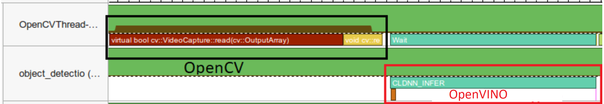

.. index:: pair: page; General Optimizations
.. _doxid-openvino_docs_deployment_optimization_guide_common:


General Optimizations
=====================

:target:`doxid-openvino_docs_deployment_optimization_guide_common_1md_openvino_docs_optimization_guide_dldt_deployment_optimization_common` This chapter covers application-level optimization techniques such as asynchronous execution to improve data pipelining, pre-processing acceleration and so on. While the techniques (e.g. pre-processing) can be specific to end-user applications, the associated performance improvements are general and shall improve any target scenario (both latency and throughput).

Inputs Pre-Processing with OpenVINO
~~~~~~~~~~~~~~~~~~~~~~~~~~~~~~~~~~~

In many cases, a network expects a pre-processed image, so make sure you do not perform unnecessary steps in your code:

* Model Optimizer can efficiently bake the mean and normalization (scale) values into the model (for example, to the weights of the first convolution). Please see :ref:`relevant Model Optimizer command-line options <doxid-openvino_docs__m_o__d_g__additional__optimization__use__cases>`.

* Let the OpenVINO accelerate other means of :ref:`Image Pre-processing and Conversion <doxid-openvino_docs__o_v__u_g__preprocessing__overview>`.

* You can directly input a data that is already in the *on-device* memory, by using the :ref:`remote tensors API of the GPU Plugin <doxid-openvino_docs__o_v__u_g_supported_plugins__g_p_u__remote_tensor__a_p_i>`.

Prefer OpenVINO Async API
~~~~~~~~~~~~~~~~~~~~~~~~~

The API of the inference requests offers Sync and Async execution. While the ``:ref:`ov::InferRequest::infer() <doxid-classov_1_1_infer_request_1abcb7facc9f7c4b9226a1fd343e56958d>``` is inherently synchronous and executes immediately (effectively serializing the execution flow in the current application thread), the Async "splits" the ``infer()`` into ``:ref:`ov::InferRequest::start_async() <doxid-classov_1_1_infer_request_1a5a05ae4352f804c865e11f5d68b983d5>``` and ``:ref:`ov::InferRequest::wait() <doxid-classov_1_1_infer_request_1ab0e0739da45789d816f8b5584a0b5691>```. Please consider the :ref:`API examples <doxid-openvino_docs__o_v__u_g__infer_request>`.

A typical use-case for the ``:ref:`ov::InferRequest::infer() <doxid-classov_1_1_infer_request_1abcb7facc9f7c4b9226a1fd343e56958d>``` is running a dedicated application thread per source of inputs (e.g. a camera), so that every step (frame capture, processing, results parsing and associated logic) is kept serial within the thread. In contrast, the ``:ref:`ov::InferRequest::start_async() <doxid-classov_1_1_infer_request_1a5a05ae4352f804c865e11f5d68b983d5>``` and ``:ref:`ov::InferRequest::wait() <doxid-classov_1_1_infer_request_1ab0e0739da45789d816f8b5584a0b5691>``` allow the application to continue its activities and poll or wait for the inference completion when really needed. So one reason for using asynchronous code is *efficiency*.

.. note:: Although the Synchronous API can be somewhat easier to start with, in the production code always prefer to use the Asynchronous (callbacks-based, below) API, as it is the most general and scalable way to implement the flow control for any possible number of requests (and hence both latency and throughput scenarios).

Let's see how the OpenVINO Async API can improve overall frame rate of the application. The key advantage of the Async approach is as follows: while a device is busy with the inference, the application can do other things in parallel (e.g. populating inputs or scheduling other requests) rather than wait for the current inference to complete first.

In the example below, inference is applied to the results of the video decoding. So it is possible to keep two parallel infer requests, and while the current is processed, the input frame for the next is being captured. This essentially hides the latency of capturing, so that the overall frame rate is rather determined only by the slowest part of the pipeline (decoding vs inference) and not by the sum of the stages.

You can compare the pseudo-codes for the regular and async-based approaches:

* In the regular way, the frame is captured with OpenCV and then immediately processed:

.. ref-code-block:: cpp

	while(true) {
	    // capture frame
	    // populate CURRENT InferRequest
	    // Infer CURRENT InferRequest //this call is synchronous
	    // display CURRENT result
	}




* In the "true" async mode, the ``NEXT`` request is populated in the main (application) thread, while the ``CURRENT`` request is processed:

.. ref-code-block:: cpp

	while(true) {
	    // capture frame
	    // populate NEXT InferRequest
	    // start NEXT InferRequest //this call is async and returns immediately
	    
	    // wait for the CURRENT InferRequest
	    // display CURRENT result
	    // swap CURRENT and NEXT InferRequests
	}


.. image:: vtune_async.png
	:alt: Intel VTune screenshot

The technique can be generalized to any available parallel slack. For example, you can do inference and simultaneously encode the resulting or previous frames or run further inference, like emotion detection on top of the face detection results. Refer to the Object Detection С++ Demo, Object Detection Python Demo(latency-oriented Async API showcase) and :ref:`Benchmark App Sample <doxid-openvino_inference_engine_samples_benchmark_app__r_e_a_d_m_e>` for complete examples of the Async API in action.

.. note:: Using the Asynchronous API is a must for :ref:`throughput-oriented scenarios <doxid-openvino_docs_deployment_optimization_guide_tput>`.

Notes on Callbacks
------------------

Notice that the Async's ``:ref:`ov::InferRequest::wait() <doxid-classov_1_1_infer_request_1ab0e0739da45789d816f8b5584a0b5691>``` waits for the specific request only. However, running multiple inference requests in parallel provides no guarantees on the completion order. This may complicate a possible logic based on the ``:ref:`ov::InferRequest::wait <doxid-classov_1_1_infer_request_1ab0e0739da45789d816f8b5584a0b5691>```. The most scalable approach is using callbacks (set via the ``:ref:`ov::InferRequest::set_callback <doxid-classov_1_1_infer_request_1afba2a10162ab356728ec8901973e8f02>```) that are executed upon completion of the request. The callback functions will be used by the OpenVINO runtime to notify on the results (or errors. This is more event-driven approach.

Few important points on the callbacks:

* It is the application responsibility to ensure that any callback function is thread-safe

* Although executed asynchronously by a dedicated threads the callbacks should NOT include heavy operations (e.g. I/O) and/or blocking calls. Keep the work done by any callback to a minimum.

"get_tensor" Idiom
~~~~~~~~~~~~~~~~~~

Within the OpenVINO, each device may have different internal requirements on the memory padding, alignment, etc for intermediate tensors. The **input/output tensors** are also accessible by the application code. As every ``:ref:`ov::InferRequest <doxid-classov_1_1_infer_request>``` is created by the particular instance of the ``:ref:`ov::CompiledModel <doxid-classov_1_1_compiled_model>``` (that is already device-specific) the requirements are respected and the requests' input/output tensors are still device-friendly. Thus:

* ``get_tensor`` (that offers the ``data()`` method to get a system-memory pointer to the tensor's content), is a recommended way to populate the inference inputs (and read back the outputs) **from/to the host memory**
  
  * For example, for the GPU device, the inputs/outputs tensors are mapped to the host (which is fast) only when the ``get_tensor`` is used, while for the ``set_tensor`` a copy into the internal GPU structures may happen

* In contrast, when the input tensors are already in the **on-device memory** (e.g. as a result of the video-decoding), prefer the ``set_tensor`` as a zero-copy way to proceed
  
  * Consider :ref:`GPU device Remote tensors API <doxid-openvino_docs__o_v__u_g_supported_plugins__g_p_u__remote_tensor__a_p_i>`.

Please consider the :ref:`API examples <doxid-openvino_docs__o_v__u_g__infer_request>` for ``get_tensor`` and ``set_tensor``.

