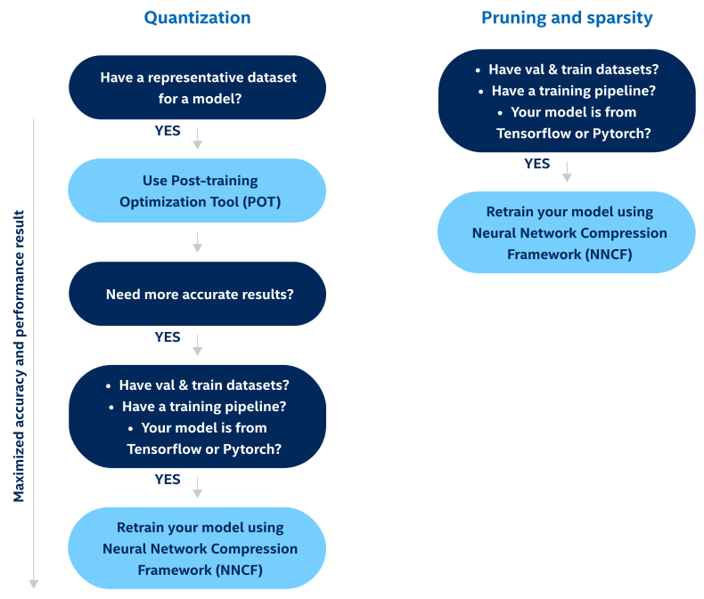

.. index:: pair: page; Model Optimization Guide
.. _doxid-openvino_docs_model_optimization_guide:

Model Optimization Guide
========================

:target:`doxid-openvino_docs_model_optimization_guide_1md_openvino_docs_optimization_guide_model_optimization_guide`

.. toctree::
   :maxdepth: 1
   :hidden:

   pot_introduction
   docs_nncf_introduction
   (Experimental) Protecting Model <pot_ranger_README>

Model optimization is an optional offline step of improving final model performance by applying special optimization methods like quantization, pruning, preprocessing optimization, etc. OpenVINO provides several tools to optimize models at different steps of model development:

* **Model Optimizer** implements optimization to a model, most of them added by default, but you can configure mean/scale values, batch size, RGB vs BGR input channels, and other parameters to speed up preprocess of a model (:ref:`Embedding Preprocessing Computation <doxid-openvino_docs__m_o__d_g__additional__optimization__use__cases>`).

* **Post-training Optimization tool** :ref:`(POT) <doxid-pot_introduction>` is designed to optimize the inference of deep learning models by applying post-training methods that do not require model retraining or fine-tuning, for example, post-training 8-bit quantization.

* **Neural Network Compression Framework** :ref:`(NNCF) <doxid-docs_nncf_introduction>` provides a suite of advanced methods for training-time model optimization within the DL framework, such as PyTorch and TensorFlow. It supports methods, like Quantization-aware Training and Filter Pruning. NNCF-optimized models can be inferred with OpenVINO using all the available workflows.

Detailed workflow:
~~~~~~~~~~~~~~~~~~

.. image:: DEVELOPMENT_FLOW_V3_crunch.svg

To understand which development optimization tool you need, refer to the diagram:

Post-training methods are limited in terms of achievable accuracy and for challenging use cases accuracy might degrade. In this case, training-time optimization with NNCF is an option.

Once the model is optimized using the aforementioned tools it can be used for inference using the regular OpenVINO inference workflow. No changes to the code are required.

If you are not familiar with model optimization methods, we recommend starting from :ref:`post-training methods <doxid-pot_introduction>`.

See also
~~~~~~~~

* :ref:`Deployment optimization <doxid-openvino_docs_deployment_optimization_guide_dldt_optimization_guide>`

