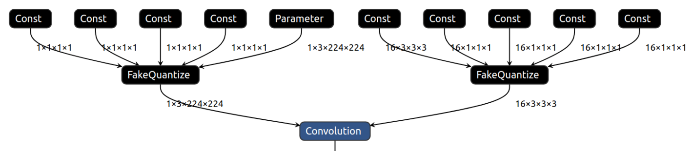

.. index:: pair: page; Intermediate Representation Suitable for INT8 Inference
.. _doxid-openvino_docs__m_o__d_g_prepare_model_convert_model__i_r_suitable_for__i_n_t8_inference:

Intermediate Representation Suitable for INT8 Inference
=======================================================

:target:`doxid-openvino_docs__m_o__d_g_prepare_model_convert_model__i_r_suitable_for__i_n_t8_inference_1md_openvino_docs_mo_dg_prepare_model_convert_model_ir_suitable_for_int8_inference`

Introduction
~~~~~~~~~~~~

OpenVINO Runtime CPU and GPU devices can infer models in low precision. For more details, refer to the :ref:`Model Optimization Guide <optim_perf__model_optim_guide>`.

Intermediate Representation should be specifically formed to be suitable for low precision inference. Such a model is called a Low Precision IR and can be generated in two ways:

* By :ref:`quantizing regular IR with the Post-Training Optimization tool <optim_perf__pot_intro>`

* Using Model Optimizer for a model pre-trained for Low Precision inference: TensorFlow pre-TFLite models (``.pb`` model file with ``FakeQuantize\*`` operations) and ONNX quantized models. Both TensorFlow and ONNX quantized models can be prepared by `Neural Network Compression Framework <https://github.com/openvinotoolkit/nncf/blob/develop/README.md>`__.

For an operation to be executed in INT8, it must have ``FakeQuantize`` operations as inputs. For more details, see the :ref:`specification of `FakeQuantize` operation <doxid-openvino_docs_ops_quantization__fake_quantize_1>`.

To execute the ``Convolution`` operation in INT8 on CPU, both data and weight inputs should have ``FakeQuantize`` as an input operation:

Low precision IR is also suitable for FP32 and FP16 inference if a chosen plugin supports all operations of the IR. The only difference between a Low Precision IR and FP16 or FP32 IR is the existence of ``FakeQuantize`` in the Low Precision IR. Plugins that support Low Precision Inference recognize these sub-graphs and quantize them during inference. The ones that do not, execute all operations, including ``FakeQuantize``, as is in the FP32 or FP16 precision.

Consequently, when ``FakeQuantize`` operations are present in an OpenVINO IR, it suggests to the inference device how to quantize particular operations in the model. If the device is capable, it accepts the suggestion and performs Low Precision Inference. If not, it executes the model in the floating-point precision.

Compressed Low Precision Weights
~~~~~~~~~~~~~~~~~~~~~~~~~~~~~~~~

Weighted operations, such as ``Convolution`` and ``MatMul``, store weights as the floating-point ``Constant`` in the graph followed by the ``FakeQuantize`` operation. The ``Constant`` followed by the ``FakeQuantize`` operation could be optimized memory-wise due to the ``FakeQuantize`` operation semantics. The resulting weights sub-graph stores weights in Low Precision ``Constant``, which gets unpacked back to floating point with the ``Convert`` operation. Weights compression replaces ``FakeQuantize`` with optional ``Subtract`` and ``Multiply`` operation leaving output arithmetically the same and weights storing takes four times less memory.

See the visualization of ``Convolution`` with the compressed weights:

Both Model Optimizer and Post-Training Optimization tool generate a compressed IR by default.

